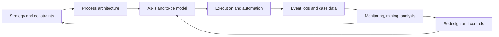

# Business Process Management Is Process Governance, Not Workflow Glue

BPM, or Business Process Management, is the discipline of treating recurring
cross-functional work as a managed system: identify the process, model how it
should work, measure how it actually works, redesign it, execute or automate it,
and keep improving it as conditions change. The important distinction is that
BPM is not the same thing as BPMN diagrams, workflow software, RPA scripts, or a
one-time process-improvement project. Those are instruments. BPM is the control
loop that decides which processes matter, how they should behave, who owns them,
which measurements prove they are healthy, and how changes are governed.

## What BPM Means

ISO's [process-approach guidance](https://www.iso.org/iso/iso9001_2015_process_approach.pdf)
defines the base unit: a process is a set of interrelated or interacting
activities that use inputs to deliver an intended result. That definition
matters because BPM is not organized around departments, org-chart boxes, or
individual tasks. It is organized around value-producing flows such as
quote-to-cash, procure-to-pay, employee onboarding, customer support escalation,
loan origination, claims handling, order fulfillment, or regulatory approval.

Professional BPM definitions differ in wording, but they converge on the same
shape:

| Lens | BPM Emphasis | Practical Meaning |
| --- | --- | --- |
| Management discipline | Processes are assets to be designed, measured, controlled, and improved. | A process has an owner, target outcomes, metrics, controls, and a change cadence. |
| Cross-functional work | Processes span people, systems, partners, and customers. | The hard problem is usually handoff quality, not one team's local efficiency. |
| Lifecycle | Modeling, execution, monitoring, and optimization form a loop. | A process model is stale unless runtime data and exceptions feed back into it. |
| Technology-enabled, not technology-defined | BPMS, workflow engines, RPA, process mining, and low-code tools support BPM. | Buying a platform does not create BPM capability unless governance and measurement exist. |

This is why BPM is often confused with adjacent terms:

| Term | Relationship To BPM |
| --- | --- |
| Workflow automation | Automates routing and task execution for part or all of a process. BPM decides whether that workflow is the right process and how it is governed. |
| BPMN | A standard notation for process models. BPMN can document and sometimes execute process logic, but it is not the management discipline. |
| BPMS / BPM platform | A software suite for modeling, executing, monitoring, and managing processes. It is a tool implementation of BPM ideas. |
| RPA | Automates repetitive UI-level tasks. It can be a tactical implementation inside a BPM program, but it can also preserve a broken process by automating its symptoms. |
| Process mining | Uses event logs to discover, check, and improve real process behavior. It supplies evidence to the BPM monitoring and redesign loop. |
| Project management | Manages unique work. BPM manages recurring or at least repeatable patterns of work, including variable cases with known rules and exceptions. |

## The Mechanism: A Control Loop Over Work

The useful mental model is a feedback system:



In a mature implementation, each loop has explicit state:

| State | Artifact | Typical Owner | Quality Question |
| --- | --- | --- | --- |
| Process portfolio | Process architecture, value-chain map, ownership matrix | COO, transformation office, enterprise architect | Which processes matter enough to govern? |
| Current behavior | Interviews, observations, event logs, current-state BPMN | Process analyst, domain lead | What actually happens, including exceptions? |
| Target behavior | To-be model, policies, decision rules, controls | Process owner, compliance, product/operations lead | What should happen, and under which conditions? |
| Runtime execution | Workflow engine, case manager, API orchestration, task queues | Engineering, operations, platform team | Can the process execute consistently across people and systems? |
| Measurement | KPIs, SLAs, event logs, bottleneck reports, conformance checks | Process owner, analytics, audit | Are outcomes improving, and where is reality drifting from design? |
| Governance | Change backlog, release process, risk controls, audit trail | Process owner, governance board | Who can change the process, and what evidence justifies the change? |

The loop can be written as organizational pseudocode:

```text
procedure BPM_CONTROL_LOOP(strategy, processPortfolio, eventSources):
  for each reviewCycle:
    candidateProcesses = rank_by(strategy, risk, cost, customer_impact)

    for each process in candidateProcesses:
      owner = require_process_owner(process)
      currentModel = discover_current_state(process, interviews, eventSources)
      baseline = measure(currentModel, eventSources, target_metrics)

      gaps = compare(
        observed_behavior = baseline.event_log_patterns,
        expected_behavior = currentModel.rules_and_paths,
        objectives = strategy.process_objectives
      )

      if gaps are material:
        targetModel = redesign(process, gaps, constraints, controls)
        executionPlan = choose_implementation(targetModel)
        deploy(executionPlan)
        instrument(process, case_id, activity, timestamp, actor, outcome)

      report(owner, metrics, exceptions, residual_risk)
```

The invariant is that process changes remain tied to measurable business
outcomes and accountable ownership. The loop does not naturally terminate; it
slows down when the process is stable, low-risk, and meeting objectives. The
main complexity drivers are cross-system integration, exception volume,
regulatory constraints, unclear ownership, and poor event data. Precision is
lost whenever the model hides informal work, merges multiple real cases into
one "happy path," or records events without a reliable case identifier.

## How BPM Is Used

In practice, BPM programs usually start where work crosses boundaries and local
optimization is not enough:

| Use Case | BPM Role | Typical Technology |
| --- | --- | --- |
| Order-to-cash | Align sales, finance, fulfillment, billing, collections, and customer communication. | BPMN model, workflow engine, ERP/CRM integration, SLA dashboards. |
| Procure-to-pay | Standardize requisitions, approvals, vendor onboarding, purchase orders, receiving, and payment. | Forms, rules, task routing, document management, ERP connectors. |
| Insurance or healthcare claims | Coordinate documents, eligibility checks, decisions, exceptions, and audit trails. | Case management, decision rules, content management, analytics. |
| Loan origination | Combine customer input, risk checks, underwriting, compliance, approvals, and status updates. | Workflow/case engine, rules engine, identity/data integrations. |
| Employee onboarding | Coordinate HR, IT access, legal, payroll, manager tasks, equipment, and training. | Task management, identity provisioning, notifications, event logs. |
| Regulatory processes | Prove that required controls executed and exceptions were handled. | Process repository, audit trail, conformance checks, reporting. |
| Customer support escalation | Route cases by severity, entitlement, skill, SLA risk, and customer context. | Case management, queues, rules, knowledge systems, monitoring. |

The software stack varies, but a complete BPM implementation usually needs five
capabilities:

1. Model the process in a notation that business and technical stakeholders can
   review.
2. Execute the process through workflow, case management, API orchestration, or
   human task routing.
3. Integrate with systems of record instead of retyping data across screens.
4. Observe runtime behavior through event logs, metrics, and exception capture.
5. Govern change through ownership, versioning, controls, and auditability.

This is why Gartner's
[BPM platform category](https://www.gartner.com/reviews/market/business-process-management-platforms)
requires more than a drawing canvas: it includes modeling, a metadata
repository, an execution engine, and state or rule management. Gartner's newer
[business process automation category](https://www.gartner.com/reviews/market/business-process-automation-tools)
uses more current language but points at the same operational substrate:
designing, executing, monitoring, integrating, task-managing, and case-managing
business processes.

## BPMN Matters, But It Has Boundaries

BPMN is the dominant process notation because it is designed to be readable by
business stakeholders while still precise enough for technical implementation.
The [OMG / ISO standard](https://www.omg.org/spec/BPMN/ISO/19510/PDF) frames
BPMN as a bridge between process design and implementation, with constructs for
events, activities, gateways, pools, lanes, messages, data associations, and
exceptions.

That bridge is useful, but it creates a trap: teams may treat a BPMN diagram as
the process. It is only a representation. A process model becomes operationally
valuable when it is connected to:

- ownership and decision rights;
- runtime state and case identifiers;
- service-level targets and business outcomes;
- exception handling and escalation policy;
- event logs that let analysts compare intended behavior with actual behavior;
- a change process for versioning and communicating redesigns.

The BPMN standard itself does not solve simulation, deployment, monitoring, or
organizational adoption. It provides notation and semantics. BPM supplies the
management system around that notation.

## Process Mining Turned BPM Into An Evidence Problem

Older BPM work could become workshop-driven: interview people, draw the process,
argue about the right future state, and hope the redesign lands. Process mining
changes the evidence model. Given event logs with a case ID, activity name,
timestamp, actor, and relevant attributes, process-mining tools can infer actual
paths, check conformance against a model, find bottlenecks, and surface variants
that the official process never acknowledged.

That does not make mining magic. It depends on log quality:

| Requirement | Why It Matters |
| --- | --- |
| Stable case ID | Without it, events cannot be grouped into process instances. |
| Meaningful activity names | Low-level system events may not map cleanly to business activities. |
| Ordered timestamps | Duration, waiting time, and bottleneck analysis need reliable time data. |
| Actor or role | Handoff and responsibility analysis need organizational context. |
| Outcome and exception markers | Optimization needs to distinguish successful, failed, cancelled, and exceptional cases. |
| Model provenance | Analysts need to know whether a model was designed, mined, manually edited, or generated. |

The [Process Mining Manifesto](https://www.tf-pm.org/upload/1580737614108.pdf)
captures the key evidence turn: modern systems already record traces of
operational work, and those traces can be used to discover, monitor, and improve
real processes rather than assumed processes. Current
[process intelligence](https://www.gartner.com/reviews/market/process-intelligence-platforms)
platforms extend this idea with anomaly detection, threshold tracking, decision
support, and links back into process design.

## Is BPM Popular?

Yes, but the answer depends on what "BPM" means.

If BPM means the management discipline, it is durable. It has a long-running
academic community, an active
[International Conference on Business Process Management](https://bpm-conference.org/)
series since 2003, standards such as BPMN / ISO/IEC 19510, and a large
professional ecosystem around process improvement, automation, compliance,
process mining, and operational excellence.

If BPM means the software label, the term is less fashionable than it used to
be. The market has fragmented into names such as business process automation,
digital process automation, workflow automation, process orchestration, process
intelligence, process mining, low-code automation, case management, RPA, and now
agentic orchestration. Gartner still maintains a BPM platform category, but its
[2025 Market Guide](https://www.gartner.com/en/documents/6495671) language
around business process automation reflects the shift toward automation and
monitoring as the buying vocabulary.

If BPM means the outsourced services sector, it is large but semantically
messy. Business news often uses "BPM" for business process management/services
firms that run operations for clients, overlapping with older BPO/BPS language.
Those sources show continued demand for process-domain expertise, especially as
AI changes delivery models, but they should not be confused with adoption of BPM
software or the BPM discipline inside one enterprise.

Current popularity signals are directional, not exact:

| Signal | What It Suggests | Caveat |
| --- | --- | --- |
| Gartner BPM platform, BPA, and process intelligence categories | Enterprises still buy tools for modeling, executing, monitoring, and analyzing processes. | Analyst category pages are market taxonomies, not adoption surveys. |
| Camunda 2024 and 2026 automation surveys | Automation leaders report high investment intent and many process endpoints. | Vendor survey; respondent pool is already automation-oriented. |
| Fortune Business Insights market estimate | Commercial analysts expect BPM market growth through the 2030s. | Market-size pages are directional and often opaque about methodology. |
| BPM conference series and Springer proceedings | BPM remains an active research field. | Academic activity is not the same as mainstream enterprise adoption. |
| Business process services news | Process-domain labor and services remain economically meaningful. | Services-sector "BPM" often means outsourced operations, not BPM tooling. |

The best synthesis: BPM is popular in enterprise operations but less visible
under its old name. The underlying need has grown because organizations have
more SaaS systems, more integration points, more compliance requirements, more
automation tools, and now more AI agents acting inside business workflows.

## Why AI Makes BPM More Important, Not Less

AI can automate tasks inside a process, but it does not remove the need for
process control. In fact, AI increases the need for explicit BPM mechanics:

- What process instance is this AI action attached to?
- Which policy, rule, or approval gave the AI permission to act?
- What evidence was used?
- What should happen when the model is uncertain?
- Which exceptions require human review?
- How is the outcome measured?
- How can the organization prove after the fact that the process followed its
  controls?

Without that machinery, agentic automation becomes a collection of impressive
task completions with weak operational accountability. BPM gives AI systems a
case model, state transitions, audit trail, escalation policy, and performance
loop.

## Failure Modes

BPM fails when it becomes theater.

| Failure Mode | Mechanism | Better Test |
| --- | --- | --- |
| Diagram worship | The organization maintains beautiful process maps that do not match actual work. | Compare the model to event logs and exception reports. |
| Local optimization | One department improves its queue while increasing total cycle time. | Measure end-to-end customer or case outcomes. |
| Automation over broken work | RPA or workflow tools encode waste instead of removing it. | Redesign before automating; automate only after root-cause analysis. |
| Happy-path modeling | Exceptions, rework, cancellations, and manual overrides are omitted. | Require variant and exception coverage before implementation. |
| No process owner | Everyone participates, but nobody can change policy, resources, or tooling. | Assign accountable ownership and decision rights. |
| Weak instrumentation | Logs cannot reconstruct cases or handoffs. | Define the event schema before rollout. |
| Executable-diagram overreach | Teams force business ambiguity into brittle executable BPMN. | Use BPMN where it clarifies control flow; use code, rules, or case logic where those are better abstractions. |
| AI opacity | AI decisions are embedded in workflows without provenance or escalation rules. | Log prompts, inputs, outputs, confidence, approvals, and override paths where policy requires it. |

## Practical Takeaways

1. Start BPM work by naming the process instance, owner, objective, and outcome
   metric. A diagram without those is documentation, not management.
2. Treat BPMN as a shared language, not a universal runtime. Use it where
   standardized process communication matters.
3. Instrument before optimizing. If the event log cannot reconstruct the case,
   process mining and conformance checks will be misleading.
4. Separate process governance from automation tooling. A workflow engine can
   execute a bad process perfectly.
5. Evaluate BPM popularity by the problem, not the acronym. The current market
   may call it automation, orchestration, or process intelligence, but the
   durable question is still: how does this organization control and improve
   cross-functional work?

## Sources

- [Wikipedia: Business process management](https://en.wikipedia.org/wiki/Business_process_management)
- [Workflow Management Coalition: What is BPM?](https://wfmc.org/what-is-bpm/)
- [ISO: The process approach in ISO 9001:2015](https://www.iso.org/iso/iso9001_2015_process_approach.pdf)
- [Springer: Fundamentals of Business Process Management](https://www.springerprofessional.de/en/fundamentals-of-business-process-management/15562224)
- [OMG: Business Process Model and Notation](https://www.omg.org/bpmn/)
- [OMG: About BPMN 2.0.2](https://www.omg.org/spec/BPMN/2.0.2/About-BPMN)
- [OMG / ISO: BPMN ISO/IEC 19510 PDF](https://www.omg.org/spec/BPMN/ISO/19510/PDF)
- [Gartner Peer Insights: Business Process Management Platforms](https://www.gartner.com/reviews/market/business-process-management-platforms)
- [Gartner Peer Insights: Business Process Automation Tools](https://www.gartner.com/reviews/market/business-process-automation-tools)
- [Gartner: Market Guide for Business Process Automation Tools](https://www.gartner.com/en/documents/6495671)
- [IEEE Task Force on Process Mining: Process Mining Manifesto](https://www.tf-pm.org/upload/1580737614108.pdf)
- [Gartner Peer Insights: Process Intelligence Platforms](https://www.gartner.com/reviews/market/process-intelligence-platforms)
- [Camunda: 2024 State of Process Orchestration report summary](https://camunda.com/blog/2024/01/state-of-process-orchestration-report-2024/)
- [Camunda: 2026 State of Agentic Orchestration and Automation](https://camunda.com/state-of-agentic-orchestration-and-automation/)
- [Fortune Business Insights: BPM market size](https://www.fortunebusinessinsights.com/business-process-management-bpm-market-102639)
- [International Conference on Business Process Management](https://bpm-conference.org/)
- [Springer: BPM conference proceedings](https://link.springer.com/conference/bpm)
- [Times of India: BPM sector navigates slowdown, automation](https://timesofindia.indiatimes.com/city/bengaluru/bpm-sector-navigates-slowdown-automation/articleshow/121448158.cms)
- [Economic Times: BPM deal value and AI](https://economictimes.indiatimes.com/tech/technology/a-62-rise-in-bpm-deal-value-belies-fears-of-ai-dominance/articleshow/131358051.cms?from=mdr)
