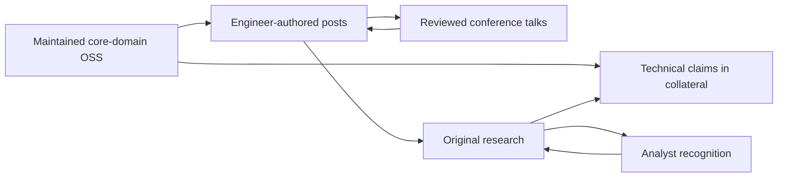

# Engineering Credibility Is A Costly-To-Fake Signal

An organization whose product is not a developer tool still gets evaluated by engineers.
Those engineers do not read the marketing site as evidence. They run a short verification
procedure against public artifacts, and they run most of it before anyone at the vendor
knows they exist. This note treats that procedure as the design target. The governing
mechanism is signaling: an artifact moves a technical buyer only when producing it is much
cheaper for a competent organization than for an incompetent one, and only when the buyer
can check it in minutes. That single constraint predicts most of the observed pattern. It
explains why a maintained repository outranks a released repository, why an
engineer-authored postmortem outranks a thought-leadership post, why a published uptime
number outranks the word "reliable", and why a license reversal destroys more trust than
the original release ever created.

## Source map

| Ref | Source | Role in this note |
| --- | --- | --- |
| B1 | [The Technical Buyer's Journey, DemandWorks](https://www.dwmedia.com/blog/the-technical-buyers-journey/) | 62% of buying process online pre-contact; 76% use technical publications; secondary Stack Overflow 2025 figures (48% influenced a purchase, API-first ranking, security as top rejection reason). |
| B2 | [Technical Buyer: Definition, Examples & Use Cases, Saber](https://www.saber.app/glossary/technical-buyer) | Gartner figure: 73% of enterprise purchases involve formal technical evaluation, up from 52%; enumerates the six competence signals buyers judge. |
| B3 | [What are the 5 key supplier evaluation criteria, TechnologyMatch](https://technologymatch.com/blog/what-are-the-5-key-supplier-evaluation-criteria) | Documentation as a reliability signal; adversarial demo testing (break inputs, rotate secrets, throttle networks). |
| B4 | [The Essential IT Vendor Selection Criteria Checklist, TechnologyMatch](https://technologymatch.com/blog/the-essential-it-vendor-selection-criteria-and-checklist) | Structured selection processes 30% more likely to succeed; 55–75% ERP objective-failure rate. |
| O1 | [How Open Source Builds Trust in Developer Hiring, daily.dev](https://recruiter.daily.dev/resources/open-source-builds-trust-developer-hiring/) | 87% of hiring managers value OSS expertise; 70% more likely to select OSS contributors; "verifiable code history"; Guy Martin (Autodesk) on earned community standing. |
| O2 | [Open source software earns trust through transparency, openDesk](https://www.opendesk.eu/en/blog/open-source-software-trust) | Public review as a distinct quality pressure; Germany's BSI inspects OSS directly. |
| O3 | [12 things to consider when assessing open source software, LeadDev](https://leaddev.com/software-quality/12-things-consider-when-assessing-open-source-software) | HashiCorp Terraform MPL 2.0 → BSL 1.1 (Aug 2023) and the immediate OpenTF fork. |
| O4 | [Building Trust and Adoption Through Compliance in Open Source, OSFY](https://www.opensourceforu.com/2026/08/building-trust-and-adoption-through-compliance-in-open-source/) | Compliance as a long-term-thinking signal and a gate into regulated buyers. |
| F1 | [Building Credibility Signals at Scale, Deepak Gupta](https://guptadeepak.com/ebooks/geo-cybersecurity/building-credibility-at-scale/) | Framework: one maintained OSS tool > dozens of posts; original research as strongest signal; 2–3 patents give lift; compounding portfolio; 6–18 month horizon; phased analyst roadmap. Cybersecurity-specific. |
| E1 | [The best company engineering blogs to follow in 2026, daily.dev](https://daily.dev/blog/best-company-engineering-blogs-to-follow/) | Content profiles for Netflix, Uber, and Airbnb engineering blogs. |
| P1 | [Stripe engineering blog](https://stripe.dev/blog/topic/engineering) | 99.9995% payment reliability target; engineer-authored system deep dives. |
| P2 | [How Stripe uses GitHub](https://github.com/customer-stories/stripe) | 9 public libraries, nearly 90 public repositories; "showing the rigor behind their software". |
| P3 | [Inside Stripe's Engineering Culture, Part 1, Pragmatic Engineer](https://newsletter.pragmaticengineer.com/p/stripe) | Mandatory API review beyond code review; measurement culture. |
| P4 | [Inside Stripe's Engineering Culture, Part 2, Pragmatic Engineer](https://newsletter.pragmaticengineer.com/p/stripe-part-2) | Achieved 99.999%+ API reliability, six nines in peak week; CTO framing of operational excellence; CEO as prolific internal publisher. |
| D1 | [How Stripe, Twilio, and GitHub built dev trust, daily.dev](https://business.daily.dev/resources/cracking-the-code-how-stripe-twilio-and-github-built-dev-trust/) | Self-service, responsiveness, clear communication as trust factors; Twilio Developer Voices at $650 per tutorial; Stripe scale figures. |
| D2 | [Closing the developer AI trust gap, Stack Overflow](https://stackoverflow.blog/2026/02/18/closing-the-developer-ai-trust-gap/) | 84% use or plan to use AI tools, 29% trust them (down 11 points); operational definition of developer trust. |
| X1 | Michael Spence, "Job Market Signaling", *Quarterly Journal of Economics*, 1973 | Background only, outside the research report's register: separating versus pooling equilibria. |
| L1 | [github.com/oaiz-io](https://github.com/oaiz-io) | First-party worked example (polint, gnr8, demohunter). Used to make the framework concrete, not as evidence for it. |

## Background: the buyer's inference problem

A technical buyer wants to know an unobservable quantity: will this vendor's engineering
hold up under load, under attack, and under three years of maintenance. No public artifact
answers that directly. Every artifact the buyer can see is a proxy chosen and published by
the vendor, which is exactly the adverse-selection setup that signaling theory addresses
[X1].

| Term | Definition | Why it matters here |
| --- | --- | --- |
| Technical buyer | Developer, engineering manager, architect, or procurement role that can approve or veto a vendor [B2] | The audience for every signal in this note |
| Trust signal | Public artifact whose production cost falls sharply with genuine competence | The unit of design |
| Pooling | Every vendor emits the artifact, so it carries no information | The failure state of most marketing |
| Separating | Only competent vendors find the artifact worth producing | The goal state |
| Stock signal | One-time artifact retaining value without further spend (patent, paper, past talk) | Ages; discounted for recency |
| Flow signal | Artifact requiring continuous spend (maintained repo, release cadence, uptime reporting) | Strongest separation; revocable |

The formal condition is small enough to state directly. Let `q` be true engineering quality,
`s` a public artifact, `c(s | q)` the cost of producing and sustaining `s` at quality `q`,
and `v(s)` the value the vendor captures if the buyer believes `s`:

```text
s separates competent from incompetent vendors iff
    c(s | incompetent) > v(s) >= c(s | competent)
```

When both costs are close, the market pools and the buyer learns nothing. A landing page
claiming engineering excellence costs about the same to produce whether or not it is true,
so `c(s | incompetent) ≈ c(s | competent) ≈ 0` and the artifact is uninformative regardless
of how well written it is. This is not a claim that marketing is dishonest. It is a claim
that marketing is structurally unable to carry this particular payload.

Two levers raise `c(s | incompetent)`:

1. **Inspectability.** Publish the source, the method, the numbers, or the failure. Anyone
   can assert an architecture. Publishing the repository converts the assertion into
   something that must survive reading. Public code is reviewed by people the vendor does
   not employ, producing a quality pressure closed systems do not experience. Germany's Federal
   Office for Information Security (BSI) inspects open source precisely because that
   transparency exists [O2].
2. **Recurrence.** A one-time artifact can be bought once. A five-year release cadence with
   green CI cannot be bought. This is why the research is unambiguous that maintenance, not
   release, is the credibility mechanism [F1, O2].

## Where the evaluation actually happens

The buyer runs most of the procedure before the vendor is aware of it. Technical buyers
complete an average of 62% of the buying process online before speaking to anyone at the
vendor, rising to 66% for buyers 35 and younger, and 76% routinely consult online technical
publications during research, slightly ahead of vendor websites at 74% [B1]. Meanwhile the
formal gate has hardened: 73% of enterprise software purchases now involve formal technical
evaluation, up from 52% five years earlier [B2]. Developers are not bystanders in this;
48% reported endorsing or influencing a technology purchase in the previous year, and 20%
of those influenced a substantial stack addition [B1].

```text
procedure EVALUATE(vendor):
  # Phase 1: self-service. No vendor contact. ~62% of the process. [B1]
  artifacts <- {product docs, github org, engineering blog, status page, security page}
  for a in artifacts:
      if unreachable(a) or stale(a): record_absence(a)
  if security_or_privacy_concern(artifacts): return REJECT   # top rejection reason [B1]
  score(api_and_integration_surface)                          # top ranked factor [B1]

  # Phase 2: contact and formal evaluation. 73% of enterprise purchases. [B2]
  demo <- request_demo(vendor)
  adversarial_probe(demo): break inputs, rotate secrets, throttle network,
                           observe failure modes                       # [B3]
  assert docs_match_observed_behavior(demo)                            # [B3]
  assess(support responsiveness, architecture depth, update frequency) # [B2]
  return DECISION
```

Two properties of this loop drive everything downstream.

**Phase 1 rejections are silent.** A buyer who eliminates a vendor while reading its GitHub
org never files a lost-deal reason, never answers a survey, and never appears in a funnel.
The vendor observes nothing. This is an inference rather than a reported finding, but it is
the most parsimonious explanation for the evidence gap the underlying research flags: no
source establishes a causal link from an engineering-brand investment to a purchase
decision, and the strongest available data is correlational. The negative outcomes are
censored by construction, so the measurement problem is structural rather than a gap
someone has simply not filled yet.

**Phase 2 is adversarial, and documentation is the instrument.** Practitioner guidance tells
buyers to break inputs, rotate secrets, throttle networks, watch failure modes, and check
documentation against actual behavior [B3]. Docs are not treated as a convenience. They are
treated as a testable claim about the system, and a mismatch is read as evidence about
engineering discipline rather than about the docs team.

## A cost-and-verification model of signals

The following table is a synthesis. The signal categories and their evidence come from the
sources cited per row; the cost profile and verification columns are the framework applied
to them.

| Signal | Production cost profile | Buyer's verification action | Time to check | What a fake looks like |
| --- | --- | --- | --- | --- |
| Maintained OSS in the core domain [F1, O2] | Recurring; falls sharply with real competence | Commit history, issue latency, CI status, release cadence | 2–5 min | Stale HEAD, red CI, unanswered issues, no releases |
| Engineer-authored system deep dive [E1, P1] | High per post; requires the system to exist | Look for numbers, constraints, named trade-offs, an author with a title | 5–10 min | No numbers, no failure modes, no named engineer |
| Published reliability metric [P1, P4] | Recurring measurement plus real operational spend | Status page history, incident writeups, methodology | 2 min | A percentage with no status page and no postmortems |
| Original research or benchmark [F1] | Very high; needs a research capability | Method, released data, reproducibility | 10–30 min | Unreleased data, unstated baseline |
| Patent family [F1] | High and slow; one-time per filing | Public registry lookup | 2 min | Registry is authoritative; relevance is the weak point |
| Peer-reviewed publication | High; gated by external reviewers | Venue and program committee | 5 min | Non-reviewed or pay-to-publish venue |
| Compliance certification [O4] | High and recurring; audited | Certificate, auditor, scope, expiry | 5 min | Self-attestation with no named auditor |
| Talk at a reviewed conference [F1] | Medium; gated by an external CFP | Recording, CFP selectivity | 5 min | Vendor-run venue, vendor-selected speaker |
| Marketing claim | Near zero regardless of quality | None available | 0 | Pools. Carries no information either way |

Two design rules follow. First, prefer signals in the upper rows for anything a skeptical
engineer must accept. Second, publish every signal in the form the verification column
expects. A reliability number without a public status page fails not because it is untrue
but because the buyer's check has nothing to bind to. The gate is `verifiability`, not
`truth`.

## Open source as the strongest available signal, and its exact mechanism

The framework claim is strong: a single well-maintained open source tool can generate more
lasting authority than dozens of blog posts [F1]. The mechanism is the cost model above.
Code is inspectable by definition and maintenance is recurring by definition, so a
maintained repository maximizes both levers simultaneously. No other artifact does.

The strongest quantitative support is analogical rather than direct. In hiring, 87% of
managers value open source expertise and report being 70% more likely to choose candidates
with it, because contributions "replace resumes with verifiable code history" [O1]. That is
a different decision under a different budget, and the transfer to vendor selection rests on
the shared mechanism, not on the number. Treat the 87%/70% figures as illustrative of the
mechanism, not as an effect size for procurement.

**What to open source.** For a company whose product is not a developer tool, the selection
rule is: release internal tools that demonstrate depth in the core domain [F1]. The word
doing the work is *core*. A repository is a claim about which problems the team has actually
solved, so an adjacent utility signals adjacent competence. Stripe's portfolio of nine
public libraries and nearly 90 public repositories sits directly on its core domain, and the
company frames the practice as showing the rigor behind the software so customers can trust
it as infrastructure [P2].

**Why the release is not the signal.** Releasing costs one afternoon. Sustaining costs
forever, in public, against strangers who file issues the team must answer. An incompetent
organization can pay the first cost and cannot pay the second, which is exactly the
separating condition. Guy Martin, Director of Open at Autodesk, states the community version
of this: standing has to be earned through contribution, not assigned [O1].

**The revocation failure mode.** Flow signals can be withdrawn, and withdrawal is worse than
never starting. HashiCorp moved Terraform from MPL 2.0 to BSL 1.1 in August 2023 to blunt
cloud providers reselling the software, and the community forked immediately as OpenTF [O3].
The mechanism: adopters had spent their own resources on an artifact whose openness was the
implicit contract. Changing the license retroactively repriced that spend, so the accumulated
trust functioned as collateral that the license change seized. Any organization using OSS as
a credibility instrument should treat the license as a commitment it does not intend to
revisit, because the option value of relicensing is smaller than the trust it destroys.

## Engineering blogs: depth is the cost function

The pattern across credible non-dev-tool blogs is consistent. Netflix publishes on
distributed systems, service discovery, and resilience tooling such as Simian Army and
Chaos Mesh. Uber publishes deep dives on internal systems including Apache Pinot, Apache
Hudi, and the Michelangelo ML platform. Airbnb concentrates on experimentation, ML-based
personalization, and the data systems behind search and pricing [E1]. Stripe publishes
engineer-authored posts on named internal systems, such as building a data plane from
scratch and using graph search and state machines to auto-remediate a global database fleet
[P1].

| Company | Core product (not a dev tool) | Blog subject matter | Signal mechanism |
| --- | --- | --- | --- |
| Netflix | Streaming media | Distributed systems, resilience, chaos engineering | Failure handling published in detail [E1] |
| Uber | Marketplace / ride-hailing | Marketplace architecture, ML, data infrastructure | Named internal systems [E1] |
| Airbnb | Hospitality marketplace | Experimentation, personalization, data systems | Data-heavy method disclosure [E1] |
| Stripe | Payments infrastructure | API design, reliability, operations | Engineer bylines plus leadership writing culture [P1, P4] |

Stripe is the best-documented row and the least clean comparator: it has a
developer-facing API product, so some of its practice is native rather than adapted.
Netflix, Uber, and Airbnb are the unambiguous non-dev-tool cases, and the evidence for
them is a ranking summary rather than primary company material [E1].

None of these posts is expensive to *write*. They are expensive to *have material for*. A
team that has not built a data plane cannot describe the trade-offs it made building one.
That is the entire cost asymmetry, and it yields a usable editorial test: **could a
competent writer who never worked on the system produce this post?** If yes, the post pools.
Posts survive the test when they contain at least one of: a measured number with its
methodology, a rejected alternative with the reason it was rejected, a failure that occurred
and its remediation, or a constraint that forced an unattractive design.

Leadership behavior is the enabling condition, not decoration. At Stripe the CEO is
described as one of the most prolific publishers to the internal blog, and both the CEO and
CTO publish internally and externally on a regular cadence, with engineers encouraged to do
the same [P4]. Writing that is not modeled from the top loses to feature work every quarter, because
its payoff is diffuse and its cost is immediate and personal.

## Hard evidence: metrics, research, patents, compliance

**Measured reliability is a falsifiable commitment.** Stripe targets 99.9995% reliability for
payment processing [P1] and reports achieving API reliability consistently above 99.999%,
exceeding six nines during the peak Black Friday and Cyber Monday week [P4]. Its CTO frames
operational excellence as systematically keeping promises to users, and states that breaking
the promise is failure [P4]. The signal value is not the digit count. It is that the number
is measured, published, and contradicted by the vendor's own status page if it slips. A
vendor that publishes a number accepts a standing opportunity to be caught. That acceptance
is the cost. Process disclosure works the same way: every API-modifying change at Stripe
passes a review beyond normal code review, in an organization that measures everything it
can about its development practices [P3]. Such a process only becomes a signal once it is
described externally.

**Original research is rated the strongest single signal**, because it introduces data,
frameworks, or findings that marketing cannot replicate [F1]. Take the ranking with care:
[F1] is a cybersecurity-specific framework aimed at visibility in AI-mediated search, and
its ordering has not been validated against buyer behavior in other domains. The underlying
mechanism, that novel findings require a research capability and therefore separate types,
is sound independent of the ranking.

**Patents give lift at low volume.** Even two or three patents in the core domain provide
meaningful credibility lift with technical evaluators [F1]. Patents are pure stock signals:
expensive and slow to acquire, then permanently checkable in a public registry at near-zero
cost to the buyer. Their weakness is relevance, not authenticity. A registry proves the
filing exists; it does not prove the filing bears on the product being evaluated.

**Compliance is the procurement-side instrument.** Investing in compliance signals that the
people running the project think long-term rather than shipping and hoping, and it removes
barriers to government, healthcare, and finance buyers before those buyers ask [O4]. The
evidence base supports the principle but does not rank specific frameworks, so which
certification to pursue first is not answerable from this research.

## Segment-specific priorities

The following mapping is inferred from signal-type preferences, not from a survey that
compares segments directly. The underlying research is explicit that no source measures how
trust heuristics differ between IC developers and CTOs with empirical rigor. Treat it as a
prioritization hypothesis.

| Segment | Primary signals | What to build | Basis |
| --- | --- | --- | --- |
| IC developers | API quality, documentation accuracy, code quality, security posture | Public repos, docs that match behavior, security disclosures | [B1], [B3], [O1] |
| Engineering managers | Architecture sophistication, operational reliability, update frequency | Architectural deep dives, published uptime and incident writeups | [B2], [P1], [P4] |
| CTOs | Analyst recognition, patents, research, executive thought leadership | Analyst engagement, original research, leadership writing | [F1], [P4] |
| Procurement | Compliance, evaluation readiness, vendor stability | Certifications, documented processes, structured evaluation packets | [B2], [B4], [O4] |

Note the asymmetry in stakes. Structured vendor selection correlates with a 30% higher rate
of successful outcomes, and 55–75% of ERP projects miss their objectives with poor vendor
selection implicated [B4]. Procurement's caution is calibrated to a genuinely high base rate
of failure, which is why compliance artifacts are read as risk reduction rather than as
bureaucracy.

## DevRel when there is no developer product

Standard developer relations optimizes a funnel that a non-dev-tool company does not have:
signup, first API call, SDK adoption, integration depth. Removing that funnel does not remove
the audience, because the engineers and security reviewers inside customer organizations
still hold veto power. The adaptation is to keep the audience and replace the funnel:

| Standard DevRel | Non-dev-tool substitute | Basis |
| --- | --- | --- |
| SDK tutorials | Engineering content on internal systems | [P1], [P4] |
| API adoption metrics | Technical content consumption and repo engagement | [D1] |
| Product-focused community | OSS contribution in the company's domain | [P2], [F1] |
| Product launch talks | Conference talks on architecture and operations | [F1] |

Community content models can transfer with adaptation. Twilio's Developer Voices program
pays $650 per published tutorial [D1], but Twilio is a developer tool company; for a
non-dev-tool company, the equivalent budget buys domain engineering content rather than
integration tutorials. Developers consistently value self-service access, responsive
support, and clear communication [D1], all of which are properties of the artifact surface
rather than of a relationship.

## Failure modes

| Failure mode | Mechanism | How the buyer detects it | Mitigation |
| --- | --- | --- | --- |
| Performative OSS | Release cost paid, maintenance cost not; the separating condition is never met | Commit graph, open issue age, no releases | Ship fewer repos, maintain them visibly |
| Abandoned repos | Flow signal stops; recency discount applies immediately | Last commit date, dead CI | Archive deliberately with a stated reason |
| Marketing-fluff blog | Production cost independent of engineering quality, so the content pools | No numbers, no failure modes, no author | Apply the editorial test above, or publish nothing |
| License reversal | Retroactively reprices adopter investment; seizes accumulated trust | License history in the repo | Treat the license as a non-revocable commitment [O3] |
| Metric without instrumentation | Unverifiable claim; check has nothing to bind to | No status page, no methodology | Publish the status page before the number |
| Individual credibility asserted as organizational | Signal resolves to a person and a former employer, not the company | Bylines, repo owner, paper affiliation | Re-attach: org-owned repos, current affiliation on output |
| Adoption metrics presented as trust | Usage and trust are separate quantities | Buyer discounts vanity metrics | Report trust-relevant evidence instead |

The last row has the sharpest available evidence. Stack Overflow's 2025 survey found 84% of
developers use or plan to use AI tools, while only 29% trust them, down 11 percentage points
from 2024, where trust means willingness to deploy AI-generated output to production with
minimal human review and confidence the tool is not injecting unacceptable risk and
technical debt [D2]. Usage went up while trust went down. Any organization citing adoption
as evidence of trust is reporting the wrong variable.

One honest gap: the research supports that maintenance is required to sustain OSS
credibility and to avoid the perception of abandonment [F1, O2], but it does not establish
that an unmaintained repository actively signals incompetence. The defensible version of the
claim is that abandonment stops producing a positive signal. Whether it produces a negative
one is unmeasured.

## The compounding portfolio

Signal types reinforce each other. Analyst recognition raises the citation potential of
published research, a conference talk drives traffic to technical posts, and open source
contributions validate the technical claims made elsewhere in a vendor's collateral [F1].



The practical consequence is a slow ramp. [F1] estimates 6–18 months before a systematic
portfolio produces results, and sketches a phased analyst roadmap: briefings in months 1–3,
customer references for analyst research in months 3–6, inclusion in relevant reports in
months 6–12, named positions in competitive evaluations by months 12–18. Those timings come
from a cybersecurity context targeting AI-mediated citation, so treat the phase ordering as
more transferable than the durations.

## Worked example: OAIZ Labs

OAIZ sells automation to operations and business teams. The buyer is not an engineer, but
the veto often is: security and privacy concerns are the top reason developers reject a
technology [B1], and 73% of enterprise purchases route through a formal technical evaluation
[B2]. This inverts the usual framing. **The signal portfolio's job here is veto prevention,
not lead generation.** The engineer reviewing an AI agent that will hold OAuth scopes across
Gmail, Calendar, GitHub, Notion, and Zendesk is deciding whether to allow the purchase the
business team already wants. That reviewer is also, statistically, in a population where 84%
use AI tools and 29% trust them [D2]. The trust deficit is the market condition, not an edge
case.

The three OAIZ Labs repositories map onto core-domain depth unevenly [L1]:

| Repository | What it demonstrates | Core-domain distance | Signal read |
| --- | --- | --- | --- |
| gnr8 (Rust) | Code-first OpenAPI 3.1 and typed SDK generation with deterministic output and zero OSS dependencies | Close. Any integration platform lives or dies on API contract handling | Strongest domain-depth claim; determinism and zero-dependency are falsifiable properties a reviewer can test |
| polint (Rust) | Repo-local static analysis, rules as code, facts-first, ships no built-in rules | Close. The verification half of generate-then-check, which is what an automation-generating agent needs | Second strongest; publishes a design stance (facts-first, no bundled rules) rather than a feature list |
| demohunter (TypeScript/Bun) | Narrated demos as code from `.tour.ts` files, local-first | Distant. Go-to-market tooling, not automation infrastructure | Weakest depth signal; potentially the widest reach |

All three carry the flow properties the mechanism requires: active maintenance, CI badges,
and published release artifacts [L1]. What they currently lack is reach. Roughly seven stars
on polint means the signal is well formed and rarely encountered. **Reach and credibility are
different failure modes with different fixes.** A weak-substance repository is fixed by doing
real work; a low-reach repository is fixed by distribution, which is precisely what the
compounding graph provides through talks and writeups [F1].

The founder-level stock signals are substantial and mis-attached. Thirteen US and
patent-family filings, spanning NLP-based CVE-to-CPE linking, vulnerable-function
identification with hierarchical attention networks, malicious package detection, automated
patch generation, and license analysis for AI-generated content, far exceed the two-to-three
filings that [F1] identifies as sufficient for meaningful lift. Eleven peer-reviewed
publications with DIMVA 2020, ICISSP 2022 (best-paper nomination), and ICNLSP 2022, alongside
Lund University, Politecnico di Milano, and University of Lübeck, clear a bar that marketing
cannot clear. Conference talks at GOTO Copenhagen, Øredev, and the Linux Foundation OSS
Summit NA are externally gated venues. Every one of those artifacts resolves, on inspection,
to Debricked and OpenText. Signals attach to whatever entity the buyer's lookup returns, so
transferring them requires explicit re-attachment: current affiliation on new output,
org-owned repositories, and bylines that name both the person and the company.

Scoring the portfolio against the model gives a concrete gap list:

| Signal | Present | Type | Gap |
| --- | --- | --- | --- |
| Core-domain OSS, maintained | Yes: gnr8, polint | Flow | Distribution, not substance |
| Adjacent OSS | Yes: demohunter | Flow | Lower domain-depth yield per unit of maintenance |
| Engineer-authored deep dives | Partially, via this vault | Flow | Needs OAIZ bylines and named internal systems, not general essays |
| Measured reliability of the automation runtime | Not stated in the case material | Flow | No status page or published number binds the claim |
| Original research | Yes, but pre-OAIZ | Stock | Re-attach or produce new work under current affiliation |
| Patents | 13 filings, pre-OAIZ | Stock | Same; relevance to automation domain needs stating |
| Reviewed conference presence | 2022 vintage | Stock, aging | Recency discount is active |
| Compliance posture | Not stated in the case material | Flow | The security reviewer asks first; procurement asks second [O4] |

The two highest-leverage moves the model identifies are both flow signals that are currently
absent rather than weak: a published, instrumented reliability figure for the automation
runtime, and a stated compliance posture. Both bind directly to the veto-holder's concerns
[B1, O4]. Neither requires new engineering brand infrastructure. Both require accepting a
standing opportunity to be caught, which is the cost that makes them work.

## Limits

- **Survey provenance.** The 62%, 76%, 48%, and 73% figures reach this note through
  marketing-agency and vendor-glossary intermediaries citing GlobalSpec/TREW, Stack Overflow
  2025, and Gartner [B1, B2]. The primary reports were not verified. Directional confidence
  is reasonable; precise values should not be quoted as settled.
- **No causal evidence.** Nothing in this evidence base links a specific brand investment to
  a purchase decision. Stripe's scale [D1] is correlational and overdetermined. The
  censored-outcome argument earlier is an inference about why the evidence is missing, not a
  substitute for it.
- **Domain specificity.** The credibility framework [F1] was written for cybersecurity
  vendors optimizing for citation by AI search engines. Its rankings, the 6–18 month horizon,
  and the analyst roadmap durations are unvalidated elsewhere.
- **Analogical transfer.** The 87%/70% OSS figures are hiring data [O1]. The mechanism
  transfers; the magnitude does not.
- **Comparator contamination.** As noted above, Stripe carries a developer-facing API
  product, and the cleaner non-dev-tool comparators rest on a ranking summary [E1] rather
  than primary company material.
- **First-party inputs.** Stripe sources [P1, P2] and the OAIZ Labs material [L1] are
  first-party. The Pragmatic Engineer pieces are independent but rest on internal Stripe
  communications [P3, P4].
- **Inferred segmentation.** The segment table is a hypothesis derived from signal-type
  preferences, not from a study comparing segments.
- **Regional scope.** The cited surveys appear US-centric. Whether the same heuristics hold
  for European technical buyers is untested here.

## Open questions

1. How fast does credibility decay when a flow signal stops? No source measures the decay
   curve after an organization reduces content output or OSS maintenance.
2. Do abandoned vendor repositories actively signal incompetence, or merely fail to signal
   competence? [F1, O2] establish the maintenance requirement without characterizing the
   negative case.
3. What is the minimum viable OSS investment for a non-dev-tool company: one maintained
   project, or a portfolio?
4. Which compliance frameworks carry the most weight with technical buyers in regulated
   industries? [O4] supports the principle and ranks nothing.
5. How do AI-mediated discovery tools change which signals buyers encounter? [F1] notes that
   AI engines can trace an organization's GitHub activity, but the effect on buyer behavior
   is unmeasured.
6. Does founder-level credibility transfer measurably to a new company, and what mechanism
   accelerates it?

## Testable next steps

The cheapest experiments the model suggests, in increasing cost:

1. **Instrument before claiming.** Publish a status page for the automation runtime and let
   it accumulate history before publishing any reliability figure. The history is the signal;
   the figure is a summary of it.
2. **Editorial gate.** Apply the pooling test to every draft: could a competent writer who
   never touched the system have written this? Reject on yes.
3. **Distribution pass on existing repos.** The substance exists; measure whether reach, not
   quality, is the binding constraint by submitting the same work to reviewed venues and
   tracking inbound technical inquiries over 12 months.
4. **Vendor-page A/B test.** Serve two evaluation pages, one linking engineering posts, repos,
   and reliability data, one without, and compare technical-evaluation initiation rates.
5. **Postmortem publication.** Publish one real incident writeup and measure security
   questionnaire completion time against a baseline period. This is the highest-cost and
   highest-separation signal available to a young organization, because incompetent
   organizations cannot afford to describe their own failures precisely.

## References

- [The Technical Buyer's Journey, DemandWorks](https://www.dwmedia.com/blog/the-technical-buyers-journey/)
- [Technical Buyer: Definition, Examples & Use Cases, Saber](https://www.saber.app/glossary/technical-buyer)
- [What are the 5 key supplier evaluation criteria, TechnologyMatch](https://technologymatch.com/blog/what-are-the-5-key-supplier-evaluation-criteria)
- [The Essential IT Vendor Selection Criteria Checklist, TechnologyMatch](https://technologymatch.com/blog/the-essential-it-vendor-selection-criteria-and-checklist)
- [How Open Source Builds Trust in Developer Hiring, daily.dev](https://recruiter.daily.dev/resources/open-source-builds-trust-developer-hiring/)
- [Open source software earns trust through transparency, openDesk](https://www.opendesk.eu/en/blog/open-source-software-trust)
- [12 things to consider when assessing open source software, LeadDev](https://leaddev.com/software-quality/12-things-consider-when-assessing-open-source-software)
- [Building Trust and Adoption Through Compliance in Open Source, Open Source For You](https://www.opensourceforu.com/2026/08/building-trust-and-adoption-through-compliance-in-open-source/)
- [Building Credibility Signals at Scale, Deepak Gupta](https://guptadeepak.com/ebooks/geo-cybersecurity/building-credibility-at-scale/)
- [The best company engineering blogs to follow in 2026, daily.dev](https://daily.dev/blog/best-company-engineering-blogs-to-follow/)
- [Stripe engineering blog](https://stripe.dev/blog/topic/engineering)
- [How Stripe uses GitHub](https://github.com/customer-stories/stripe)
- [Inside Stripe's Engineering Culture, Part 1, Pragmatic Engineer](https://newsletter.pragmaticengineer.com/p/stripe)
- [Inside Stripe's Engineering Culture, Part 2, Pragmatic Engineer](https://newsletter.pragmaticengineer.com/p/stripe-part-2)
- [Cracking the code: how Stripe, Twilio, and GitHub built dev trust, daily.dev](https://business.daily.dev/resources/cracking-the-code-how-stripe-twilio-and-github-built-dev-trust/)
- [Mind the gap: Closing the AI trust gap for developers, Stack Overflow](https://stackoverflow.blog/2026/02/18/closing-the-developer-ai-trust-gap/)
- Michael Spence, "Job Market Signaling", *Quarterly Journal of Economics*, 1973 (background on separating equilibria; outside the research report's source register)
- [OAIZ Labs on GitHub](https://github.com/oaiz-io) (first-party worked example)
