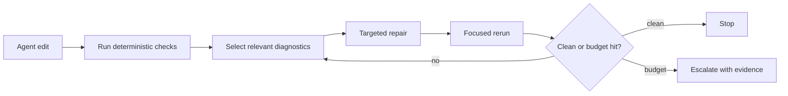

# Static Analysis Feedback Can Help And Harm Agents

Static-analysis feedback is useful for AI coding agents, but only when it is treated as an
external, deterministic signal with scoped repair guidance. Feedback loops are not
automatically safe. Some studies show large issue reductions from tool feedback; another
shows security degradation from iterative AI-only refinement. The design implication is to
prefer deterministic analyzers, cap iterations, and preserve evidence.

## Evidence Snapshot

| Study | Signal | Measurement | Design implication |
| --- | --- | ---: | --- |
| FeedbackEval | mixed feedback | 63.6% repair success | Combine signal types. |
| FeedbackEval | compiler feedback | 49.2% repair success | Compiler output alone is not enough. |
| FeedbackEval | iterations | diminishing gains after 2-3 | Cap repair loops. |
| Static Analysis as Feedback Loop | Bandit/Pylint | security >40% -> 13% | Deterministic static checks can reduce issues. |
| Static Analysis as Feedback Loop | Bandit/Pylint | readability >80% -> 11%; reliability >50% -> 11% | General quality may improve more than security. |
| Springer feedback study | tests/static analysis | models self-detect poorly but fix with feedback | External diagnostics matter. |
| Security Degradation paper | AI-only iterative refinement | +37.6% critical vulnerabilities after five iterations | Feedback source matters. |

The apparent contradiction is the point. Static analysis as a deterministic external tool is
not the same as asking the model to critique itself.

## Why Determinism Matters

An agent can repair against this:

```json
{
  "rule_id": "local/no-request-to-shell",
  "severity": "error",
  "file": "src/routes/run.ts",
  "range": {"start": {"line": 14, "column": 8}},
  "message": "request data reaches shell execution without validation",
  "evidence": {
    "source": "req.query.cmd",
    "sink": "exec",
    "required_barrier": "validate_command",
    "policy_precision": "heuristic"
  }
}
```

It cannot repair as reliably against:

```text
Maybe improve security here.
```

The first object has a rule identity, location, evidence, and expected barrier. The second
is another prompt.

## Loop Design



This loop has two safeguards:

1. The feedback comes from tools, not model self-critique.
2. The loop stops when marginal value drops or uncertainty remains.

## Good Agent-Facing Diagnostics

| Field | Why it matters |
| --- | --- |
| `rule_id` | Enables filtering, focused reruns, baselines, and memory. |
| `file` and `range` | Keeps the repair local. |
| `message` | States the policy in human language. |
| `evidence` | Lets the agent verify the analyzer's claim. |
| `precision` | Prevents overconfident repairs from heuristic findings. |
| `fix` or `help` | Shows the intended direction without requiring a new search. |
| `fingerprint` | Supports baselines and stable debt tracking. |

If a diagnostic is ambiguous to a human, it is usually worse for an agent. The agent does not
have the team's tacit memory. It needs the missing local context in the diagnostic.

## Failure Modes

| Failure mode | Cause | Mitigation |
| --- | --- | --- |
| False-positive cascade | Agent changes correct code to satisfy a weak warning. | Mark precision and use focused rules. |
| Context flooding | Full report pasted into prompt. | Use summaries and targeted JSON queries. |
| Infinite repair churn | Rule is vague or non-deterministic. | Cap iterations and require stable output. |
| Security degradation | Model self-critique invents unsafe changes. | Prefer deterministic SAST/static checks. |
| Silent unsupported facts | Analyzer cannot compute needed fact but reports clean. | Emit `unknown` or capability diagnostics. |

The principle is simple: static analysis should reduce ambiguity. When it increases
ambiguity, it becomes another source of agent drift.

## How polint Fits

polint's `ai-friendly` format exists for this loop. It prints a compact summary and stores a
full JSON report under `.polint/output/latest.json`. The playbook explicitly tells agents
not to read the whole file into context, but to query slices with `jq`.

That design aligns with the research:

- deterministic local rules provide external feedback;
- JSON avoids terminal scraping;
- baselines and ignores avoid overwhelming adoption;
- `--only-rule` and `--max-diagnostics` support focused repair;
- precision/status fields in policy queries preserve uncertainty.

The article should be clear that the goal is not "make agents obey prompts." The goal is to
turn the statically checkable part of the prompt into a deterministic repair loop.

## Sources

- [FeedbackEval](https://arxiv.org/html/2504.06939)
- [Static Analysis as a Feedback Loop](https://arxiv.org/abs/2508.14419)
- [Helping LLMs improve code generation using feedback from testing and static analysis](https://link.springer.com/article/10.1007/s44163-026-01009-5)
- [Security Degradation in Iterative AI Code Generation](https://arxiv.org/html/2506.11022v2)
- [polint agent playbook](https://github.com/emilwareus/polint/blob/main/docs/AGENT-PLAYBOOK.md)
- [polint AI-friendly schema](https://github.com/emilwareus/polint/blob/main/docs/schemas/polint-ai-friendly-v1.json)

