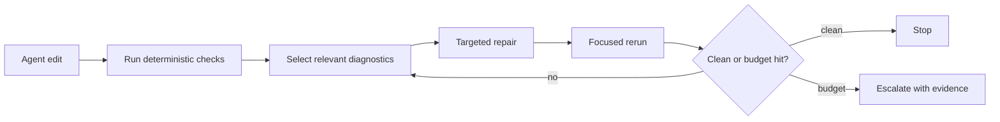

# Static Analysis Feedback Can Help And Harm Agents

Static-analysis feedback is useful for AI coding agents, but only when it is treated as an
external, deterministic signal with scoped repair guidance. Feedback loops are not
automatically safe. Some studies show large issue reductions from tool feedback; another
shows security degradation from iterative AI-only refinement. The design implication is to
prefer deterministic analyzers, cap iterations, and preserve evidence.

## Evidence Snapshot

| Study | Signal | Measurement | Design implication |
| --- | --- | ---: | --- |
| FeedbackEval | mixed feedback | 63.6% repair success | Combine signal types. |
| FeedbackEval | compiler feedback | 49.2% repair success | Compiler output alone is not enough. |
| FeedbackEval | iterations | diminishing gains after 2-3 | Cap repair loops. |
| Static Analysis as Feedback Loop | Bandit/Pylint | security >40% -> 13% | Deterministic static checks can reduce issues. |
| Static Analysis as Feedback Loop | Bandit/Pylint | readability >80% -> 11%; reliability >50% -> 11% | General quality may improve more than security. |
| Springer feedback study | tests/static analysis | models self-detect poorly but fix with feedback | External diagnostics matter. |
| Security Degradation paper | AI-only iterative refinement | +37.6% critical vulnerabilities after five iterations | Feedback source matters. |

The apparent contradiction is the point. Static analysis as a deterministic external tool is
not the same as asking the model to critique itself.

## The Feedback Signal Has A Type

For agent repair loops, "feedback" is too broad. The signal source changes the risk.

| Feedback type | Example | Strength | Risk |
| --- | --- | --- | --- |
| Compiler/typechecker | TypeScript `tsc --noEmit` | deterministic semantic errors | can be too local to explain policy |
| Unit tests | failing test assertion | executable behavior | may be flaky or underspecified |
| Static policy | `local/no-request-to-shell` | deterministic repo convention | model can overfit false positives |
| Security scanner | taint/path warning | evidence-backed risk | model may cargo-cult sanitizers |
| LLM self-critique | "review your code" | cheap and broad | can invent problems or degrade security |
| Human review | PR comment | high-context judgment | slow and not always machine-readable |

The design goal is to make the deterministic signals precise enough that agents do not have
to guess what local rule they violated.

## Why Determinism Matters

An agent can repair against this:

```json
{
  "rule_id": "local/no-request-to-shell",
  "severity": "error",
  "file": "src/routes/run.ts",
  "range": {"start": {"line": 14, "column": 8}},
  "message": "request data reaches shell execution without validation",
  "evidence": {
    "source": "req.query.cmd",
    "sink": "exec",
    "required_barrier": "validate_command",
    "policy_precision": "heuristic"
  }
}
```

It cannot repair as reliably against:

```text
Maybe improve security here.
```

The first object has a rule identity, location, evidence, and expected barrier. The second
is another prompt.

## Repair Loop Pseudocode

The loop should be explicit, bounded, and diagnostic-driven.

```text
repair_with_static_feedback(goal, command, max_iterations):
  history = []

  for iteration in 1..max_iterations:
    report = run(command)
    diagnostics = parse_machine_readable_report(report)

    if diagnostics.is_empty:
      return Success(history)

    cluster = choose_repair_cluster(diagnostics, history)
    if cluster is None:
      return Blocked(reason="no actionable diagnostic", history=history)

    context = load_minimal_context(cluster)
    patch = propose_patch(goal, cluster, context)
    apply_patch(patch)

    history.push({
      iteration: iteration,
      rule_ids: cluster.rule_ids,
      files: cluster.files,
      fingerprints: cluster.fingerprints
    })

    if repeats_same_failure(history):
      return Blocked(reason="repeated diagnostic", history=history)

  return Blocked(reason="iteration budget exceeded", history=history)
```

This is not only a coding workflow. It is a safety control. The loop stops when diagnostics
repeat, when the report is non-actionable, or when the iteration budget is gone.

## Diagnostic Slicing

Agents should not ingest the whole report when one rule cluster is enough. A report slicer
should rank diagnostics by relevance and repairability.

```text
choose_repair_cluster(diagnostics, history):
  candidates = []

  for diagnostic in diagnostics:
    score = 0

    if diagnostic.severity == "error":
      score += 100
    if diagnostic.file in recently_edited_files():
      score += 50
    if diagnostic.policy_status in {"exact", "setup_aware"}:
      score += 30
    if diagnostic.policy_status in {"unknown", "unsupported"}:
      score -= 40
    if diagnostic.fingerprint in history.recent_fingerprints:
      score -= 80

    candidates.push((score, diagnostic))

  best = highest_score_cluster_by_rule_and_file(candidates)

  if best.score < actionable_threshold:
    return None

  return best
```

The ranking should prefer exact, local, high-severity diagnostics and deprioritize repeated
or unsupported findings. That prevents the agent from thrashing on weak signals.

## Loop Design



This loop has two safeguards:

1. The feedback comes from tools, not model self-critique.
2. The loop stops when marginal value drops or uncertainty remains.

## What The Agent Needs In Context

A useful static-analysis report should let the agent answer five questions without a search
through the whole repository:

| Question | Required diagnostic data |
| --- | --- |
| What rule did I violate? | `rule_id`, message, docs/help link. |
| Where is the smallest edit likely to be? | primary file/range plus path edge locations. |
| Why is this a violation? | source, sink, guard, call path, or matched fact. |
| How certain is the analyzer? | policy status, precision, unsupported edges. |
| How do I know when to stop? | stable fingerprint and focused rerun command. |

The absence of any field pushes the agent back toward guessing.

## Good Agent-Facing Diagnostics

| Field | Why it matters |
| --- | --- |
| `rule_id` | Enables filtering, focused reruns, baselines, and memory. |
| `file` and `range` | Keeps the repair local. |
| `message` | States the policy in human language. |
| `evidence` | Lets the agent verify the analyzer's claim. |
| `precision` | Prevents overconfident repairs from heuristic findings. |
| `fix` or `help` | Shows the intended direction without requiring a new search. |
| `fingerprint` | Supports baselines and stable debt tracking. |

If a diagnostic is ambiguous to a human, it is usually worse for an agent. The agent does not
have the team's tacit memory. It needs the missing local context in the diagnostic.

## Failure Modes

| Failure mode | Cause | Mitigation |
| --- | --- | --- |
| False-positive cascade | Agent changes correct code to satisfy a weak warning. | Mark precision and use focused rules. |
| Context flooding | Full report pasted into prompt. | Use summaries and targeted JSON queries. |
| Infinite repair churn | Rule is vague or non-deterministic. | Cap iterations and require stable output. |
| Security degradation | Model self-critique invents unsafe changes. | Prefer deterministic SAST/static checks. |
| Silent unsupported facts | Analyzer cannot compute needed fact but reports clean. | Emit `unknown` or capability diagnostics. |

The principle is simple: static analysis should reduce ambiguity. When it increases
ambiguity, it becomes another source of agent drift.

## Stop Rules

Repair loops need stop rules because more iterations are not always safer.

```text
should_stop(history, current_report):
  if current_report.has_no_diagnostics:
    return ("success", "clean")

  if history.iterations >= max_iterations:
    return ("blocked", "iteration budget exceeded")

  if same_fingerprints_for_last_n_runs(history, n=2):
    return ("blocked", "same diagnostics repeated")

  if current_report.only_contains_status({"unknown", "unsupported"}):
    return ("blocked", "needs capability or human decision")

  if edit_size_since_start() > allowed_repair_budget:
    return ("blocked", "repair is no longer scoped")

  if tests_or_checks_regressed_outside_target_rule():
    return ("blocked", "repair caused unrelated regression")

  return ("continue", "actionable diagnostics remain")
```

These controls are especially important for security. An agent that keeps changing code to
satisfy a weak warning can remove validation, broaden permissions, or add fake sanitizers.

## Metrics For A Static-Analysis Agent Loop

The useful metrics are not only pass/fail.

| Metric | What it reveals |
| --- | --- |
| repair success rate | Whether diagnostics are actionable. |
| iterations to clean | Whether feedback is too vague or too broad. |
| repeated-fingerprint rate | Whether the agent is stuck on the same issue. |
| edit distance per diagnostic | Whether repairs are scoped. |
| unrelated regression rate | Whether feedback causes collateral damage. |
| false-positive repair rate | Whether weak diagnostics drive harmful edits. |
| unknown/unsupported rate | Whether the engine is honestly exposing gaps. |

For the polint article, this gives a concrete evaluation path: show not only that a rule
finds a violation, but that its diagnostic helps an agent repair the violation in a bounded,
small edit.

## How polint Fits

polint's `ai-friendly` format exists for this loop. It prints a compact summary and stores a
full JSON report under `.polint/output/latest.json`. The playbook explicitly tells agents
not to read the whole file into context, but to query slices with `jq`.

That design aligns with the research:

- deterministic local rules provide external feedback;
- JSON avoids terminal scraping;
- baselines and ignores avoid overwhelming adoption;
- `--only-rule` and `--max-diagnostics` support focused repair;
- precision/status fields in policy queries preserve uncertainty.

The article should be clear that the goal is not "make agents obey prompts." The goal is to
turn the statically checkable part of the prompt into a deterministic repair loop.

## Sources

- [FeedbackEval](https://arxiv.org/html/2504.06939)
- [Static Analysis as a Feedback Loop](https://arxiv.org/abs/2508.14419)
- [Helping LLMs improve code generation using feedback from testing and static analysis](https://link.springer.com/article/10.1007/s44163-026-01009-5)
- [Security Degradation in Iterative AI Code Generation](https://arxiv.org/html/2506.11022v2)
- [polint agent playbook](https://github.com/emilwareus/polint/blob/main/docs/AGENT-PLAYBOOK.md)
- [polint AI-friendly schema](https://github.com/emilwareus/polint/blob/main/docs/schemas/polint-ai-friendly-v1.json)
