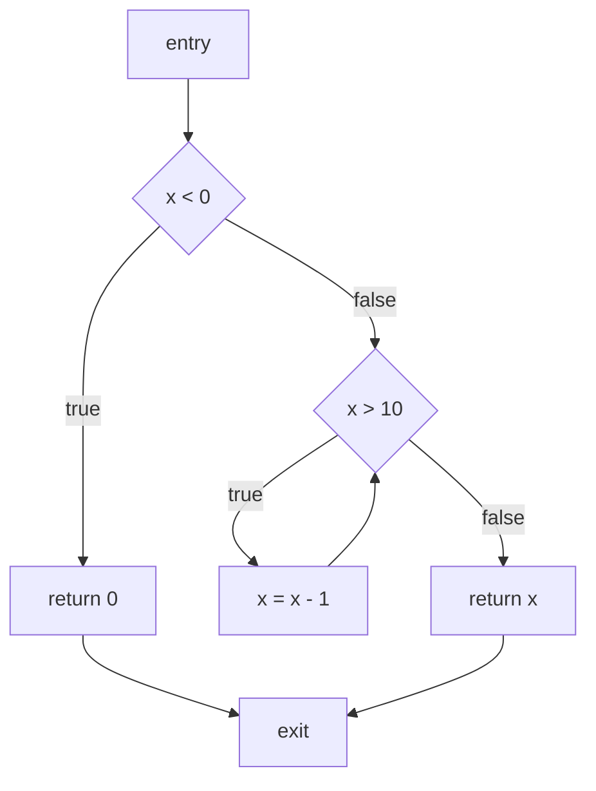

# CFG Construction And Traversal

A control-flow graph (CFG) is the execution skeleton on which most intraprocedural static
analyses run. Its vertices are program points—usually basic blocks—and its directed edges are
possible transfers of control. Building one is not just “connect statements in source order.”
The builder must model branch conditions, short-circuit operators, abrupt exits, exceptions,
cleanup code, loops, and language-specific lowering. Dominators, post-dominators, natural loops,
and strongly connected components then turn the raw graph into traversable structure. If the
CFG omits an edge, a later data-flow solver can be perfectly implemented and still miss the
behavior the program permits.

## What a CFG stores

For a function, write `G = (V, E, entry, exit)`, where `V` is a set of nodes and `E` is a set
of directed edges. A production node usually carries more than an integer ID:

| Field | Purpose |
| --- | --- |
| `id` | Stable identity for maps and evidence. |
| `statements` | Source or IR operations executed sequentially in the block. |
| `terminator` | Branch, return, throw, switch, or invoke that ends the block. |
| `predecessors` / `successors` | Graph adjacency for forward/backward traversal. |
| `span` | Source range used in diagnostics and path evidence. |
| `edge kind` | True/false, fallthrough, backedge, exception, cleanup, or unknown. |
| `origin` | AST, lowered IR, generated code, or framework model. |

A basic block has one entry and one terminator. Once control enters it, all contained
statements execute in sequence until the terminator chooses a successor. [LLVM's language
reference](https://llvm.org/docs/LangRef.html#basic-blocks) uses this shape explicitly: a
function is a list of basic blocks, each ending in a terminator, and the list forms the CFG.

Consider:

```c
int clamp(int x) {
  if (x < 0) {
    return 0;
  }

  while (x > 10) {
    x -= 1;
  }

  return x;
}
```

One reasonable block-level graph is:



The loop condition is a node because it has two outgoing edges. The decrement is a separate
block because it is the target of the backedge and must be revisited by a data-flow solver.
The two returns need not share a source statement, but a synthetic `exit` simplifies
post-dominator and backward-analysis equations.

## Lowering an AST into a CFG

The builder should make control context explicit rather than using special cases scattered
through rule code. The context contains the current fallthrough blocks and targets for
`break`, `continue`, `return`, and exception edges.

```text
build_function(function):
  entry = new_block("entry")
  exit = new_block("exit")
  context = Context(
    break_target = none,
    continue_target = none,
    return_target = exit,
    exception_target = none,
  )

  open_blocks = lower_block(function.body, [entry], context)
  for block in open_blocks:
    add_edge(block, exit, kind="fallthrough")

  return CFG(entry, exit, all_blocks)

lower_block(statements, incoming, context):
  current = incoming
  for statement in statements:
    current = lower_statement(statement, current, context)
  return current

lower_statement(statement, incoming, context):
  if statement is simple:
    block = append_to_or_create_block(incoming, statement)
    return [block]

  if statement is if(condition, then_body, else_body):
    test = new_block(condition)
    connect_all(incoming, test, kind="normal")
    then_entry = new_block("then")
    else_entry = new_block("else")
    add_edge(test, then_entry, kind="true")
    add_edge(test, else_entry, kind="false")
    then_end = lower_block(then_body, [then_entry], context)
    else_end = lower_block(else_body, [else_entry], context)
    open_ends = then_end + else_end
    if open_ends is empty:
      return []
    join = new_block("if_join")
    connect_all(open_ends, join, kind="normal")
    return [join]

  if statement is while(condition, body):
    header = new_block(condition)
    connect_all(incoming, header, kind="normal")
    body_entry = new_block("loop_body")
    after_loop = new_block("loop_exit")
    add_edge(header, body_entry, kind="true")
    add_edge(header, after_loop, kind="false")
    loop_context = context.with(
      break_target = after_loop,
      continue_target = header,
    )
    body_end = lower_block(body, [body_entry], loop_context)
    connect_all(body_end, header, kind="backedge")
    return [after_loop]

  if statement is return(expression):
    block = append_to_or_create_block(incoming, statement)
    add_edge(block, context.return_target, kind="return")
    return []

  if statement is throw(expression):
    block = append_to_or_create_block(incoming, statement)
    add_exception_edge(block, context.exception_target)
    return []

  fail("unsupported control construct must be modeled explicitly")
```

The pseudocode is intentionally strict about unsupported constructs. A production analyzer can
choose a conservative unknown edge, but it should record that choice as a precision gap. A
silent fallthrough edge for `return`, `throw`, or a `finally` block is worse than an explicit
unsupported result because it creates an apparently precise but false path.

The actual implementation needs two refinements:

1. A condition expression can itself branch. `a && b` evaluates `b` only when `a` is true, so
   the CFG should represent the short-circuit edge rather than treating the expression as an
   opaque boolean.
2. The `if` example needs an explicit join block when later statements follow both branches.
   The join is the successor of both branch exits. It is not necessarily a source node; it is a
   graph artifact that gives later facts one program point at which to merge.

## Splitting into basic blocks

If an initial lowering pass emits one node per statement, a normalization pass can create
basic blocks. The classic leader algorithm marks:

```text
find_leaders(instructions):
  leaders = { first_instruction }

  for instruction in instructions:
    if instruction is a branch:
      leaders.add(instruction.target)
      leaders.add(next_instruction(instruction))
    if instruction is return or throw:
      if next_instruction_exists(instruction):
        leaders.add(next_instruction(instruction))

  return leaders

make_basic_blocks(instructions, leaders):
  blocks = []
  current = none

  for instruction in instructions:
    if instruction in leaders:
      current = new_block()
      blocks.append(current)
    current.append(instruction)

  for block in blocks:
    add_edges_from_terminator(block)

  return blocks
```

In SSA-based IR, the terminator is explicit and PHI nodes live at the start of a successor
block. [LLVM specifies that PHIs occur before non-PHI instructions](https://llvm.org/docs/LangRef.html#phi-instruction)
and that an incoming value is selected according to the predecessor block that was executed.
That edge-based meaning is why CFG edge identity must remain stable when the graph is lowered.

## Traversal primitives

The simplest traversal is reachability:

```text
reachable_from(entry):
  reachable = { entry }
  worklist = [entry]

  while worklist is not empty:
    node = worklist.pop()
    for successor in node.successors:
      if reachable.add(successor):
        worklist.push(successor)

  return reachable
```

This is enough for dead-code discovery, but not for path-sensitive facts. Traversal order
matters for performance, not for a monotone fixed point. Reverse postorder tends to process a
forward CFG close to topological order before loops feed information back; reverse reverse
postorder is a useful starting order for backward analyses.

## Dominators and dominator trees

Node `d` dominates node `n` when every path from `entry` to `n` passes through `d`. Every
reachable node dominates itself. Dominance answers questions such as:

- Is a definition guaranteed to execute before this use?
- Is a block a legal loop header?
- Where should a PHI be inserted for SSA construction?
- Does a guard dominate a dangerous operation?

The standard equations are a forward must analysis:

```text
Dom(entry) = {entry}
Dom(n)     = {n} union intersection(Dom(p) for p in predecessors(n))
```

An iterative implementation is easy to verify:

```text
compute_dominators(cfg):
  all_nodes = reachable_from(cfg.entry)
  dom = map node -> all_nodes
  dom[cfg.entry] = {cfg.entry}
  changed = true

  while changed:
    changed = false
    for node in reverse_postorder(cfg) excluding cfg.entry:
      new_dom = {node} union intersection(
        dom[pred] for pred in node.predecessors if pred in all_nodes
      )
      if new_dom != dom[node]:
        dom[node] = new_dom
        changed = true

  return dom
```

The implementation invariant is that `dom[n]` never contains a node that is not a dominator
of `n` after the graph's predecessor information has been accounted for. The set version is
clear but can be expensive. The [Lengauer–Tarjan algorithm](https://doi.org/10.1145/357062.357071)
uses DFS trees and path-minimum machinery; its sophisticated implementation is near-linear
in graph size. [Cooper, Harvey, and Kennedy's simpler formulation](https://hipersoft.cs.rice.edu/grads/publications/dom14.pdf)
often wins in practice on compiler-sized graphs despite its quadratic worst-case bound.

The immediate dominator `idom(n)` is the unique strict dominator closest to `n`. Connecting
each node to its immediate dominator produces a tree. A tree is more useful than a set table
for queries such as “walk all scopes that dominate this block” and for SSA renaming.

## Post-dominators and control dependence

Node `p` post-dominates node `n` when every path from `n` to the function's exit passes through
`p`. Compute post-dominators by reversing the graph and treating a synthetic exit as the
entry:

```text
PostDom(exit) = {exit}
PostDom(n)    = {n} union intersection(PostDom(s) for s in successors(n))
```

Multiple returns, `throw`, non-returning calls, and infinite loops make the definition of
“exit” a policy choice. An analyzer can add separate normal and exceptional exits, or declare
that non-terminating paths do not post-dominate the normal exit. It must document the choice;
otherwise a rule such as “every authorization check post-dominates an entry guard” has an
ambiguous result.

Post-dominance supports control dependence. A node `y` is control-dependent on a branch `x`
when `x` has a successor from which `y` is reachable, but `y` does not post-dominate `x`. In
plain language, the branch decides whether `y` executes. Security policies use this to ask
whether a sink is guarded, and compilers use it for dependence graphs and region formation.

## Loops: natural structure versus arbitrary cycles

For an edge `u -> h`, if `h` dominates `u`, the edge is a backedge and `h` is a natural-loop
header. The natural loop for that backedge is the smallest set containing `h` and `u` and closed
over predecessors of members until the header is reached:

```text
natural_loop(header, tail):
  loop = {header, tail}
  worklist = [tail]

  while worklist is not empty:
    node = worklist.pop()
    for pred in node.predecessors:
      if pred not in loop:
        loop.add(pred)
        if pred != header:
          worklist.push(pred)

  return loop

find_natural_loops(cfg, dom):
  loops = []
  for tail in cfg.nodes:
    for header in tail.successors:
      if dominates(dom, header, tail):
        loops.append(natural_loop(header, tail))
  return nest_by_containment(loops)
```

[LLVM's loop terminology](https://llvm.org/docs/LoopTerminology.html) uses this natural-loop
notion and represents the loop hierarchy as a forest. A loop preheader is a block outside the
loop that unconditionally leads to its header; creating one makes loop-invariant code motion
and loop summaries easier.

Not every cyclic CFG is a natural loop. An irreducible graph can have multiple entry headers,
so no single header dominates all nodes in the cycle. The more general tool is a strongly
connected component (SCC): every node in an SCC can reach every other node. Tarjan's
[depth-first search algorithm](https://doi.org/10.1137/0201010) computes SCCs in `O(|V| + |E|)`.

| Structure | Entry condition | Use | Limitation |
| --- | --- | --- | --- |
| Natural loop | One header dominates the backedge tail | Loop bounds, nesting, preheaders, invariants | Misses irreducible multi-entry cycles. |
| SCC | Mutual reachability | General cycle detection, recursive regions | Does not identify a canonical header or loop exit. |
| Loop forest | Nested natural loops | Scheduling and loop transformations | Depends on dominance and reducibility assumptions. |

## Real implementations

Different frontends expose the same graph idea at different levels:

| System | CFG level | Why it matters |
| --- | --- | --- |
| LLVM IR | Explicit basic blocks and terminators | Optimizations, SSA, dominators, loop passes, and data flow share one graph. |
| Roslyn | `ControlFlowGraph` over operations and regions | C# analyzers can reason about branches, regions, and captures without lowering to machine IR. |
| rustc MIR | Basic blocks over a desugared intermediate representation | Borrow checking can use non-lexical lifetime regions tied to CFG locations. |
| angr | `CFGFast` statically recovers binary edges; `CFGEmulated` uses symbolic execution | Indirect jumps show why CFG recovery itself can be approximate. |

Rust's borrow checker is a useful source-level example: the compiler guide describes move and
borrow data-flow analyses over MIR and region values containing points in the MIR CFG. The
graph is not merely for optimization; it is the coordinate system for a safety proof.

## Production edge cases

| Construct | Common incorrect model | Required treatment |
| --- | --- | --- |
| `a && b`, `a || b` | One opaque expression edge | Branch on the first operand and short-circuit. |
| `switch` / pattern match | One edge to the whole statement | One labeled edge per case plus a default/unknown case. |
| `break` / `continue` | Fallthrough to the next source statement | Contextual targets for the nearest loop or labeled construct. |
| `try` / `finally` | Direct edge around cleanup | Route normal and exceptional exits through cleanup blocks. |
| `defer` | Ignore deferred calls | Add scope-exit edges or a conservative cleanup summary. |
| `throw` / panic | Return to the next statement | Exceptional edge to a handler or an exceptional exit. |
| Async/generators | Assume one contiguous stack | Represent suspension/resumption or lower to an explicit state machine. |
| `goto` / computed jump | Assume structured nesting | Add explicit edges; unresolved targets must be unknown. |
| Infinite loop | Force an edge to normal exit | Keep non-terminating SCCs distinct from normal post-dominance. |

The minimum fixture suite should include one test per edge kind, a nested loop, an irreducible
cycle if the language permits it, multiple returns, an exception path, and a branch whose guard
does not dominate the sink it appears near in source order. Compare graph edges and dominator
sets directly; testing only final diagnostics hides CFG construction bugs.

## Sources

- [LLVM basic blocks and terminators](https://llvm.org/docs/LangRef.html#basic-blocks)
- [LLVM PHI instruction semantics](https://llvm.org/docs/LangRef.html#phi-instruction)
- [LLVM loop terminology](https://llvm.org/docs/LoopTerminology.html)
- [LLVM LoopInfo API](https://llvm.org/doxygen/classllvm_1_1LoopInfo.html)
- [Lengauer–Tarjan dominator algorithm](https://doi.org/10.1145/357062.357071)
- [A simple, fast dominance algorithm](https://hipersoft.cs.rice.edu/grads/publications/dom14.pdf)
- [Tarjan's linear graph algorithms](https://doi.org/10.1137/0201010)
- [Roslyn ControlFlowGraph API](https://learn.microsoft.com/en-us/dotnet/api/microsoft.codeanalysis.flowanalysis.controlflowgraph)
- [Rust MIR borrow checking](https://rustc-dev-guide.rust-lang.org/borrow_check.html)
- [angr CFG recovery](https://api.angr.io/en/latest/analyses/cfg.html)
