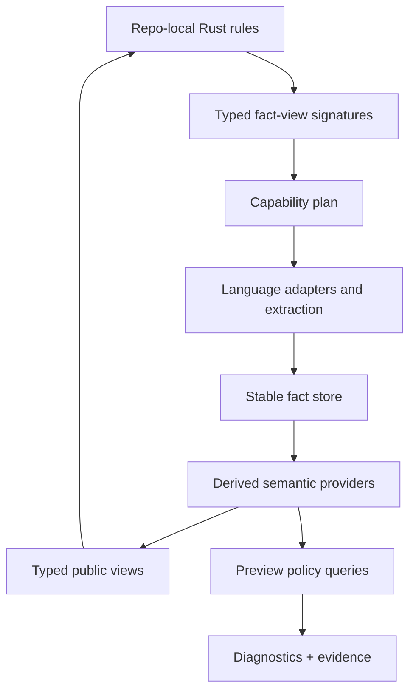

# polint Is A Repo-Local Policy Engine

polint is easiest to explain as a linter with no bundled rules, but that undersells the
design. The deeper idea is repo-local policy execution: the framework supplies analysis
infrastructure, typed facts, diagnostics, caching, and machine output; the repository owns
the rules because the repository owns the local conventions.

## What polint Claims To Be

The README describes polint as a Rust framework for writing static-analysis rules that live
inside the user's repository. It explicitly says polint is not a replacement for ESLint,
Biome, Ruff, golangci-lint, or formatters. It is the layer for rules that belong to the
codebase.

That boundary is important. polint's job is not "generic JavaScript linting" or "generic Go
linting." Its job is the policies generic linters cannot know:

| Local policy class | Example |
| --- | --- |
| Internal API usage | Use generated billing SDK, not raw HTTP calls. |
| Security guardrails | Request data must not reach shell execution. |
| Migration rules | New component API must replace old props. |
| Design systems | Use tokens, not raw colors. |
| Test quality | Table tests require `t.Run` and assertions. |
| Review obligations | GORM model changes require index review. |

## Why "No Built-In Rules" Is Coherent

A tool with no rules sounds empty until you separate policy from substrate.

| Layer | Owned by |
| --- | --- |
| Parsers and adapters | Framework |
| Fact model | Framework |
| Diagnostics and output schema | Framework |
| Cache and CI runner | Framework |
| Rule code | Repository |
| Rule semantics | Repository |
| Fixtures and local examples | Repository |

This mirrors the shadcn-style ownership pattern: install scaffolding, then own the code. In
polint, `polint new-rule` creates a local Rust rule module and fixtures under
`.polint/tests/rules/`. The framework can improve the engine while the repository reviews
policy changes like any other code change.

## The Engine Shape Implied By The Docs

polint's public docs imply a layered engine, even when some layers are still preview or
roadmap items.



The important design move is that rule signatures declare capabilities. A rule that asks for
`StringLiterals<'_>` can run on cheap syntax facts. A rule that asks for `DataFlow<'_>`
forces the engine to plan a deeper provider stack.

## The Rule Function Is The Contract

Rule modules use `#[polint::rule]` functions. The typed fact-view parameters declare what
the rule can read.

```rust
#[polint::rule(
    id = "local/no-secret-logs",
    description = "Secret-like values must not reach logs.",
    severity = "error"
)]
fn no_secret_logs(ctx: &mut RuleCtx<'_>, flow: DataFlow<'_>) -> RuleResult {
    let mut query = FlowQuery::new(
        SourcePattern::secret_like(["token", "password"]),
        SinkPattern::logger(),
    );
    query.barriers = BarrierPattern::call_any(["redact", "mask_secret"]);

    for violation in flow.forbidden(query) {
        ctx.report(violation.diagnostic(ctx.rule_id(), "secret reaches logs"));
    }
    Ok(())
}
```

The signature tells the engine that this rule needs data-flow capability. That enables
capability planning, setup diagnostics, caching, and `polint inspect rule --format json`.

## Rule Execution Pseudocode

The runtime can treat rules as typed queries over precomputed facts:

```text
execute_rule_pack(rule_pack, repo):
  plan = build_capability_plan(rule_pack)
  fact_store = analyze_repo(repo, plan)
  diagnostics = []

  for rule in rule_pack.rules:
    support = fact_store.support_for(rule.required_views)

    if support.has_blocking_gap:
      diagnostics.push(capability_diagnostic(rule.id, support))
      continue

    views = []
    for view_type in rule.required_views:
      views.push(fact_store.materialize(view_type, rule.options))

    diagnostics.extend(call_rule_function(rule, views))

  return diagnostics
```

That design gives local rules normal code ergonomics while preserving the engine's ability
to plan, cache, and validate capability support.

## The Public Fact Surface

polint's docs distinguish stable fact views from preview policy queries and reserved
internals.

| Surface | Status | Purpose |
| --- | --- | --- |
| `Imports<'_>` | stable | Syntactic import checks. |
| `ResolvedImports<'_>` | stable | Setup-aware import resolution. |
| `ModuleGraphFacts<'_>` | stable | Relationship and boundary rules. |
| `Symbols<'_>` / `References<'_>` | stable | API use and migration checks. |
| `FunctionMetrics<'_>` / `ComplexityMetrics<'_>` | stable | Maintainability rules. |
| `ChangedFiles<'_>` | stable | Diff-gated review policies. |
| `Calls<'_>` | preview | Reachable-call policies. |
| `ControlFlow<'_>` | preview | Guard and lifecycle policies. |
| `DataFlow<'_>` | preview | Source-to-sink policies. |
| Raw CFG/call graph/data-flow graph | reserved | Engine internals, not rule API. |

This is the main architectural bet: the SDK should expose policy-level facts, not raw engine
machinery.

## A Staged Static-Analysis Roadmap

The current public fact set supports useful local rules without solving all of static
analysis. The deeper roadmap can be staged so each layer earns its way into the SDK.

| Stage | Private machinery | Public capability | Example policy |
| --- | --- | --- | --- |
| 1. Syntax facts | parsers, spans, imports, literals, declarations | `Imports`, `StringLiterals`, `Functions` | ban raw colors or unsafe imports |
| 2. Repository graph | resolved imports, module roots, changed files | `ResolvedImports`, `ModuleGraphFacts`, `ChangedFiles` | prevent UI -> database imports |
| 3. Symbols | definitions, references, exports | `Symbols`, `References` | migration is complete only when old API refs are gone |
| 4. Calls | direct calls, CHA/RTA/VTA where supported, entrypoints | `Calls` policy queries | production handler must not reach internal admin API |
| 5. CFG | branch and lifecycle facts, guard dominance | `ControlFlow` policy queries | operation must be guarded before side effect |
| 6. Data flow | SSA/value-flow, summaries, barriers, budgets | `DataFlow` policy queries | request data must not reach shell execution |
| 7. Memory and alias | MemorySSA-like facts, points-to summaries | still private unless stable | secret stored in container must not reach logger |

This sequence matters because every later layer depends on earlier correctness. A broken
module resolver poisons symbols. A broken call graph poisons interprocedural flow. A broken
alias model poisons memory flow.

## How Data Flow Could Work Inside polint

The public preview API can stay small:

```rust
FlowQuery::new(SourcePattern::http_request(), SinkPattern::call("exec"))
```

Internally, the engine can compile it into a staged analysis:

```text
run_flow_query(query, repo_facts):
  plan = compile_query(query)

  local_cfgs = repo_facts.require("cfg", languages=plan.languages)
  local_value_flow = repo_facts.require("value_flow", cfgs=local_cfgs)

  if plan.interprocedural:
    call_graph = repo_facts.require("calls", precision=plan.minimum_precision)
    summaries = compute_or_load_summaries(call_graph, query)
    graph = stitch_interprocedural_flow(local_value_flow, call_graph, summaries)
  else:
    graph = local_value_flow

  results = bounded_source_sink_search(
    graph=graph,
    sources=plan.sources,
    sinks=plan.sinks,
    barriers=plan.barriers,
    max_depth=query.max_depth,
    max_paths=query.max_paths
  )

  return attach_policy_status_and_evidence(results)
```

The rule author never sees the graph. They see violations, unknowns, precision, and paths.

## How Calls Could Work Inside polint

The `Calls<'_>` preview should also hide the raw graph. A reachability policy can compile
entrypoint patterns and target patterns into a bounded traversal.

```text
run_reachability_query(query, repo_facts):
  call_graph = repo_facts.require("call_graph", precision=query.minimum_precision)
  roots = call_graph.match_roots(query.roots)
  targets = call_graph.match_targets(query.targets)

  for root in roots:
    frontier = [(root, [])]
    visited = empty_set()

    while frontier not empty:
      function, path = frontier.pop()

      if function in targets:
        emit_violation(root, function, path, precision=path_precision(path))
        continue

      if path.length == query.max_depth:
        emit_unknown(root, function, reason="budget_exceeded")
        continue

      for edge in call_graph.outgoing(function):
        if edge.status == "unknown":
          emit_unknown(root, function, reason=edge.reason)
        else if visited.add(edge.callee):
          frontier.push((edge.callee, path + [edge]))
```

This is the right level for a repo-local API because policies usually care about bounded
reachability, not graph algorithms.

## How A Rule Should Be Tested

The fixture model is part of the product. A local policy should have examples for positive,
negative, unknown, and budget behavior.

```text
rule_fixture:
  files:
    src/bad.ts: contains violation
    src/good.ts: contains allowed pattern
    src/unknown.ts: uses dynamic edge the provider cannot resolve
  expected:
    diagnostics:
      - rule_id: local/no-request-to-shell
        file: src/bad.ts
        status: exact
      - rule_id: polint/capability
        file: src/unknown.ts
        status: unknown
```

Testing unknown behavior is what keeps a static-analysis product honest. A clean-only
fixture suite can hide unsupported semantics for years.

## Agent Workflow

polint is explicitly agent-aware. The agent playbook recommends:

```bash
polint check --format ai-friendly --fail-on none
jq '.summary.by_rule' .polint/output/latest.json
jq '[.diagnostics[] | select(.rule_id=="local/no-raw-colors")][0:20]' \
  .polint/output/latest.json
```

That is a good pattern: keep stdout small, persist the full report, and query only the slice
needed for repair. Agents should not paste megabytes of diagnostics into context.

## Adoption Mechanics

polint has adoption mechanisms that matter for real codebases:

| Mechanism | Why it matters |
| --- | --- |
| Baseline | Existing debt does not block adoption. |
| Central ignore | Accepted exceptions are explicit. |
| Comment ignores | Local suppressions are visible and inspectable. |
| Diff-gated review | Review-only rules fire on changed files/lines. |
| JSON schema | Agents and CI can parse without terminal scraping. |
| SARIF/GitHub output | Results fit normal code scanning/review flows. |

Without baselines and ignores, a custom analyzer becomes a one-time demo. With them, it can
ratchet new code without pretending legacy debt disappeared.

## How polint Differs From Nearby Tools

| Tool family | Strength | Gap polint targets |
| --- | --- | --- |
| ESLint/typescript-eslint | JS/TS AST rules and ecosystem | Repo-specific multi-language policies and agent output. |
| Semgrep | Pattern and taint rules across languages | Repository-owned Rust rule packs and typed fact APIs. |
| CodeQL | Deep variant analysis and security queries | Fast repo-local policy loop with local fixtures and ownership. |
| Ruff/Biome/formatters | Fast common rules and formatting | Non-generic local architecture rules. |
| golangci-lint | Aggregates Go linters | Cross-language local policy substrate. |

The comparison should be respectful. polint is not trying to beat these tools at their core
jobs. It fills the "team-specific static policy" slot.

## The Article Thesis

The article should frame polint as an answer to a concrete problem:

> AI agents do not reliably remember local engineering conventions. The conventions that are
> statically checkable should become executable, repo-local diagnostics with evidence and
> repair guidance.

That thesis explains the unusual product shape:

- no bundled rules, because the valuable rules are local;
- Rust rule packs, because rules are code and should be tested;
- typed fact views, because rule authors should not parse everything themselves;
- preview policy queries, because deeper graph analysis should be bounded and explainable;
- agent-friendly JSON, because diagnostics are part of the repair loop.

## Sources

- [emilwareus/polint README](https://github.com/emilwareus/polint)
- [polint agent playbook](https://github.com/emilwareus/polint/blob/main/docs/AGENT-PLAYBOOK.md)
- [polint analysis roadmap](https://github.com/emilwareus/polint/blob/main/docs/ANALYSIS-ROADMAP.md)
- [polint fact reference](https://github.com/emilwareus/polint/blob/main/docs/facts/README.md)
- [polint policy query preview](https://github.com/emilwareus/polint/blob/main/docs/facts/policy-queries.md)
- [polint calls facts](https://github.com/emilwareus/polint/blob/main/docs/facts/calls.md)
- [polint control-flow facts](https://github.com/emilwareus/polint/blob/main/docs/facts/control-flow.md)
- [polint data-flow facts](https://github.com/emilwareus/polint/blob/main/docs/facts/data-flow.md)
- [polint changed-files facts](https://github.com/emilwareus/polint/blob/main/docs/facts/changed-files.md)
- [polint ignore comments](https://github.com/emilwareus/polint/blob/main/docs/IGNORE-COMMENTS.md)
- [polint GitHub Action guide](https://github.com/emilwareus/polint/blob/main/docs/GITHUB-ACTION.md)
- [ESLint custom rules](https://eslint.org/docs/latest/extend/custom-rules)
- [Semgrep rule writing overview](https://docs.semgrep.dev/writing-rules/overview/)
- [About CodeQL](https://codeql.github.com/docs/codeql-overview/about-codeql/)
