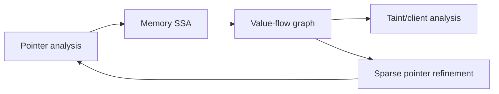

# Data-Flow Engines Are Fixed-Point Machines

Data-flow analysis computes facts that become true at program points: which definitions can
reach this use, which variables are live, which values are tainted, which resources must be
closed. The engine repeatedly applies transfer functions over a graph until the facts stop
changing. The implementation choices are lattice, graph, transfer functions, solver, and
evidence.

## The Core Model

A classic intraprocedural data-flow problem has:

| Part | Meaning |
| --- | --- |
| CFG | Nodes are program points or basic blocks; edges are possible control flow. |
| Fact domain | The finite set of things being tracked. |
| Lattice | How facts combine. Often powerset with union. |
| Transfer function | How an instruction transforms incoming facts into outgoing facts. |
| Direction | Forward for "what can reach here"; backward for "what is needed before here." |
| Fixed point | The stable result after propagation stops changing facts. |

For a taint-like analysis, the fact domain might be "place X is tainted by source S."
For reaching definitions, it might be "definition D may reach this point." For resource
cleanup, it might be "resource R is open."

## Worklist Solver Pseudocode

```text
solve_forward(cfg, entry_state):
  in  = map node -> bottom
  out = map node -> bottom
  in[cfg.entry] = entry_state
  worklist = [cfg.entry]

  while worklist not empty:
    node = worklist.pop()
    old_out = out[node]

    out[node] = transfer(node, in[node])

    if out[node] != old_out:
      for succ in cfg.successors(node):
        new_in = join(in[succ], out[node])
        if new_in != in[succ]:
          in[succ] = new_in
          worklist.push(succ)

  return in, out
```

The loop terminates when the lattice is finite and transfer functions are monotone. If facts
can grow forever, the analysis needs widening, bounds, or a different abstraction.

## IFDS And IDE

IFDS and IDE are frameworks for interprocedural data-flow problems with distributive flow
functions over finite domains. IFDS reduces such problems to graph reachability on an
exploded supergraph. IDE generalizes the setup so each fact can carry a value from a
bounded-height lattice through edge functions.

| Framework | Good for | Constraint |
| --- | --- | --- |
| IFDS | Presence/absence facts, such as "this variable is tainted" | Finite domain, distributive transfer functions |
| IDE | Facts with values, such as confidence or state | Bounded value lattice and distributive edge functions |

This is why IFDS/IDE are attractive for static-analysis engines: they provide a clean way
to be context-sensitive and interprocedural without hand-coding every call/return case. The
cost is that not every policy fits the finite distributive model without approximation.

## Sparse Value Flow

Dense solvers propagate over every CFG edge. Sparse solvers use def-use/value-flow edges so
they skip program points irrelevant to the value being tracked. SVF is the canonical source
for this design in the LLVM/C ecosystem: it accepts points-to information, constructs
interprocedural memory SSA, and captures def-use chains for both top-level and address-taken
variables. Value-flow construction and pointer analysis can be iteratively refined.



The architectural lesson is broader than LLVM. A production engine should separate:

| Layer | Responsibility |
| --- | --- |
| IR/MIR | Normalize syntax into operations and places. |
| CFG | Model execution order and branches. |
| Def-use/value flow | Track value movement. |
| Points-to/alias | Approximate memory/object identity. |
| Summary | Compress function behavior for callers. |
| Policy | Ask bounded source/sink/guard/reachability questions. |

## Summaries

Interprocedural analysis cannot inline the world. It needs summaries:

```text
summary sanitize(x):
  input: tainted(x)
  output: untainted(return)

summary passthrough(x):
  input: tainted(x)
  output: tainted(return)
```

Summaries make calls analyzable without repeatedly re-solving every callee. They also create
a modeling boundary: library functions, framework handlers, and generated clients can be
represented by compact facts when source is unavailable or too expensive.

## Budgets Are Part Of Semantics

Any real data-flow engine has budgets:

| Budget | Prevents | Must be surfaced as |
| --- | --- | --- |
| `max_depth` | Infinite or too-deep paths | budget evidence |
| `max_paths` | Path explosion | truncated path count |
| time limit | CI stalls | incomplete/unknown status |
| memory limit | crashes | capability or budget diagnostic |
| context bound | unbounded call strings | precision label |

If the engine stops early, "no finding" and "not enough budget" are different results.
Treating both as clean output is unsound as a user interface, even when the underlying
algorithm is explicitly approximate.

## Validation

A data-flow engine needs fixtures at multiple levels:

| Level | Test type |
| --- | --- |
| Transfer function | One instruction changes facts as expected. |
| CFG | Branch and loop facts reach expected nodes. |
| Summary | Callee behavior is compressed correctly. |
| Source/sink model | Positive and negative taint examples. |
| Budget behavior | Truncation produces visible evidence. |
| Regression corpus | Known real patterns stay stable. |

The hard part is not writing one example that triggers. It is proving that the engine reports
unknowns and limitations honestly when the model is incomplete.

## Implication For polint

polint's public `DataFlow<'_>` surface is currently a policy view, not a raw graph API. That
is the right user-facing level for repo-local rules. Internally, the engine can evolve from
syntax and MIR ordering to richer CFG, call, summary, alias, and points-to machinery without
requiring every local rule to change.

The article angle: I built polint because many local rules need more than AST matching, but
most teams do not need to write IFDS solvers. They need a framework that turns deep analysis
machinery into small, testable policy questions.

## Sources

- [Precise Interprocedural Dataflow Analysis via Graph Reachability](https://pages.cs.wisc.edu/~fischer/cs701.f14/popl95.pdf)
- [Inter-procedural data-flow analysis with IFDS/IDE and Soot](https://dl.acm.org/doi/10.1145/2259051.2259052)
- [Practical Extensions to the IFDS Algorithm](https://link.springer.com/chapter/10.1007/978-3-642-11970-5_8)
- [SVF: Interprocedural Static Value-Flow Analysis in LLVM](https://yuleisui.github.io/publications/cc16.pdf)
- [CodeQL data flow analysis](https://codeql.github.com/docs/writing-codeql-queries/about-data-flow-analysis/)
- [polint data-flow facts](https://github.com/emilwareus/polint/blob/main/docs/facts/data-flow.md)

