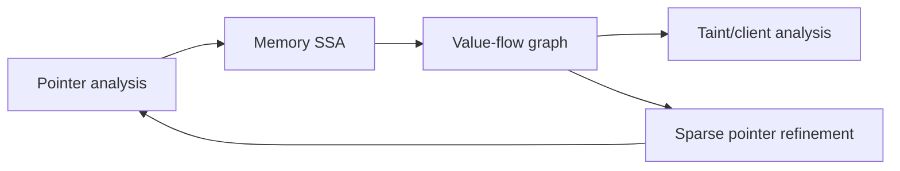

# Data-Flow Engines Are Fixed-Point Machines

Data-flow analysis computes facts that become true at program points: which definitions can
reach this use, which variables are live, which values are tainted, which resources must be
closed. The engine repeatedly applies transfer functions over a graph until the facts stop
changing. The implementation choices are lattice, graph, transfer functions, solver, and
evidence.

## The Core Model

A classic intraprocedural data-flow problem has:

| Part | Meaning |
| --- | --- |
| CFG | Nodes are program points or basic blocks; edges are possible control flow. |
| Fact domain | The finite set of things being tracked. |
| Lattice | How facts combine. Often powerset with union. |
| Transfer function | How an instruction transforms incoming facts into outgoing facts. |
| Direction | Forward for "what can reach here"; backward for "what is needed before here." |
| Fixed point | The stable result after propagation stops changing facts. |

For a taint-like analysis, the fact domain might be "place X is tainted by source S."
For reaching definitions, it might be "definition D may reach this point." For resource
cleanup, it might be "resource R is open."

## Worklist Solver Pseudocode

```text
solve_forward(cfg, entry_state):
  in  = map node -> bottom
  out = map node -> bottom
  in[cfg.entry] = entry_state
  worklist = [cfg.entry]

  while worklist not empty:
    node = worklist.pop()
    old_out = out[node]

    out[node] = transfer(node, in[node])

    if out[node] != old_out:
      for succ in cfg.successors(node):
        new_in = join(in[succ], out[node])
        if new_in != in[succ]:
          in[succ] = new_in
          worklist.push(succ)

  return in, out
```

The loop terminates when the lattice is finite and transfer functions are monotone. If facts
can grow forever, the analysis needs widening, bounds, or a different abstraction.

## CFG Construction Is The First Analysis

The control-flow graph is already an approximation. Before any data-flow algorithm can run,
the engine decides which execution edges exist. A simple expression-only language can build a
CFG by connecting statements in order. A real language needs edges for short-circuit boolean
operators, early returns, loops, breaks, continues, exceptions, `defer`/`finally`, async
callbacks, generated code, and framework entrypoints.

```text
build_cfg(function):
  cfg = new_graph()
  entry = cfg.new_node("entry")
  exit = cfg.new_node("exit")

  current = [entry]

  for stmt in function.body:
    current = connect_statement(cfg, current, stmt, exit)

  for node in current:
    cfg.add_edge(node, exit, kind="fallthrough")

  return cfg

connect_statement(cfg, incoming, stmt, exit):
  if stmt is assignment or expression:
    node = cfg.new_node(stmt)
    for pred in incoming:
      cfg.add_edge(pred, node, kind="normal")
    return [node]

  if stmt is if condition then_branch else_branch:
    test = cfg.new_node(stmt.condition)
    for pred in incoming:
      cfg.add_edge(pred, test, kind="normal")
    then_end = connect_block(cfg, [test], then_branch, exit, edge_label="true")
    else_end = connect_block(cfg, [test], else_branch, exit, edge_label="false")
    return then_end + else_end

  if stmt is while condition body:
    test = cfg.new_node(stmt.condition)
    for pred in incoming:
      cfg.add_edge(pred, test, kind="normal")
    body_end = connect_block(cfg, [test], body, exit, edge_label="true")
    for tail in body_end:
      cfg.add_edge(tail, test, kind="backedge")
    return [test]  // false edge leaves loop

  if stmt is return expr:
    node = cfg.new_node(stmt)
    for pred in incoming:
      cfg.add_edge(pred, node, kind="normal")
    cfg.add_edge(node, exit, kind="return")
    return []
```

This pseudocode omits language-specific edges, but it shows the key invariant: every later
solver trusts the CFG. If a parser adapter forgets `finally`, exception, or callback edges,
the data-flow engine can be perfectly implemented and still miss real paths. Production
systems therefore need CFG fixtures before they need clever solvers.

## The Lattice Is The Semantics

A data-flow value is not usually a boolean. It is an element in a lattice: a partially
ordered set with a join or meet operation. The order means "is at least as informative as"
or "is no less conservative than", depending on the analysis.

| Analysis | Domain | Combine | Boundary | Intuition |
| --- | --- | --- | --- | --- |
| Reaching definitions | set of definitions | union | empty set at entry | A definition may reach a point. |
| Live variables | set of variables | union | empty set at exit | A variable may be read later. |
| Available expressions | set of expressions | intersection | all expressions at entry to non-entry blocks | Expression must be available on every path. |
| Constant propagation | map variable -> constant lattice | pointwise join | unreachable at entry, unknown elsewhere | A variable is a known constant only if paths agree. |
| Taint | map place -> taint labels | union | policy-specific sources | Any source influence matters. |
| Integer ranges | map value -> interval | interval union with widening | unconstrained top | Bounds may grow until forced to converge. |

For a finite-height lattice, a monotone transfer function can only change each node's state a
finite number of times. That is the termination argument behind the worklist loop.

```text
join_constant_value(a, b):
  if a == unreachable:
    return b
  if b == unreachable:
    return a
  if a == b:
    return a
  return unknown

join_environment(left, right):
  result = {}
  for variable in all_variables(left, right):
    result[variable] = join_constant_value(left[variable], right[variable])
  return result
```

This is why constant propagation loses precision at joins. If one path has `x = 2, y = 3`
and another has `x = 3, y = 2`, the joined environment says `x = unknown, y = unknown`. A
later `z = x + y` cannot recover `z = 5` without path sensitivity or a richer abstraction.

## Forward, Backward, May, And Must Are Four Different Choices

The generic solver changes shape depending on direction and confluence. A forward solver
computes `in[n]` from predecessors and then `out[n]`. A backward solver computes `out[n]`
from successors and then `in[n]`.

```text
solve_backward(cfg, exit_state):
  in  = map node -> bottom
  out = map node -> bottom
  out[cfg.exit] = exit_state
  worklist = reverse_postorder(cfg.nodes)

  while worklist not empty:
    node = worklist.pop()
    old_in = in[node]

    out[node] = combine(in[succ] for succ in cfg.successors(node))
    in[node] = transfer_backward(node, out[node])

    if in[node] != old_in:
      for pred in cfg.predecessors(node):
        worklist.push(pred)

  return in, out
```

The `combine` operation is not always union. May analyses ask "can this fact hold on at
least one path?" and usually combine with union. Must analyses ask "does this fact hold on
every path?" and usually combine with intersection.

## Bit-Vector Gen/Kill Algorithms

Classical compiler analyses are often bit-vector problems. Each possible fact gets a bit
position. Transfer functions become fast `and`/`or` operations.

### Reaching Definitions

Reaching definitions is forward and may. A definition reaches a node if there is some path
from the definition to the node on which the variable is not redefined.

```text
compute_reaching_definitions(cfg):
  all_defs = enumerate_assignments(cfg)

  for node in cfg.nodes:
    gen[node] = definitions_created_by(node)
    kill[node] = definitions_of_same_variables(all_defs, gen[node]) - gen[node]
    in[node] = empty_bitset()
    out[node] = empty_bitset()

  worklist = cfg.nodes
  while worklist not empty:
    node = worklist.pop()

    new_in = union(out[pred] for pred in cfg.predecessors(node))
    new_out = gen[node] union (new_in - kill[node])

    if new_in != in[node] or new_out != out[node]:
      in[node] = new_in
      out[node] = new_out
      worklist.add_all(cfg.successors(node))

  return in, out
```

### Live Variables

Live variables is backward and may. A variable is live before a statement if a later path may
read it before it is overwritten.

```text
compute_live_variables(cfg):
  for node in cfg.nodes:
    use[node] = variables_read_before_written(node)
    def[node] = variables_written(node)
    in[node] = empty_bitset()
    out[node] = empty_bitset()

  worklist = cfg.nodes
  while worklist not empty:
    node = worklist.pop()

    new_out = union(in[succ] for succ in cfg.successors(node))
    new_in = use[node] union (new_out - def[node])

    if new_in != in[node] or new_out != out[node]:
      in[node] = new_in
      out[node] = new_out
      worklist.add_all(cfg.predecessors(node))

  return in, out
```

### Available Expressions

Available expressions is forward and must. An expression is available at a point only if
every path to that point has already computed it and none of its operands have been
redefined.

```text
compute_available_expressions(cfg):
  universe = all_side_effect_free_expressions(cfg)

  for node in cfg.nodes:
    gen[node] = expressions_computed_by(node)
    kill[node] = expressions_mentioning_variables_written_by(node)
    in[node] = universe
    out[node] = universe

  in[cfg.entry] = empty_set()
  out[cfg.entry] = gen[cfg.entry]

  worklist = cfg.nodes - {cfg.entry}
  while worklist not empty:
    node = worklist.pop()

    new_in = intersection(out[pred] for pred in cfg.predecessors(node))
    new_out = gen[node] union (new_in - kill[node])

    if new_in != in[node] or new_out != out[node]:
      in[node] = new_in
      out[node] = new_out
      worklist.add_all(cfg.successors(node))

  return in, out
```

The shape is the same in all three algorithms. The facts, direction, and combine operation
change. This is the reason a reusable engine exists at all.

## SSA Turns Merges Into Values

Static single assignment form gives every assignment a unique name and represents merges
with phi functions. It does not eliminate control flow, but it makes def-use traversal much
sparser: a use points to one SSA definition instead of requiring a dense reaching-definitions
query at every program point.

The classic SSA construction algorithm has two phases: place phi functions using dominance
frontiers, then rename variables by walking the dominator tree with one stack per source
variable.

```text
construct_ssa(cfg):
  dominators = compute_dominators(cfg)
  idom_tree = immediate_dominator_tree(dominators)
  frontier = compute_dominance_frontiers(cfg, idom_tree)

  for variable in variables(cfg):
    worklist = blocks_that_define(variable)
    has_phi = empty_set()

    while worklist not empty:
      block = worklist.pop()
      for frontier_block in frontier[block]:
        if frontier_block not in has_phi:
          insert_phi(frontier_block, variable)
          has_phi.add(frontier_block)
          if frontier_block does not define variable:
            worklist.push(frontier_block)

  stacks = map variable -> stack([initial_version(variable)])
  rename_block(cfg.entry, stacks, idom_tree)

rename_block(block, stacks, idom_tree):
  pushed = []

  for phi in block.phis:
    name = fresh_version(phi.variable)
    stacks[phi.variable].push(name)
    phi.result = name
    pushed.append(phi.variable)

  for statement in block.statements:
    for use in statement.uses:
      use.name = stacks[use.variable].top()
    for def in statement.defs:
      name = fresh_version(def.variable)
      stacks[def.variable].push(name)
      def.name = name
      pushed.append(def.variable)

  for succ in block.successors:
    for phi in succ.phis:
      phi.add_operand(from_block=block, value=stacks[phi.variable].top())

  for child in idom_tree.children(block):
    rename_block(child, stacks, idom_tree)

  for variable in reverse(pushed):
    stacks[variable].pop()
```

SSA is why modern engines often prefer sparse propagation over dense propagation. If a
policy asks whether `req.query.cmd` can reach `exec`, the engine wants value edges from
definitions to uses, not every CFG edge in the function.

## MemorySSA Is SSA For Memory, With Conservative Clobbers

SSA is easy for local variables. Memory is harder because loads and stores may alias.
LLVM's MemorySSA overlays memory operations with:

| Node | Meaning |
| --- | --- |
| `MemoryDef` | A memory-writing operation such as a store or call that may write. |
| `MemoryUse` | A memory-reading operation such as a load. |
| `MemoryPhi` | A merge of memory versions at a CFG join. |

The simple mental model is one memory version variable for the function. Every write creates
a new version. Joins create memory phis. Queries then walk backward through memory defs and
use alias analysis to ask which prior access actually clobbers a location.

```text
build_memory_ssa(cfg):
  current_memory = map block -> incoming_memory_version

  for block in dominator_tree_preorder(cfg):
    memory_version = incoming_version(block, current_memory)

    if block_has_multiple_memory_predecessors(block):
      memory_version = create_memory_phi(block, predecessor_versions(block))

    for instruction in block.instructions:
      if instruction.may_read_memory:
        create_memory_use(instruction, memory_version)

      if instruction.may_write_memory:
        memory_version = create_memory_def(
          instruction,
          defining_access=memory_version
        )

    for succ in block.successors:
      current_memory[succ].add_predecessor(block, memory_version)
```

```text
get_clobbering_access(memory_use, location):
  access = memory_use.defining_access

  while access is not live_on_entry:
    if access is MemoryDef and may_alias(access.location, location):
      return access

    if access is MemoryPhi:
      return nearest_phi_or_recursive_clobber(access, location)

    access = access.defining_access

  return live_on_entry
```

LLVM's documented design is intentionally conservative: MemorySSA is intraprocedural, uses
one memory variable, and relies on a walker plus alias analysis to refine clobber queries.
That trade-off is a useful pattern for a policy engine: store a safe coarse graph, then add
cached disambiguation for queries that need precision.

## IFDS And IDE

IFDS and IDE are frameworks for interprocedural data-flow problems with distributive flow
functions over finite domains. IFDS reduces such problems to graph reachability on an
exploded supergraph. IDE generalizes the setup so each fact can carry a value from a
bounded-height lattice through edge functions.

| Framework | Good for | Constraint |
| --- | --- | --- |
| IFDS | Presence/absence facts, such as "this variable is tainted" | Finite domain, distributive transfer functions |
| IDE | Facts with values, such as confidence or state | Bounded value lattice and distributive edge functions |

This is why IFDS/IDE are attractive for static-analysis engines: they provide a clean way
to be context-sensitive and interprocedural without hand-coding every call/return case. The
cost is that not every policy fits the finite distributive model without approximation.

## IFDS As Exploded-Supergraph Reachability

An IFDS problem starts with an interprocedural CFG and a finite set of facts `D`. The
exploded graph has one node for each pair `(program_point, fact)`, plus a special zero fact
used to generate new facts. Transfer functions become graph edges.

```text
build_ifds_exploded_graph(icfg, facts, flow_function):
  graph = new_graph()

  for edge in icfg.edges:
    for fact_in in facts + {zero}:
      for fact_out in flow_function(edge, fact_in):
        graph.add_edge(
          from=(edge.source, fact_in),
          to=(edge.target, fact_out),
          kind=edge.kind
        )

  return graph

solve_ifds(icfg, facts, starts):
  exploded = build_ifds_exploded_graph(icfg, facts, flow_function)
  reachable = empty_set()
  worklist = [(start_point, zero) for start_point in starts]

  while worklist not empty:
    state = worklist.pop()
    if state in reachable:
      continue
    reachable.add(state)

    for edge in exploded.outgoing(state):
      if call_returns_are_realizable(edge, state):
        worklist.push(edge.to)

  return reachable
```

The phrase "realizable path" matters. A path that enters function `a`, then returns from
function `b`, is not a valid execution path. Practical IFDS solvers track call/return
matching so summaries from one call site are not blindly applied to every caller.

For taint, facts might be `(place, label)` pairs. A source edge maps `zero` to
`(req.query.cmd, user_input)`. An assignment maps `(x, label)` to `(y, label)`. A sanitizer
maps `(x, label)` to the empty set for the protected sink class. A sink is not special to
the solver; it is a query over reachable facts at sink program points.

## IDE Adds Edge Functions

IDE keeps the exploded-supergraph shape but gives each edge a function over values instead
of only saying whether a fact exists. That lets the analysis represent facts such as "this
symbol maps to this constant-like value" where the fact identity and the value are separate.

```text
solve_ide(icfg, facts, value_lattice):
  value_at = map (point, fact) -> value_lattice.bottom
  value_at[(entry, zero)] = value_lattice.top
  worklist = [(entry, zero)]

  while worklist not empty:
    point, fact = worklist.pop()

    for edge in outgoing_ide_edges(point, fact):
      old = value_at[(edge.to_point, edge.to_fact)]
      propagated = edge.function(value_at[(point, fact)])
      new = value_lattice.join(old, propagated)

      if new != old:
        value_at[(edge.to_point, edge.to_fact)] = new
        worklist.push((edge.to_point, edge.to_fact))

  return value_at
```

The important constraint is still distributivity. IDE is powerful, but it is not a license
to model arbitrary non-distributive semantics exactly.

## Sparse Value Flow

Dense solvers propagate over every CFG edge. Sparse solvers use def-use/value-flow edges so
they skip program points irrelevant to the value being tracked. SVF is the canonical source
for this design in the LLVM/C ecosystem: it accepts points-to information, constructs
interprocedural memory SSA, and captures def-use chains for both top-level and address-taken
variables. Value-flow construction and pointer analysis can be iteratively refined.



The architectural lesson is broader than LLVM. A production engine should separate:

| Layer | Responsibility |
| --- | --- |
| IR/MIR | Normalize syntax into operations and places. |
| CFG | Model execution order and branches. |
| Def-use/value flow | Track value movement. |
| Points-to/alias | Approximate memory/object identity. |
| Summary | Compress function behavior for callers. |
| Policy | Ask bounded source/sink/guard/reachability questions. |

## Sparse Value-Flow Construction

A sparse value-flow graph is usually built from SSA or memory SSA plus alias information.
It connects definitions to uses directly, and it adds memory edges when stores may feed
loads.

```text
build_sparse_value_flow(functions, alias_info):
  graph = new_graph()

  for function in functions:
    ssa = ensure_ssa(function)
    memory_ssa = ensure_memory_ssa(function)

    for value_def in ssa.definitions:
      for use in value_def.direct_uses:
        graph.add_edge(value_def, use, kind="ssa-use")

    for store in memory_ssa.memory_defs:
      for load in memory_uses_potentially_clobbered_by(store, alias_info):
        graph.add_edge(store.value, load.result, kind="memory-flow")

    for call in function.calls:
      for summary_edge in call_summary_edges(call):
        graph.add_edge(summary_edge.source, summary_edge.target, kind="summary")

  return graph
```

The precision driver is `alias_info`. If every pointer may alias every other pointer, the
graph becomes dense and noisy. If aliasing is too optimistic, the engine misses flows. SVF's
value-flow design is a state-of-the-art example of refining pointer analysis and value-flow
construction together rather than treating them as unrelated passes.

## Datalog Is The Same Fixed Point In Declarative Form

Datalog engines such as Souffle express analysis as recursive relations. Instead of writing
a worklist loop by hand, the author declares facts and rules; the engine evaluates them to
a fixed point, usually with semi-naive delta evaluation and indexes.

```text
// Input relations:
Edge(from, to)
Def(node, variable, definition)
Use(node, variable)
Kills(node, definition)

// A definition reaches the node where it is created.
Reach(node, definition) :-
  Def(node, _, definition).

// A definition reaches a successor if it reached the predecessor
// and the predecessor did not kill it.
Reach(to, definition) :-
  Reach(from, definition),
  Edge(from, to),
  !Kills(from, definition).

// A use observes every reaching definition for the used variable.
UseDef(useNode, definition) :-
  Use(useNode, variable),
  Reach(useNode, definition),
  Def(_, variable, definition).
```

This form is attractive for whole-program static analysis because many analyses are joins
over relations: `Call`, `Assign`, `PointsTo`, `Reachable`, `Overrides`, `FlowsTo`. The cost
is that the rule set becomes the program. Engine authors still need schema design, indexes,
stratification discipline, provenance, and budget controls.

## Abstract Interpretation Adds Widening And Narrowing

When the lattice has infinite ascending chains, a plain worklist may never terminate. Range
analysis is the standard example: loop iterations can keep changing `[0, 0]` to `[0, 1]` to
`[0, 2]` forever. Abstract interpretation solves this by widening: after enough growth,
replace the precise value with a coarser one that guarantees convergence. Narrowing can then
recover some precision.

```text
solve_with_widening(cfg, max_updates_before_widen):
  state = map node -> bottom
  update_count = map node -> 0
  worklist = [cfg.entry]

  while worklist not empty:
    node = worklist.pop()
    incoming = join(state[pred] for pred in cfg.predecessors(node))
    next = transfer(node, incoming)

    if next not <= state[node]:
      update_count[node] += 1

      if update_count[node] > max_updates_before_widen:
        next = widen(state[node], next)

      if next != state[node]:
        state[node] = next
        worklist.add_all(cfg.successors(node))

  for i in 1..narrowing_rounds:
    for node in cfg.nodes:
      refined = transfer(node, join(state[pred] for pred in cfg.predecessors(node)))
      state[node] = narrow(state[node], refined)

  return state
```

Widening is not a performance trick. It changes the semantics of the analysis. Diagnostics
should therefore say when a result comes from a widened `top` state instead of a precise
range.

## Incremental Data Flow Is Dependency Management

Incremental analysis is not just "run faster on changed files." It requires the engine to
remember which derived facts depended on which inputs, configuration, rule options, and
analysis capabilities. CodeQL's public incremental analysis direction and MLIR's solver
dependency model both point at the same architecture: cache stable base facts, track
dependencies, and enqueue only affected states.

```text
update_after_file_change(file, new_content):
  old_digest = input_digest[file]
  new_digest = hash(new_content)
  if old_digest == new_digest:
    return cached_results_for(file)

  changed_inputs = parse_and_extract_delta(file, new_content)
  affected_facts = dependency_index.reverse_lookup(changed_inputs)
  affected_queries = dependency_index.reverse_lookup(affected_facts)

  invalidate(affected_facts)
  invalidate(affected_queries)

  worklist = affected_facts
  while worklist not empty:
    fact = worklist.pop()
    old_value = cache[fact]
    new_value = recompute(fact)

    if new_value != old_value:
      cache[fact] = new_value
      for dependent in dependency_index.dependents(fact):
        worklist.push(dependent)

  return rerun_queries(affected_queries)
```

The hard part is correctness of the dependency index. If a rule result depends on module
resolution, the cache key must include module setup. If a data-flow result depends on the
call graph, changing a function signature may invalidate paths outside the edited file. A
green incremental run is only trustworthy if invalidation is conservative.

## Summaries

Interprocedural analysis cannot inline the world. It needs summaries:

```text
summary sanitize(x):
  input: tainted(x)
  output: untainted(return)

summary passthrough(x):
  input: tainted(x)
  output: tainted(return)
```

Summaries make calls analyzable without repeatedly re-solving every callee. They also create
a modeling boundary: library functions, framework handlers, and generated clients can be
represented by compact facts when source is unavailable or too expensive.

## Budgets Are Part Of Semantics

Any real data-flow engine has budgets:

| Budget | Prevents | Must be surfaced as |
| --- | --- | --- |
| `max_depth` | Infinite or too-deep paths | budget evidence |
| `max_paths` | Path explosion | truncated path count |
| time limit | CI stalls | incomplete/unknown status |
| memory limit | crashes | capability or budget diagnostic |
| context bound | unbounded call strings | precision label |

If the engine stops early, "no finding" and "not enough budget" are different results.
Treating both as clean output is unsound as a user interface, even when the underlying
algorithm is explicitly approximate.

## Validation

A data-flow engine needs fixtures at multiple levels:

| Level | Test type |
| --- | --- |
| Transfer function | One instruction changes facts as expected. |
| CFG | Branch and loop facts reach expected nodes. |
| Summary | Callee behavior is compressed correctly. |
| Source/sink model | Positive and negative taint examples. |
| Budget behavior | Truncation produces visible evidence. |
| Regression corpus | Known real patterns stay stable. |

The hard part is not writing one example that triggers. It is proving that the engine reports
unknowns and limitations honestly when the model is incomplete.

## Implication For polint

polint's public `DataFlow<'_>` surface is currently a policy view, not a raw graph API. That
is the right user-facing level for repo-local rules. Internally, the engine can evolve from
syntax and MIR ordering to richer CFG, call, summary, alias, and points-to machinery without
requiring every local rule to change.

The article angle: I built polint because many local rules need more than AST matching, but
most teams do not need to write IFDS solvers. They need a framework that turns deep analysis
machinery into small, testable policy questions.

## Sources

- [Precise Interprocedural Dataflow Analysis via Graph Reachability](https://pages.cs.wisc.edu/~fischer/cs701.f14/popl95.pdf)
- [Inter-procedural data-flow analysis with IFDS/IDE and Soot](https://dl.acm.org/doi/10.1145/2259051.2259052)
- [Practical Extensions to the IFDS Algorithm](https://link.springer.com/chapter/10.1007/978-3-642-11970-5_8)
- [Efficiently Computing Static Single Assignment Form and the Control Dependence Graph](https://www.cs.utexas.edu/~pingali/CS380C/2010/papers/ssaCytron.pdf)
- [LLVM MemorySSA](https://llvm.org/docs/MemorySSA.html)
- [Writing DataFlow Analyses in MLIR](https://mlir.llvm.org/docs/Tutorials/DataFlowAnalysis/)
- [MLIR sparse data-flow analysis source](https://mlir.llvm.org/doxygen/SparseAnalysis_8h_source.html)
- [SVF: Interprocedural Static Value-Flow Analysis in LLVM](https://yuleisui.github.io/publications/cc16.pdf)
- [SVF project documentation](https://svf-tools.github.io/SVF/)
- [Souffle tutorial](https://souffle-lang.github.io/tutorial)
- [CodeQL data flow analysis](https://codeql.github.com/docs/writing-codeql-queries/about-data-flow-analysis/)
- [Incrementalizing Production CodeQL Analyses](https://arxiv.org/pdf/2308.09660)
- [polint data-flow facts](https://github.com/emilwareus/polint/blob/main/docs/facts/data-flow.md)
