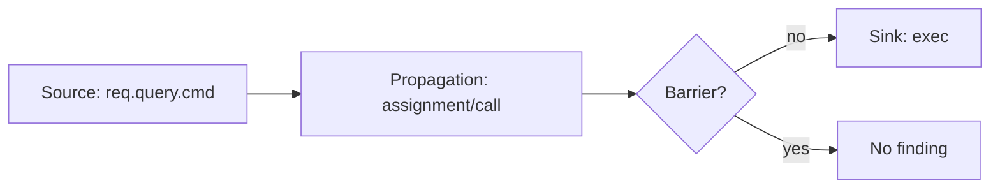

# Taint Analysis Is Modeling, Not Magic

Taint analysis sounds automatic: mark untrusted input, track it through the program, warn
when it reaches a dangerous sink. In practice, the hard part is the model. Sources, sinks,
sanitizers, barriers, propagators, call summaries, and precision labels decide whether the
result is useful or noisy.

## The Source-Sink Shape

Semgrep's taint-mode docs state the basic vocabulary clearly. A taint rule defines sources,
optional propagators, optional sanitizers, and sinks. A finding occurs when tainted data
reaches a sink without being transformed or checked by a sanitizer.



CodeQL path queries use the same conceptual model at a different abstraction level: define
where data can flow from, where it can flow to, and which graph edges connect the two.

## Exactness Is Semantics

One of the most useful Semgrep details is exactness. If a source pattern is not exact, then
subexpressions inside the matched source can also become tainted. If a sanitizer pattern is
not exact, subexpressions inside the matched sanitizer can become sanitized. Sinks default in
the other direction.

| Model knob | Question it answers |
| --- | --- |
| exact source | Does the whole matched expression become a source, or only the exact match? |
| exact sanitizer | Does the whole matched expression sanitize its subexpressions? |
| exact sink | Is the matched call the sink, or are its subexpressions sinks too? |
| propagator | Does a library-specific operation move taint in a non-default way? |
| barrier | Does this call or operation block the policy path? |

These are not UI details. They define the analysis semantics.

## Sanitizers Are The Dangerous Part

A source is usually easy to identify. A sink is usually easy to identify. Sanitizers are
where false negatives hide.

```text
sanitize_html(input)    // maybe safe for HTML, not SQL
escape_sql(input)       // maybe safe for SQL, not shell
validate_command(input) // safe only if the allowlist is correct
String(input)           // conversion, not validation
```

A production engine should avoid claiming "sanitized" without evidence about which sink
class the sanitizer protects. For repo-local rules, the safest model is explicit: the team
names the barrier calls and owns the fixtures.

## Policy Query Pseudocode

```text
for source in match_sources(program, query.source):
  frontier = [(source, [])]

  while frontier not empty:
    node, path = frontier.pop()

    if path.length > query.max_depth:
      emit_unknown("budget_exceeded", path)
      continue

    if matches_sink(node, query.sink):
      if not path_crosses_barrier(path, query.barriers):
        emit_violation(source, node, path)
      continue

    for edge in outgoing_data_flow_edges(node):
      if edge_is_supported(edge):
        frontier.push((edge.to, path + [edge]))
      else:
        emit_unknown("unsupported_edge", path + [edge])
```

The important line is `emit_unknown`. A static-analysis engine must not silently drop
unsupported flows and then call the result clean.

## Path Evidence

Path evidence is what makes a taint finding repairable:

| Evidence | Example |
| --- | --- |
| source | `req.query.cmd` |
| sink | `exec(command)` |
| path | `req.query.cmd -> String(...) -> command -> exec(...)` |
| barrier status | no matching `validate_command` |
| precision | heuristic source, exact sink |
| budget | searched depth 8 of requested 8 |

Semgrep says taint findings include a taint trace, though it may report one trace even when
multiple possible traces exist. CodeQL path queries similarly render path explanations in
code scanning or VS Code. polint's preview policy diagnostics carry a normalized evidence
header plus query-specific scalar evidence such as source, sink, path status, path, barrier
status, and budget reason.

## Interprocedural Cost

Intraprocedural taint is limited to a function. Interprocedural taint follows calls.
Interfile taint crosses file boundaries. Each step is more useful and more expensive.
Semgrep documents that interprocedural/interfile analysis is more powerful and requires more
memory, with interfile analysis only supported for a subset of languages and a recommended
memory budget per core.

For an engine like polint, this argues for explicit options:

| Option | Purpose |
| --- | --- |
| `max_depth` | Bound call/data-flow path length. |
| `max_paths` | Bound evidence volume. |
| `minimum_precision` | Avoid acting on weaker paths if policy requires stronger proof. |
| `include_tests` | Exclude test-only paths when checking production reachability. |
| source/sink/barrier patterns | Keep local semantics explicit and reviewable. |

## What To Validate

Each taint rule should ship fixtures:

| Fixture | Purpose |
| --- | --- |
| direct violation | Source reaches sink. |
| sanitized path | Barrier prevents finding. |
| wrong sanitizer | Barrier for a different domain does not suppress. |
| unsupported dynamic call | Engine reports unknown or capability issue. |
| budget case | Truncated path is visible. |
| false-positive guard | Safe code remains clean. |

The model is the policy. If the model is wrong, the engine can be technically correct and
still harmful.

## Implication For The polint Article

The article should not claim "polint solves taint analysis." The sharper claim is: polint
lets a repository express local taint-like policies in code, with bounded queries, explicit
source/sink/barrier models, fixtures, and agent-readable evidence. That is a pragmatic
middle path between regex linting and full general-purpose security analysis.

## Sources

- [Semgrep taint analysis overview](https://docs.semgrep.dev/writing-rules/data-flow/taint-mode/overview)
- [CodeQL data flow analysis](https://codeql.github.com/docs/writing-codeql-queries/about-data-flow-analysis/)
- [Creating path queries in CodeQL](https://codeql.github.com/docs/writing-codeql-queries/creating-path-queries/)
- [polint data-flow facts](https://github.com/emilwareus/polint/blob/main/docs/facts/data-flow.md)
- [polint policy query preview](https://github.com/emilwareus/polint/blob/main/docs/facts/policy-queries.md)

