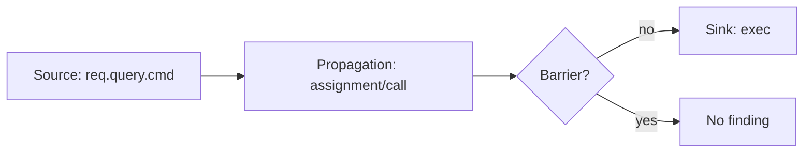

# Taint Analysis Is Modeling, Not Magic

Taint analysis sounds automatic: mark untrusted input, track it through the program, warn
when it reaches a dangerous sink. In practice, the hard part is the model. Sources, sinks,
sanitizers, barriers, propagators, call summaries, and precision labels decide whether the
result is useful or noisy.

## The Source-Sink Shape

Semgrep's taint-mode docs state the basic vocabulary clearly. A taint rule defines sources,
optional propagators, optional sanitizers, and sinks. A finding occurs when tainted data
reaches a sink without being transformed or checked by a sanitizer.



CodeQL path queries use the same conceptual model at a different abstraction level: define
where data can flow from, where it can flow to, and which graph edges connect the two.

## The Taint Lattice

A boolean taint bit is rarely enough. Real policies need labels: `user_input`,
`secret_like`, `html_untrusted`, `sql_untrusted`, `shell_untrusted`, `path_untrusted`,
`maybe_null`, or repository-specific categories. A value can carry multiple labels, and a
sanitizer may remove only one label class.

```text
TaintState = map Place -> set<TaintLabel>

bottom = empty map
join(left, right):
  result = copy(left)
  for place, labels in right:
    result[place] = result[place] union labels
  return result
```

The join is usually union because taint is a may property: if any path lets untrusted input
reach a place, the place is considered tainted. Sanitization is not the inverse of source
introduction. It is a transfer function that removes specific labels under specific
conditions.

The domain needs to say what a "place" is. Otherwise aliasing, fields, and containers are
hidden in prose.

```text
Place ::=
    Local(variable)
  | Param(function, index)
  | Return(call_site)
  | Receiver(call_site)
  | Field(base_place, field_name)
  | Index(base_place, abstract_key)
  | Global(symbol)
  | HeapObject(abstract_object)

AccessPath ::= base.selector_1.selector_2....selector_k
  where k <= access_path_limit

Label ::= policy tag, optionally carrying source identity and sanitizer state

State ::= Place -> powerset(Label)
```

This definition exposes several precision switches:

| Switch | Precise version | Cheaper version | Failure mode |
| --- | --- | --- | --- |
| variable vs object taint | distinguish local bindings and heap objects | taint variables only | misses alias/container effects |
| field sensitivity | `obj.secret` distinct from `obj.name` | whole object tainted | false positives across fields |
| index sensitivity | key-specific array/map elements | whole collection tainted | false positives across entries |
| access-path depth | track `a.b.c` up to bound | collapse beyond bound to summary | deep flows become unknown or broad |
| explicit vs implicit flow | branch conditions affect assignments | only value flow | misses control-dependent leaks |
| may vs must taint | any path taints | all paths taint | security rules usually need may |

Semgrep's public taint model is a useful reminder that production tools choose points in
this space. Its docs describe variable-level taint behavior and advanced modeling knobs, but
aliasing and object identity remain precision boundaries that a policy engine must surface.

```text
transfer_assignment(state, target, expression):
  labels = labels_of_expression(state, expression)
  return state with state[target] = labels

transfer_sanitizer_call(state, target, callee, arguments):
  labels = labels_of_arguments(state, arguments)
  removed = sanitizer_labels_removed(callee, arguments)
  return state with state[target] = labels - removed

transfer_concat(state, target, parts):
  labels = union(labels_of_expression(state, part) for part in parts)
  return state with state[target] = labels
```

This is why taint tracking differs from strict value-preserving data flow. In `"/tmp/" +
name`, the resulting string is not equal to `name`, but it is still influenced by `name`.

## Exactness Is Semantics

One of the most useful Semgrep details is exactness. If a source pattern is not exact, then
subexpressions inside the matched source can also become tainted. If a sanitizer pattern is
not exact, subexpressions inside the matched sanitizer can become sanitized. Sinks default in
the other direction.

| Model knob | Question it answers |
| --- | --- |
| exact source | Does the whole matched expression become a source, or only the exact match? |
| exact sanitizer | Does the whole matched expression sanitize its subexpressions? |
| exact sink | Is the matched call the sink, or are its subexpressions sinks too? |
| propagator | Does a library-specific operation move taint in a non-default way? |
| barrier | Does this call or operation block the policy path? |

These are not UI details. They define the analysis semantics.

## Matching Sources, Sinks, And Sanitizers

The model compiler should turn human rule patterns into matchers with explicit exactness.

```text
compile_taint_model(query):
  return {
    sources: compile_patterns(query.sources, default_exact=true),
    sinks: compile_patterns(query.sinks, default_exact=true),
    sanitizers: compile_patterns(query.sanitizers, default_exact=true),
    propagators: compile_propagators(query.propagators),
    barriers: compile_barriers(query.barriers)
  }

match_source(model, expression):
  matches = []
  for source in model.sources:
    if source.exact:
      if pattern_matches(source.pattern, expression):
        matches.push(expression)
    else:
      for subexpression in walk(expression):
        if pattern_matches(source.pattern, subexpression):
          matches.push(subexpression)
  return matches
```

Exactness controls whether the match applies to the node itself or to its children. In a
source pattern like `source(sink(x))`, non-exact source behavior can accidentally taint
`sink(x)` or `x` depending on the matcher semantics. In a sanitizer pattern, non-exactness
can accidentally sanitize inputs before they have actually passed through the sanitizer.

## Sanitizers Are The Dangerous Part

A source is usually easy to identify. A sink is usually easy to identify. Sanitizers are
where false negatives hide.

```text
sanitize_html(input)    // maybe safe for HTML, not SQL
escape_sql(input)       // maybe safe for SQL, not shell
validate_command(input) // safe only if the allowlist is correct
String(input)           // conversion, not validation
```

A production engine should avoid claiming "sanitized" without evidence about which sink
class the sanitizer protects. For repo-local rules, the safest model is explicit: the team
names the barrier calls and owns the fixtures.

## Propagators Model Library Behavior

Default assignment and call-return propagation are not enough. Libraries can move taint via
builder APIs, mutable containers, callbacks, fields, indexes, or side effects.

```text
// Example model: builder.add(x) taints builder, builder.build() returns tainted value.
propagator builder_add:
  when call.method == "add":
    from = call.argument(0)
    to = call.receiver

propagator builder_build:
  when call.method == "build":
    from = call.receiver
    to = call.return_value
```

```text
apply_propagators(state, call, model):
  updates = []

  for propagator in model.propagators:
    if propagator.matches(call):
      source_places = propagator.source_places(call)
      target_places = propagator.target_places(call)
      labels = union(state[source] for source in source_places)

      for target in target_places:
        updates.push((target, labels))

  return join_updates(state, updates)
```

Side-effectful propagators are especially important for mutable APIs:

```text
list.add(secret)   // taints list
value = list.get(0) // value receives taint from list
```

Without these models, an engine may report clean code because it did not understand the
container, not because the program is safe.

## Policy Query Pseudocode

```text
for source in match_sources(program, query.source):
  frontier = [(source, [])]

  while frontier not empty:
    node, path = frontier.pop()

    if path.length > query.max_depth:
      emit_unknown("budget_exceeded", path)
      continue

    if matches_sink(node, query.sink):
      if not path_crosses_barrier(path, query.barriers):
        emit_violation(source, node, path)
      continue

    for edge in outgoing_data_flow_edges(node):
      if edge_is_supported(edge):
        frontier.push((edge.to, path + [edge]))
      else:
        emit_unknown("unsupported_edge", path + [edge])
```

The important line is `emit_unknown`. A static-analysis engine must not silently drop
unsupported flows and then call the result clean.

## A Worklist Taint Solver

For intraprocedural taint, the policy query can be implemented as a forward worklist over a
CFG. Sources seed labels. Transfer functions propagate or remove labels. Sink checks inspect
the incoming state.

```text
solve_taint_function(cfg, model):
  in = map node -> bottom_taint_state()
  out = map node -> bottom_taint_state()
  worklist = [cfg.entry]

  while worklist not empty:
    node = worklist.pop()

    incoming = join(out[pred] for pred in cfg.predecessors(node))
    state = incoming

    for source_match in match_sources(model, node.expression):
      state[source_match.place].add(source_match.label)

    state = apply_default_transfer(state, node)
    state = apply_propagators(state, node, model)
    state = apply_sanitizers(state, node, model)

    for sink_match in match_sinks(model, node.expression):
      labels = labels_reaching_sink(state, sink_match)
      if labels intersects sink_match.forbidden_labels:
        emit_violation(node, sink_match, labels)

    if state != out[node]:
      in[node] = incoming
      out[node] = state
      worklist.add_all(cfg.successors(node))

  return violations
```

This solver is easy to understand but can be imprecise. At joins it merges labels from
different paths. A path-sensitive engine may keep separate states per branch predicate, but
that can grow exponentially. Most production tools choose bounded path sensitivity,
context sensitivity, or policy-level path reconstruction rather than full path enumeration.

## Interprocedural Summaries

Interprocedural taint should not inline every callee for every call. The common solution is
a summary: a compact description of how taint moves from parameters, globals, receiver, and
fields to return values, out-parameters, or sinks.

```text
compute_function_summary(function, model):
  symbolic_sources = []

  for parameter in function.parameters:
    symbolic_sources.push(label(parameter, "param:" + parameter.index))

  result = solve_taint_function_with_symbolic_sources(
    function.cfg,
    model,
    symbolic_sources
  )

  summary = empty_summary()

  for return_expr in function.returns:
    for label in result.labels_at(return_expr):
      summary.add_flow(from=label.origin, to="return")

  for sink in result.sinks:
    for label in result.labels_at(sink.argument):
      summary.add_sink_flow(from=label.origin, to=sink.kind)

  for mutated_argument in result.mutated_arguments:
    summary.add_flow(from=label.origin, to=mutated_argument)

  return summary
```

At a call site, the summary is instantiated with the caller's actual taint state:

```text
apply_summary(state, call, summary):
  for flow in summary.flows:
    source_actual = actual_place(call, flow.from)
    target_actual = actual_place(call, flow.to)
    state[target_actual].add_all(state[source_actual])

  for sink_flow in summary.sink_flows:
    source_actual = actual_place(call, sink_flow.from)
    if state[source_actual] intersects forbidden_labels(sink_flow.to):
      emit_violation(call, sink_flow, state[source_actual])

  return state
```

Summaries create an explicit modeling boundary. Unknown external calls should either use a
pessimistic summary, a configured library summary, or an `unknown` result. Treating them as
"no flow" creates false confidence.

Recursive functions and mutually recursive call groups make summaries a fixed-point problem.
The engine should solve summaries in call-graph strongly connected components.

```text
compute_summaries(call_graph, model):
  summaries = map function -> empty_summary()

  for scc in reverse_topological_scc_order(call_graph):
    changed = true

    while changed:
      changed = false

      for function in scc.functions:
        old = summaries[function]
        new = analyze_function_with_current_summaries(
          function,
          model,
          summaries
        )

        joined = join_summary(old, new)
        if joined != old:
          summaries[function] = joined
          changed = true

  return summaries
```

An external or unknown call should have one explicit semantic:

| Unknown-call policy | Meaning | Diagnostic consequence |
| --- | --- | --- |
| opaque-propagating | tainted args may taint return/receiver/outputs | more false positives, fewer false negatives |
| modeled | configured summary gives known flows | precise only as far as model is correct |
| capability-unknown | engine refuses to claim clean result | user sees unsupported/unknown evidence |

The worst policy is silent non-propagation. That reports "clean" when the engine merely
failed to model the call.

## IFDS Encoding Of Taint

Taint is often a good IFDS fit because facts are finite and transfer functions are usually
distributive. A fact can be `(place, label)`. The zero fact introduces sources.

```text
flow_function(edge, fact):
  if fact == zero and edge.target matches source:
    return {zero, (source_place(edge.target), source_label(edge.target))}

  if edge is assignment target = source:
    if fact.place == source:
      return {fact, (target, fact.label)}
    return {fact}

  if edge.target matches sanitizer for fact.label:
    if fact.place in sanitized_places(edge.target):
      return empty_set()
    return {fact}

  if edge is call:
    return apply_call_flow(edge, fact)

  return {fact}
```

This encoding explains the algorithmic attraction of IFDS: interprocedural taint becomes
reachability in an exploded graph. The limitation is also clear: if the policy needs
unbounded string reasoning, arithmetic relations, or rich heap shapes, the fact domain stops
being the small finite set IFDS wants.

## Path Evidence

Path evidence is what makes a taint finding repairable:

| Evidence | Example |
| --- | --- |
| source | `req.query.cmd` |
| sink | `exec(command)` |
| path | `req.query.cmd -> String(...) -> command -> exec(...)` |
| barrier status | no matching `validate_command` |
| precision | heuristic source, exact sink |
| budget | searched depth 8 of requested 8 |

Semgrep says taint findings include a taint trace, though it may report one trace even when
multiple possible traces exist. CodeQL path queries similarly render path explanations in
code scanning or VS Code. polint's preview policy diagnostics carry a normalized evidence
header plus query-specific scalar evidence such as source, sink, path status, path, barrier
status, and budget reason.

## Path Reconstruction

The solver should keep predecessor edges for facts that reach sinks. It does not need to
store every possible path. It needs enough to reconstruct one or a bounded number of useful
paths.

```text
record_update(target_state, fact, predecessor_fact, edge):
  if fact not in target_state:
    target_state.add(fact)
    predecessor[target_state.point, fact] = (predecessor_fact, edge)
    return changed

  if path_rank(edge) better than existing predecessor:
    predecessor[target_state.point, fact] = (predecessor_fact, edge)

  return no_change

reconstruct_path(sink_point, sink_fact):
  path = []
  cursor = (sink_point, sink_fact)

  while cursor in predecessor:
    previous_fact, edge = predecessor[cursor]
    path.push(edge)
    cursor = (edge.source_point, previous_fact)

  return reverse(path)
```

Path ranking should prefer short, source-to-sink, human-readable paths over exhaustive
coverage. For an agent, one clear repair path is usually more useful than 500 equivalent
paths through helper functions.

Interprocedural path reconstruction has an additional constraint: the witness must be
realizable. A path that enters `sanitize`, returns from `parse`, and continues in the caller
is not an execution path.

```text
reconstruct_interprocedural_path(sink_state):
  witness = []
  cursor = sink_state
  call_stack = empty_stack()

  while cursor has predecessor:
    pred, edge = predecessor[cursor]

    if edge.kind == summary:
      expanded = expand_summary_edge(edge)
      if expanded exists:
        witness.extend(expanded)
      else:
        witness.push(summary_only_edge(edge))

    else if edge.kind == return:
      call_stack.push(edge.call_site)
      witness.push(edge)

    else if edge.kind == call:
      expected = call_stack.pop()
      if expected != edge.call_site:
        return invalid_witness("unmatched call/return")
      witness.push(edge)

    else:
      witness.push(edge)

    cursor = pred

  return reverse(witness)
```

If the solver uses summaries, the engine should either record the callee witness that created
the summary or mark the path segment as `summary-only`. Inventing a detailed path after the
fact is worse than showing a compact but honest witness.

## Interprocedural Cost

Intraprocedural taint is limited to a function. Interprocedural taint follows calls.
Interfile taint crosses file boundaries. Each step is more useful and more expensive.
Semgrep documents that interprocedural/interfile analysis is more powerful and requires more
memory, with interfile analysis only supported for a subset of languages and a recommended
memory budget per core.

For an engine like polint, this argues for explicit options:

| Option | Purpose |
| --- | --- |
| `max_depth` | Bound call/data-flow path length. |
| `max_paths` | Bound evidence volume. |
| `minimum_precision` | Avoid acting on weaker paths if policy requires stronger proof. |
| `include_tests` | Exclude test-only paths when checking production reachability. |
| source/sink/barrier patterns | Keep local semantics explicit and reviewable. |

## What To Validate

Each taint rule should ship fixtures:

| Fixture | Purpose |
| --- | --- |
| direct violation | Source reaches sink. |
| sanitized path | Barrier prevents finding. |
| wrong sanitizer | Barrier for a different domain does not suppress. |
| unsupported dynamic call | Engine reports unknown or capability issue. |
| budget case | Truncated path is visible. |
| false-positive guard | Safe code remains clean. |

The model is the policy. If the model is wrong, the engine can be technically correct and
still harmful.

## Implication For The polint Article

The article should not claim "polint solves taint analysis." The sharper claim is: polint
lets a repository express local taint-like policies in code, with bounded queries, explicit
source/sink/barrier models, fixtures, and agent-readable evidence. That is a pragmatic
middle path between regex linting and full general-purpose security analysis.

## Sources

- [Semgrep taint analysis overview](https://docs.semgrep.dev/writing-rules/data-flow/taint-mode/overview)
- [Semgrep advanced taint mode](https://docs.semgrep.dev/writing-rules/data-flow/taint-mode/advanced)
- [CodeQL data flow analysis](https://codeql.github.com/docs/writing-codeql-queries/about-data-flow-analysis/)
- [Creating path queries in CodeQL](https://codeql.github.com/docs/writing-codeql-queries/creating-path-queries/)
- [Joern data-flow query steps](https://docs.joern.io/cpgql/data-flow-steps/)
- [Joern data-flow semantics](https://docs.joern.io/dataflow-semantics/)
- [polint data-flow facts](https://github.com/emilwareus/polint/blob/main/docs/facts/data-flow.md)
- [polint policy query preview](https://github.com/emilwareus/polint/blob/main/docs/facts/policy-queries.md)
