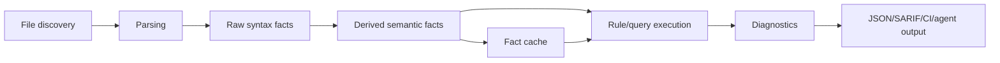

# Static Analysis Engines Are Fact Pipelines

A static-analysis engine is best understood as a pipeline that turns source files into
stable facts, then lets rules query those facts and emit diagnostics. The engine design
problem is not parsing alone. It is fact ownership: which facts are extracted, which are
derived, which are cached, which are public, which are approximate, and which are safe to
show to rule authors.

## The Pipeline

The common architecture is:



CodeQL's public description maps cleanly onto this shape: create a database by extracting a
relational representation of source files, run queries over that database, and interpret the
results. Semgrep maps it differently: scan code with rules that combine pattern matching and
data-flow analysis. polint uses local Rust rule packs over typed fact views.

The internal stages can be implemented many ways, but the pipeline boundary matters. Once
facts are stable, rules can be tested, cached, diff-gated, and exposed to agents without
forcing each rule to re-parse the repository.

## Facts Before Rules

The mistake in many custom analysis systems is letting every rule do its own extraction. A
rule that reads source text with regex, resolves imports manually, walks a parser tree, and
constructs its own partial call graph is not a rule. It is an unreviewed analyzer.

A fact-first engine separates responsibilities:

| Component | Owns | Should not own |
| --- | --- | --- |
| Parser adapter | syntax trees, parse errors, spans | policy decisions |
| Fact extractor | imports, literals, functions, branches | diagnostics |
| Semantic provider | symbols, references, types, calls | rule-specific messages |
| Rule API | stable typed views | raw internal graph layout |
| Diagnostic layer | location, evidence, severity, fingerprint | parser internals |
| Cache | input digests, capability plan, derived facts | semantic guesses not keyed by inputs |

This is the design logic behind polint's public docs: rule authors request typed views such
as `Imports<'_>`, `ResolvedImports<'_>`, `Symbols<'_>`, `References<'_>`,
`Calls<'_>`, or `DataFlow<'_>`. The signature declares the fact contract.

```rust
use polint::sdk::prelude::*;

#[polint::rule(
    id = "local/no-raw-colors",
    description = "Require design tokens instead of raw color literals.",
    severity = "error"
)]
fn no_raw_colors(ctx: &mut RuleCtx<'_>, literals: StringLiterals<'_>) -> RuleResult {
    for literal in literals.iter() {
        if literal.value.starts_with('#') {
            ctx.report(Diagnostic::error(
                ctx.rule_id(),
                ctx.file_path(literal.file),
                literal.span.diagnostic_range(),
                "Use a design token instead of a raw color literal.",
            ));
        }
    }
    Ok(())
}
```

That rule does not need a parser. It needs a bounded fact view with spans.

## Capability Planning

A fact-first engine can plan analysis from the rule set:

```text
rule signatures
  -> required fact views
  -> required parser adapters
  -> semantic providers
  -> cache keys
  -> setup diagnostics
```

This lets the engine fail closed. If a rule needs resolved imports but the repository has no
configured module root, the right result is a capability/setup diagnostic, not a rule that
quietly runs with empty facts.

polint's fact docs make this distinction explicit. Stable public views include functions,
metrics, imports, resolved imports, module graph, symbols, references, branches, Go tests,
TS/JS facts, literals, JSX attributes, and changed files. Raw CFG, raw call graph, solver
internals, evidence stores, type/value/alias facts, benchmarks, and eval reports are private
or reserved until explicitly promoted.

## Cache Design

Analysis caches are not just performance hacks. They are correctness contracts. A cache key
must include every input that can change the fact output: source content, config, rule
options, requested capabilities, cache format version, analyzer version, and relevant setup.

polint's README describes cache keys that include source path and content, rule/options
digest, loaded config, requested capability plan, cache format, and polint version. That is
the right shape. If a capability changes from syntax-only imports to setup-aware resolved
imports, the cache must miss.

```text
cache key =
  hash(
    file path,
    file content,
    analyzer version,
    config digest,
    rule options digest,
    capability plan,
    cache format version
  )
```

## Diagnostic Ownership

The engine should own normalization:

| Field | Why it belongs in the engine |
| --- | --- |
| File path | Rules should not invent path formats. |
| Range | Rules should use span-backed facts. |
| Fingerprint | Baselines and ignores need stable identity. |
| Severity | Rules declare intent, output normalizes it. |
| Evidence | Agents need scalar, queryable fields. |
| Suppression | Suppressions must be visible and auditable. |
| Output schema | JSON/SARIF/GitHub formats should be deterministic. |

SARIF exists because teams need to combine results from multiple static-analysis tools. A
repo-local engine does not have to invent an interchange format, but it should still own a
stable machine contract.

## What To Hide

Raw graph APIs are tempting. They also leak implementation details. A rule author who can
traverse raw CFG nodes, raw call graph IDs, or solver rows can write powerful rules, but the
engine can no longer change internals safely.

The better API shape is policy-level:

```rust
fn no_secret_logs(ctx: &mut RuleCtx<'_>, flow: DataFlow<'_>) -> RuleResult {
    let mut query = FlowQuery::new(
        SourcePattern::secret_like(["token", "password"]),
        SinkPattern::logger(),
    );
    query.barriers = BarrierPattern::call_any(["redact", "mask_secret"]);

    for violation in flow.forbidden(query) {
        ctx.report(violation.diagnostic(ctx.rule_id(), "secret reaches logs"));
    }
    Ok(())
}
```

The rule asks a policy question. The engine chooses the private graph representation, applies
budgets, records precision, and emits evidence.

## Design Checklist

Before adding a new fact family, ask:

| Question | Reason |
| --- | --- |
| What is the stable public shape? | Avoid leaking parser/provider internals. |
| What are the setup requirements? | Missing setup should be a diagnostic. |
| What is the precision tier? | Do not sell heuristics as proof. |
| What is the cache key? | Avoid stale or cross-config facts. |
| What are the limits? | Prevent broad graph dumps and path explosion. |
| What fixtures prove it? | Rule authors need positive and negative cases. |
| What is the agent output? | Diagnostics should be repairable. |

The guiding principle: expose facts that are strong enough to write useful policy rules, but
small enough to keep the engine honest.

## Sources

- [About CodeQL](https://codeql.github.com/docs/codeql-overview/about-codeql/)
- [About CodeQL queries](https://codeql.github.com/docs/writing-codeql-queries/about-codeql-queries/)
- [OASIS SARIF 2.1.0](https://www.oasis-open.org/standard/sarifv2-1-os/)
- [emilwareus/polint README](https://github.com/emilwareus/polint)
- [polint fact reference](https://github.com/emilwareus/polint/blob/main/docs/facts/README.md)
- [polint API visibility plan](https://github.com/emilwareus/polint/blob/main/docs/API-VISIBILITY-PLAN.md)
- [polint agent playbook](https://github.com/emilwareus/polint/blob/main/docs/AGENT-PLAYBOOK.md)

