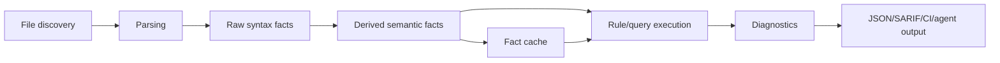

# Static Analysis Engines Are Fact Pipelines

A static-analysis engine is best understood as a pipeline that turns source files into
stable facts, then lets rules query those facts and emit diagnostics. The engine design
problem is not parsing alone. It is fact ownership: which facts are extracted, which are
derived, which are cached, which are public, which are approximate, and which are safe to
show to rule authors.

## The Pipeline

The common architecture is:



CodeQL's public description maps cleanly onto this shape: create a database by extracting a
relational representation of source files, run queries over that database, and interpret the
results. Semgrep maps it differently: scan code with rules that combine pattern matching and
data-flow analysis. polint uses local Rust rule packs over typed fact views.

The internal stages can be implemented many ways, but the pipeline boundary matters. Once
facts are stable, rules can be tested, cached, diff-gated, and exposed to agents without
forcing each rule to re-parse the repository.

## A Concrete Engine Loop

The simplest usable engine has four phases: plan, extract, derive, query. Planning happens
before file analysis so the engine knows which capabilities are actually needed.

```text
run_analysis(repo, config, rule_pack):
  plan = build_capability_plan(rule_pack, config)
  inputs = discover_inputs(repo, config)

  extraction_jobs = []
  for file in inputs.files:
    if plan.needs_language(file.language):
      extraction_jobs.push((file, plan.language_capabilities(file.language)))

  raw_facts = parallel_map(extraction_jobs, extract_file_facts)
  fact_store = load_or_create_fact_store(repo, config, plan)
  fact_store.upsert_raw(raw_facts)

  derived_plan = order_derived_fact_providers(plan)
  for provider in derived_plan:
    derived_facts = provider.compute(fact_store)
    fact_store.upsert_derived(provider.name, derived_facts)

  diagnostics = []
  for rule in rule_pack.rules:
    views = fact_store.materialize_views(rule.required_views)
    diagnostics.extend(rule.run(views))

  return normalize_diagnostics(diagnostics, config.output)
```

This loop is intentionally boring. The sophistication lives behind `extract_file_facts`,
`provider.compute`, and `materialize_views`, not inside every rule.

## Facts Before Rules

The mistake in many custom analysis systems is letting every rule do its own extraction. A
rule that reads source text with regex, resolves imports manually, walks a parser tree, and
constructs its own partial call graph is not a rule. It is an unreviewed analyzer.

A fact-first engine separates responsibilities:

| Component | Owns | Should not own |
| --- | --- | --- |
| Parser adapter | syntax trees, parse errors, spans | policy decisions |
| Fact extractor | imports, literals, functions, branches | diagnostics |
| Semantic provider | symbols, references, types, calls | rule-specific messages |
| Rule API | stable typed views | raw internal graph layout |
| Diagnostic layer | location, evidence, severity, fingerprint | parser internals |
| Cache | input digests, capability plan, derived facts | semantic guesses not keyed by inputs |

This is the design logic behind polint's public docs: rule authors request typed views such
as `Imports<'_>`, `ResolvedImports<'_>`, `Symbols<'_>`, `References<'_>`,
`Calls<'_>`, or `DataFlow<'_>`. The signature declares the fact contract.

```rust
use polint::sdk::prelude::*;

#[polint::rule(
    id = "local/no-raw-colors",
    description = "Require design tokens instead of raw color literals.",
    severity = "error"
)]
fn no_raw_colors(ctx: &mut RuleCtx<'_>, literals: StringLiterals<'_>) -> RuleResult {
    for literal in literals.iter() {
        if literal.value.starts_with('#') {
            ctx.report(Diagnostic::error(
                ctx.rule_id(),
                ctx.file_path(literal.file),
                literal.span.diagnostic_range(),
                "Use a design token instead of a raw color literal.",
            ));
        }
    }
    Ok(())
}
```

That rule does not need a parser. It needs a bounded fact view with spans.

## Capability Planning

A fact-first engine can plan analysis from the rule set:

```text
rule signatures
  -> required fact views
  -> required parser adapters
  -> semantic providers
  -> cache keys
  -> setup diagnostics
```

This lets the engine fail closed. If a rule needs resolved imports but the repository has no
configured module root, the right result is a capability/setup diagnostic, not a rule that
quietly runs with empty facts.

polint's fact docs make this distinction explicit. Stable public views include functions,
metrics, imports, resolved imports, module graph, symbols, references, branches, Go tests,
TS/JS facts, literals, JSX attributes, and changed files. Raw CFG, raw call graph, solver
internals, evidence stores, type/value/alias facts, benchmarks, and eval reports are private
or reserved until explicitly promoted.

## Capability Planning Pseudocode

Typed rule signatures make planning mechanical. The engine does not have to guess whether a
rule needs data flow; the function parameters say so.

```text
build_capability_plan(rule_pack, config):
  plan = empty_plan()

  for rule in rule_pack.rules:
    for view in rule.signature.fact_views:
      requirements = capability_requirements(view)
      plan.add(rule.id, requirements)

    for query in rule.static_query_declarations:
      requirements = query_requirements(query)
      plan.add(rule.id, requirements)

  for requirement in plan.requirements:
    provider = select_provider(requirement, config)

    if provider is missing:
      plan.add_setup_diagnostic(
        rule_id=requirement.requesting_rule,
        capability=requirement.name,
        status="unsupported"
      )
      continue

    if not provider.is_configured(config):
      plan.add_setup_diagnostic(
        rule_id=requirement.requesting_rule,
        capability=requirement.name,
        status="unknown",
        reason=provider.missing_setup(config)
      )
      continue

    plan.bind(requirement, provider)

  return plan
```

The planning phase is where "no fallback code paths" becomes an analyzer principle. If a
rule needs resolved imports but the module resolver is not configured, the engine should not
run a weaker syntax-only rule and pretend it answered the same question. It should emit a
capability diagnostic.

## Fact Extraction Should Produce Small, Stable Records

The extractor should store facts that are boring enough to cache and compare. AST objects,
parser handles, and ad hoc closures are poor facts. Spans, symbols, references, imports,
edges, and normalized strings are better.

```text
extract_file_facts(file, capabilities):
  parse_tree = parse(file.content, file.language)
  facts = []

  if capabilities.needs_imports:
    facts.extend(extract_imports(parse_tree, file.id))

  if capabilities.needs_functions:
    facts.extend(extract_function_declarations(parse_tree, file.id))

  if capabilities.needs_literals:
    facts.extend(extract_literals(parse_tree, file.id))

  if capabilities.needs_cfg:
    facts.extend(build_cfg_facts(parse_tree, file.id))

  if capabilities.needs_local_symbols:
    facts.extend(extract_local_symbols(parse_tree, file.id))

  return facts
```

Each fact should have:

| Field | Purpose |
| --- | --- |
| stable ID | Lets derived facts and diagnostics refer to it. |
| file ID | Supports invalidation by file. |
| span | Produces precise diagnostics. |
| kind | Enables typed querying. |
| payload | Stores normalized values, not parser objects. |
| provenance | Explains parser/provider/source. |

The moment a rule receives parser-specific objects, the engine has leaked its private
adapter layer.

## Derived Facts Form A Dependency Graph

Derived providers should declare their input facts and output facts. That makes ordering and
incremental invalidation possible.

```text
order_derived_fact_providers(plan):
  graph = new_dependency_graph()

  for provider in selected_providers(plan):
    for input_kind in provider.input_fact_kinds:
      graph.add_edge(input_kind, provider.output_fact_kind)

  if graph.has_cycle_without_fixed_point_provider:
    raise configuration_error("cyclic fact providers need an explicit solver")

  return topological_sort_or_solver_groups(graph)
```

Some cycles are real analysis loops. Points-to facts may improve call edges; call edges may
enable more points-to propagation through callees. Those cycles should be modeled as solver
groups, not hidden inside unrelated providers.

```text
solve_provider_group(group, fact_store):
  worklist = group.initial_outputs()

  while worklist not empty:
    output_kind = worklist.pop()
    provider = group.provider_for(output_kind)
    old = fact_store.get(output_kind)
    new = provider.transfer(fact_store)

    delta = new - old
    if delta is not empty:
      fact_store.add(output_kind, delta)
      for dependent in group.dependents(output_kind):
        worklist.push(dependent)
```

This is the same fixed-point idea as data flow, lifted from program points to fact families.

## Cache Design

Analysis caches are not just performance hacks. They are correctness contracts. A cache key
must include every input that can change the fact output: source content, config, rule
options, requested capabilities, cache format version, analyzer version, and relevant setup.

polint's README describes cache keys that include source path and content, rule/options
digest, loaded config, requested capability plan, cache format, and polint version. That is
the right shape. If a capability changes from syntax-only imports to setup-aware resolved
imports, the cache must miss.

```text
cache key =
  hash(
    file path,
    file content,
    analyzer version,
    config digest,
    rule options digest,
    capability plan,
    cache format version
  )
```

## Incremental Invalidation

Cache keys decide whether one artifact can be reused. Dependency indexes decide what else
must be recomputed after a change.

```text
invalidate_for_change(change):
  changed_inputs = classify_change(change)
  dirty = queue(changed_inputs)
  invalidated = empty_set()

  while dirty not empty:
    item = dirty.pop()
    if item in invalidated:
      continue

    invalidated.add(item)

    for dependent in dependency_index.dependents(item):
      dirty.push(dependent)

  cache.delete_all(invalidated)
  return invalidated
```

The dependency graph should include:

| Dependency | Example invalidation |
| --- | --- |
| file content -> parse facts | Edited file invalidates its syntax facts. |
| parse facts -> local symbols | Changed declaration invalidates symbol facts for the file. |
| module config -> resolved imports | Changed `tsconfig` invalidates import resolution. |
| call graph -> data-flow paths | Changed callee edge invalidates interprocedural paths. |
| rule options -> diagnostics | Changed source/sink patterns invalidate query results. |
| analyzer version -> all provider outputs | Provider semantics changed. |

Incremental analysis is safe only when invalidation is conservative. Recomputing too much is
a performance bug. Recomputing too little is a correctness bug.

## Query Engines Come In Several Shapes

There is no single best query execution model. Different engines choose different
representations because their policy surfaces differ.

| Model | How it works | Good for | Risk |
| --- | --- | --- | --- |
| Visitor API | Rule code walks AST nodes. | Syntax policies, local linting. | Rules reimplement semantics. |
| Typed fact views | Rules iterate stable records. | Repo-local policies and agent output. | Needs careful fact design. |
| Relational query | Facts are tables; rules are queries. | Whole-repo joins and variant analysis. | Query language and schema complexity. |
| Datalog | Recursive facts evaluated to fixed point. | Points-to, call graphs, reachability. | Requires stratification, indexes, provenance. |
| Graph traversal | Nodes and edges in a graph database/CPG. | Exploratory code search and slicing. | Easy to write expensive traversals. |
| Sparse solver | Propagate along def-use/value-flow edges. | Data flow and taint. | Requires good aliases and summaries. |

For polint's use case, typed fact views plus constrained policy queries are the best public
default. Internally, some providers can still use relational indexes, Datalog-style fixed
points, or sparse solvers.

## Diagnostic Ownership

The engine should own normalization:

| Field | Why it belongs in the engine |
| --- | --- |
| File path | Rules should not invent path formats. |
| Range | Rules should use span-backed facts. |
| Fingerprint | Baselines and ignores need stable identity. |
| Severity | Rules declare intent, output normalizes it. |
| Evidence | Agents need scalar, queryable fields. |
| Suppression | Suppressions must be visible and auditable. |
| Output schema | JSON/SARIF/GitHub formats should be deterministic. |

SARIF exists because teams need to combine results from multiple static-analysis tools. A
repo-local engine does not have to invent an interchange format, but it should still own a
stable machine contract.

## What To Hide

Raw graph APIs are tempting. They also leak implementation details. A rule author who can
traverse raw CFG nodes, raw call graph IDs, or solver rows can write powerful rules, but the
engine can no longer change internals safely.

The better API shape is policy-level:

```rust
fn no_secret_logs(ctx: &mut RuleCtx<'_>, flow: DataFlow<'_>) -> RuleResult {
    let mut query = FlowQuery::new(
        SourcePattern::secret_like(["token", "password"]),
        SinkPattern::logger(),
    );
    query.barriers = BarrierPattern::call_any(["redact", "mask_secret"]);

    for violation in flow.forbidden(query) {
        ctx.report(violation.diagnostic(ctx.rule_id(), "secret reaches logs"));
    }
    Ok(())
}
```

The rule asks a policy question. The engine chooses the private graph representation, applies
budgets, records precision, and emits evidence.

## Design Checklist

Before adding a new fact family, ask:

| Question | Reason |
| --- | --- |
| What is the stable public shape? | Avoid leaking parser/provider internals. |
| What are the setup requirements? | Missing setup should be a diagnostic. |
| What is the precision tier? | Do not sell heuristics as proof. |
| What is the cache key? | Avoid stale or cross-config facts. |
| What are the limits? | Prevent broad graph dumps and path explosion. |
| What fixtures prove it? | Rule authors need positive and negative cases. |
| What is the agent output? | Diagnostics should be repairable. |

The guiding principle: expose facts that are strong enough to write useful policy rules, but
small enough to keep the engine honest.

## Sources

- [About CodeQL](https://codeql.github.com/docs/codeql-overview/about-codeql/)
- [About CodeQL queries](https://codeql.github.com/docs/writing-codeql-queries/about-codeql-queries/)
- [CodeQL incremental analysis](https://docs.github.com/en/code-security/how-tos/find-and-fix-code-vulnerabilities/scan-from-the-command-line/incremental-analysis)
- [Incrementalizing Production CodeQL Analyses](https://arxiv.org/pdf/2308.09660)
- [Writing DataFlow Analyses in MLIR](https://mlir.llvm.org/docs/Tutorials/DataFlowAnalysis/)
- [Souffle docs](https://souffle-lang.github.io/docs.html)
- [OASIS SARIF 2.1.0](https://www.oasis-open.org/standard/sarifv2-1-os/)
- [emilwareus/polint README](https://github.com/emilwareus/polint)
- [polint fact reference](https://github.com/emilwareus/polint/blob/main/docs/facts/README.md)
- [polint API visibility plan](https://github.com/emilwareus/polint/blob/main/docs/API-VISIBILITY-PLAN.md)
- [polint agent playbook](https://github.com/emilwareus/polint/blob/main/docs/AGENT-PLAYBOOK.md)
