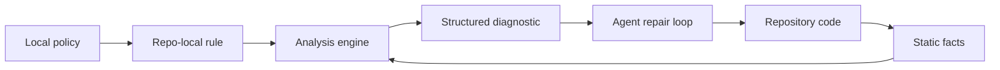

# Static Analysis Is Repair Infrastructure

Static analysis has moved from "run a linter before merge" toward an infrastructure layer
for repair loops. The useful unit is no longer just a warning in a terminal. It is a
structured fact about the repository: a rule ID, span, evidence, precision level, and
machine-readable path back to the policy. That matters more as AI coding agents write more
code, because agents need external feedback that is deterministic, local, scoped, and
cheap to rerun.

## Background

Static analysis is a broad family, not one technique. CodeQL describes an analysis flow as
database creation, query execution, and result interpretation; its databases include
language-specific relational representations of AST, data-flow graph, and control-flow
graph facts. Semgrep describes rules as pattern matching plus data-flow analysis. ESLint
exposes a JavaScript visitor API over ESTree nodes. SootUp exposes call-graph algorithms
such as CHA, RTA, and VTA. These are all "static analysis", but they sit on different rungs
of a ladder.

| Layer | Typical fact | Example policy |
| --- | --- | --- |
| Text and files | path, glob, generated/vendor status | Do not edit generated code. |
| Syntax | imports, literals, JSX attributes, declarations | Do not use raw colors. |
| Metrics | file size, function size, complexity | Flag code that grew beyond a review threshold. |
| Module graph | resolved imports, package boundaries | UI must not import persistence modules. |
| Symbols | definitions, references, exports | Migration is not complete until old API calls are gone. |
| Types | checker facts, public API shapes | Use generated SDK types instead of ad hoc JSON. |
| Calls | caller -> callee edges | Production roots must not reach raw admin APIs. |
| Control flow | branches, guards, cleanup order | Open transaction must be cleaned up. |
| Data flow | source -> sink paths, barriers | Request data must not reach shell execution. |

The central design question is not "which analyzer is best?" It is "which facts does this
policy need, and how much approximation can the team tolerate?"

## Current State

The ecosystem is specialized. ESLint custom rules are JavaScript modules with a `meta`
object and a `create(context)` visitor factory. That model is excellent for JavaScript
syntax policies, but the docs explicitly warn that core rules are not a public API for
extension, which means teams copy logic when they need something core-like but local.

Semgrep occupies a different authoring point: YAML rules with pattern matching and taint
mode. In taint mode, authors define sources, propagators, sanitizers, and sinks. Semgrep
also documents important semantic details that rule authors must understand: source and
sanitizer exactness changes whether subexpressions are tainted or sanitized; taint findings
include a trace; interprocedural and interfile analysis increase power and memory cost.

CodeQL is deeper again. It extracts a database, then runs QL queries over language-specific
schemas. CodeQL path queries require sources, sinks, and a path graph; the result is not
only "there is a bug" but a displayable route from source to sink. This is the mature form
of static analysis as evidence.

`polint` sits in a newer niche. It is not trying to replace ESLint, Ruff, Biome,
golangci-lint, or CodeQL. Its README positions it as a Rust framework for repo-local
static-analysis rules: the team owns the policies, while the framework supplies file
discovery, parsers, typed facts, diagnostics, caching, CI output, and an SDK.

## Why AI Agents Change The Pressure

AI coding agents make prose instructions less sufficient. A prompt or `AGENTS.md` entry
can say "use the generated billing client", but the agent still has to remember the rule,
find the violating call, know the approved replacement, and rerun a check. Static analysis
turns that into a concrete repair object.

Recent feedback-loop studies point in the same direction, while also warning against
naive automation:

| Finding | Measurement | Interpretation |
| --- | ---: | --- |
| Mixed feedback beats single feedback in FeedbackEval | 63.6% repair success | Agents benefit from combined external signals. |
| Compiler-only feedback in the same benchmark | 49.2% repair success | A diagnostic signal can be useful but too narrow. |
| Bandit/Pylint loop on PythonSecurityEval | security issues >40% -> 13% | Deterministic static checks can reduce issues. |
| Same Bandit/Pylint loop | readability >80% -> 11%, reliability >50% -> 11% | Static feedback may help general quality even more. |
| LLM-only iterative security refinement | +37.6% critical vulnerabilities after five iterations | Feedback loops can degrade security when feedback is not grounded. |

The synthesis is not "run more tools." It is: use deterministic tools as external
oracles, cap iteration, and keep the feedback small enough to act on.

## The Useful Static-Analysis Product

The durable product is a repairable diagnostic:

```text
rule_id: local/no-raw-admin-reachable
severity: error
file: internal/http/routes.go
range: 42:5-42:23
message: production route reaches raw admin API
evidence:
  root: POST /billing/refund
  target: dangerousAdmin
  path: handler -> refund -> dangerousAdmin
  precision: conservative
  max_depth: 8
```

This is different from a style warning. It is an interface between repository policy and a
repair loop. The agent can filter by `rule_id`, inspect one file, verify the evidence, edit
the call path, rerun only the relevant rule, and stop when the report is empty.



## Practical Implications

Treat static analysis as a portfolio:

| Need | Prefer |
| --- | --- |
| Formatting and common language rules | Existing formatter/linter |
| Security variant analysis across many repos | CodeQL or Semgrep-style engine |
| JavaScript syntax policy | ESLint or typescript-eslint rule |
| Architecture and import boundaries | Module graph facts |
| Agent-facing repo conventions | Repo-local policy rules with JSON output |
| Source-to-sink security rule | Taint/data-flow query with explicit model |
| Review-only rule | Diff-gated check |

For the polint article, the strongest framing is not that generic linters are weak. They are
strong at their domains. The gap is local knowledge: internal APIs, migration states,
security guardrails, design tokens, and review obligations that generic rule packs cannot
know without becoming bespoke.

## Sources

- [About CodeQL](https://codeql.github.com/docs/codeql-overview/about-codeql/)
- [About CodeQL queries](https://codeql.github.com/docs/writing-codeql-queries/about-codeql-queries/)
- [Creating path queries in CodeQL](https://codeql.github.com/docs/writing-codeql-queries/creating-path-queries/)
- [Semgrep rule writing overview](https://docs.semgrep.dev/writing-rules/overview/)
- [Semgrep taint analysis overview](https://docs.semgrep.dev/writing-rules/data-flow/taint-mode/overview)
- [ESLint custom rules](https://eslint.org/docs/latest/extend/custom-rules)
- [SootUp call graph construction](https://soot-oss.github.io/SootUp/v1.1.2/call-graph-construction/)
- [emilwareus/polint README](https://github.com/emilwareus/polint)
- [FeedbackEval](https://arxiv.org/html/2504.06939)
- [Static Analysis as a Feedback Loop](https://arxiv.org/abs/2508.14419)
- [Security Degradation in Iterative AI Code Generation](https://arxiv.org/html/2506.11022v2)

