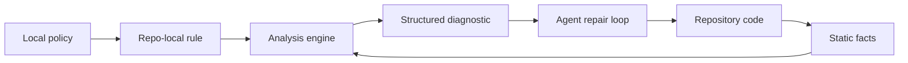

# Static Analysis Is Repair Infrastructure

Static analysis has moved from "run a linter before merge" toward an infrastructure layer
for repair loops. The useful unit is no longer just a warning in a terminal. It is a
structured fact about the repository: a rule ID, span, evidence, precision level, and
machine-readable path back to the policy. That matters more as AI coding agents write more
code, because agents need external feedback that is deterministic, local, scoped, and
cheap to rerun.

## Background

Static analysis is a broad family, not one technique. CodeQL describes an analysis flow as
database creation, query execution, and result interpretation; its databases include
language-specific relational representations of AST, data-flow graph, and control-flow
graph facts. Semgrep describes rules as pattern matching plus data-flow analysis. ESLint
exposes a JavaScript visitor API over ESTree nodes. SootUp exposes call-graph algorithms
such as CHA, RTA, and VTA. These are all "static analysis", but they sit on different rungs
of a ladder.

| Layer | Typical fact | Example policy |
| --- | --- | --- |
| Text and files | path, glob, generated/vendor status | Do not edit generated code. |
| Syntax | imports, literals, JSX attributes, declarations | Do not use raw colors. |
| Metrics | file size, function size, complexity | Flag code that grew beyond a review threshold. |
| Module graph | resolved imports, package boundaries | UI must not import persistence modules. |
| Symbols | definitions, references, exports | Migration is not complete until old API calls are gone. |
| Types | checker facts, public API shapes | Use generated SDK types instead of ad hoc JSON. |
| Calls | caller -> callee edges | Production roots must not reach raw admin APIs. |
| Control flow | branches, guards, cleanup order | Open transaction must be cleaned up. |
| Data flow | source -> sink paths, barriers | Request data must not reach shell execution. |

The central design question is not "which analyzer is best?" It is "which facts does this
policy need, and how much approximation can the team tolerate?"

## What "State Of The Art" Actually Means

There is no single state of the art because static analysis is a stack of methods. A modern
engine is usually state of the art in one or two layers, not all of them.

| Layer | Mature methods | Current production direction | Main limit |
| --- | --- | --- | --- |
| Parsing | native parsers, tree-sitter, compiler frontends | multi-language normalized facts | syntax is not semantics |
| Local facts | AST visitors, symbol tables, metrics | typed fact stores with spans | fragile across languages |
| Data flow | monotone worklists, SSA, IFDS/IDE | sparse value-flow and path queries | aliasing and summaries |
| Calls | CHA, RTA, VTA, points-to | language-specific dispatch models | dynamic features and callbacks |
| Memory | alias analysis, MemorySSA | sparse memory def/use graphs | precision vs. cost |
| Whole-program | Datalog, graph queries, relational DBs | database-backed and incremental analysis | cache invalidation and schema complexity |
| Taint | source/sink/sanitizer models | labels, exactness, interprocedural traces | model completeness |
| Agent loops | JSON/SARIF, focused reruns | deterministic repair feedback | false-positive repair churn |

This is why "language agnostic" has to be phrased carefully. The policy surface can be
language agnostic. The semantic providers underneath are necessarily language specific.

## Current State

The ecosystem is specialized. ESLint custom rules are JavaScript modules with a `meta`
object and a `create(context)` visitor factory. That model is excellent for JavaScript
syntax policies, but the docs explicitly warn that core rules are not a public API for
extension, which means teams copy logic when they need something core-like but local.

Semgrep occupies a different authoring point: YAML rules with pattern matching and taint
mode. In taint mode, authors define sources, propagators, sanitizers, and sinks. Semgrep
also documents important semantic details that rule authors must understand: source and
sanitizer exactness changes whether subexpressions are tainted or sanitized; taint findings
include a trace; interprocedural and interfile analysis increase power and memory cost.

CodeQL is deeper again. It extracts a database, then runs QL queries over language-specific
schemas. CodeQL path queries require sources, sinks, and a path graph; the result is not
only "there is a bug" but a displayable route from source to sink. This is the mature form
of static analysis as evidence.

`polint` sits in a newer niche. It is not trying to replace ESLint, Ruff, Biome,
golangci-lint, or CodeQL. Its README positions it as a Rust framework for repo-local
static-analysis rules: the team owns the policies, while the framework supplies file
discovery, parsers, typed facts, diagnostics, caching, CI output, and an SDK.

## How The Major Families Differ Internally

The tools that appear similar in a CI log often have very different internal models.

| Tool family | Internal shape | What it is good at | What this implies for polint |
| --- | --- | --- | --- |
| ESLint-style visitor | traverse ESTree and report nodes | fast syntax-local JavaScript rules | good inspiration for simple rule ergonomics, not enough for multi-language policy |
| Semgrep-style pattern/taint | patterns plus source/sink/sanitizer models | grep-like rules that can grow into taint | exactness and model knobs should be explicit |
| CodeQL-style database | extracted relational DB plus QL queries | variant analysis, path problems, security queries | facts and queries should be separable and cacheable |
| Joern CPG | code property graph plus traversals | exploratory slicing across syntax, CFG, PDG | graph exploration is powerful but needs bounded APIs |
| SVF/LLVM | IR, pointer analysis, MemorySSA, sparse value flow | precise compiled-language data/value flow | sparse internal graphs can sit behind simple policy queries |
| Souffle/Doop | recursive Datalog relations | whole-program fixed-point analyses | relational facts are a serious implementation option |
| MLIR data flow | lattice states over IR anchors and use-def subscriptions | reusable compiler analyses | dependency-driven propagation should be an engine primitive |

The shared trend is not "everything becomes one tool." It is fact separation: parse once,
derive stable facts, query those facts, and attach evidence.

## The Algorithmic Center Has Not Changed

The foundational ideas are old and still central:

```text
while facts keep changing:
  apply transfer functions
  join results at merge points
  enqueue dependents
```

Modern systems differ in what the "facts" are and how dependencies are represented:

| Engine style | Facts | Dependency edge |
| --- | --- | --- |
| Dense CFG solver | state at every basic block | CFG predecessor/successor |
| SSA sparse solver | state at SSA value | def-use edge |
| MemorySSA solver | memory access versions | defining access / clobber chain |
| IFDS/IDE solver | `(point, fact)` exploded nodes | realizable interprocedural edge |
| Datalog engine | relations | rule body to derived head |
| Code database | extracted tables | query dependency and result provenance |
| Incremental engine | cached facts | invalidation dependency graph |

The implementation details are different, but the intellectual shape is still fixed-point
computation plus approximation control.

## The Current Frontier Is Incremental, Explainable, And Bounded

Modern static analysis has already learned how to find deep facts. The pressure now is
running those facts cheaply and making them actionable.

1. Incremental analysis: CodeQL's public direction combines cached base databases with
   changed-code analysis for pull requests. Research prototypes show that fully incremental
   query evaluation can make small updates fast, but initial indexing and memory can be very
   expensive. The engineering lesson is to design cache keys and invalidation before the
   engine gets large.
2. Explainable paths: CodeQL path queries, Semgrep taint traces, and Joern
   `reachableByFlows` all point at the same UX requirement: a warning without a path is hard
   to repair.
3. Policy-level knobs: Semgrep's exactness, CodeQL barriers/additional flow steps, and
   polint's planned budgets all expose analysis semantics as part of the rule.
4. Sparse representations: SSA, MemorySSA, SVF-style value-flow graphs, and MLIR sparse
   analyses avoid traversing irrelevant CFG edges when a value graph is enough.
5. Honest uncertainty: dynamic dispatch, reflection, unresolved imports, framework
   callbacks, and missing summaries should produce precision labels or unknowns, not silent
   clean results.

This is the context in which polint is interesting: it can make these ideas available for
repo-local policies without requiring every team to operate a full variant-analysis stack.

## Hard Data That Shapes The Current State

The strongest lesson from production and research data is that "more static analysis" is not
one variable. Different engines hit different walls: tuple invalidation, memory blowups,
timeouts, source/sink modeling, graph size, context explosion, and benchmark drift.

| Tool / method | Hard data | What it actually proves |
| --- | --- | --- |
| CodeQL incremental production scans | GitHub reported average PR scan speedups over seven days: JavaScript/TypeScript 29/47/70% and Python 11/57/70% for `<3 min`, `3-7 min`, and `>7 min` baseline buckets in March 2026; later C/C++ and Go data reported C/C++ 17/34/46% and Go 9/16/25%. | Incrementality is now production-relevant, but numbers are query-suite/setup-specific. |
| CodeQL incremental research prototype | FSE 2023 paper reported full incremental initialization around 66-67 minutes and 70-72 GB memory on two Ruby projects; hybrid initialization around 14-15 minutes and 21-23 GB. | Small updates can be fast, but stable IDs and memory are central blockers. |
| Semgrep CE | Official docs describe CE data flow as intraprocedural; default CLI guardrails include 5 s per rule/file timeout, timeout threshold 3, and 1 MB max target size. | Default scans are bounded products, not proofs that every file/path was analyzed. |
| FlowDroid | PLDI 2014 reported 93% recall and 86% precision on DroidBench 1.0; real-app analysis in that paper was often under 1 minute for top Google Play apps. | Deep Android taint can work, but benchmark/configuration/lifecycle/source-sink choices matter. |
| Souffle | CAV 2016 OpenJDK analysis: context-insensitive points-to 35 s / 8.5 GB; context-sensitive points-to 6:44:08 / 206.4 GB; security analysis 14:45:01 / 75.3 GB. | Datalog can be fast, but context sensitivity and relation size can dominate memory. |
| Joern / CPG | IEEE S&P 2014 Linux kernel CPG: about 52M nodes, 87M edges, 110 min import, 14 GB graph plus 14 GB index; four traversals found 18 previously unknown kernel vulnerabilities. | Graph queries can support expert vulnerability hunting, but graph construction/storage is a large artifact. |
| LLVM MemorySSA | LLVM docs frame MemorySSA as replacing many MemoryDependenceAnalysis uses because careless dependency scans can become quadratic; MemorySSA uses one memory variable and walkers/AA for clobbers. | Sparse memory representation is a performance design, not a complete alias solution. |

These numbers should discipline the article. A repo-local policy engine should not promise
"full static analysis." It should promise explicit capability tiers, bounded queries,
machine-readable unknowns, and focused rules whose cost is proportional to the policy being
asked.

## Why AI Agents Change The Pressure

AI coding agents make prose instructions less sufficient. A prompt or `AGENTS.md` entry
can say "use the generated billing client", but the agent still has to remember the rule,
find the violating call, know the approved replacement, and rerun a check. Static analysis
turns that into a concrete repair object.

Recent feedback-loop studies point in the same direction, while also warning against
naive automation:

| Finding | Measurement | Interpretation |
| --- | ---: | --- |
| Mixed feedback beats single feedback in FeedbackEval | 63.6% repair success | Agents benefit from combined external signals. |
| Compiler-only feedback in the same benchmark | 49.2% repair success | A diagnostic signal can be useful but too narrow. |
| Bandit/Pylint loop on PythonSecurityEval | security issues >40% -> 13% | Deterministic static checks can reduce issues. |
| Same Bandit/Pylint loop | readability >80% -> 11%, reliability >50% -> 11% | Static feedback may help general quality even more. |
| LLM-only iterative security refinement | +37.6% critical vulnerabilities after five iterations | Feedback loops can degrade security when feedback is not grounded. |

The synthesis is not "run more tools." It is: use deterministic tools as external
oracles, cap iteration, and keep the feedback small enough to act on.

## Repair Infrastructure Architecture

Static analysis becomes repair infrastructure when the diagnostic is designed for a loop,
not only for a human reading terminal output.

```text
build_repair_infrastructure(repo):
  policies = load_repo_local_rules(repo)
  facts = analyze_repo(repo, policies.required_capabilities)
  diagnostics = run_policies(policies, facts)

  for diagnostic in diagnostics:
    attach:
      stable rule id
      precise span
      path or local evidence
      precision/status
      suggested repair direction when known
      fingerprint for baselines

  write:
    compact terminal summary
    full JSON report
    optional SARIF report

agent_repair_loop():
  run check
  select one rule_id or one diagnostic cluster
  inspect only relevant files and evidence
  edit smallest policy-preserving change
  rerun focused check
  stop when clean, unknown, or iteration budget reached
```

The engine is doing product work here. It is shaping the feedback so the repair actor, human
or agent, does less guessing.

## The Useful Static-Analysis Product

The durable product is a repairable diagnostic:

```text
rule_id: local/no-raw-admin-reachable
severity: error
file: internal/http/routes.go
range: 42:5-42:23
message: production route reaches raw admin API
evidence:
  root: POST /billing/refund
  target: dangerousAdmin
  path: handler -> refund -> dangerousAdmin
  precision: conservative
  max_depth: 8
```

This is different from a style warning. It is an interface between repository policy and a
repair loop. The agent can filter by `rule_id`, inspect one file, verify the evidence, edit
the call path, rerun only the relevant rule, and stop when the report is empty.



## Practical Implications

Treat static analysis as a portfolio:

| Need | Prefer |
| --- | --- |
| Formatting and common language rules | Existing formatter/linter |
| Security variant analysis across many repos | CodeQL or Semgrep-style engine |
| JavaScript syntax policy | ESLint or typescript-eslint rule |
| Architecture and import boundaries | Module graph facts |
| Agent-facing repo conventions | Repo-local policy rules with JSON output |
| Source-to-sink security rule | Taint/data-flow query with explicit model |
| Review-only rule | Diff-gated check |

For the polint article, the strongest framing is not that generic linters are weak. They are
strong at their domains. The gap is local knowledge: internal APIs, migration states,
security guardrails, design tokens, and review obligations that generic rule packs cannot
know without becoming bespoke.

## Sources

- [About CodeQL](https://codeql.github.com/docs/codeql-overview/about-codeql/)
- [About CodeQL queries](https://codeql.github.com/docs/writing-codeql-queries/about-codeql-queries/)
- [Creating path queries in CodeQL](https://codeql.github.com/docs/writing-codeql-queries/creating-path-queries/)
- [CodeQL incremental analysis](https://docs.github.com/en/code-security/how-tos/find-and-fix-code-vulnerabilities/scan-from-the-command-line/incremental-analysis)
- [Faster incremental analysis with CodeQL in pull requests](https://github.blog/changelog/2026-03-24-faster-incremental-analysis-with-codeql-in-pull-requests/)
- [Incremental analysis for Go, C/C++, and CodeQL CLI](https://github.blog/changelog/2026-06-10-incremental-analysis-for-go-c-c-and-codeql-cli/)
- [Incrementalizing Production CodeQL Analyses](https://arxiv.org/pdf/2308.09660)
- [Semgrep rule writing overview](https://docs.semgrep.dev/writing-rules/overview/)
- [Semgrep taint analysis overview](https://docs.semgrep.dev/writing-rules/data-flow/taint-mode/overview)
- [Semgrep CLI reference](https://docs.semgrep.dev/cli-reference)
- [ESLint custom rules](https://eslint.org/docs/latest/extend/custom-rules)
- [FlowDroid](https://www.bodden.de/pubs/far+14flowdroid.pdf)
- [SootUp call graph construction](https://soot-oss.github.io/SootUp/v1.1.2/call-graph-construction/)
- [Go `callgraph/vta` package](https://pkg.go.dev/golang.org/x/tools/go/callgraph/vta)
- [LLVM MemorySSA](https://llvm.org/docs/MemorySSA.html)
- [Writing DataFlow Analyses in MLIR](https://mlir.llvm.org/docs/Tutorials/DataFlowAnalysis/)
- [SVF project documentation](https://svf-tools.github.io/SVF/)
- [Souffle docs](https://souffle-lang.github.io/docs.html)
- [Souffle CAV 2016 paper](https://www.souffle-lang.com/pdf/cav16.pdf)
- [Joern data-flow query steps](https://docs.joern.io/cpgql/data-flow-steps/)
- [Modeling and Discovering Vulnerabilities with Code Property Graphs](https://www.ieee-security.org/TC/SP2014/papers/ModelingandDiscoveringVulnerabilitieswithCodePropertyGraphs.pdf)
- [emilwareus/polint README](https://github.com/emilwareus/polint)
- [FeedbackEval](https://arxiv.org/html/2504.06939)
- [Static Analysis as a Feedback Loop](https://arxiv.org/abs/2508.14419)
- [Security Degradation in Iterative AI Code Generation](https://arxiv.org/html/2506.11022v2)
