# Latency Budget Is The Product

The practical product quality of a real-time voice agent is not determined by one model's
benchmark. It is determined by the full path from user intent to audible agent behavior:
capture, transport, VAD, endpointing, STT finalization, LLM first token, TTS first audio,
playout, cancellation, and tail behavior. The user does not experience these as separate
components. The user experiences one thing: did the agent respond at the right time?

This note is deliberately not a polished article. It is the evidence trace for later writing.

## Source Map

| Ref      | Source                                                                                         | Local path                                          | Role                                                                                                              |
| -------- | ---------------------------------------------------------------------------------------------- | --------------------------------------------------- | ----------------------------------------------------------------------------------------------------------------- |
| R-VA-003 | Moonshine v2: Ergodic Streaming Encoder ASR (arXiv 2602.12241)                                 | `../paper-text/moonshine-v2-2602.12241.txt`         | Local/live ASR response-latency and WER numbers. `paper evidence`.                                                |
| R-VA-004 | Open ASR Leaderboard (arXiv 2510.06961)                                                        | `../paper-text/open-asr-leaderboard-2510.06961.txt` | Accuracy/throughput context and benchmark caveats. `paper evidence`.                                              |
| R-VA-007 | OpenAI Realtime API reference                                                                  | `../articles/openai-realtime-api-reference.html`    | Turn detection knobs, default silence duration, interruption semantics. `official-doc evidence`.                  |
| R-VA-009 | Pipecat Smart Turn docs                                                                        | `../articles/pipecat-smart-turn.html`               | Turn detection as a separate stage after VAD. `official-doc evidence`.                                            |
| R-VA-014 | Fish Audio S2 (arXiv 2603.08823)                                                               | `../paper-text/fish-audio-s2-2603.08823.txt`        | Primary TTFA and RTF data for production TTS serving. `paper evidence`.                                           |
| R-VA-018 | Moshi (arXiv 2410.00037)                                                                       | `../paper-text/moshi-2410.00037.txt`                | Native speech argument against cascaded multi-stage latency; 230 ms human turn-taking citation. `paper evidence`. |
| R-VA-022 | Stivers et al. "Universals and cultural variation in turn-taking in conversation" (PNAS, 2009) | URL in `../references.md`                           | Human response offset baseline. `paper evidence`.                                                                 |
| R-VA-023 | ITU-T G.114: One-way transmission time                                                         | `../articles/itu-g114.html`                         | Network delay planning baseline. `official-doc evidence`.                                                         |

## Why This Is The First Insight

Voice-agent latency discussions get confused because people use the same word for several
different things:

- network delay;
- model throughput;
- model first-token latency;
- VAD frame delay;
- end-of-turn delay;
- TTS real-time factor;
- time to first audio;
- user-perceived response delay;
- tail latency under concurrency.

Those are not interchangeable. A model can have excellent RTFx and still be a bad
conversational component if it waits too long to finalize a turn. A TTS system can generate
audio faster than real time and still have bad first-audio latency. A WebSocket demo can
feel fine on localhost while mobile packet loss makes playout and interruption state
unstable. A Realtime API can be "low latency" while default endpointing still waits for a
silence threshold before creating a response.

The voice agent budget is a waterfall. If every stage looks individually reasonable, the
sum can still feel slow. If the agent responds early at the wrong turn boundary, the sum
can look fast but feel rude.

## Baseline Human And Network Timing

The human literature is useful because it gives the target feel. Stivers et al. (2009)
measured response offsets across 10 languages (`paper evidence`). The cross-language
distribution has a median gap of approximately 200 ms, with per-language means ranging
widely: Japanese fastest at about 7 ms and Danish slowest at about 469 ms. The Moshi
paper (R-VA-018) cites this same Stivers et al. source but states "230 ms average in
natural conversations measured over 10 languages."

The discrepancy between ~200 ms and 230 ms warrants a note. Stivers et al. report several
summary statistics depending on the analysis method: the modal response is a short positive
gap, the cross-language median gap is approximately 200 ms, but means can be pulled by
outliers and the exact subset of data used. Moshi appears to cite 230 ms as a mean or
rounded summary. Both numbers appear in the literature referencing this source. This
insight does not pick one as canonical. The important conclusion does not depend on whether
the number is 200 or 230: humans do not wait passively for silence. Humans predict when
the prior turn is ending.

ITU-T G.114 gives a different baseline: network planning (`official-doc evidence`). Its
summary says one-way delay of 400 ms should not be exceeded for general planning and that
highly interactive speech can be affected by lower delays. That is a network
recommendation, not an AI-agent budget. But it is a useful warning: if the media path
itself consumes a few hundred milliseconds, the model stack has little room left.

| Baseline                                           |         Number | Source quality                                            | What it means                                             | What it does not mean                                               |
| -------------------------------------------------- | -------------: | --------------------------------------------------------- | --------------------------------------------------------- | ------------------------------------------------------------------- |
| Human turn response offset (cross-language median) |        ~200 ms | `paper evidence` (Stivers et al. 2009, R-VA-022)          | Humans predict turn endings.                              | AI agents can safely answer after every 200 ms pause.               |
| Human turn response offset (Moshi's cited average) |        ~230 ms | `paper evidence` (Moshi, R-VA-018, citing Stivers et al.) | Rounded/mean summary of the same underlying data.         | A contradictory finding; it reflects a different summary statistic. |
| Japanese mean in Stivers et al.                    |          ~7 ms | `paper evidence` (R-VA-022)                               | Some cultures/languages have extremely tight turn timing. | A universal target for products.                                    |
| Danish mean in Stivers et al.                      |        ~469 ms | `paper evidence` (R-VA-022)                               | Normal conversation tolerates variation.                  | Slow endpointing is always fine.                                    |
| ITU G.114 planning upper bound                     | 400 ms one-way | `official-doc evidence` (R-VA-023)                        | Network delay above this is broadly problematic.          | Full voice-agent round trip should be 400 ms total.                 |

## The Voice Agent Waterfall

For a cascaded agent, the path is roughly:

```mermaid
flowchart LR
  A[Mic capture] --> B[AEC / noise suppression]
  B --> C[Uplink transport]
  C --> D[VAD speech start]
  D --> E[Endpointing / end of turn]
  E --> F[STT final or stable partial]
  F --> G[LLM first token]
  G --> H[TTS first audio]
  H --> I[Downlink transport]
  I --> J[Playback buffer]
  J --> K[User hears response]
```

The critical hidden point is that "STT latency" is often a compound of endpointing and
recognition. Moonshine v2 explicitly defines response latency as the time between detecting
the end of a speech segment with VAD and returning the transcript (`paper evidence`,
R-VA-003). OpenAI server VAD has default silence duration of 500 ms (`official-doc
evidence`, R-VA-007), which is not "model compute"; it is a policy decision to avoid
cutting users off. Fish Audio S2 reports TTFA as low as 100 ms (`paper evidence`,
R-VA-014), but only after input text is available and under a specific production serving
setup (see TTS section below for caveats).

## Copied Data: ASR Latency

Moonshine v2 Table 2 is unusually useful because it measures response latency on Apple M3
in a live-transcription-like scenario (`paper evidence`, R-VA-003). The paper defines
response latency as "the amount of time taken between the end of a speech utterance and the
returned transcript in a real-time, live transcription scenario running on an Apple MacBook
M3." The paper compares Moonshine, Moonshine v2, and Whisper via faster-whisper.

| Model               | Params | Response latency on Apple M3 | Compute load | Source                                                | Source quality   |
| ------------------- | -----: | ---------------------------: | -----------: | ----------------------------------------------------- | ---------------- |
| Moonshine Tiny      |    27M |                        27 ms |        5.91% | R-VA-003 Table 2 (latency/load); params from Figure 5 | `paper evidence` |
| Moonshine Base      |    61M |                        44 ms |        7.34% | R-VA-003 Table 2 (latency/load); params from Figure 5 | `paper evidence` |
| Moonshine v2 Tiny   |    34M |                        50 ms |        8.03% | R-VA-003 Table 2                                      | `paper evidence` |
| Moonshine v2 Small  |   123M |                       148 ms |       17.97% | R-VA-003 Table 2                                      | `paper evidence` |
| Moonshine v2 Medium |   245M |                       258 ms |       28.95% | R-VA-003 Table 2                                      | `paper evidence` |
| Whisper Tiny        |    39M |                       289 ms |        8.46% | R-VA-003 Table 2 (latency/load); params from R-VA-030 | `paper evidence` |
| Whisper Base        |    74M |                       553 ms |       16.19% | R-VA-003 Table 2 (latency/load); params from R-VA-030 | `paper evidence` |
| Whisper Small       |   244M |                     1,940 ms |       56.84% | R-VA-003 Table 2 (latency/load); params from R-VA-030 | `paper evidence` |
| Whisper Large v3    | 1,550M |                    11,286 ms |      330.65% | R-VA-003 Table 2 (latency/load); params from R-VA-030 | `paper evidence` |

All values in this table were verified against `../paper-text/moonshine-v2-2602.12241.txt`.

This table can support a very strong slide, but the claim must be precise:

- It is not a general "Moonshine always beats Whisper" claim.
- It is not a cloud streaming benchmark.
- It is not total user round-trip latency.
- It is a local, live-transcription-oriented response-latency comparison on Apple M3.

Inference: offline ASR architectures can be inappropriate for latency-critical agent loops
even when their WER is good. A local streaming-oriented model can dramatically reduce the
STT portion of the waterfall. The Moonshine v2 paper explicitly highlights this: "Moonshine
v2 Tiny achieves 50 ms latency (5.8x faster than Whisper Tiny), Moonshine v2 Small
achieves 148 ms (13.1x faster than Whisper Small), and Moonshine v2 Medium achieves 258 ms
(43.7x faster than Whisper Large v3)."

## Copied Data: TTS First Audio

Fish Audio S2 is useful because it reports both RTF and TTFA (`paper evidence`, R-VA-014).
RTF is total speed; TTFA is when the user can start hearing something.

| System                               |      RTF |                  TTFA | Hardware/context                               | Source             | Source quality   |
| ------------------------------------ | -------: | --------------------: | ---------------------------------------------- | ------------------ | ---------------- |
| Fish Audio S2                        |    0.195 |      as low as 100 ms | single NVIDIA H200, SGLang, production serving | R-VA-014 Section 5 | `paper evidence` |
| Fish Audio S2 under high concurrency | <0.5 RTF | not separately stated | 3000+ acoustic tokens/s                        | R-VA-014 Section 5 | `paper evidence` |

The "as low as 100 ms" TTFA claim requires careful qualification. The paper states this is
achieved "in the production serving environment" on a single NVIDIA H200 GPU, using their
SGLang-based inference engine with several specific optimizations:

1. Audio tokenizer decoding is co-scheduled with LLM decoding on the same GPU via MPS
   (multi-process service), enabling concurrent execution.
2. RadixCache is extended to cache diverse reference audio contexts, enabling KV cache hits
   for voice reuse. The paper reports 86.4% average prefix-cache hit rate and over 90% at
   peak.
3. The Dual-AR architecture is structurally isomorphic to standard autoregressive text LLMs,
   allowing all native SGLang optimizations (continuous batching, paged KV cache, CUDA graph
   replay).

Inference: the 100 ms TTFA is a best-case figure under warm-cache, single-GPU serving
conditions. Cold-start TTFA (new voice, no cache) will be higher. The paper does not report
a cold-start TTFA separately. This is still the cleanest primary-source "voice-agent TTS
latency" data found in the surveyed literature because it speaks directly in TTFA terms,
but production deployments on different hardware (e.g., A100, L40, or local GPU) should
expect different numbers.

## Turn Detection Is Latency

OpenAI Realtime `server_vad` has `silence_duration_ms`, defaulting to 500 ms (`official-doc
evidence`, R-VA-007). That value can dominate the interaction. Pipecat Smart Turn analyzes
the recent user turn after VAD detects a pause (`official-doc evidence`, R-VA-009). LiveKit
supports VAD-only, STT endpointing, realtime model detection, and turn-detector models
(`official-doc evidence`, R-VA-008). Deepgram Flux claims end-of-turn detection around
260 ms and response-latency reduction versus traditional STT+VAD (`vendor claim`, R-VA-020).

This means a voice-agent latency budget should have at least two endpointing columns:

| Layer                         |                                        Example number | Source quality                                                      | Why it matters                                      |
| ----------------------------- | ----------------------------------------------------: | ------------------------------------------------------------------- | --------------------------------------------------- |
| Acoustic frame classification |                                       10-32 ms frames | `official-doc evidence` (Silero defaults, R-VA-006)                 | Detects whether speech is present.                  |
| Silence endpointing           |  200-700 ms typical settings in local docs/frameworks | `official-doc evidence` (R-VA-007, R-VA-008, R-VA-009)              | Decides when a pause is enough silence.             |
| Semantic EOU                  | model-specific, e.g. Pipecat under 100 ms after pause | `official-doc evidence` (R-VA-009)                                  | Decides whether the utterance is actually complete. |
| Forced timeout                |                                               seconds | `official-doc evidence` (R-VA-007: 5-30 s; R-VA-020: 500-10,000 ms) | Prevents an incomplete turn from hanging forever.   |

## Chart Sketch

The useful visual is not a single "latency" number. It is a stacked budget with toggles:

```mermaid
xychart-beta
  title "Illustrative Voice-Agent Latency Budget"
  x-axis ["Conservative VAD", "Semantic EOU", "Speculative"]
  y-axis "Milliseconds" 0 --> 1800
  bar [700, 350, 180]
  bar [258, 258, 258]
  bar [400, 400, 250]
  bar [100, 100, 100]
```

Chart intent:

- first bar segment: endpointing;
- second: STT finalization;
- third: LLM first useful output;
- fourth: TTS first audio.

The numbers above are illustrative placeholders. The following indicates sourcing:

- **258 ms STT finalization**: from Moonshine v2 Medium response latency on Apple M3
  (`paper evidence`, R-VA-003 Table 2). Used across all three scenarios as a fixed
  reference.
- **100 ms TTS first audio**: from Fish Audio S2 best-case TTFA on H200 with SGLang
  (`paper evidence`, R-VA-014). Used as an optimistic floor.
- **700 ms endpointing (Conservative VAD)**: representative of a typical silence timer
  (e.g., local Jarvis config uses 700 ms, OpenAI server_vad defaults to 500 ms). Estimated
  from framework defaults, not a single benchmark.
- **350 ms endpointing (Semantic EOU)**: estimated, reflecting a shorter silence timer plus
  semantic EOU model inference. Not from a single source measurement.
- **180 ms endpointing (Speculative)**: estimated, reflecting speculative generation
  starting before final endpointing. Not from a single source measurement.
- **400 ms / 250 ms LLM first useful output**: estimated. LLM TTFT varies widely by
  provider, model size, prompt length, and load. These are not from a copied source value.

Before publishing, use measured Jarvis timings or clearly label as budget scenarios with
the sourcing notes above.

## Engineering Inference

Inference: instrument every stage separately. A voice agent should emit timestamps for:

- audio captured;
- first VAD speech probability above threshold;
- user speech stop;
- endpoint decision;
- first partial transcript;
- stable/final transcript;
- LLM request sent;
- LLM first token;
- TTS request sent;
- first playable audio byte/chunk;
- playback start;
- interruption detected;
- response cancellation acknowledged.

Without this instrumentation, latency arguments collapse into vibes. You cannot tune what
you cannot locate.

Inference: the user-facing design target should not be "minimize every number." It should
be "respond when the user expects a response." That means you sometimes accept more silence
to avoid interrupting thoughtful speech, and sometimes use semantic end-of-turn to respond
faster than a fixed silence timer would allow.

## Non-Claims

- This note does not prove one STT/TTS provider is universally best.
- It does not compare total cloud API latency across providers.
- It does not claim native speech models are always lower latency in production.
- It does not claim a 200 ms (or 230 ms) human response offset is a universal product
  requirement. The Stivers data shows large cross-language variation.
- It does not treat RTF, RTFx, TTFT, TTFA, and end-to-end latency as interchangeable.
- The Moonshine v2 numbers are local Apple M3 measurements, not cloud serving benchmarks.
  They should not be compared directly to cloud API latency figures.
- The Fish Audio S2 TTFA is a production H200 serving number with cache optimizations. It
  does not represent cold-start or local-GPU performance.

## Blog/Presentation Visual Candidates

- Waterfall of the voice-agent path (Mermaid flowchart above is a starting point).
- Side-by-side ASR latency table from Moonshine v2 Table 2. Highlight the 5.8x to 43.7x
  speed ratios.
- TTS RTF vs TTFA diagram explaining why "faster than real time" is insufficient. RTF tells
  you throughput; TTFA tells you when the user starts hearing audio. Both matter, but for
  conversational feel TTFA dominates.
- Endpointing slider: "too early = interruption; too late = dead air." Show how silence
  duration settings shift the tradeoff.
- "Metrics glossary" card: WER, RTF, RTFx, TTFT, TTFA, EOT latency, P95. Each with a
  one-line definition and directionality (lower-is-better vs higher-is-better).
- Stacked bar chart of the illustrative budget with clear labels showing which bars are
  source data vs estimated.

## References

- R-VA-003: Moonshine v2 (arXiv 2602.12241). `../paper-text/moonshine-v2-2602.12241.txt`. https://arxiv.org/abs/2602.12241
- R-VA-004: Open ASR Leaderboard (arXiv 2510.06961). `../paper-text/open-asr-leaderboard-2510.06961.txt`. https://arxiv.org/abs/2510.06961
- R-VA-007: OpenAI Realtime API reference. `../articles/openai-realtime-api-reference.html`. https://developers.openai.com/api/reference/resources/realtime
- R-VA-009: Pipecat Smart Turn docs. `../articles/pipecat-smart-turn.html`. https://docs.pipecat.ai/server/utilities/turn-detection/smart-turn-overview
- R-VA-014: Fish Audio S2 (arXiv 2603.08823). `../paper-text/fish-audio-s2-2603.08823.txt`. https://arxiv.org/abs/2603.08823
- R-VA-018: Moshi (arXiv 2410.00037). `../paper-text/moshi-2410.00037.txt`. https://arxiv.org/abs/2410.00037
- R-VA-022: Stivers et al. (2009). "Universals and cultural variation in turn-taking in conversation." PNAS 106(26), 10587-10592. https://www.mpi.nl/publications/item66202/universals-and-cultural-variation-turn-taking-conversation
- R-VA-023: ITU-T G.114. `../articles/itu-g114.html`. https://www.itu.int/ITU-T/recommendations/rec.aspx?rec=G.114
- Plot data: `../data/stt_models.csv`, `../data/tts_models.csv`, `../data/turn_detection.csv`
