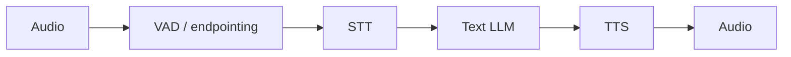

# Native Speech Models Change The Boundary

Cascaded voice agents split the problem into STT -> LLM -> TTS. Native speech-to-speech
models move the boundary: audio tokens become part of the model's input/output space, and
the system can preserve prosody, overlap, backchannels, and timing in ways a text-only
middle layer throws away.

But native speech does not automatically win. Cascades remain easier to debug, evaluate,
moderate, log, tool-call, and swap component-by-component. The interesting research
question is not "native or cascade?" It is which boundary you want to own, and what each
architecture gives up.

This insight compiles the architecture details, codec designs, latency claims, and benchmark
numbers from four published native speech models: Moshi, Qwen2.5-Omni, Mini-Omni, and
GLM-4-Voice. The goal is to give a researcher enough data to compare them against each
other and against the cascaded baseline without needing to reopen the papers.

## Source Map

| Ref      | Source                                                                    | Local path                                   | Role                                                                                   |
| -------- | ------------------------------------------------------------------------- | -------------------------------------------- | -------------------------------------------------------------------------------------- |
| R-VA-018 | Moshi: a speech-text foundation model for real-time dialogue              | `../paper-text/moshi-2410.00037.txt`         | Full-duplex speech-text model. Strongest conceptual source for native speech dialogue. |
| R-VA-019 | Qwen2.5-Omni Technical Report                                             | `../paper-text/qwen25-omni-2503.20215.txt`   | Thinker-Talker architecture with streaming speech output and multimodal benchmarks.    |
| R-VA-024 | Mini-Omni: Language Models Can Hear, Talk While Thinking in Streaming     | `../paper-text/mini-omni-2408.16725.txt`     | Small open real-time speech interaction model with SNAC codec.                         |
| R-VA-025 | GLM-4-Voice: Towards Intelligent and Human-Like End-to-End Spoken Chatbot | `../paper-text/glm-4-voice-2412.02612.txt`   | Low-bitrate speech tokenizer with flow-matching decoder and end-to-end spoken chatbot. |
| R-VA-028 | Local transport deep dive                                                 | `../TRANSPORT-DEEP-DIVE.md`                  | Cascaded architecture and media-system context.                                        |
| R-VA-022 | Stivers et al. 2009                                                       | `../articles/human-turn-taking-stivers.html` | Human turn-taking response time baseline.                                              |

## The Cascade

The conventional architecture is:



Strengths:

- every component is inspectable;
- transcript is available for logs, tools, moderation, and UI;
- STT/TTS can be swapped independently;
- debugging is simple compared with audio-token internals;
- API/tool calling fits text LLM workflows.

Weaknesses:

- latency compounds across modules;
- prosody and non-speech signal are discarded or approximated;
- turn-taking becomes an external policy;
- overlap and backchannels are awkward;
- the user's voice becomes text before the model reasons.

## Moshi

### Architecture

The Moshi paper reports a multi-stream speech-text foundation model built on top of Helium,
a 7B-parameter text LLM pretrained on 2.1 trillion tokens of public English data. The model
uses a Temporal Transformer (same architecture as Helium: 32 layers, dimension 4096, 32
heads; Helium was pretrained with context size 4096 tokens, but in Moshi training the context
is 3000 steps, i.e. ~4 minutes of audio at 12.5 Hz) paired with a smaller Depth Transformer
(6 layers, dimension
1024, 16 heads) that predicts audio tokens hierarchically at each time step. (`paper evidence`,
R-VA-018, Table 1.)

### Mimi Codec

The paper reports that Mimi is a neural audio codec that operates at 12.5 Hz with Q = 8
quantizers, each with codebook size N_A = 2048. At 12.5 Hz, this represents a bitrate of
1.1 kbps. The encoder uses striding factors (4, 5, 6, 8) plus a final stride-2 convolution to
project 24 kHz audio to 12.5 frames per second with dimension D = 512. The initial frame
size and overall stride correspond to 80 ms, meaning that given a first audio frame of 80 ms,
Mimi outputs a first latent timestep. (`paper evidence`, R-VA-018, Section 3.3.1.)

The paper reports a split RVQ architecture: semantic information is distilled from WavLM into
a plain VQ (first level), while an RVQ with 7 levels operates in parallel for acoustic tokens.
Their outputs are summed for reconstruction. This avoids forcing acoustic information into the
residual of the semantic quantizer. (`paper evidence`, R-VA-018, Section 3.3.2.)

### Latency

The paper reports: "a theoretical latency of 160 ms, 200 ms in practice." The paper also
states the 160 ms theoretical latency is "lower than the 230 ms average in natural
conversations measured over 10 languages (Stivers et al., 2009)." (`paper evidence`,
R-VA-018, Abstract and Section 1.)

Inference: The 230 ms average is from Stivers et al. 2009 (R-VA-022), cited within the Moshi
paper. Moshi's own number is 200 ms practical, meaning 30 ms faster than the average human
response gap. This is a single measurement context (the Moshi demo/system); no hardware or
measurement methodology is specified beyond the model's streaming architecture.

### Overlapping Speech

The paper reports: "overlapping speech --- which amounts for 10 to 20% of spoken time
(Cetin and Shriberg, 2006)." (`paper evidence citing Cetin and Shriberg 2006`, R-VA-018,
Section 1.)

Inference: This 10-20% figure is from a secondary source cited by the Moshi paper. The
important architectural consequence is that Moshi removes explicit speaker turns entirely ---
both streams (user and model) are processed jointly, allowing the model to handle overlapping
speech, interruptions, and backchannels without an external turn-taking policy.

### Inner Monologue

The paper reports Inner Monologue as a training and inference method where the model
jointly predicts time-aligned text tokens as a prefix to audio tokens. Text tokens are aligned to
the 12.5 Hz framerate using word-level timestamps from Whisper. Padding tokens represent
about 65% of the text stream in English conversational speech. The paper reports this
"drastically improves the length and quality of generated speech" and enables deriving
streaming ASR and TTS from a single Moshi model by adjusting the delay between text and
audio token streams. (`paper evidence`, R-VA-018, Section 3.4.4.)

### Moshi Data Table

| Claim                              |  Value | Unit    | Source                                  | Quality label                                   |
| ---------------------------------- | -----: | ------- | --------------------------------------- | ----------------------------------------------- |
| Theoretical latency                |    160 | ms      | R-VA-018, Abstract                      | `paper evidence`                                |
| Practical latency                  |    200 | ms      | R-VA-018, Abstract                      | `paper evidence`                                |
| Natural conversation average       |    230 | ms      | R-VA-018 citing Stivers et al. 2009     | `paper evidence citing Stivers et al. 2009`     |
| Backbone parameters                |     7B | params  | R-VA-018, Section 3.2                   | `paper evidence`                                |
| Backbone name                      | Helium | -       | R-VA-018, Section 3.2                   | `paper evidence`                                |
| Pretraining data (text)            |   2.1T | tokens  | R-VA-018, Section 3.2                   | `paper evidence`                                |
| Mimi codec frame rate              |   12.5 | Hz      | R-VA-018, Section 3.3.1                 | `paper evidence`                                |
| Mimi frame duration                |     80 | ms      | R-VA-018, Section 3.3.1                 | `paper evidence`                                |
| Mimi bitrate (Q=8 at 12.5 Hz)      |    1.1 | kbps    | R-VA-018, Section 3.3.1                 | `paper evidence`                                |
| Mimi quantizers                    |      8 | count   | R-VA-018, Section 3.3.1                 | `paper evidence`                                |
| Mimi codebook size (per quantizer) |   2048 | entries | R-VA-018, Section 3.3.1                 | `paper evidence`                                |
| Audio training data                |     7M | hours   | R-VA-018, Section 4.2                   | `paper evidence`                                |
| Temporal Transformer layers        |     32 | layers  | R-VA-018, Table 1                       | `paper evidence`                                |
| Depth Transformer layers           |      6 | layers  | R-VA-018, Table 1                       | `paper evidence`                                |
| Overlapping speech fraction        |  10-20 | %       | R-VA-018 citing Cetin and Shriberg 2006 | `paper evidence citing Cetin and Shriberg 2006` |

## Qwen2.5-Omni

### Architecture

The paper reports Qwen2.5-Omni as an end-to-end multimodal model using a Thinker-Talker
architecture. Thinker is a Transformer decoder (initialized from Qwen2.5) that handles text
generation. Talker is a dual-track autoregressive Transformer decoder (motivated by
Mini-Omni) that receives high-level representations from Thinker and generates speech tokens.
Both are jointly trained and inferred end-to-end. (`paper evidence`, R-VA-019, Section 2.1.)

The released model is 7B parameters (Table 1 benchmarks it against other 7B models). The CSV
file references 3B and 7B variants; the paper text only evaluates the 7B variant
("Qwen2.5-Omni-7B"). (`paper evidence`, R-VA-019, Tables 1-10.)

### TMRoPE

The paper reports TMRoPE (Time-aligned Multimodal RoPE) as a positional embedding approach
that decomposes rotary embeddings into three components: temporal, height, and width. For audio
inputs, one temporal ID corresponds to 40 ms. For video inputs, temporal IDs are dynamically
adjusted based on actual frame times. Audio and video representations are arranged in an
interleaved structure in 2-second chunks. (`paper evidence`, R-VA-019, Section 2.2.)

### Streaming Design

The paper reports a sliding-window DiT (Diffusion Transformer) for streaming codec-to-waveform
generation. The DiT uses a Flow-Matching model to convert speech tokens to mel-spectrograms,
followed by a modified BigVGAN to reconstruct waveforms. The DiT's receptive field is limited
to 4 blocks (2 lookback + current + 1 lookahead). Audio and visual encoders are modified to use
block-wise attention in 2-second blocks along the temporal dimension. (`paper evidence`,
R-VA-019, Section 2.4.)

### Speech Codec

The paper reports a custom codec called qwen-tts-tokenizer. It "efficiently represents key
information of speech and can be decoded to speech streamingly through a causal audio
decoder." The generation of speech does not require word-level or timestamp-level alignment
with text. (`paper evidence`, R-VA-019, Section 2.3.)

Inference: The paper does not report the specific bitrate, frame rate, or codebook parameters
of qwen-tts-tokenizer. This is a notable gap compared to Moshi and GLM-4-Voice, which
document their codec designs in detail.

### Latency

The paper discusses four dimensions of initial packet latency (Section 2.4): multimodal input
processing delay, first-text-to-first-voice-token delay, first-speech-to-audio delay, and
inherent architecture latency. It states that the sliding-window DiT and block-wise encoders
aim to "reduce initial package delay." However, the paper does not report a specific end-to-end
latency number in milliseconds. (`paper evidence`, R-VA-019, Section 2.4.)

Inference: The absence of a concrete latency claim is notable. This may reflect the model's
focus on multimodal understanding (not just voice dialogue) or the difficulty of measuring
latency for a system that handles text, audio, image, and video.

### Benchmark Results

The paper reports extensive benchmarks. Relevant speech-related results:

**ASR (WER, lower is better):**

| Dataset                | Qwen2.5-Omni-7B | Whisper-large-v3 | Source            |
| ---------------------- | --------------: | ---------------: | ----------------- |
| LibriSpeech test-clean |             1.8 |              1.8 | R-VA-019, Table 2 |
| LibriSpeech test-other |             3.4 |              3.6 | R-VA-019, Table 2 |
| Fleurs zh              |             3.0 |              7.7 | R-VA-019, Table 2 |
| Fleurs en              |             4.1 |              4.1 | R-VA-019, Table 2 |

(`paper evidence`, R-VA-019, Table 2.)

**Speech Generation (Seed-TTS-Eval WER, lower is better):**

| Dataset   | Qwen2.5-Omni-7B (RL) | MaskGCT | F5-TTS | CosyVoice 2 | Source            |
| --------- | -------------------: | ------: | -----: | ----------: | ----------------- |
| test-zh   |                1.42% |   2.27% |  1.56% |       1.45% | R-VA-019, Table 9 |
| test-en   |                2.33% |   2.62% |  1.83% |       2.57% | R-VA-019, Table 9 |
| test-hard |                6.54% |  10.27% |  8.67% |       6.83% | R-VA-019, Table 9 |

(`paper evidence`, R-VA-019, Table 9.)

**Single-Speaker NMOS (Naturalness MOS, higher is better):**

| Speaker                |   zh |   en | Source             |
| ---------------------- | ---: | ---: | ------------------ |
| Human                  | 4.51 |    - | R-VA-019, Table 10 |
| Qwen2.5-Omni Speaker B | 4.51 | 4.62 | R-VA-019, Table 10 |

(`paper evidence`, R-VA-019, Table 10.)

**Speech Instruction Following (Speech vs Text Input, accuracy):**

| Benchmark | Qwen2-7B (text input) | Qwen2.5-Omni-7B (speech input) | Source            |
| --------- | --------------------: | -----------------------------: | ----------------- |
| MMLU      |                  69.3 |                           65.6 | R-VA-019, Table 4 |
| GSM8K     |                  82.3 |                           85.4 | R-VA-019, Table 4 |

(`paper evidence`, R-VA-019, Table 4.)

Inference: Qwen2.5-Omni's speech instruction following is close to text-input performance. The
GSM8K result (85.4 speech vs 82.3 text) suggests that for structured reasoning tasks, the
Thinker-Talker approach preserves reasoning quality through speech input. This is a strong
result for a native multimodal model.

### Qwen2.5-Omni Data Table

| Claim                             |            Value | Unit     | Source                | Quality label              |
| --------------------------------- | ---------------: | -------- | --------------------- | -------------------------- |
| Architecture                      |   Thinker-Talker | -        | R-VA-019, Section 2.1 | `paper evidence`           |
| Evaluated model size              |               7B | params   | R-VA-019, Table 1     | `paper evidence`           |
| LLM initialization                |          Qwen2.5 | -        | R-VA-019, Section 3   | `paper evidence`           |
| Audio encoder init                | Whisper-large-v3 | -        | R-VA-019, Section 3   | `paper evidence`           |
| Vision encoder params             |            ~675M | params   | R-VA-019, Section 2.2 | `paper evidence`           |
| Audio encoder temporal resolution |               40 | ms/frame | R-VA-019, Section 2.2 | `paper evidence`           |
| Block-wise attention chunk        |                2 | seconds  | R-VA-019, Section 2.4 | `paper evidence`           |
| DiT receptive field               |                4 | blocks   | R-VA-019, Section 2.4 | `paper evidence`           |
| Seed-TTS test-zh WER (RL)         |             1.42 | %        | R-VA-019, Table 9     | `paper evidence`           |
| Seed-TTS test-en WER (RL)         |             2.33 | %        | R-VA-019, Table 9     | `paper evidence`           |
| Seed-TTS test-hard WER (RL)       |             6.54 | %        | R-VA-019, Table 9     | `paper evidence`           |
| NMOS zh (Speaker B)               |             4.51 | MOS      | R-VA-019, Table 10    | `paper evidence`           |
| NMOS en (Speaker B)               |             4.62 | MOS      | R-VA-019, Table 10    | `paper evidence`           |
| Specific end-to-end latency       |     not reported | ms       | R-VA-019              | `paper evidence` (absence) |

## Mini-Omni

### Architecture

The paper reports Mini-Omni as an end-to-end multimodal model built on Qwen2-0.5B, a
Transformer with 24 blocks and internal dimension 896. The speech encoder uses the
Whisper-small encoder. An ASR adapter connects via a two-layer MLP, and the TTS adapter
extends the model with 6 additional Transformer blocks. (`paper evidence`, R-VA-024,
Section 4.2.)

### SNAC Audio Codec

The paper reports using SNAC (by Siuzdak 2024), described in the introduction as having
"8 layers of codebooks." However, the technical section (Section 4.2) clarifies that SNAC
"comprises seven token layers" and that the system uses "eight sub-Language Model heads to
generate eight tokens, including text" — meaning 1 text head + 7 SNAC codebook layers = 8
total output heads. The paper explicitly states they opted not to sacrifice audio quality for
a simpler, lower-bitrate encoder: "we selected SNAC... to ensure audio quality." SNAC's
multi-codebook design is managed through text-instructed delayed parallel generation.
(`paper evidence`, R-VA-024, Sections 1 and 4.2.)

Inference: SNAC at 7 codebook layers (plus text) and "hundreds of tokens per second" implies
a significantly higher token rate than Moshi's 12.5 Hz or GLM-4-Voice's 12.5 Hz. The paper
does not report the exact frame rate or bitrate for SNAC in this context. The tradeoff is
explicit: higher audio fidelity at the cost of more complex token generation.

### Decoding Strategies

The paper reports three decoding strategies:

1. **Text-instructed audio generation**: Simultaneously outputs text and audio tokens, with
   audio generated via text-to-speech synthesis conditioned on the text stream. (`paper evidence`,
   R-VA-024, Section 3.2.)

2. **Text-delay parallel decoding**: Generates 8 tokens per step (1 text + 7 SNAC layers)
   with a one-step delay between adjacent codebook layers. Text token is output first, followed
   by SNAC tokens layer 1 through 7. (`paper evidence`, R-VA-024, Section 3.2.)

3. **Batch parallel decoding**: Expands inference to batch size 2 --- one sample generates
   both text and audio, the other generates text only. The text output from the text-only sample
   replaces the text in the joint sample, "effectively and almost entirely transfer[ring] the
   model's text-based capabilities to the audio modality." (`paper evidence`, R-VA-024,
   Section 3.2.)

### Training

The paper reports three-stage training: (1) modality alignment with frozen core model, training
only adapters on ASR and TTS data; (2) adaptation training with frozen adapters, training the
model on audio-input text-output tasks; (3) multi-modal finetuning with all weights unfrozen.
Trained on 8 A100 GPUs. (`paper evidence`, R-VA-024, Sections 3.3 and 4.2.)

### Latency

The paper claims "real-time speech interaction" and "minimal first token delay" but does not
report a specific latency number in milliseconds. The framing is that parallel decoding
"enables the model to achieve real-time voice output in chat scenarios." (`paper evidence`,
R-VA-024, Section 3.2.)

Inference: "Real-time" is used loosely here. Without a measured latency, this is an
architectural capability claim, not a latency benchmark.

### Benchmark Results

**ASR (WER on LibriSpeech, lower is better):**

| Dataset    | Mini-Omni | Whisper-small |  VITA | Source            |
| ---------- | --------: | ------------: | ----: | ----------------- |
| test-clean |       4.5 |           3.4 |  8.14 | R-VA-024, Table 2 |
| test-other |       9.7 |           7.6 | 18.41 | R-VA-024, Table 2 |
| dev-clean  |       4.6 |             - |  7.57 | R-VA-024, Table 2 |
| dev-other  |       9.2 |             - | 16.57 | R-VA-024, Table 2 |

(`paper evidence`, R-VA-024, Table 2.)

The paper states: "speech recognition performance slightly lags behind Whisper-small's
decoder, it still achieves an excellent level of audio comprehension." The paper does not report
TTS quality benchmarks (MOS, WER on generated speech, etc.) beyond stating "audio output
quality is on par with common TTS systems."

Inference: Mini-Omni is the smallest model in this comparison (0.5B) and the only one to use
SNAC. Its ASR performance is weaker than Whisper-small, which is expected given the model's
primary contribution is end-to-end speech-to-speech in a compact form factor, not SOTA ASR.

### Mini-Omni Data Table

| Claim                       |                                                                         Value | Unit       | Source                       | Quality label                                   |
| --------------------------- | ----------------------------------------------------------------------------: | ---------- | ---------------------------- | ----------------------------------------------- |
| Base LLM                    |                                                                    Qwen2-0.5B | -          | R-VA-024, Section 4.2        | `paper evidence`                                |
| Base LLM params             |                                                                          0.5B | params     | R-VA-024, Section 4.2        | `paper evidence`                                |
| Transformer blocks          |                                                                            24 | blocks     | R-VA-024, Section 4.2        | `paper evidence`                                |
| Internal dimension          |                                                                           896 | dim        | R-VA-024, Section 4.2        | `paper evidence`                                |
| Speech encoder              |                                                                 Whisper-small | -          | R-VA-024, Section 4.2        | `paper evidence`                                |
| TTS adapter blocks          |                                                                             6 | blocks     | R-VA-024, Section 4.2        | `paper evidence`                                |
| Audio codec                 |                                                                          SNAC | -          | R-VA-024, Section 1          | `paper evidence`                                |
| SNAC codebook layers        | 7 (intro says 8, but Section 4.2 clarifies 7 audio + 1 text = 8 output heads) | layers     | R-VA-024, Sections 1 and 4.2 | `paper evidence` (paper-internal inconsistency) |
| Token rate                  |                                                                      hundreds | tokens/sec | R-VA-024, Section 1          | `paper evidence` (imprecise)                    |
| Training GPUs               |                                                                       8x A100 | -          | R-VA-024, Section 4.2        | `paper evidence`                                |
| VoiceAssistant-400K entries |                                                                         400K+ | entries    | R-VA-024, Section 1          | `paper evidence`                                |
| ASR test-clean WER          |                                                                           4.5 | %          | R-VA-024, Table 2            | `paper evidence`                                |
| ASR test-other WER          |                                                                           9.7 | %          | R-VA-024, Table 2            | `paper evidence`                                |
| Specific end-to-end latency |                                                                  not reported | ms         | R-VA-024                     | `paper evidence` (absence)                      |

## GLM-4-Voice

### Architecture

The paper reports GLM-4-Voice as an end-to-end spoken chatbot initialized from GLM-4-9B-Base.
The vocabulary is expanded to include speech tokens. The model uses the same autoregressive
Transformer architecture with minimal modifications. Pre-training uses 1 trillion tokens with a
composition of 30% text data, one epoch each of unsupervised speech (700k hours) and
supervised speech-text data, and the remainder composed of interleaved speech-text data.
(`paper evidence`, R-VA-025, Section 4.1.)

### Speech Tokenizer

The paper reports a supervised speech tokenizer derived from finetuning whisper-large-v3 with
an additional pooling layer and a vector quantization layer. Key design choices:

- Single codebook (not multi-layer RVQ like Moshi or SNAC)
- 12.5 Hz frame rate
- 175 bps bitrate
- Codebook vectors learned with exponential moving average

(`paper evidence`, R-VA-025, Section 3.1.)

The paper states the 12.5 Hz variant was selected for GLM-4-Voice based on the tokenizer
evaluation in Table 1, which shows it offers "an optimal balance between efficiency and quality."

**GLM-4-Voice Tokenizer Evaluation (Table 1, subset):**

| Tokenizer              | Frame Rate | Bitrate (bps) | LS-clean WER | LS-other WER | Recon WER | VisQOL | MOSNet |
| ---------------------- | ---------: | ------------: | -----------: | -----------: | --------: | -----: | -----: |
| SpeechTokenizer (1.5K) |      50 Hz |          1500 |            - |            - |      9.97 |   1.53 |   2.67 |
| SpeechTokenizer (4K)   |      50 Hz |          4000 |            - |            - |      6.32 |   3.07 |   3.10 |
| Moshi (Mimi)           |    12.5 Hz |          1100 |            - |            - |      8.36 |   2.82 |   2.89 |
| GLM-4-Voice (12.5 Hz)  |    12.5 Hz |           175 |         2.10 |         4.90 |      8.43 |   2.52 |   3.39 |
| GLM-4-Voice (50 Hz)    |      50 Hz |           600 |         1.85 |         3.78 |      6.24 |   2.67 |   3.38 |

(`paper evidence`, R-VA-025, Table 1.)

Inference: GLM-4-Voice's tokenizer at 175 bps is dramatically lower bitrate than Mimi's
1100 bps, yet achieves higher MOSNet (3.39 vs 2.89) and comparable reconstruction WER
(8.43 vs 8.36). The tradeoff is that VisQOL is lower (2.52 vs 2.82). The single-codebook
design simplifies autoregressive generation --- no need for delay patterns or depth
transformers --- at the cost of potentially less acoustic detail than multi-codebook approaches.

### Streaming Inference

The paper reports the speech decoder supports streaming inference with block size b = 0.8
seconds, meaning a minimum of 10 speech tokens (at 12.5 tokens/sec) are required to
generate the initial speech output. (`paper evidence`, R-VA-025, Section 3.2.)

### Latency Formula

The paper provides an explicit latency decomposition (Section 3.3):

```
T_total = T_speech_tokenize + T_llm_prefill + T_llm_decode + T_speech_decode
```

Where:

- Speech tokenization operates in streaming blocks of fixed size t_block
- LLM prefill depends on f*r * T*user_speech (frame rate 12.5 * user speech duration)
- LLM decoding generates N_first_speech = 13 text tokens + 10 speech tokens = 23 tokens
- Speech decoding processes 10 audio tokens for the first chunk

(`paper evidence`, R-VA-025, Section 3.3.)

Inference: The paper reports the formula but not a measured latency in milliseconds. The
10-token minimum (at 12.5 Hz = 0.8 seconds of audio content) plus the 13 text tokens for
the "Streaming Thoughts" template implies a minimum generation of 23 tokens before first
audio. At typical LLM decoding speeds for a 9B model, this would take on the order of
hundreds of milliseconds, but the paper does not measure it.

### Streaming Thoughts Template

The paper reports a "Streaming Thoughts" template that alternates between outputting 13 text
tokens and 26 speech tokens. The 1:2 ratio ensures text generation is consistently faster
than speech. This decouples the speech-to-speech task into speech-to-text and
speech-and-text-to-speech subtasks, reducing latency compared to generating complete text
before starting speech. (`paper evidence`, R-VA-025, Section 3.3.)

### Benchmark Results

**Speech Language Modeling (accuracy, higher is better):**

| Model       | Modality | Params | Topic-StoryCloze | StoryCloze | Source            |
| ----------- | -------- | -----: | ---------------: | ---------: | ----------------- |
| TWIST       | S->S     |     7B |             66.6 |       53.3 | R-VA-025, Table 3 |
| Spirit-LM   | S->S     |     7B |             82.9 |       61.0 | R-VA-025, Table 3 |
| Moshi       | S->S     |     7B |             83.0 |       60.8 | R-VA-025, Table 3 |
| GLM-4-Voice | S->T     |     9B |             93.6 |       76.3 | R-VA-025, Table 3 |
| GLM-4-Voice | S->S     |     9B |             82.9 |       62.4 | R-VA-025, Table 3 |

(`paper evidence`, R-VA-025, Table 3. Baseline results taken from Defossez et al. 2024.)

**Spoken Question Answering (accuracy %, higher is better):**

| Model       | Modality | Params | Web Questions | Llama Questions | TriviaQA | Source            |
| ----------- | -------- | -----: | ------------: | --------------: | -------: | ----------------- |
| Moshi       | S->T     |     7B |          26.6 |            62.3 |     22.8 | R-VA-025, Table 4 |
| Moshi       | S->S     |     7B |           9.2 |            21.0 |      7.3 | R-VA-025, Table 4 |
| GLM-4-Voice | S->T     |     9B |          32.2 |            64.7 |     39.1 | R-VA-025, Table 4 |
| GLM-4-Voice | S->S     |     9B |          15.9 |            50.7 |     26.5 | R-VA-025, Table 4 |

(`paper evidence`, R-VA-025, Table 4. Baseline results taken from Defossez et al. 2024.)

**Chat Model Evaluation:**

| Model       | General QA (GPT-4o score) | Knowledge (GPT-4o score) | UTMOS | ASR-WER % | Source            |
| ----------- | ------------------------: | -----------------------: | ----: | --------: | ----------------- |
| SpeechGPT   |                      1.40 |                     2.20 |  3.86 |     66.57 | R-VA-025, Table 6 |
| Mini-Omni   |                      2.44 |                     1.10 |  3.17 |     25.28 | R-VA-025, Table 6 |
| Llama-Omni  |                      3.50 |                     3.90 |  3.92 |      9.18 | R-VA-025, Table 6 |
| Moshi       |                      2.42 |                     3.60 |  3.90 |      7.95 | R-VA-025, Table 6 |
| GLM-4-Voice |                      5.40 |                     5.20 |  4.45 |      5.74 | R-VA-025, Table 6 |

(`paper evidence`, R-VA-025, Table 6.)

Inference: GLM-4-Voice significantly outperforms all baselines in the chat evaluation. The
UTMOS score (4.45) indicates high speech naturalness. The ASR-WER (5.74%) measures
speech-text alignment of generated responses --- lower means the spoken response matches the
text response better. GLM-4-Voice's lead here is substantial: 5.74% vs Moshi's 7.95% and
Mini-Omni's 25.28%.

### GLM-4-Voice Data Table

| Claim                                |        Value | Unit          | Source                | Quality label              |
| ------------------------------------ | -----------: | ------------- | --------------------- | -------------------------- |
| Backbone                             |     GLM-4-9B | -             | R-VA-025, Section 4.1 | `paper evidence`           |
| Backbone params                      |           9B | params        | R-VA-025, Table 3     | `paper evidence`           |
| Tokenizer frame rate                 |         12.5 | Hz            | R-VA-025, Section 3.1 | `paper evidence`           |
| Tokenizer bitrate                    |          175 | bps           | R-VA-025, Section 3.1 | `paper evidence`           |
| Codebook type                        |       single | codebook      | R-VA-025, Section 3.1 | `paper evidence`           |
| Pre-training tokens                  |           1T | tokens        | R-VA-025, Section 4.1 | `paper evidence`           |
| Unsupervised speech data             |         700k | hours         | R-VA-025, Section 4.1 | `paper evidence`           |
| Streaming block size                 |          0.8 | seconds       | R-VA-025, Section 3.2 | `paper evidence`           |
| Min tokens for first audio           |           10 | speech tokens | R-VA-025, Section 3.2 | `paper evidence`           |
| Streaming Thoughts text:speech ratio |        13:26 | tokens        | R-VA-025, Section 3.3 | `paper evidence`           |
| Chat UTMOS                           |         4.45 | MOS           | R-VA-025, Table 6     | `paper evidence`           |
| Chat ASR-WER                         |         5.74 | %             | R-VA-025, Table 6     | `paper evidence`           |
| Chat General QA (GPT-4o)             |         5.40 | /10           | R-VA-025, Table 6     | `paper evidence`           |
| Chat Knowledge (GPT-4o)              |         5.20 | /10           | R-VA-025, Table 6     | `paper evidence`           |
| ASR LS test-clean WER                |         2.82 | %             | R-VA-025, Table 5     | `paper evidence`           |
| TTS Seed-TTS test-en WER             |         2.91 | %             | R-VA-025, Table 5     | `paper evidence`           |
| TTS Seed-TTS test-zh WER             |         2.10 | %             | R-VA-025, Table 5     | `paper evidence`           |
| Specific end-to-end latency          | not reported | ms            | R-VA-025              | `paper evidence` (absence) |

## Comprehensive Model Comparison

| Model        | Backbone        | Params | Codec                           |                                                                        Codebooks |                   Frame Rate | Bitrate       | Latency Claim                        | Duplex Support                            | Source   |
| ------------ | --------------- | -----: | ------------------------------- | -------------------------------------------------------------------------------: | ---------------------------: | ------------- | ------------------------------------ | ----------------------------------------- | -------- |
| Moshi        | Helium (custom) |     7B | Mimi (split RVQ)                |                                                                 8 (1 VQ + 7 RVQ) |                      12.5 Hz | 1.1 kbps      | 160 ms theoretical, 200 ms practical | Full duplex (multi-stream)                | R-VA-018 |
| Qwen2.5-Omni | Qwen2.5         |     7B | qwen-tts-tokenizer              |                                                                    not specified |  40 ms/frame (audio encoder) | not specified | not reported                         | Streaming speech output (not full duplex) | R-VA-019 |
| Mini-Omni    | Qwen2-0.5B      |   0.5B | SNAC                            | 7 audio + 1 text (paper intro says 8 codebooks; Section 4.2 says 7 token layers) | not specified ("hundreds/s") | not specified | "real-time" (no number)              | Streaming output (not full duplex)        | R-VA-024 |
| GLM-4-Voice  | GLM-4-9B        |     9B | Supervised VQ (whisper-derived) |                                                                                1 |                      12.5 Hz | 175 bps       | formula only (no measured number)    | Streaming output (not full duplex)        | R-VA-025 |

**Caveats:** All latency numbers are from the papers' own evaluations. Only Moshi reports a
measured practical latency. Qwen2.5-Omni, Mini-Omni, and GLM-4-Voice describe streaming
architectures but do not report measured end-to-end latency in milliseconds. Parameter counts
for Qwen2.5-Omni and GLM-4-Voice include only the language model backbone; total parameters
(including encoders, adapters, codecs) are higher. Only Moshi supports true full-duplex
(simultaneous listen and speak). The others generate speech in a streaming fashion but require
turn-based input.

## Native Versus Cascaded Comparison

| Architecture                         | Strengths                                                                                                 | Weaknesses                                                                                                | Source label                                                           |
| ------------------------------------ | --------------------------------------------------------------------------------------------------------- | --------------------------------------------------------------------------------------------------------- | ---------------------------------------------------------------------- |
| Cascaded STT -> LLM -> TTS           | Debuggable, modular, easy transcripts, easy tools, mature components                                      | Compounded latency, text bottleneck, external turn-taking                                                 | `practitioner signal` (from R-VA-028 and general engineering practice) |
| Moshi (multi-stream native)          | Preserves paralinguistic signal, models overlap/backchannels, 200 ms practical latency, no explicit turns | Harder debugging, harder moderation/logging, tool-calling boundary less obvious, English-only 7B backbone | `paper evidence` (R-VA-018)                                            |
| Qwen2.5-Omni (Thinker-Talker hybrid) | Keeps reasoning/text structure, strong multimodal benchmarks, NMOS near human                             | No measured latency, no full duplex, more complex serving                                                 | `paper evidence` (R-VA-019)                                            |
| GLM-4-Voice (single-codebook native) | Lowest bitrate tokenizer, highest chat quality scores, strong SQA, bilingual                              | No measured latency, no full duplex, 9B model size                                                        | `paper evidence` (R-VA-025)                                            |
| Mini-Omni (compact native)           | Smallest model (0.5B), demonstrates feasibility at small scale                                            | Weakest ASR, no quality benchmarks for TTS, no measured latency                                           | `paper evidence` (R-VA-024)                                            |

## Codec Architecture Diagram

```mermaid
flowchart TB
  subgraph Moshi_Mimi["Moshi: Mimi (Split RVQ)"]
    M1[24kHz audio] --> M2[Causal Encoder<br/>stride 4x5x6x8x2]
    M2 --> M3[Transformer<br/>8 layers]
    M3 --> M4[VQ: Semantic<br/>WavLM distilled]
    M3 --> M5[RVQ: 7 Acoustic<br/>codebooks]
    M4 --> M6[Sum]
    M5 --> M6
    M6 --> M7[Transformer<br/>8 layers]
    M7 --> M8[Causal Decoder]
  end

  subgraph GLM4["GLM-4-Voice (Supervised VQ)"]
    G1[Audio] --> G2[Whisper-large-v3<br/>encoder finetuned]
    G2 --> G3[Pooling Layer]
    G3 --> G4[Single VQ<br/>12.5 Hz, 175 bps]
    G4 --> G5[Flow Matching<br/>Decoder]
    G5 --> G6[HiFi-GAN Vocoder]
  end

  subgraph MiniOmni["Mini-Omni (SNAC)"]
    MO1[Audio] --> MO2[SNAC Encoder<br/>7 audio codebook layers]
    MO2 --> MO3[Delayed Parallel<br/>Decoding]
    MO3 --> MO4[SNAC Decoder]
  end
```



## Engineering Inference

Inference: The likely production path is hybrid:

1. Use WebRTC/media substrate for real client audio.
2. Start with a debuggable cascade because it gives transcripts, component isolation, and
   straightforward tool calls.
3. Add semantic EOU and better barge-in before chasing native speech.
4. Move native only when latency, emotion/prosody, duplex overlap, or product feel justify
   the loss of component transparency.

Inference: The four papers reveal a design spectrum. At one extreme, Moshi removes all turn
boundaries and processes both speakers simultaneously. At the other, Qwen2.5-Omni preserves
a text reasoning path (Thinker) while adding a speech generation path (Talker). GLM-4-Voice
sits between them, using a streaming-thoughts template that interleaves text and speech tokens.
Mini-Omni demonstrates that the approach works even at 0.5B parameters.

Inference: The codec design is the key differentiator:

- Mimi (Moshi): High bitrate (1.1 kbps), multi-codebook, semantic-acoustic split. Designed for
  real-time full-duplex.
- GLM-4-Voice tokenizer: Ultra-low bitrate (175 bps), single codebook, supervised from ASR.
  Designed for simplicity in autoregressive generation.
- SNAC (Mini-Omni): Music-grade multi-codebook. Designed for audio fidelity at the cost of
  generation complexity.
- qwen-tts-tokenizer (Qwen2.5-Omni): Underdocumented. The paper describes the architecture
  around it but not the codec itself.

Inference: For the presentation, native speech models are a "where this is going" section. The
practical builder advice remains: understand the cascade deeply, because the native systems
are trying to remove the cascade's worst boundaries. The GLM-4-Voice chat evaluation results
suggest that native models are catching up in quality. The Moshi latency result (200 ms) is
the strongest evidence that native models can beat cascades on response time.

## Non-Claims

- Native speech does not automatically outperform cascaded systems in production.
- Native speech latency claims do not include every product concern (tool calling, moderation,
  state management, error recovery).
- Cascades are not obsolete.
- Text transcripts remain valuable for tools, safety, UX, and debugging.
- Open-source native models often lag in serving maturity and evaluation harnesses.
- The comparison table above mixes self-reported numbers from different papers with different
  evaluation setups. Cross-paper comparison of quality metrics should be treated as directional,
  not as a leaderboard.
- Only Moshi reports a measured end-to-end latency. The other three papers describe streaming
  architectures but do not benchmark latency.
- None of these papers evaluate barge-in success rate, false interruption rate, or other
  voice-agent-specific metrics.
- Mini-Omni's "real-time" claim is architectural, not measured.
- NMOS/UTMOS scores are model-predicted MOS, not human MOS panels.

## Blog/Presentation Visual Candidates

- Cascade vs native boundary diagram (the Mermaid flowchart above).
- Codec architecture comparison diagram.
- Comprehensive 4-model comparison table (the one above, simplified for slides).
- "What text throws away" diagram: prosody, overlap, emotion, acoustic context.
- Moshi multi-stream architecture visual showing simultaneous user and model streams.
- GLM-4-Voice chat evaluation bar chart (scores from Table 6 showing quality gap).
- Bitrate comparison: 175 bps (GLM-4-Voice) vs 1100 bps (Mimi) vs "music-grade" (SNAC).
- Qwen2.5-Omni speech instruction following: GSM8K 85.4% speech vs 82.3% text.

## References

- R-VA-018: Moshi. `../paper-text/moshi-2410.00037.txt`. https://arxiv.org/abs/2410.00037
- R-VA-019: Qwen2.5-Omni. `../paper-text/qwen25-omni-2503.20215.txt`. https://arxiv.org/abs/2503.20215
- R-VA-024: Mini-Omni. `../paper-text/mini-omni-2408.16725.txt`. https://arxiv.org/abs/2408.16725
- R-VA-025: GLM-4-Voice. `../paper-text/glm-4-voice-2412.02612.txt`. https://arxiv.org/abs/2412.02612
- R-VA-022: Stivers et al. 2009. `../articles/human-turn-taking-stivers.html`
- R-VA-028: Local transport deep dive. `../TRANSPORT-DEEP-DIVE.md`
- Data: `../data/native_speech_models.csv`
