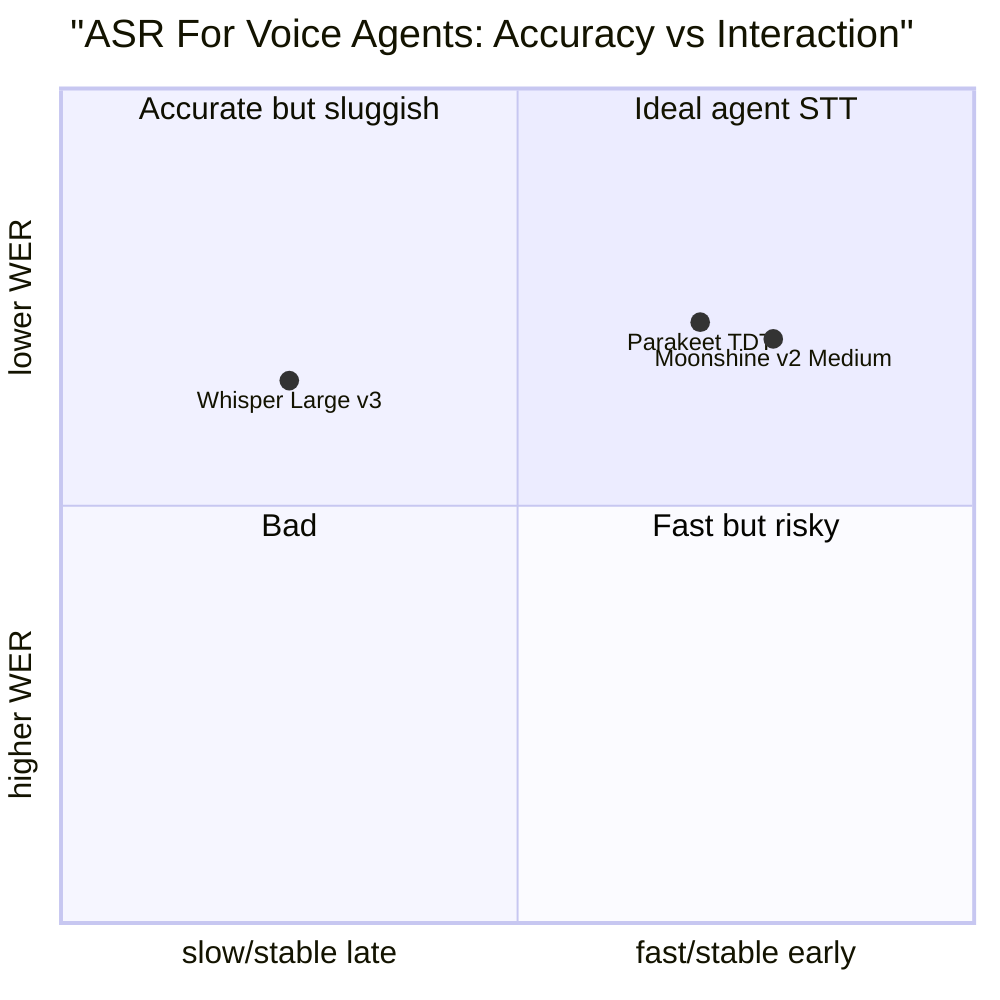

# Streaming STT Is Not Batch STT

Batch speech recognition asks: "What transcript can I produce for this audio file?" A real-time
voice agent asks a harder systems question: "What stable enough interpretation can I produce
soon enough for the agent to decide whether to speak, call tools, or keep listening?"

WER is still necessary. But WER alone is not a voice-agent metric. The question this insight
resolves is: what metrics, beyond WER, should a voice-agent builder track, and which models
have been measured on those metrics with enough rigor to trust the numbers?

## Source Map

| Ref      | Source                                                                                                | Local path                                                                                                                           | Role                                                                                                                                | Source quality                                                                |
| -------- | ----------------------------------------------------------------------------------------------------- | ------------------------------------------------------------------------------------------------------------------------------------ | ----------------------------------------------------------------------------------------------------------------------------------- | ----------------------------------------------------------------------------- |
| R-VA-001 | Local STT deep dive                                                                                   | `../STT-DEEP-DIVE.md`                                                                                                                | Existing WER/RTF/latency metric definitions and Whisper WER table.                                                                  | `practitioner signal` (compiles `paper evidence` from Whisper paper appendix) |
| R-VA-003 | Moonshine v2: Ergodic Streaming Encoder ASR for Latency-Critical Speech Applications                  | `../paper-text/moonshine-v2-2602.12241.txt`                                                                                          | Local response-latency and WER comparison with Whisper.                                                                             | `paper evidence`                                                              |
| R-VA-004 | Open ASR Leaderboard: Towards Reproducible and Transparent Multilingual Speech Recognition Evaluation | `../paper-text/open-asr-leaderboard-2510.06961.txt`                                                                                  | Reproducible WER/RTFx benchmark across ASR systems. Published by authors from Hugging Face, NVIDIA, Cambridge, Mistral, and OpenAI. | `benchmark evidence`                                                          |
| R-VA-020 | Deepgram Flux docs and launch post                                                                    | `../articles/deepgram-flux-quickstart.html`, `../articles/deepgram-flux-configuration.html`, `../articles/deepgram-flux-launch.html` | Provider view of streaming latency and EOT events.                                                                                  | Latency numbers: `vendor claim`; API parameters: `official-doc evidence`      |
| R-VA-026 | NVIDIA Parakeet TDT 0.6B v3 model card                                                                | URL in `../references.md`                                                                                                            | Current Parakeet v3 WER/RTFx values.                                                                                                | `official-doc evidence`                                                       |
| R-VA-030 | Whisper paper (Radford et al., 2022)                                                                  | `../paper-text/whisper-2212.04356.txt`                                                                                               | Baseline model trained on 680,000 hours; original WER numbers.                                                                      | `paper evidence`                                                              |

## What WER Measures And What It Hides

WER measures edit distance between transcript and reference at word level:

```text
WER = (substitutions + deletions + insertions) / reference_words
```

That is useful. It catches broad transcription quality. But voice agents need more:

- first partial latency;
- stability of partials;
- final transcript latency after speech stops;
- EOT precision/recall;
- domain-entity accuracy;
- language detection and code switching;
- timestamp accuracy;
- tail latency under concurrency;
- downstream task success.

A model can have lower average WER and still be worse for a voice agent if it emits stable
text too late. A model can have high RTFx in batch and still have poor interactive latency
if it processes long windows or waits for an endpoint.

## Open ASR Leaderboard: Useful, But Not The Whole Product

The Open ASR Leaderboard paper (`benchmark evidence`, R-VA-004) is valuable because it
standardizes WER and RTFx across many systems and datasets. The paper reports that 86 systems
were listed as of March 27, 2026, and 74 were open source.

Hardware context: all evaluation scripts were run on an NVIDIA A100-SXM4-80GB GPU (driver
560.28.03, CUDA 12.6), using a batch size of 64 whenever memory allowed, and reduced
adaptively (48, 32, 16, ...) when necessary. The paper states: "Although the absolute RTFx
values depend on the underlying hardware and can vary substantially across systems, all
measurements reported here are obtained under the same setup." This means RTFx values are
meaningful for relative comparison but do not transfer directly to other hardware.

Copied subset from the paper (Table 3 in the Open ASR Leaderboard paper, `benchmark evidence`):

| Model                          | Open | Avg. WER |         RTFx | Encoder       | Decoder     | Languages | Hardware       | Source   |
| ------------------------------ | ---- | -------: | -----------: | ------------- | ----------- | --------: | -------------- | -------- |
| Cohere Labs Transcribe         | Yes  |     5.42 |          525 | FastConformer | Transformer |        14 | A100-SXM4-80GB | R-VA-004 |
| NVIDIA Canary Qwen 2.5B        | Yes  |     5.63 |          418 | FastConformer | LLM         |         1 | A100-SXM4-80GB | R-VA-004 |
| Qwen3 ASR 1.7B                 | Yes  |     5.76 |          148 | Custom        | LLM         |        52 | A100-SXM4-80GB | R-VA-004 |
| NVIDIA Parakeet TDT 0.6B v2    | Yes  |     6.05 |         3390 | FastConformer | TDT         |         1 | A100-SXM4-80GB | R-VA-004 |
| NVIDIA Parakeet TDT 0.6B v3    | Yes  |     6.32 |         3330 | FastConformer | TDT         |        25 | A100-SXM4-80GB | R-VA-004 |
| Google Chirp v2                | No   |     6.42 | not reported | not listed    | not listed  |       468 | A100-SXM4-80GB | R-VA-004 |
| Mistral Voxtral Small 24B      | Yes  |     6.62 |         54.1 | Whisper-FT    | LLM         |         8 | A100-SXM4-80GB | R-VA-004 |
| OpenAI Whisper Large v3        | Yes  |     7.44 |          146 | Whisper       | Whisper     |        99 | A100-SXM4-80GB | R-VA-004 |
| OpenAI Whisper Large v3 Turbo  | Yes  |     7.83 |          200 | Whisper       | Whisper     |        99 | A100-SXM4-80GB | R-VA-004 |
| NVIDIA FastConformer CTC Large | Yes  |     8.96 |         6400 | FastConformer | CTC         |         1 | A100-SXM4-80GB | R-VA-004 |

The paper also notes that, restricting the comparison to models with transformer/LLM-based
decoders (10 Conformer-based and 22 Whisper-based), Conformer-based systems are on average
3.77x faster (average RTFx of 758 vs 201). This is a cross-architecture finding within the
same benchmark hardware, but only covers a subset of the 86 total systems.

Inference: throughput and accuracy form a Pareto surface, not one winner. TDT/CTC systems
can be very fast in RTFx. LLM-decoder systems can be more accurate but often slower. But
RTFx measures batch throughput on an A100, not "time from user stops speaking to agent can
act." The Open ASR Leaderboard does not measure streaming latency, partial stability, or
end-of-turn behavior.

## Moonshine v2: A Better Fit For The Live Question

Moonshine v2 (`paper evidence`, R-VA-003) defines response latency as the time between VAD
detecting the end of a speech segment and the returned transcript. That is closer to what a
voice agent needs than file throughput.

The paper reports Table 2 values. These were measured on an Apple MacBook M3
(`paper evidence`):

| Model               | Params | Response latency (ms) | Compute load (%) | Hardware | Source            |
| ------------------- | -----: | --------------------: | ---------------: | -------- | ----------------- |
| Moonshine v2 Tiny   |    34M |                    50 |             8.03 | Apple M3 | R-VA-003, Table 2 |
| Moonshine v2 Small  |   123M |                   148 |            17.97 | Apple M3 | R-VA-003, Table 2 |
| Moonshine v2 Medium |   245M |                   258 |            28.95 | Apple M3 | R-VA-003, Table 2 |
| Moonshine Tiny (v1) |     -- |                    27 |             5.91 | Apple M3 | R-VA-003, Table 2 |
| Moonshine Base (v1) |     -- |                    44 |             7.34 | Apple M3 | R-VA-003, Table 2 |
| Whisper Tiny        |    39M |                   289 |             8.46 | Apple M3 | R-VA-003, Table 2 |
| Whisper Base        |    74M |                   553 |            16.19 | Apple M3 | R-VA-003, Table 2 |
| Whisper Small       |   244M |                 1,940 |            56.84 | Apple M3 | R-VA-003, Table 2 |
| Whisper Large v3    | 1,550M |                11,286 |           330.65 | Apple M3 | R-VA-003, Table 2 |

The paper's own discussion says Moonshine v2 fills the lower parameter-count region for
memory-constrained edge processors. The paper states: "Moonshine v2 Tiny achieves 50 ms
latency (5.8x faster than Whisper Tiny), Moonshine v2 Small achieves 148 ms (13.1x faster
than Whisper Small), and Moonshine v2 Medium achieves 258 ms (43.7x faster than Whisper
Large v3)."

Inference: the Table 2 data supports the claim that architecture matters for interactive
latency. A streaming encoder and model shape designed for live use can matter more than
generic "best WER." However, these response-latency numbers are from a single hardware
platform (Apple M3) and measure a specific scenario (VAD end-of-speech to transcript
return), not full end-to-end voice-agent latency.

### Moonshine v2 WER (Table 3)

The paper also reports WER on Open ASR benchmarks (Table 3, `paper evidence`, R-VA-003).
These are per-dataset WER values for Moonshine v2 variants:

| Dataset           | Moonshine v2 Tiny (34M) WER | Moonshine v2 Small (123M) WER | Moonshine v2 Medium (245M) WER | Source            |
| ----------------- | --------------------------: | ----------------------------: | -----------------------------: | ----------------- |
| AMI               |                      19.03% |                        12.54% |                         10.68% | R-VA-003, Table 3 |
| Earnings-22       |                      20.27% |                        13.53% |                         11.90% | R-VA-003, Table 3 |
| GigaSpeech        |                      13.90% |                        10.41% |                          9.46% | R-VA-003, Table 3 |
| LibriSpeech clean |                       4.49% |                         2.49% |                          2.08% | R-VA-003, Table 3 |
| LibriSpeech other |                      12.09% |                         6.78% |                          5.00% | R-VA-003, Table 3 |
| SPGISpeech        |                       6.16% |                         3.19% |                          2.58% | R-VA-003, Table 3 |
| TED-LIUM          |                       6.12% |                         3.77% |                          2.99% | R-VA-003, Table 3 |
| VoxPopuli         |                      14.02% |                         9.98% |                          8.54% | R-VA-003, Table 3 |
| **Average**       |                  **12.01%** |                     **7.84%** |                      **6.65%** | R-VA-003, Table 3 |

### Whisper WER On LibriSpeech Clean

Keep Whisper accuracy context separate from the response-latency table. The local STT
deep dive (R-VA-001) compiles Whisper WER values originally from the Whisper paper appendix
(`paper evidence`, R-VA-030):

| Model                    | LibriSpeech clean WER | LibriSpeech other WER | Source                                           |
| ------------------------ | --------------------: | --------------------: | ------------------------------------------------ |
| Whisper Tiny (39M)       |                 7.54% |                17.15% | R-VA-001, originally R-VA-030 (`paper evidence`) |
| Whisper Base (74M)       |                 5.01% |                12.85% | R-VA-001, originally R-VA-030 (`paper evidence`) |
| Whisper Small (244M)     |                 3.43% |                 7.63% | R-VA-001, originally R-VA-030 (`paper evidence`) |
| Whisper Medium (769M)    |                 2.90% |                 5.90% | R-VA-001, originally R-VA-030 (`paper evidence`) |
| Whisper Large v3 (1.55B) |                 ~2.7% |                 ~4.5% | R-VA-001, originally R-VA-030 (`paper evidence`) |
| Whisper Turbo (809M)     |                 ~3.0% |                 ~5.0% | R-VA-001, originally R-VA-030 (`paper evidence`) |

These are useful clean-WER anchors, but they are not the same measurement as Moonshine's
live response latency. Comparing a Whisper WER column with a Moonshine response-latency
column conflates two independent measurements from different papers and different
experimental setups.

## Whisper: Still The Baseline, But Not Designed For This

The Whisper paper (`paper evidence`, R-VA-030) is still foundational. It trained on 680,000
hours of multilingual and multitask supervision and gave a robust open baseline. But
Whisper's original architecture and 30-second chunking assumptions are not the same as
turn-level streaming.

The local presentation can say:

- Whisper is the default mental baseline.
- faster-whisper/CTranslate2 made it much more practical.
- It is still not inherently a low-latency endpointing model.
- Using Whisper in a voice agent usually means wrapping it with VAD, chunking, buffering,
  and finalization heuristics.

This distinction matters because many demos "work" with Whisper but feel delayed or brittle.

## Deepgram Flux: Vendor Approach To End-of-Turn

Deepgram Flux is relevant because it makes end-of-turn an explicit product surface. The
documentation provides three configurable parameters (`official-doc evidence`, R-VA-020):

| Parameter             | Default | Range        | Role                                                           | Source quality          |
| --------------------- | ------- | ------------ | -------------------------------------------------------------- | ----------------------- |
| `eot_threshold`       | 0.7     | 0.5 -- 0.9   | Confidence threshold for EndOfTurn event                       | `official-doc evidence` |
| `eager_eot_threshold` | not set | 0.3 -- 0.9   | Earlier speculative EOT trigger; enables EagerEndOfTurn events | `official-doc evidence` |
| `eot_timeout_ms`      | 5000    | 500 -- 10000 | Silence timeout forcing EndOfTurn regardless of confidence     | `official-doc evidence` |

The quickstart page claims "~260ms end-of-turn detection" (`vendor claim`, R-VA-020). This
number is not accompanied by a benchmark methodology, dataset, hardware specification, or
percentile definition. It should be treated as a marketing claim until independently measured.

Inference: the parameter design is instructive regardless of whether the latency claim is
verified. Exposing eot_threshold and eager_eot_threshold as tunable knobs shows that
production STT vendors recognize turn detection as a first-class product surface, not just
an afterthought to WER. The eager/confirmed two-stage model (speculate early, confirm or
cancel) maps naturally to speculative LLM execution.

## Streaming STT Metrics For Voice Agents

The evaluation table for a real voice agent should include:

| Metric                     | Why it matters                                    | How to measure                                       |
| -------------------------- | ------------------------------------------------- | ---------------------------------------------------- |
| WER/CER                    | Base transcription quality.                       | Reference transcript comparison after normalization. |
| Entity WER                 | Names, product terms, numbers, codes.             | Domain entity extraction plus transcript alignment.  |
| Time to first partial      | Perceived responsiveness and speculative context. | Audio start -> first interim transcript.             |
| Partial churn              | Whether early text is stable enough to use.       | Edit distance between successive partials and final. |
| End-of-turn latency        | When LLM can start safely.                        | Human stop time -> EOT/stable final.                 |
| False EOT rate             | Interruptions.                                    | User-labeled incomplete turns marked complete.       |
| Missed EOT rate            | Dead air.                                         | Complete turns not closed within target.             |
| P95/P99 latency            | Tail frustration.                                 | Percentiles over calls, not just mean.               |
| Concurrency RTF/RTFx       | Cost and serving capacity.                        | Benchmark at expected stream count.                  |
| Telephony/noise robustness | Real users.                                       | 8 kHz, mu-law, packet loss, echo, background speech. |

## Chart Sketch



This is a conceptual sketch, not a chart from copied data. The axes represent qualitative
assessments of each model's positioning based on the evidence discussed above. A publishable
version should use:

- x-axis: measured EOT-to-final latency in Jarvis or a provider benchmark;
- y-axis: WER/entity WER on the target domain;
- bubble size: model footprint or cost.

## Engineering Inference

Pick STT by conversation behavior, not by clean benchmark rank.

For a local live presentation:

- Moonshine v2 is worth highlighting because it directly targets latency-critical local ASR.
  The paper measures the metric that matters most: response latency on consumer hardware.
- faster-whisper remains useful as the familiar baseline and broad ecosystem option.
- Parakeet/Canary/Qwen-style models should be discussed as accuracy/throughput leaders on
  the Open ASR Leaderboard (A100 batch benchmark), but not oversold as turn-taking
  solutions without local streaming measurements on comparable hardware.
- Deepgram Flux is relevant because it makes end-of-turn an explicit product surface, but
  the ~260ms EOT claim is a `vendor claim` without published methodology.

For production:

- create an audio test set from actual domain calls;
- label turn boundaries and entities, not just transcript text;
- measure P50/P95/P99 end-of-turn and final transcript latency;
- evaluate what happens when users interrupt, backchannel, pause mid-sentence, or speak
  in noise.

Inference: the Moonshine v2 response-latency data and the Open ASR WER/RTFx data
collectively show that "best ASR" depends on what you optimize for. A voice agent that
picks STT by Open ASR leaderboard rank alone will likely have suboptimal interactive
behavior, because RTFx on an A100 does not predict end-of-turn latency on the deployment
hardware.

## Non-Claims

- The Open ASR Leaderboard does not rank "best voice-agent STT." It measures batch WER and
  RTFx on A100 hardware. These are necessary but not sufficient metrics for voice agents.
- Moonshine v2 response-latency numbers are from Apple M3 hardware and do not prove best
  accuracy on all domains. They show edge-device interactive latency, not server throughput.
- RTFx is not the same as end-of-turn latency. RTFx measures how fast a model processes
  audio relative to real time in batch mode. End-of-turn latency measures how quickly the
  system decides the user has stopped speaking.
- WER on LibriSpeech clean does not predict noisy phone-call behavior. Human transcriber
  disagreement is ~4-5% WER, and LibriSpeech clean top models are below 2%.
- Cloud vendor latency claims (including Deepgram's ~260ms EOT) must be re-measured from the
  client environment with a defined methodology before being treated as evidence.
- Whisper WER values and Moonshine response-latency values cannot be directly compared in a
  single table because they measure different things under different conditions.

## Blog/Presentation Visual Candidates

- Scatter plot: WER vs response latency for Moonshine and Whisper from R-VA-003 Table 2.
  This is a clean within-paper comparison on the same hardware.
- Scatter plot: Open ASR WER vs RTFx for current top systems from R-VA-004. Note that this
  is on A100 hardware and measures batch throughput, not interactive latency.
- Metric glossary showing WER, RTFx, TTFT, final latency, EOT latency with directionality.
- Example transcript partial churn timeline (conceptual, no data source yet).
- Deepgram Flux parameter table as an example of how production STT exposes turn-detection
  knobs.

## References

- R-VA-001: `../STT-DEEP-DIVE.md`
- R-VA-003: `../paper-text/moonshine-v2-2602.12241.txt`, https://arxiv.org/abs/2602.12241
- R-VA-004: `../paper-text/open-asr-leaderboard-2510.06961.txt`, https://arxiv.org/abs/2510.06961
- R-VA-020: `../articles/deepgram-flux-quickstart.html`, `../articles/deepgram-flux-configuration.html`, `../articles/deepgram-flux-launch.html`, https://developers.deepgram.com/docs/flux/quickstart
- R-VA-026: see `../references.md`, https://huggingface.co/nvidia/parakeet-tdt-0.6b-v3
- R-VA-030: `../paper-text/whisper-2212.04356.txt`, https://arxiv.org/abs/2212.04356
- Data: `../data/stt_models.csv`
