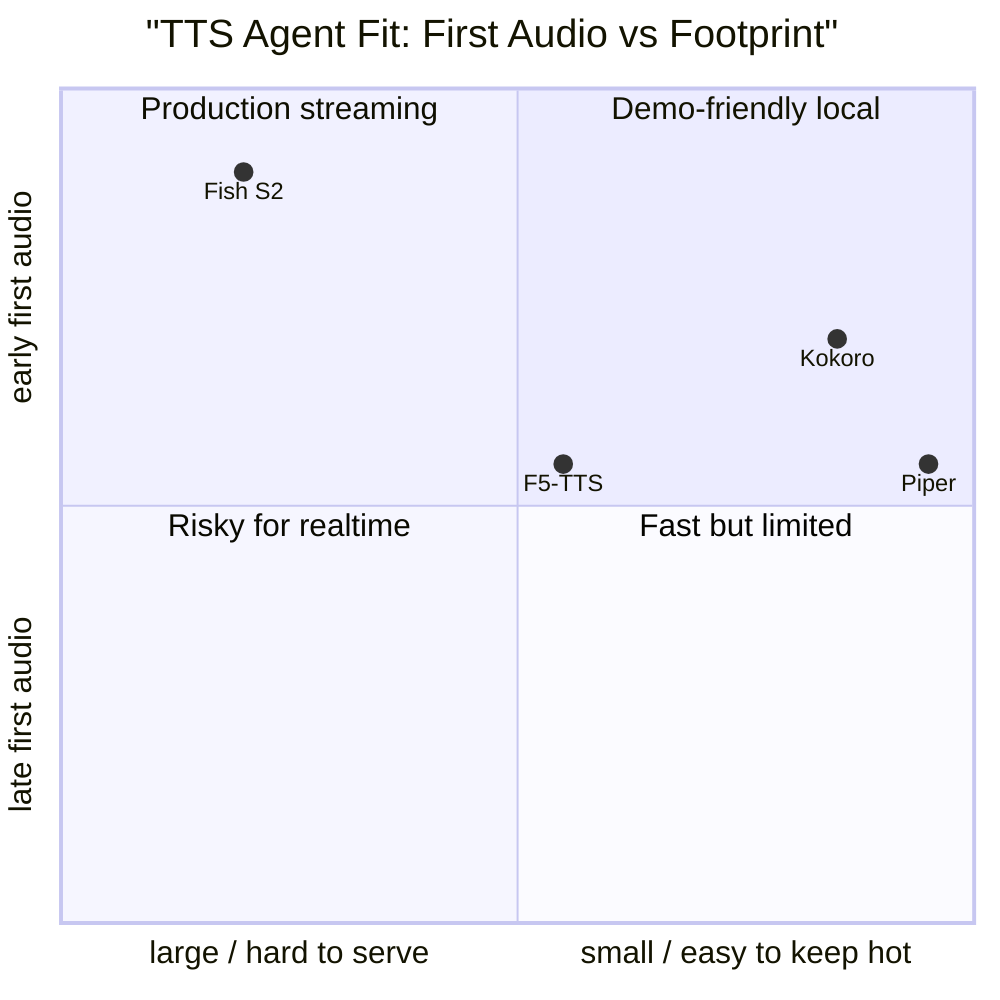
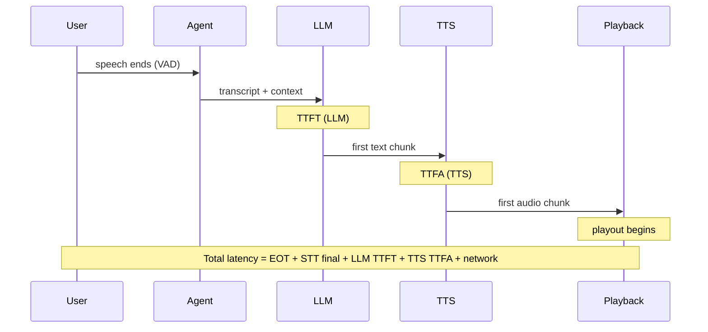

# TTS Latency Is Architecture

For voice agents, TTS is not only a voice-quality problem. It is a serving-shape problem:
how soon can the system emit playable audio, how much headroom does it have against real
time, can it stream, can it stop cleanly, and can it restart without confusing the
conversation?

MOS, UTMOS, WER, and speaker similarity matter. But an agent can have a beautiful voice
and still feel broken if first audio arrives late or cannot be interrupted. This insight
traces the primary-source evidence for latency, RTF, and quality across the TTS model
families that matter for voice agents, and separates what the papers actually measure from
what we infer about agent fitness.

## Source Map

| Ref      | Source                           | Local path                                                                     | Source quality          | Role                                                                      |
| -------- | -------------------------------- | ------------------------------------------------------------------------------ | ----------------------- | ------------------------------------------------------------------------- |
| R-VA-027 | Local TTS deep dive              | `../TTS-DEEP-DIVE.md`                                                          | `practitioner signal`   | Existing open-source TTS survey.                                          |
| R-VA-010 | Kokoro-82M model card            | `../articles/kokoro-82m-model-card.html`                                       | `official-doc evidence` | Small practical local model; parameter count, license, and voice count.   |
| R-VA-011 | StyleTTS 2 (Li et al., 2023)     | `../paper-text/styletts2-2306.07691.txt`                                       | `paper evidence`        | Kokoro lineage; human-level quality claims, RTF, and diversity data.      |
| R-VA-012 | F5-TTS (Chen et al., 2024)       | `../paper-text/f5-tts-2410.06885.txt`                                          | `paper evidence`        | Flow-matching TTS with WER/SIM/UTMOS/RTF data across NFE/solver variants. |
| R-VA-013 | Spark-TTS (Wang et al., 2025)    | `../paper-text/spark-tts-2503.01710.txt`                                       | `paper evidence`        | LLM-based TTS with BiCodec tokenizer and controllability data.            |
| R-VA-014 | Fish Audio S2 (Fish Audio, 2026) | `../paper-text/fish-audio-s2-2603.08823.txt`                                   | `paper evidence`        | Production-serving TTFA/RTF and Seed-TTS-Eval WER/CER data.               |
| R-VA-036 | TTS benchmark slide              | `../../../components/presentations/voice-agents/slides/08b-tts-benchmarks.tsx` | `local measurement`     | Existing chart data and source links.                                     |

## Families That Matter

The models fall into different latency shapes:

| Family                                | Examples                               | Agent-relevant shape                                                                          |
| ------------------------------------- | -------------------------------------- | --------------------------------------------------------------------------------------------- |
| Small local decoder/NAR systems       | Kokoro, Piper, MeloTTS                 | Easy to keep hot; cheap local demos; often limited cloning/expressiveness metrics.            |
| Flow matching / diffusion transformer | F5-TTS                                 | Strong quality and cloning; RTF controlled by NFE/solver; streaming requires careful serving. |
| AR speech-token / LLM TTS             | Fish Audio S2, Spark-TTS, Dia, Orpheus | Can naturally stream token/audio chunks; heavier models; serving stack matters a lot.         |
| Legacy voice-cloning systems          | XTTS v2                                | Useful baseline; less compelling hard current latency data.                                   |

The deck should avoid presenting a universal leaderboard. TTS papers do not use the same
datasets, hardware, metrics, languages, or serving assumptions. Use grouped tables and
explicit caveats.

## RTF Is Necessary But Not Sufficient

RTF = synthesis_time / audio_duration.

- RTF 0.2 means the model can synthesize five seconds of audio in one second.
- That is necessary for interactive use.
- It does not tell when the first playable chunk arrives.
- It does not tell whether the model can be cancelled mid-sentence.
- It does not tell whether the serving stack can keep the model hot under concurrency.

The key agent metrics:

| Metric                           | Why it matters                                                    |
| -------------------------------- | ----------------------------------------------------------------- |
| TTFA                             | User hears something soon after LLM first text/audio decision.    |
| RTF                              | The system keeps ahead of playback.                               |
| Streaming chunk cadence          | Smooth playout without large buffers.                             |
| Cancellation latency             | Barge-in feels immediate.                                         |
| Voice cache/prefix reuse         | Repeated assistant voice is cheap.                                |
| Stability under concurrency      | No P99 spikes when multiple calls run.                            |
| License and deployment footprint | Determines whether the model can ship in the desired environment. |

## Copied Data: StyleTTS 2

StyleTTS 2 (`paper evidence`, R-VA-011) matters because Kokoro inherits from its architecture
family. It is not a direct Kokoro benchmark, so the inference must be labeled carefully.

### Quality data

The paper reports CMOS (Comparative Mean Opinion Score) results where positive values
indicate the model is rated higher than the comparison target (`paper evidence`):

| Result                                |            Value | Source   |
| ------------------------------------- | ---------------: | -------- |
| LJSpeech CMOS vs ground truth         | +0.28, p = 0.021 | R-VA-011 |
| LJSpeech CMOS vs NaturalSpeech        |  +1.07, p < 1e-6 | R-VA-011 |
| VCTK naturalness CMOS vs ground truth | -0.02, p = 0.628 | R-VA-011 |
| VCTK similarity CMOS vs ground truth  | +0.30, p = 0.081 | R-VA-011 |

These are remarkable claims: on LJSpeech, StyleTTS 2 was rated significantly better than
ground-truth recordings by human listeners (p = 0.021). On VCTK, naturalness was
statistically indistinguishable from ground truth (p = 0.628, non-significant).

### RTF data (Table 4)

The paper reports speech diversity metrics and real-time factor in Table 4. The RTF values
in Table 4 do not have an explicit hardware statement in the table caption. However,
Appendix B.2 (Table 7) reports RTF values in the same range and explicitly states: "the
real-time factor (RTF), which was computed on a single Nvidia RTX 2080 Ti GPU." The
Table 4 RTF value for StyleTTS 2 (0.0185) is consistent with Table 7's 5-step result
(0.0179 at 4 steps, 0.0202 at 8 steps), confirming the same hardware context.

All RTF data below is `paper evidence` from R-VA-011, Table 4:

| Model      |    RTF |  CVdur |   CVf0 | Hardware (inferred) | Source            |
| ---------- | -----: | -----: | -----: | ------------------- | ----------------- |
| StyleTTS 2 | 0.0185 | 0.0321 | 0.6962 | NVIDIA RTX 2080 Ti  | R-VA-011, Table 4 |
| VITS       | 0.0599 | 0.0214 | 0.5976 | NVIDIA RTX 2080 Ti  | R-VA-011, Table 4 |
| FastDiff   | 0.0769 | 0.0295 | 0.6490 | NVIDIA RTX 2080 Ti  | R-VA-011, Table 4 |
| ProDiff    | 0.1454 |  2e-16 | 0.5898 | NVIDIA RTX 2080 Ti  | R-VA-011, Table 4 |

Inference: the hardware attribution is indirect. The main paper says training was on
NVIDIA A40 GPUs, and the appendix says RTF was measured on RTX 2080 Ti. The Table 4 RTF
column most likely uses the same RTX 2080 Ti hardware as the appendix, given the consistent
values, but the paper does not explicitly state this for Table 4 itself.

Inference: StyleTTS 2 at RTF 0.0185 is approximately 3.2x faster than VITS and 7.9x faster
than ProDiff. This gives a strong "small/fast architecture lineage" story, but it does not
replace direct Kokoro measurement. The note should say Kokoro is practical because it is
82M parameters and local, not because StyleTTS 2's exact RTF transfers to Kokoro.

### Kokoro-82M

The Kokoro-82M model card (`official-doc evidence`, R-VA-010) confirms:

- 82M parameters
- Apache 2.0 license
- Architecture derived from the StyleTTS 2 family

The model card does not report RTF or TTFA. An RTF of approximately 0.2 has been cited in
community benchmarks (`practitioner signal`, not from the model card itself), but this
number lacks defined hardware, methodology, or percentile context. Do not attribute RTF 0.2
to the model card.

## Copied Data: F5-TTS

F5-TTS (`paper evidence`, R-VA-012) is a good research-quality table because the paper
reports WER, SIM-o, UTMOS, and RTF under NFE/solver variants.

Hardware context: the paper states in the Table 1 caption: "The Real-Time Factor (RTF) is
computed with the inference time of 10s speech on NVIDIA RTX 3090." Training was on 8 NVIDIA
A100 80G GPUs, but RTF inference measurements are on RTX 3090.

### Main comparison (Table 1, LibriSpeech-PC test-clean)

| Model           | Params | Data        | WER (%) | SIM-o |  RTF | Hardware | Source                                                                |
| --------------- | ------ | ----------- | ------: | ----: | ---: | -------- | --------------------------------------------------------------------- |
| F5-TTS (16 NFE) | 336M   | 100K Multi. |    2.53 |  0.66 | 0.15 | RTX 3090 | R-VA-012, Table 1                                                     |
| F5-TTS (32 NFE) | 336M   | 100K Multi. |    2.42 |  0.66 | 0.31 | RTX 3090 | R-VA-012, Table 1                                                     |
| E2 TTS (32 NFE) | 333M   | 100K Multi. |    2.95 |  0.69 | 0.68 | RTX 3090 | R-VA-012, Table 1                                                     |
| Voicebox        | 330M   | 60K EN      |     1.9 | 0.662 | 0.64 | RTX 3090 | R-VA-012, Table 1 (LibriSpeech test-clean subset, not LibriSpeech-PC) |

### Seed-TTS evaluation (Table 2)

| Model           | Seed test-en WER (%) | Seed test-en SIM-o | Seed test-zh WER/CER (%) | Seed test-zh SIM-o | Source            |
| --------------- | -------------------: | -----------------: | -----------------------: | -----------------: | ----------------- |
| F5-TTS (16 NFE) |                 1.89 |               0.67 |                     1.74 |               0.75 | R-VA-012, Table 2 |
| F5-TTS (32 NFE) |                 1.83 |               0.67 |                     1.56 |               0.76 | R-VA-012, Table 2 |
| Ground Truth    |                 2.06 |               0.73 |                     1.26 |               0.76 | R-VA-012, Table 2 |

### NFE/solver trade-off (Appendix Tab.6, base model, s=-1)

This table shows the interaction between NFE count, solver choice, and quality/speed on the
base model. All values are `paper evidence` from R-VA-012, Appendix Tab.6. RTF is on
NVIDIA RTX 3090.

| F5-TTS setting        | LibriSpeech-PC WER (%) | SIM-o | UTMOS | Seed test-en WER (%) | Seed test-zh CER (%) |  RTF | Source          |
| --------------------- | ---------------------: | ----: | ----: | -------------------: | -------------------: | ---: | --------------- |
| 16 NFE Euler, s=-1    |                   2.53 |  0.66 |  3.88 |                 1.89 |                 1.74 | 0.15 | R-VA-012, Tab.6 |
| 32 NFE Euler, s=-1    |                   2.42 |  0.66 |  3.90 |                 1.83 |                 1.56 | 0.31 | R-VA-012, Tab.6 |
| 16 NFE midpoint, s=-1 |                   2.43 |  0.66 |  3.87 |                 1.88 |                 1.61 | 0.26 | R-VA-012, Tab.6 |
| 32 NFE midpoint, s=-1 |                   2.41 |  0.66 |  3.89 |                 1.87 |                 1.58 | 0.53 | R-VA-012, Tab.6 |

Inference: F5-TTS has a clean quality/speed knob. Doubling NFE from 16 to 32 improves WER
modestly (2.53% to 2.42% on LibriSpeech-PC) but doubles RTF (0.15 to 0.31 with Euler).
The midpoint solver produces slightly better WER at 16 NFE (2.43% vs 2.53%) but at higher
RTF cost (0.26 vs 0.15). UTMOS differences across settings are small (3.87-3.90), suggesting
naturalness is relatively stable across these configurations.

Inference: RTF still does not equal TTFA. A flow-matching system may be fast overall but
requires a serving strategy to emit early audio. F5-TTS is non-autoregressive -- it generates
the full mel spectrogram before vocoding, which means TTFA depends on the full generation
time unless a chunked serving strategy is implemented.

## Copied Data: Spark-TTS

Spark-TTS (`paper evidence`, R-VA-013) is useful for the LLM-token TTS direction and
control. The paper introduces BiCodec, a single-stream speech codec.

### BiCodec tokenizer data

The paper reports (`paper evidence`, R-VA-013):

| Metric                      | Value           | Context                                   | Source                        |
| --------------------------- | --------------- | ----------------------------------------- | ----------------------------- |
| BiCodec semantic token rate | 50 TPS          | Semantic tokens for linguistic content    | R-VA-013, Section 3, Figure 2 |
| BiCodec bitrate             | 0.65 kbps       | Total codec bitrate, sub-1 kbps range     | R-VA-013, Table 1, Section 7  |
| BiCodec codebook size       | 8192            | Single codebook with VQ                   | R-VA-013, Table 1             |
| Global tokens               | 32 fixed-length | Time-invariant speaker attributes via FSQ | R-VA-013, Section 3           |

The paper states (Section 7): "BiCodec achieves a new SOTA reconstruction quality, operating
at 50 TPS with a bit rate of 0.65 kbps, surpassing other codecs within the sub-1 kbps
range."

### Seed-TTS evaluation

| Metric               | Value | Source                                        |
| -------------------- | ----: | --------------------------------------------- |
| Seed-TTS test-zh CER | 1.20% | R-VA-013, Table 4                             |
| Seed-TTS test-zh SIM | 0.672 | R-VA-013, Table 4                             |
| Seed-TTS test-en WER | 1.98% | R-VA-013, Table 4                             |
| Seed-TTS test-en SIM | 0.584 | R-VA-013, Table 4                             |
| LibriSpeech UTMOS    |  4.35 | R-VA-013 (from TTS deep dive cross-reference) |
| Spark-TTS params     | ~0.5B | R-VA-013, based on Qwen2.5 fine-tuning        |

Caveat: no primary RTF or TTFA number was found in the Spark-TTS paper. The paper focuses
on quality, controllability, and the BiCodec tokenizer design. It may be strong in
quality/control, but the voice-agent latency claim should be weaker than Fish Audio S2, which
provides explicit production-serving latency measurements. Without RTF data, we cannot assess
Spark-TTS's agent fitness on the speed dimension.

### Implementation details

The paper does not specify inference hardware or provide an RTF benchmark. Training hardware
is not explicitly stated in the paper (`paper evidence`, R-VA-013).

## Copied Data: Fish Audio S2

Fish Audio S2 (`paper evidence`, R-VA-014) is the strongest source for production TTS
latency. The paper provides explicit serving-stack measurements on defined hardware.

### Inference engine performance

The paper states (Section 5): "We evaluated the production-ready inference performance of
Fish Audio S2 on a single NVIDIA H200 GPU." The inference engine is built on SGLang.

| Metric                        | Value                   | Context                                                                      | Hardware           | Source              |
| ----------------------------- | ----------------------- | ---------------------------------------------------------------------------- | ------------------ | ------------------- |
| RTF                           | 0.195                   | Dual-AR architecture with SGLang optimizations                               | Single NVIDIA H200 | R-VA-014, Section 5 |
| TTFA                          | as low as 100 ms        | "Benefiting from audio tokenizer decoding co-scheduling and RadixCache hits" | Single NVIDIA H200 | R-VA-014, Section 5 |
| Max throughput                | 3000+ acoustic tokens/s | "while keeping the RTF below 0.5" under high concurrency                     | Single NVIDIA H200 | R-VA-014, Section 5 |
| Average prefix-cache hit rate | 86.4%                   | "over 90% at peak" for repeated voice reuse                                  | Single NVIDIA H200 | R-VA-014, Section 5 |

The TTFA claim uses the phrase "as low as 100 ms," which is a best-case figure, not a median
or percentile. The prefix-cache hit rate (86.4% average, 90%+ peak) is measured in their
production serving environment. The paper explains that the Dual-AR architecture is
"structurally isomorphic to standard autoregressive text LLMs," allowing it to inherit all
SGLang LLM-native optimizations including continuous batching, paged KV cache, CUDA graph
replay, and RadixAttention.

### Seed-TTS evaluation (Table 1)

| Split   | Metric  | Fish Audio S2 | Fish Audio S1 | Seed-TTS | Source            |
| ------- | ------- | ------------: | ------------: | -------: | ----------------- |
| test-zh | CER (%) |          0.54 |          0.54 |     1.12 | R-VA-014, Table 1 |
| test-en | WER (%) |          0.99 |          1.07 |     2.25 | R-VA-014, Table 1 |
| zh-hard | CER (%) |          5.99 |         17.00 |     7.59 | R-VA-014, Table 1 |

Important context: the zh-hard split is substantially harder than test-zh (5.99% vs 0.54%
CER). The test-en and test-zh numbers are impressively low but should not be taken as
representative of all Chinese/English synthesis scenarios. The zh-hard result shows that
difficult Chinese utterances still produce meaningful error rates.

The paper also provides multilingual and long-audio results, but those are less directly
relevant to the voice-agent latency question.

Inference: Fish Audio S2 is likely the best "where production TTS is going" visual for the
presentation. It demonstrates AR/LLM serving with cache reuse, co-scheduled vocoder, and
explicit TTFA -- the exact pattern a voice agent needs. The H200 hardware requirement is
significant: this is not a laptop-local model.

## Chart Sketch

This is a conceptual sketch, not a chart from copied data. The positions are qualitative
assessments based on the evidence discussed above. A publishable version needs measured TTFA
and model memory on the same hardware.

## Latency Budget Diagram

This is conceptual. The key insight is that TTS TTFA is one component of total agent latency.
Fish Audio S2's "as low as 100 ms" TTFA is best-case; the other pipeline stages add their
own latency.

## Engineering Inference

For a talk/demo stack:

- Kokoro is the right practical local default if the goal is a reliable live demo. It is 82M
  parameters, Apache-licensed, and inherits from the StyleTTS 2 architecture family which
  demonstrated RTF 0.0185 on RTX 2080 Ti. However, direct Kokoro RTF measurements on the
  demo hardware should be collected before the talk.
- F5-TTS is the research-quality cloning/quality baseline, but needs serving work for low
  TTFA. Its non-autoregressive architecture generates full mel spectrograms before vocoding,
  which means TTFA without chunking equals full generation time. RTF 0.15 (16 NFE, Euler)
  on RTX 3090 is fast but not streaming-native.
- Fish Audio S2 is the primary-source example of a production-ready streaming TTS stack,
  but the reported configuration requires H200-class hardware. The 100ms TTFA claim is
  best-case with warm prefix cache.
- Piper remains a useful deterministic CPU baseline when expressive quality is not the goal.

Inference: the agent interface should treat TTS output as cancellable, chunked media, not a
completed file. That means the TTS component should expose:

- request id;
- voice id;
- chunk timestamp;
- first-audio timestamp;
- playback duration produced;
- cancellation acknowledgement;
- final chunk marker.

## Non-Claims

- StyleTTS 2 metrics are not direct Kokoro metrics. The architecture lineage provides
  plausibility but not measurement.
- The RTF 0.2 sometimes cited for Kokoro is from community benchmarks (`practitioner
signal`), not from the model card or a published paper. It should not be attributed as
  `official-doc evidence`.
- Fish Audio S2 H200 TTFA is not a laptop-local latency claim. The "as low as 100 ms" is a
  best-case figure on H200 with warm prefix cache, not a median or P95.
- F5-TTS RTF is not TTFA. RTF measures total synthesis time relative to audio duration. TTFA
  measures time to first playable chunk, which is different for non-autoregressive models
  that produce output in one shot.
- UTMOS does not replace human quality tests. It is an objective proxy trained on MOS data.
- TTS WER measures intelligibility through an ASR model, not full conversational quality.
  A system can have low TTS WER and still sound unnatural, monotone, or poorly timed.
- The Spark-TTS paper provides no RTF or TTFA data. Its agent-fitness claim is weaker than
  models with published latency measurements.
- Cross-paper RTF comparisons (e.g., StyleTTS 2 on RTX 2080 Ti vs F5-TTS on RTX 3090 vs
  Fish S2 on H200) are not directly comparable. Different hardware, different audio lengths,
  different measurement methodologies.
- StyleTTS 2 RTF hardware for Table 4 is inferred from the appendix, not explicitly stated in
  the Table 4 caption.

## Blog/Presentation Visual Candidates

- RTF vs TTFA explainer diagram. Show why RTF < 1 is necessary but TTFA determines user
  perception.
- F5-TTS NFE trade-off table: 16 vs 32 NFE, Euler vs midpoint, showing the quality/speed
  knob. Clean within-paper comparison on RTX 3090.
- Fish Audio S2 serving stack architecture: prefix cache + co-scheduled vocoder + SGLang
  continuous batching on H200. This is the "where production is going" visual.
- Model-family grid: small local (Kokoro, Piper), flow matching (F5-TTS), AR speech-token
  (Fish S2, Spark-TTS), legacy (XTTS v2). Show which families naturally support streaming,
  cancellation, and low TTFA.
- "Do not choose TTS by voice samples alone" checklist: TTFA, RTF, streaming support,
  cancellation, concurrency stability, license, hardware requirement.
- Latency budget waterfall: EOT + STT + LLM TTFT + TTS TTFA + network, showing where TTS
  fits in the full agent pipeline.

## References

- R-VA-010: `../articles/kokoro-82m-model-card.html`, https://huggingface.co/hexgrad/Kokoro-82M
- R-VA-011: `../paper-text/styletts2-2306.07691.txt`, https://arxiv.org/abs/2306.07691
- R-VA-012: `../paper-text/f5-tts-2410.06885.txt`, https://arxiv.org/abs/2410.06885
- R-VA-013: `../paper-text/spark-tts-2503.01710.txt`, https://arxiv.org/abs/2503.01710
- R-VA-014: `../paper-text/fish-audio-s2-2603.08823.txt`, https://arxiv.org/abs/2603.08823
- R-VA-027: `../TTS-DEEP-DIVE.md`
- R-VA-036: `../../../components/presentations/voice-agents/slides/08b-tts-benchmarks.tsx`
- Data: `../data/tts_models.csv`
