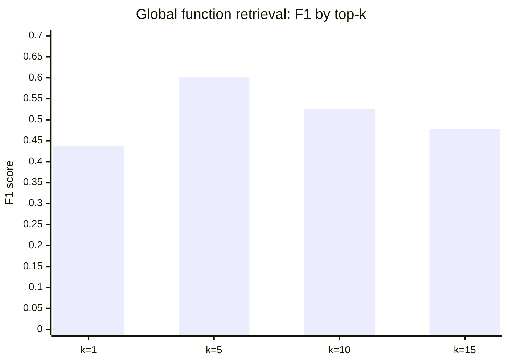

# INSIGHT 16: More Context Can Hurt

Irrelevant context does not merely waste tokens and cost. It actively degrades agent task success.
The evidence comes from four independent studies that converge on the same mechanism: models
struggle to extract signal from noise, and the failure mode is not graceful degradation but
measurable performance drops. This is not an argument for less documentation. It is an argument
for layered, scoped, retrievable documentation where the agent receives the minimal relevant
context for the task at hand.

## Source map

| Ref | Source                                                          | Local text                                               | Source quality | Role in this insight                                                                                            |
| --- | --------------------------------------------------------------- | -------------------------------------------------------- | -------------- | --------------------------------------------------------------------------------------------------------------- |
| R18 | Evaluating AGENTS.md (Gloaguen et al., ETH Zurich, 2026)        | `paper-text/evaluating-agents-md-2602.11988.txt`         | paper evidence | Primary. Controlled experiment showing LLM-generated context files reduce success and increase cost.            |
| R64 | A3-CodGen (Liao et al., 2024)                                   | `paper-text/a3-codgen-2312.05772.txt`                    | paper evidence | Shows global context retrieval has a non-monotonic quality curve: too many retrieved functions hurt.            |
| R49 | How Does Chunking Affect RAG Code Completion? (Wu et al., 2026) | `paper-text/chunking-rag-code-completion-2605.04763.txt` | paper evidence | Shows function-level chunking underperforms, and cross-file context length matters more than chunk granularity. |
| R32 | Lost in the Middle (Liu et al., Stanford, 2023)                 | `paper-text/lost-in-the-middle-2307.03172.txt`           | paper evidence | Shows positional degradation in long contexts; models miss information in the middle of long inputs.            |

---

## Paper-by-paper discussion

### R18: Evaluating AGENTS.md

This is the strongest direct evidence. Gloaguen et al. (ETH Zurich, 2026) built AGENT BENCH, a
138-instance benchmark from 12 open-source repositories that contain developer-written context
files. They evaluated four coding agents (Claude Code with Sonnet-4.5, Codex with GPT-5.2,
Codex with GPT-5.1 Mini, QwenCode with Qwen3-30B) in three settings: no context file, LLM-generated
context file, and developer-provided context file.

The result that matters: LLM-generated context files reduced resolution rates by 0.5% (SWE-bench
Lite) and 2% (AGENT BENCH) on average while increasing cost by 20-23%. Developer-provided files
improved performance by only 4% on average. The behavioral analysis shows context files encouraged
broader exploration and more testing, consuming agent interaction budget without proportional payoff.

Methods: Controlled A/B evaluation across multiple agents and models. Each context file setting
is tested on the same instances. Success = generated patch passes all tests.

Limitations: The benchmark is Python-only. The context files were generated using recommended
initialization commands from each agent vendor, which may not represent best-practice authorship.
The developer-written files vary in quality across the 12 repositories.

### R64: A3-CodGen

A3-CodGen provides the most controlled evidence for the "too much global context hurts" claim
within a single study. The paper explores optimal retrieval of global functions for repository-level
code generation.

The key RQ2 result: the optimal top-k for global function retrieval is k=5 (approximately 8
retrieved functions on average). At k=10, F1 drops 12.48%. At k=15, performance decreases further.
The paper explicitly states: "the overdosed amount (between 10 to 20 functions) of functions is
retrieved, introducing excessive interference and hindering accurate reusing."

For local context, the same pattern appears at the knowledge-type level: adding Module Variables
to the context caused an 11.87% drop in precision. The best local configuration was Local Functions

- Class Instance Attributes only -- not all four available knowledge types.

Methods: Controlled ablation on a 383-function benchmark from 29 PyPI repositories. Foundation
model: GPT-3.5-Turbo-16k.

Limitations: Single model, single language (Python), relatively small benchmark by today's
standards. The optimal k likely depends on model capacity and context window size.

### R49: Chunking study

Wu et al. (2026) ran 864 experimental settings crossing 4 chunking strategies, 4 retrievers,
5 generators, and 9 parameter configurations on RepoEval and CrossCodeEval. The findings
relevant to this insight:

1. Function chunking underperforms all other strategies by 3.57-5.64 pp Exact Match on RepoEval
   (Cliff's delta = -1.0). Function chunks are never Pareto-optimal on cost-quality tradeoff.
2. Cross-file context length is the dominant parameter: doubling from 2,048 to 8,192 tokens yields
   up to 4.2 pp EM gain.
3. Chunk size has a weaker, non-monotonic effect (at most 1.9 pp).

The function-chunking result is counter-intuitive. Function-level granularity seems like it should
be the "natural" code unit, but it loses cross-function context that sliding window and cAST
preserve. The inference: the "right" context unit is not always the semantically cleanest unit.
It is the one that preserves enough surrounding signal for the task.

Methods: Controlled empirical study with full factorial design. Statistical significance tested.

Limitations: Python-only benchmarks (RepoEval, CrossCodeEval). Code completion task, not
issue resolution or feature implementation. The optimal context length may differ for other tasks.

### R32: Lost in the Middle

Liu et al. (Stanford, 2023) established the U-shaped performance curve for long-context models.
Models perform best when relevant information is at the beginning or end of the context, and
significantly worse when it is in the middle.

The key finding for this insight: GPT-3.5-Turbo's multi-document QA performance when relevant
information is placed in the middle (56.1%) can be lower than its closed-book performance (no
documents at all). Extended-context models are not necessarily better at using their context.

Methods: Controlled experiments varying context size and position of relevant information.
Multi-document QA and key-value retrieval tasks.

Limitations: This paper is from 2023 and tested GPT-3.5-Turbo, Claude-1.3, MPT-30B-Instruct, and
LongChat-13B. Newer models (GPT-4, Claude 3+) may handle positional retrieval better. However,
the underlying mechanism (attention dilution in long contexts) remains relevant, and more recent
work (R40, Coding Agents are Effective Long-Context Processors) shows agents still benefit from
tool-based context management over raw long-context feeding.

---

## Data tables

### Evaluating AGENTS.md: resolution rate and cost changes

| Setting                        |     SWE-bench Lite avg resolution | AGENT BENCH avg resolution | Avg cost increase |
| ------------------------------ | --------------------------------: | -------------------------: | ----------------: |
| No context file (baseline)     |                   varies by agent |            varies by agent |                -- |
| LLM-generated context file     |                       -0.5 pp avg |                -2.0 pp avg |           +20-23% |
| Developer-written context file | N/A (not available for SWE-bench) |                    +4% avg |           +20-23% |

Source: R18, Section 4.2, Table 2, Figure 3.

### A3-CodGen: global function retrieval by top-k

|         Top-k | Avg retrieved functions | Precision | Recall |    F1 | Accuracy |
| ------------: | ----------------------: | --------: | -----: | ----: | -------: |
| 0 (no global) |                     N/A |       N/A |    N/A |   N/A |    0.843 |
|             1 |                   1.757 |     0.372 |  0.533 | 0.438 |    0.786 |
|             5 |                   8.154 |     0.518 |  0.717 | 0.601 |    0.851 |
|            10 |                  16.031 |     0.479 |  0.583 | 0.526 |    0.836 |
|            15 |                  23.592 |     0.407 |  0.583 | 0.479 |    0.802 |

Source: R64, Table II. Units: precision/recall/F1/accuracy are fractions (0-1).

The peak at k=5 and subsequent decline is the table to show in the talk. The visual argument:
retrieval helps, but retrieval of irrelevant candidates actively hurts.

### Chunking study: function chunks vs others (RepoEval)

| Chunking strategy | Exact Match (EM) relative to best | Cost-quality Pareto optimal? |
| ----------------- | --------------------------------: | ---------------------------- |
| Sliding Window    |                         reference | Yes                          |
| cAST              |             within 2.1 pp of best | Yes                          |
| Declaration       |             within 2.1 pp of best | No                           |
| Function          |                 -3.57 to -5.64 pp | Never                        |

Source: R49, Section findings summary.

### Cross-file context length effect (chunking study)

| Context length (tokens) | EM gain over 2,048 baseline |
| ----------------------: | --------------------------: |
|                   2,048 |                    baseline |
|                   4,096 |                 up to ~2 pp |
|                   8,192 |                up to 4.2 pp |

Source: R49. Units: percentage points of Exact Match.

---

## Chart sketch: A3-CodGen global retrieval curve

The visual argument: there is a clear peak at k=5 (approximately 8 retrieved functions). Beyond
that, more context means more noise and worse performance. This is the same "selective slice"
pattern seen in RepoGraph (INSIGHT 21) where 2-hop flat context performed worse than 1-hop.

---

## Inference for "code AI agents love"

The convergent finding across these papers is:

> The right amount of context is not "all available context." It is the minimal set of relevant
> artifacts for the current task, retrieved selectively and placed where the model can use them.

For practitioners structuring codebases for agents:

1. Keep root `AGENTS.md` / `CLAUDE.md` minimal: only durable, mandatory facts (build commands,
   test commands, style rules that never change). The R18 result shows that LLM-generated
   comprehensive context files hurt more than they help.

2. Use scoped, layered documentation: package-level READMEs, directory-level instructions,
   function-level docstrings. Let the agent retrieve the layer relevant to its current task.

3. Design modules so relevant context is compact and local: if a module's API surface is small
   and well-typed, the agent needs fewer retrieved files to understand how to use it.

4. Prefer structured retrieval over bulk inclusion: callers, callees, tests, examples, and
   contracts are more useful than "all files in the same package."

5. Monitor context cost: if agent inference cost is rising without proportional success gains,
   the context pipeline is likely feeding noise.

---

## What this does not prove

- This does not prove documentation is harmful. It proves _irrelevant_ documentation in the
  working context is harmful. The distinction matters.

- This does not prove smaller context windows are better. The chunking study shows that more
  cross-file context (2,048 to 8,192 tokens) improves results when the content is relevant.

- This does not prove AGENTS.md files are useless. R18 shows developer-written context files
  provide a small positive effect (+4%) on AGENT BENCH. The problem is LLM-generated comprehensive
  files, not carefully authored minimal guidance.

- This does not prove the optimal k=5 from A3-CodGen generalizes to all models and tasks. Larger
  models with better attention may tolerate more retrieved context. But the shape of the curve
  (peak then decline) is consistent across studies.

- Lost in the Middle was tested on 2023 models. Positional sensitivity may have improved since
  then. However, the broader mechanism (attention dilution with irrelevant content) remains
  relevant for any transformer-based system.

---

## Blog visual candidates

1. A3-CodGen F1 curve: bar chart showing the peak at k=5 and decline at k=10, k=15.
2. Evaluating AGENTS.md cost chart: cost increases 20-23% with context files, performance flat
   or negative.
3. A "context budget" conceptual diagram: small targeted context (callers, types, tests) vs
   large undifferentiated context dump.
4. Side-by-side: "what the agent needs" (5 relevant files) vs "what it gets" (50 files from a
   comprehensive context file).

---

## References

- R18: Evaluating AGENTS.md, `paper-text/evaluating-agents-md-2602.11988.txt`
- R32: Lost in the Middle, `paper-text/lost-in-the-middle-2307.03172.txt`
- R49: How Does Chunking Affect RAG Code Completion?, `paper-text/chunking-rag-code-completion-2605.04763.txt`
- R64: A3-CodGen, `paper-text/a3-codgen-2312.05772.txt`
