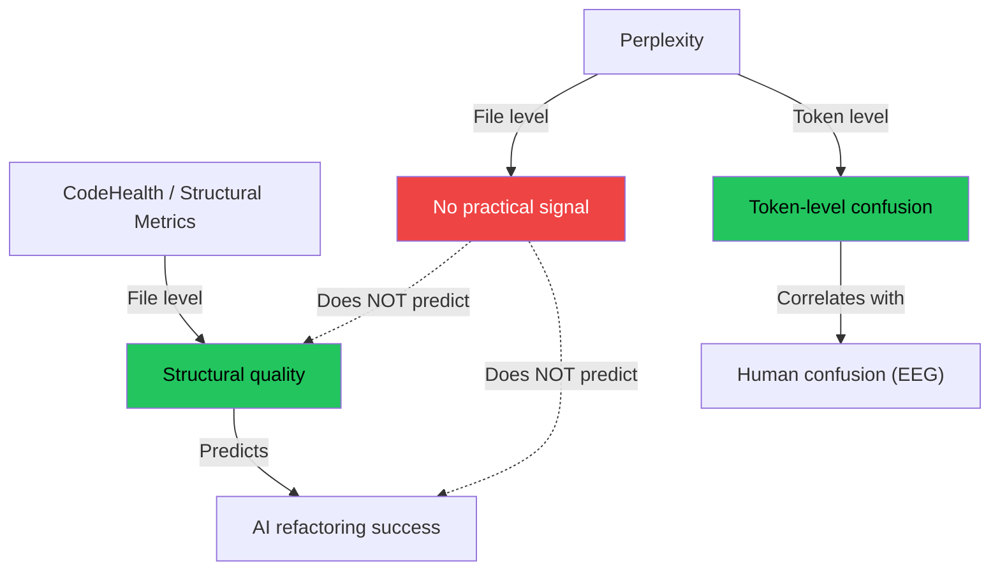

# INSIGHT 31: Perplexity Is Not File-Level AI-Friendliness

Perplexity measures token-level prediction surprise, not structural editability.
At the file level, PPL has no practically meaningful association with code
quality as measured by CodeHealth. But at the token and snippet level, PPL spikes
do correlate with human confusion. These are not contradictory findings. They
reveal that file-level "AI-friendliness" is a structural property -- code
smells, nesting depth, argument counts, control-flow complexity -- that PPL
does not capture when aggregated across an entire file.

The practical implication: do not use perplexity alone to measure whether code
is "AI-friendly." Use structural code quality metrics alongside or instead.

## Source map

| Ref | Source                                                                   | Local file                                         | Role in this insight                                                                       |
| --- | ------------------------------------------------------------------------ | -------------------------------------------------- | ------------------------------------------------------------------------------------------ |
| R77 | Code for Machines, Not Just Humans (Borg et al., 2026)                   | `papers/code-for-machines-2601.02200.pdf`          | Negative result: PPL has negligible association with CodeHealth at the file level.         |
| R79 | How do Humans and LLMs Process Confusing Code? (Abdelsalam et al., 2025) | `papers/humans-llms-confusing-code-2508.18547.pdf` | Positive result: PPL spikes correlate with human EEG confusion at the token/snippet level. |

## Borg et al. RQ1: Perplexity vs CodeHealth (negative result)

### Method

For each of the five medium-sized LLMs, Borg et al. computed per-file
perplexity on the 5,000-file dataset (60-120 SLOC Python, stratified 50/50
Healthy/Unhealthy). They compared median PPL between the Healthy and Unhealthy
groups using Wilcoxon rank-sum tests with Holm correction. Effect sizes were
measured using Cliff's delta.

### Table 1 -- Perplexity by CodeHealth group, copied from the paper

| Model   | Group     |    N | Median PPL |   IQR | Max PPL | Delta median | p (Holm) | delta (Cliff's) |
| ------- | --------- | ---: | ---------: | ----: | ------: | -----------: | -------: | --------------: |
| Gemma   | Healthy   | 2369 |      2.092 | 0.515 |   3.127 |       +0.069 |   <0.001 |          +0.098 |
| Gemma   | Unhealthy | 2396 |      2.023 | 0.552 |   3.071 |              |          |                 |
| GLM     | Healthy   | 2375 |      1.577 | 0.493 |   2.529 |       -0.017 |    0.039 |          -0.039 |
| GLM     | Unhealthy | 2404 |      1.594 | 0.492 |   2.533 |              |          |                 |
| GPT     | Healthy   | 2214 |      2.943 | 1.473 |   6.226 |       +0.237 |   <0.001 |          +0.136 |
| GPT     | Unhealthy | 2216 |      2.706 | 1.559 |   6.299 |              |          |                 |
| Granite | Healthy   | 2369 |      1.764 | 0.582 |   2.932 |       +0.005 |    0.992 |          +0.000 |
| Granite | Unhealthy | 2395 |      1.759 | 0.617 |   2.923 |              |          |                 |
| Qwen    | Healthy   | 2335 |      1.728 | 0.610 |   2.915 |       -0.041 |    0.004 |          -0.054 |
| Qwen    | Unhealthy | 2388 |      1.769 | 0.622 |   2.968 |              |          |                 |

Units: PPL is mean per-token perplexity (dimensionless). IQR is interquartile
range. Delta median is Healthy minus Unhealthy (positive = healthy code has
HIGHER perplexity). Cliff's delta ranges from -1 to +1; values near 0 are
negligible.

### Key observations

1. **Direction is inconsistent.** Gemma, GPT, and Granite show higher PPL for
   healthy code. GLM and Qwen show lower PPL for healthy code. If PPL were a
   useful proxy for code quality, the direction should be consistent.

2. **Effect sizes are negligible.** Cliff's delta ranges from -0.054 to +0.136.
   By standard interpretation: negligible (|d| < 0.147). Even GPT's +0.136 is
   barely at the edge of "negligible."

3. **Statistical significance without practical significance.** Some p-values
   are significant (p < 0.001 for Gemma and GPT), but the effect sizes are too
   small to matter. Large sample sizes (N ~2,400 per group) can produce
   statistically significant results even when the real-world difference is
   trivially small.

4. **Granite shows zero effect.** Delta median +0.005, Cliff's delta 0.000,
   p = 0.992. No relationship at all.

### Why file-level PPL does not capture code quality

The paper explains this clearly. Perplexity measures how well a language model
predicts the next token. A deeply nested function with complex conditionals may
actually be MORE predictable at the token level (if the model has seen many such
patterns in training) than a well-structured function with domain-specific but
uncommon variable names.

File-level PPL averages across all tokens, washing out local signals. A function
might have one confusing branch (high local PPL) surrounded by boilerplate (low
PPL), and the file-level average would look normal.

## Abdelsalam et al.: PPL does correlate with human confusion at token level

### Method

Abdelsalam et al. recorded EEG signals from 24 participants processing code
snippets containing "atoms of confusion" -- small syntactic constructs known to
confuse programmers (operator precedence tricks, conditional assignments, type
conversions, etc.). They simultaneously computed per-token perplexity from
Qwen2.5-Coder-32B on the same snippets and measured correlation with the late
frontal positivity (LFP) EEG component, a neural marker of cognitive processing
difficulty.

### Key data from the paper

| Measurement                |                                                  Value |
| -------------------------- | -----------------------------------------------------: |
| EEG participants           |                                                     24 |
| High-quality EEG samples   |                                                  1,432 |
| Model used for PPL         |                                      Qwen2.5-Coder-32B |
| Atoms of confusion studied | Standard set (operator precedence, conditionals, etc.) |
| PPL-EEG correlation        |            Statistically significant for LFP component |

### Key finding

LLM perplexity spikes at the same code locations where human brain activity
shows increased confusion processing. Humans and LLMs are "similarly confused"
by atoms of confusion.

This is a positive result for PPL as a confusion detector at the token/snippet
level. It directly contrasts with the Borg negative result about PPL at the
file level.

## The resolution: two different scales of measurement

The apparent contradiction resolves cleanly when you separate the scales:

| Scale                | PPL usefulness | What it measures                                           | Citation         |
| -------------------- | -------------- | ---------------------------------------------------------- | ---------------- |
| Token/snippet        | Useful         | Local confusion, surprising constructs, atoms of confusion | R79 (Abdelsalam) |
| File-level aggregate | Not useful     | Nothing practically meaningful about structural quality    | R77 (Borg)       |

### Why the scales diverge

1. **Token-level PPL** detects surprising local patterns: unexpected operator
   usage, unusual variable assignments, type coercions. These ARE confusing to
   both humans and models.

2. **File-level PPL** averages over hundreds of tokens. Structural code smells
   -- deeply nested logic, god classes, excessive arguments, duplicated code
   blocks -- are not token-level surprises. They are structural patterns that
   can be locally predictable while being globally harmful.

3. **Structural quality** is about relationships between code units: function
   cohesion, argument count, nesting depth, control-flow complexity, duplication.
   These are measured by metrics like CodeHealth, cyclomatic complexity, and code
   smell detectors. PPL does not address them.

## Supporting evidence: SLOC and PPL are not correlated

The Borg paper also cites Kotti et al. (referenced in the paper) finding that
SLOC and PPL are not correlated. This further supports the view that PPL
captures a different dimension than structural code properties. File size,
nesting, complexity, and smell density are structural features. PPL is a
prediction-difficulty feature. They are measuring different things.

## Inference: what this means for codebase structure

1. **Do not use PPL alone to measure "AI-friendliness."** File-level perplexity
   is not a proxy for structural code quality. A file with low perplexity can
   still be full of code smells that cause LLMs to produce broken refactorings.

2. **Use structural code quality metrics.** CodeHealth, cyclomatic complexity,
   cognitive complexity, nesting depth, and smell detectors capture the
   properties that actually predict AI refactoring success (see INSIGHT_30).

3. **PPL is still useful for specific purposes.** Token-level perplexity can
   identify confusing code constructs -- atoms of confusion, surprising syntax,
   unclear operator usage. This is valuable for code review and readability
   analysis, but it is a different tool than a code quality metric.

4. **The two dimensions are complementary.** A comprehensive "AI-friendly code"
   assessment would check both:
   - Structural quality (code smells, complexity, nesting) for editability.
   - Local confusion signals (PPL spikes, atoms of confusion) for readability.

5. **For this talk, the implication is clear.** When we say "write code AI
   agents love," we mean: reduce nesting, simplify methods, limit arguments,
   eliminate duplication, avoid god classes. These are structural properties.
   They are detectable with standard static analysis tools. PPL is a distraction
   at the file level.

## What this does not prove

1. It does not prove perplexity is useless. The Abdelsalam study demonstrates
   clear value at the token level. The claim is specifically about file-level
   aggregated PPL as a code quality proxy.

2. It does not prove perplexity cannot be made useful at the file level with
   different aggregation methods. Perhaps PPL variance, max-PPL, or percentile-
   based measures within a file could capture structural issues. The Borg study
   used mean per-token PPL. Other aggregation strategies were not tested.

3. It does not prove the Abdelsalam correlation is causal. EEG correlation with
   PPL spikes does not prove PPL causes confusion or that reducing PPL would
   reduce confusion. Both could be driven by a common underlying factor (the
   inherent complexity of the code construct).

4. It does not prove CodeHealth is the right alternative. CodeHealth was the
   metric tested. Other structural metrics may perform better, worse, or
   differently.

5. It does not prove results generalize beyond Python. Both the Borg study
   (Python competitive-programming files) and the Abdelsalam study used
   specific, controlled datasets.

## Blog and presentation visual candidates

1. **Two-scale diagram**: Token-level PPL (useful, correlates with human
   confusion) vs file-level PPL (not useful for quality). The visual argument:
   "same metric, different scale, different answer."

2. **Direction inconsistency table**: Show the Healthy-Unhealthy delta medians
   for all 5 models. Some positive, some negative, all tiny. Caption: "If PPL
   measured code quality, the direction would be consistent."

3. **Cliff's delta bar chart**: All five models with negligible effect sizes.
   Draw the |d| < 0.147 threshold line. Caption: "Statistically significant
   does not mean practically meaningful."

4. **Complementary metrics slide**: Two-column layout. Left: "What PPL catches"
   (surprising tokens, atoms of confusion, unusual syntax). Right: "What
   structural metrics catch" (nesting, complexity, god classes, duplication,
   argument counts). Caption: "Use both, but know what each measures."

5. **The resolution diagram** (Mermaid above): PPL at token level correlates
   with confusion; PPL at file level does not predict quality; structural
   metrics predict AI refactoring success.

## References

- R77: Code for Machines, Not Just Humans,
  `papers/code-for-machines-2601.02200.pdf`
- R79: How do Humans and LLMs Process Confusing Code?,
  `papers/humans-llms-confusing-code-2508.18547.pdf`
