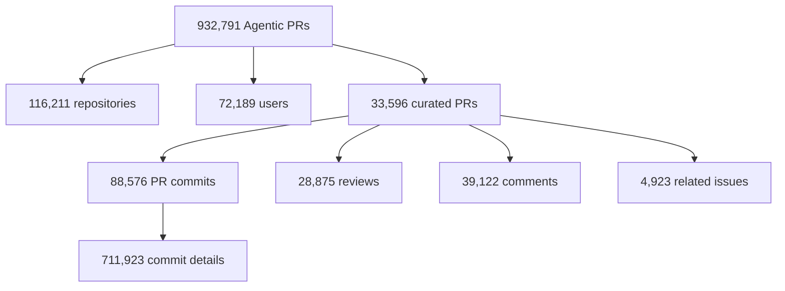
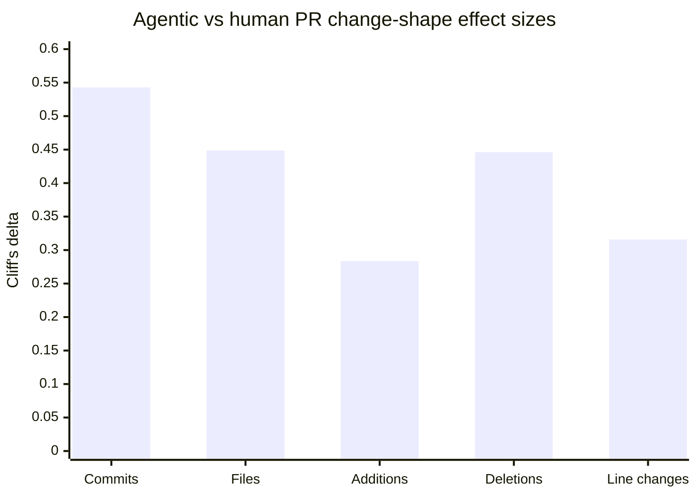
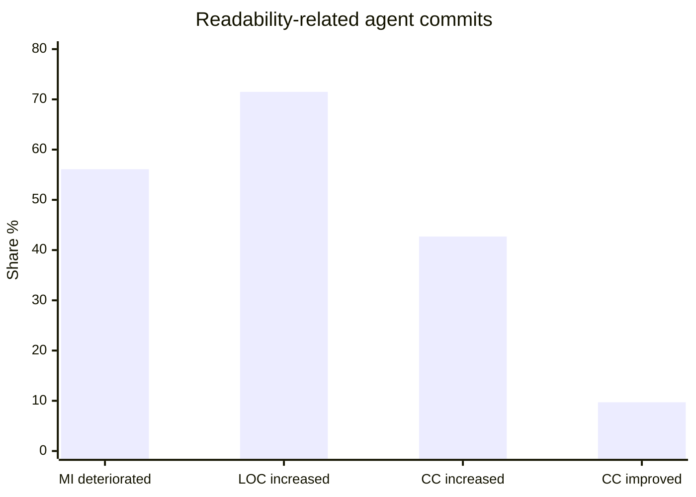

# INSIGHT 25: Agentic PRs Have a Different Shape

Agent-written code is no longer a few anecdotes from people trying Claude Code on side projects.
AIDev gives the phenomenon ecosystem scale. "How AI Coding Agents Modify Code" compares
agentic and human merged PRs. The readability paper mines readability-intended agent commits.

This matters for the article because an agent-friendly codebase is not just a repo that helps an
agent write code. It is also a repo that can review, constrain, and absorb agent-shaped changes.
Agent patches have measurable patterns. Some are useful. Some are biased. The repo should be
designed around those observed biases.

Plot-ready data lives in `presentations/write-code-ai-agents-love/research/data/agentic_pr_change_shape.csv`.

## Source map

| Ref | Source                                        | Local text                                                   | Role in this insight                                                   |
| --- | --------------------------------------------- | ------------------------------------------------------------ | ---------------------------------------------------------------------- |
| R69 | AIDev                                         | `paper-text/aidev-agentic-prs-2602.09185.txt`                | Establishes scale: hundreds of thousands of Agentic PRs.               |
| R70 | How AI Coding Agents Modify Code              | `paper-text/how-ai-coding-agents-modify-code-2601.17581.txt` | Compares merged agentic PRs with merged human PRs.                     |
| R76 | Do AI Agents Really Improve Code Readability? | `paper-text/readability-agents-2603.13723.txt`               | Measures how readability-intended agent commits affect static metrics. |
| R09 | SWE-CI                                        | `paper-text/swe-ci-2603.03823.txt`                           | Adds maintainability/regression evidence across CI history.            |
| R46 | Needle in the Repo                            | `paper-text/needle-in-the-repo-2603.27745.txt`               | Shows functional tests can miss structural maintainability failures.   |

## AIDev: agentic PRs are now observable at scale

AIDev is a dataset paper. Its importance is not a single performance number. Its importance is that
agent-authored PRs are now numerous enough to study empirically. That changes the tone of the
blogpost. We do not need to argue only from personal experience. We can say: agentic development
has a measurable footprint in public repositories.

### AIDev data copied from the paper

| AIDev table               |   Value |
| ------------------------- | ------: |
| All Agentic pull requests | 932,791 |
| All repositories          | 116,211 |
| All users/developers      |  72,189 |
| Curated Agentic PRs       |  33,596 |
| Curated repositories      |   2,807 |
| Curated users             |   1,796 |
| PR comments               |  39,122 |
| PR reviews                |  28,875 |
| PR review comments        |  19,450 |
| PR commits                |  88,576 |
| PR commit details         | 711,923 |
| Related issues            |   4,923 |
| Issues                    |   4,614 |
| PR timeline events        | 325,500 |
| PR task-type records      |  33,596 |

Source trace: R69, `paper-text/aidev-agentic-prs-2602.09185.txt`.

### Graph sketch: AIDev data layers

The inference I want to make carefully: AIDev does not prove agentic PRs are good or bad. It proves
there is enough agentic PR activity to study patterns. That supports using ecosystem data rather
than relying only on "vibes."

## How AI Coding Agents Modify Code: patch shape differs

This paper compares merged Agentic PRs and merged Human PRs. It reports statistical and
practical differences across commit counts, files touched, additions, deletions, and line changes.
The most useful number is Cliff's delta because it describes distributional separation, not just
mean difference.

I need to be cautious about direction. The text summary says human PRs modify codebases more
broadly and remove more code, while the table reports effect sizes for agentic vs human metrics.
Before using a visual in the article, re-open the exact table and label the direction from the paper,
not from memory. For this research note, the safe claim is that the distributions differ with small
to large practical effects.

### Dataset comparison copied from the paper

| Dataset slice | Agentic PRs | Human PRs |
| ------------- | ----------: | --------: |
| Merged PRs    |      24,014 |     5,081 |
| Commits       |     440,295 |    23,242 |

### Effect-size data copied from the paper

| Change metric | Cliff's delta | Practical size in paper |
| ------------- | ------------: | ----------------------- |
| Commits       |        0.5429 | Large                   |
| Files touched |        0.4487 | Medium                  |
| Additions     |        0.2836 | Small                   |
| Deletions     |        0.4462 | Medium                  |
| Line changes  |        0.3158 | Small                   |

### Similarity data copied from the paper

| Similarity metric | Agentic PRs | Human PRs |
| ----------------- | ----------: | --------: |
| TF-IDF            |      0.1245 |    0.1007 |
| BM25              |      2.8455 |    0.1739 |
| CodeBERT          |      0.9356 |    0.9285 |
| GraphCodeBERT     |      0.8254 |    0.7815 |

Source trace: R70, `paper-text/how-ai-coding-agents-modify-code-2601.17581.txt`.

### Chart sketch: practical effect sizes

The blog inference: code review systems should not treat an agent PR as "just a normal PR with an
AI author." The patch shape, similarity profile, and failure modes may differ. Review gates should
watch the patterns that matter:

- more or fewer commits than expected for task size;
- broad file touches;
- low deletion or suspicious compatibility shims;
- generated files edited by hand;
- tests changed without implementation;
- implementation changed without tests;
- public API changed without generated clients/docs;
- architecture boundaries crossed.

## Readability paper: even "readability" intent can degrade metrics

The readability paper is a useful corrective because it looks at commits that explicitly claim
readability/understandability/clarity-like intent. If even those commits often increase size or reduce
maintainability metrics, then "the agent cleaned it up" is not enough.

The paper mines AIDev for readability-related commits, classifies what smells they address, and
computes static metric deltas before and after.

### Readability-paper data copied from the paper

| Measurement                            |       Value |
| -------------------------------------- | ----------: |
| Readability keyword commits            |       4,115 |
| Share of all agent commits             |  about 0.3% |
| Python readability-related commits     |         577 |
| Valid pre/post metric-analysis commits |         403 |
| Manual classification sample           | 231 commits |
| Label-level agreement                  |       94.7% |
| Micro-averaged Cohen's kappa           |        0.80 |

### What readability commits addressed

| Readability smell addressed                          | Agent share |
| ---------------------------------------------------- | ----------: |
| Complex, long, or inadequate logic                   |       42.4% |
| Incomplete or inadequate code documentation          |       24.2% |
| Logic category from human baseline mentioned in text |       18.2% |

The full table has more categories, but these are the numbers most relevant to the blog point:
agents emphasize logic complexity and documentation more than surface-level naming/formatting.

### Metric deltas copied from the paper

| Metric                | Mean delta after - before |    Median delta | Effect-size note                |
| --------------------- | ------------------------: | --------------: | ------------------------------- |
| Lines of Code         |                    +27.61 |           +6.00 | Large effect                    |
| Cyclomatic Complexity |                     +3.13 |            0.00 | Large effect                    |
| Multi-line Comments   |                     +2.10 |            0.00 | Positive shift                  |
| Source Lines of Code  |                    +18.47 |           +2.60 | Large effect                    |
| Logical Lines of Code |                    +12.18 | not copied here | Positive shift                  |
| Halstead Volume       |                    +43.60 |            0.00 | Some commits add cognitive load |
| Halstead Effort       |                   +321.49 |            0.00 | Some commits add cognitive load |
| Halstead Difficulty   |                     +0.31 |            0.00 | Small mean shift                |
| Comment lines         |                     +1.67 | not copied here | Positive shift                  |
| Single-line Comments  |                     +0.73 | not copied here | Positive shift                  |
| Maintainability Index |                     -3.25 | not copied here | Medium negative effect          |

### Directional outcome shares copied from the paper

| Outcome                            | Share |
| ---------------------------------- | ----: |
| Maintainability Index deteriorated | 56.1% |
| Lines of Code increased            | 71.5% |
| Cyclomatic Complexity improved     |  9.7% |
| Cyclomatic Complexity increased    | 42.7% |

Source trace: R76, `paper-text/readability-agents-2603.13723.txt`.

### Chart sketch: readability-intended does not mean structurally simpler

This is not a claim that the agent changes were all bad. Static metrics are imperfect. Sometimes a
readable change legitimately adds lines or comments. But the result is strong enough to justify
review gates: readability claims should be checked against complexity, size, duplication, and actual
human clarity, not accepted as self-evident.

## Link to maintainability benchmarks

SWE-CI and Needle in the Repo broaden the same concern. SWE-CI finds that many models can look
good on style metrics while underperforming on Maintainability Index. Needle in the Repo finds
functional test passes can still violate structural oracles.

### Supporting maintainability data from earlier insights

| Source             |                                                        Data point | Why it matters here                                      |
| ------------------ | ----------------------------------------------------------------: | -------------------------------------------------------- |
| SWE-CI             |                     15/20 models beat human oracle code on Pylint | Style-clean is not enough.                               |
| SWE-CI             |                20/20 models underperform on Maintainability Index | Maintainability needs deeper checks.                     |
| Needle in the Repo | 64/483 outcomes pass functional tests but fail structural oracles | Behavior tests miss architecture failures.               |
| Needle in the Repo |                                Dependency Control 4.3% solve rate | Some architectural requirements are especially hard.     |
| Needle in the Repo |                     Responsibility Decomposition 15.2% solve rate | Agents struggle with structural design, not only syntax. |

Source traces: R09 and R46.

## Inference for codebase design

Agent-friendly codebases should assume agent PRs are productive but biased. They should make the
desired patch shape visible and enforce the unacceptable patch shapes.

| Observed risk                     | Codebase affordance                              | Example                                                |
| --------------------------------- | ------------------------------------------------ | ------------------------------------------------------ |
| Broad or odd file touch pattern   | Ownership and package boundaries                 | CODEOWNERS, module tags, dependency rules              |
| Superficial compatibility shim    | Static refactoring rules and API migration tests | OpenGrep/Semgrep/custom lint for old imports           |
| "Readability" adds volume         | Complexity and maintainability gates             | MI/CC thresholds, review checklist                     |
| Generated files hand-edited       | Generated-code policy                            | "Do not edit generated clients; run generator" lint/CI |
| API call guessing                 | Generated SDKs and typed clients                 | OpenAPI -> TypeScript client                           |
| Structure bypassed but tests pass | Structural oracles                               | import-boundary lint, architecture tests               |
| No-op should be accepted          | Reproduction and abstention path                 | issue-specific verify command                          |

## How this changes the article

The article should not sound like "make the repo nice so agents can move faster." It should say:

1. Agents are a new contributor class.
2. They have observable patch-shape and quality tendencies.
3. The repo needs affordances for generation and guardrails for review.
4. The same artifacts help both: types, tests, generated clients, lint rules, package boundaries,
   setup commands, and explicit task specs.

This gives the talk a more serious engineering tone. It is not "AI agents love clean code." It is
"AI agents need operational constraints because their changes have different statistical failure
surfaces."

## What I should not claim

I should not claim all agent PRs are worse. AIDev is a dataset; it does not score quality by itself.
The agent-vs-human PR paper compares merged PRs, which have already passed some project review
process. The readability paper is focused on readability-keyword commits and Python metrics.

I should not overclaim static readability metrics. They are signals, not truth. A larger patch can be
more readable. A lower Maintainability Index can sometimes be an artifact. The safe claim is that
readability intent does not reliably imply structural quality improvement.

## Blog visual candidates

1. AIDev scale graph: PRs -> repos -> users -> curated subset.
2. Agentic-vs-human Cliff's delta bar chart.
3. Readability commit outcomes bar chart.
4. Review-gate matrix: observed agent PR risk -> codebase guardrail.
5. Patch-shape dashboard mock: files touched, generated files, tests changed, boundary violations.

## References

- R09: SWE-CI, `paper-text/swe-ci-2603.03823.txt`
- R46: Needle in the Repo, `paper-text/needle-in-the-repo-2603.27745.txt`
- R69: AIDev, `paper-text/aidev-agentic-prs-2602.09185.txt`
- R70: How AI Coding Agents Modify Code, `paper-text/how-ai-coding-agents-modify-code-2601.17581.txt`
- R76: Do AI Agents Really Improve Code Readability?, `paper-text/readability-agents-2603.13723.txt`
