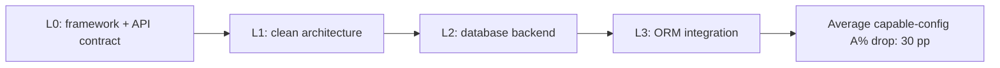
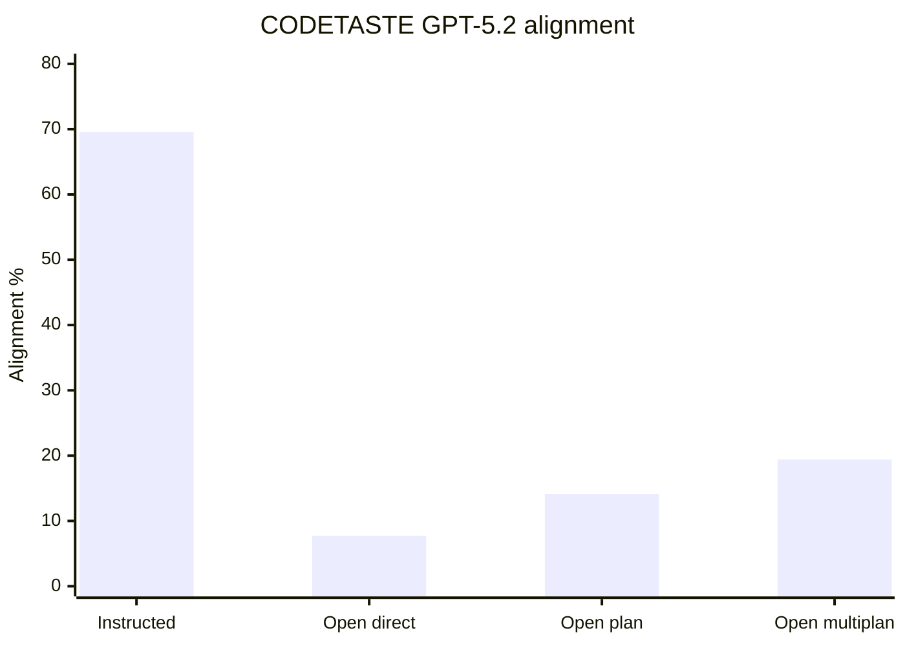
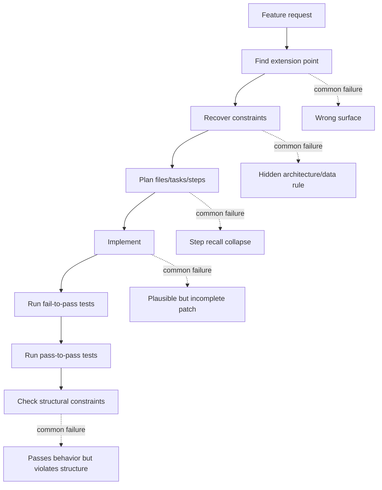

# INSIGHT 22: Feature Work Fails at Planning and Constraints

The most important correction to my earlier "agents need better codebases" framing is that not
all coding tasks fail in the same place. Bug-fix tasks often fail at localization and patch
correctness. Feature work fails more often at planning, constraint satisfaction, and step fidelity.
The agent may write a patch, apply it cleanly, and still miss the actual feature shape.

This note combines four papers because none of them alone is enough:

- RACE-bench measures feature-addition reasoning at file/task/step granularity.
- Constraint Decay measures what happens as backend code generation is forced to satisfy
  production-like structural constraints.
- CODETASTE measures large real refactorings, comparing detailed instructions against vague
  "open track" focus areas.
- FeatureBench measures repository-scale feature restoration with executable environments and
  tests.

Together they support a precise claim: feature-friendly codebases must expose extension points,
constraints, examples, and acceptance tests. Otherwise the agent is forced to invent a plan and
then satisfy hidden architecture rules while editing.

Plot-ready data lives in `presentations/write-code-ai-agents-love/research/data/feature_constraints_planning.csv`.

## Source map

| Ref | Source           | Local text                                              | Why it matters                                                                      |
| --- | ---------------- | ------------------------------------------------------- | ----------------------------------------------------------------------------------- |
| R68 | RACE-bench       | `paper-text/race-bench-feature-addition-2603.26337.txt` | Measures feature-addition planning quality and reasoning recall.                    |
| R71 | Constraint Decay | `paper-text/constraint-decay-2605.06445.txt`            | Controlled backend experiment showing structural constraints degrade agent success. |
| R72 | CODETASTE        | `paper-text/codetaste-2603.04177.txt`                   | Real large refactoring benchmark with tests plus static rules.                      |
| R44 | FeatureBench     | `paper-text/featurebench-2602.10975.txt`                | Feature implementation remains hard even for strong agents.                         |

## RACE-bench: patches apply before reasoning is correct

RACE-bench is valuable because it does not stop at "resolved or not." It asks whether the agent
identified the correct files, tasks, and implementation steps. That matters because feature work is
not just locating a bug line. A feature requires a small plan: add this interface, call that service,
update this persistence path, add this test, preserve that old behavior.

The striking pattern is the gap between patch application and resolution. Some systems produce
patches that apply at very high rates. That does not mean the feature works. In other words, the
agent can manipulate the repository successfully while still misunderstanding the change.

### RACE-bench data copied from the paper

| Agent          | Patch apply | Resolved | Gap: apply - resolved |
| -------------- | ----------: | -------: | --------------------: |
| AutoCodeRover  |      96.21% |   28.79% |              67.42 pp |
| TraeAgent      |      78.98% |   52.65% |              26.33 pp |
| mini-SWE-Agent |      95.83% |   70.08% |              25.75 pp |

| mini-SWE-Agent reasoning level | Recall |
| ------------------------------ | -----: |
| Files                          |  0.890 |
| Tasks                          |  0.751 |
| Steps                          |  0.445 |

| Failure comparison                                             |        Value |
| -------------------------------------------------------------- | -----------: |
| Applied-but-failing patches: lower reasoning recall vs success |  35.7% lower |
| Applied-but-failing patches: higher over-prediction vs success | 94.1% higher |

Source trace: R68, `paper-text/race-bench-feature-addition-2603.26337.txt`.

### Chart sketch: RACE-bench apply vs resolved

```mermaid
xychart-beta
  title "RACE-bench: patch application is not resolution"
  x-axis ["AutoCodeRover", "TraeAgent", "mini-SWE-Agent"]
  y-axis "Percent" 0 --> 100
  bar "Patch apply" [96.21, 78.98, 95.83]
  bar "Resolved" [28.79, 52.65, 70.08]
```

The inference for the talk: "it made a patch" is a dangerously low bar. Codebases should help
agents preserve the plan as it gets more specific. That means visible examples, acceptance tests,
and structured task specs, not just a natural language feature request.

## Constraint Decay: production structure is the hard part

Constraint Decay fixes one API contract based on the RealWorld Conduit API, then varies
non-functional constraints: framework, architecture, database backend, and ORM integration. This
is exactly the kind of thing real software requires. We rarely want "any working backend." We want
the backend to use our framework, architecture, database, data-access rules, auth conventions, and
test setup.

The paper's main result is brutal: capable configurations lose about 30 percentage points of
assertion pass rate from L0 to L3. That is not a small style preference. It is the measurable cost of
making code production-shaped.

### Constraint Decay data copied from the paper

| Measurement                             | Value | Interpretation                                             |
| --------------------------------------- | ----: | ---------------------------------------------------------- |
| Greenfield generation tasks             |    80 | Controlled combinations across frameworks/constraints.     |
| Feature implementation tasks            |    20 | Existing-codebase sanity check.                            |
| API operations in contract              |    19 | Non-trivial CRUD-style backend surface.                    |
| Assertions in test suite                |   291 | Behavioral checks for API behavior.                        |
| Capable-config L0 -> L3 A% drop         | 30 pp | Structural constraints materially reduce success.          |
| Relative loss from baseline             |   40% | Constraint cost is large relative to baseline performance. |
| Full-set vs subset Pearson correlation  |  0.98 | Cost-reduced subset tracked full benchmark well.           |
| Full-set vs subset Spearman correlation |  0.95 | Rank ordering also tracked well.                           |

### Marginal constraint effects copied from the paper

| Constraint         | Average A% effect |
| ------------------ | ----------------: |
| Clean architecture |           -9.1 pp |
| PostgreSQL         |          -19.3 pp |
| SQLite             |          -14.3 pp |
| SQLAlchemy         |           -1.5 pp |
| Sequelize          |           -0.6 pp |

The database result matters. It says the agent problem is not only syntax or routing. Data-layer
interaction is a core failure surface: query composition, ORM runtime behavior, dialect mismatches,
state propagation, and auth state all become places where plausible code fails.

### Framework sensitivity copied from the paper

| Framework | Average assertion pass rate |
| --------- | --------------------------: |
| Express   |                       51.4% |
| Koa       |                       50.7% |
| Flask     |                       49.3% |
| aiohttp   |                       38.4% |
| Fastify   |                       31.7% |
| Django    |                       25.4% |
| FastAPI   |                       24.2% |
| Hono      |                       18.5% |

Source trace: R71, `paper-text/constraint-decay-2605.06445.txt`.

### Chart sketch: constraints as performance decay

The codebase-design inference is subtle. The answer is not "avoid constraints." Constraints are
what make software maintainable. The answer is to make constraints explicit and executable. If the
architecture rule is hidden in prose, the agent has to infer it. If the rule is encoded as imports,
types, generated clients, lints, tests, and examples, the agent has something to repair against.

## CODETASTE: agents execute specified refactors better than they discover them

CODETASTE is not a feature benchmark; it is a refactoring benchmark. It is still relevant because
large feature work often contains refactoring-like moves: move a boundary, replace an old API,
standardize a package, update an integration pattern, or migrate many call sites.

The key distinction is between the Instructed Track and Open Track. In the instructed track, the
agent receives a detailed description of the intended refactor. In the open track, it receives a
vague focus area and must infer the human architectural choice. The performance gap is the point.

### CODETASTE benchmark scale copied from the paper

| Benchmark property                     |    Value |
| -------------------------------------- | -------: |
| Instances                              |      100 |
| Repositories                           |       87 |
| Programming languages                  |        6 |
| Average files edited by human refactor |    91.52 |
| Average LOC changed                    | 2,605.39 |
| Maximum LOC changed                    |   18,821 |
| Maximum files changed                  |      290 |
| Average tests per instance             | 1,638.53 |
| Average additive static rules          |    29.66 |
| Average reductive static rules         |    63.41 |

### CODETASTE result data copied from the paper

| Model / mode                  |  PASS | Alignment A |   Instruction-following rate |
| ----------------------------- | ----: | ----------: | ---------------------------: |
| GPT-5.2 instructed            | 76.0% |       69.6% |                        89.3% |
| GPT-5.2 open direct           | 87.0% |        7.7% |       about 9-10% components |
| GPT-5.2 open plan             | 87.0% |       14.1% |           higher than direct |
| GPT-5.2 open multiplan oracle | 81.0% |       19.4% | highest open-track alignment |
| GPT-5.1 Codex Mini instructed | 47.0% |       34.6% |                        72.2% |
| Claude Sonnet 4.5 instructed  | 43.0% |       32.4% |                        69.2% |
| Qwen3 instructed              | 30.0% |       11.8% |  lower than frontier systems |

Source trace: R72, `paper-text/codetaste-2603.04177.txt`.

### Chart sketch: specified vs inferred refactoring intent

The article should use this as a clean argument for explicit task specs and visible extension
points. Agents can execute a detailed structural transformation far better than they can infer a
human's intended architectural move from a broad complaint.

## FeatureBench: feature restoration is still hard

FeatureBench is useful because it makes "feature work" concrete. It constructs executable
environments and validates both fail-to-pass and pass-to-pass behavior. The numbers are low even
for strong agents. That prevents the article from sounding like feature success is solved if we add
more context.

### FeatureBench data copied from the paper

| Measurement                        | Value |
| ---------------------------------- | ----: |
| Tasks                              |   200 |
| Executable environments            | 3,825 |
| Repositories                       |    24 |
| Claude Opus 4.5 resolved           | 11.0% |
| GPT-5.1-Codex resolved             | 12.5% |
| Approximate FeatureBench task LOC  | 790.2 |
| Approximate SWE-Dev comparison LOC |   190 |

Source trace: R44, `paper-text/featurebench-2602.10975.txt`.

The most important methodological detail from FeatureBench is not only the low resolved rate. It is
the validation shape: feature tests must fail before the feature is restored and pass after the patch,
while existing behavior must also keep passing. That is the agent-friendly test pattern for feature
work: fail-to-pass plus pass-to-pass.

## Synthesis: where feature tasks collapse

This graph is the blogpost argument in one figure. Feature work is not one action. It is a chain of
recoveries. A codebase can help at each point.

## What code patterns follow from this

| Failure mode                  | Repo pattern that helps                              | Why                                           |
| ----------------------------- | ---------------------------------------------------- | --------------------------------------------- |
| Wrong extension point         | Canonical examples and small public interfaces       | The agent sees where new behavior belongs.    |
| Hidden architecture rule      | Custom lint/static rules and import boundaries       | The rule becomes executable feedback.         |
| Missing data-layer convention | Typed repository/service layer and integration tests | Query/ORM mistakes are caught locally.        |
| Step recall collapse          | Task specs with file/task/checklist structure        | The plan survives context and implementation. |
| Inferred refactor is wrong    | Explicit migration/refactor spec and static rules    | The desired transformation is named.          |
| Feature breaks old behavior   | Pass-to-pass tests                                   | The agent sees preservation requirements.     |
| Raw API guessing              | Generated SDKs and typed clients                     | API contracts become local symbols.           |

## What I should not claim

I should not claim that "simple architecture" is the only answer. Constraint Decay actually shows
that production constraints are hard, but production code needs them. The answer is not less
architecture. The answer is more visible, executable architecture.

I should not claim that planning alone solves open-ended feature work. CODETASTE planning nearly
doubles GPT-5.2 open-track alignment from 7.7% to 14.1%, but that is still far below instructed
alignment. Planning helps only if the plan is grounded in the right structure and objective.

I should not combine RACE-bench, Constraint Decay, CODETASTE, and FeatureBench into one model
leaderboard. They measure different task definitions and harnesses. The shared conclusion is about
failure shape, not model ranking.

## Blog visual candidates

1. RACE-bench apply-vs-resolved grouped bars.
2. RACE-bench reasoning waterfall: files -> tasks -> steps.
3. Constraint Decay marginal effects by constraint.
4. CODETASTE instructed vs open-track alignment chart.
5. Feature-work failure chain graph.

## References

- R44: FeatureBench, `paper-text/featurebench-2602.10975.txt`
- R68: RACE-bench, `paper-text/race-bench-feature-addition-2603.26337.txt`
- R71: Constraint Decay, `paper-text/constraint-decay-2605.06445.txt`
- R72: CODETASTE, `paper-text/codetaste-2603.04177.txt`
