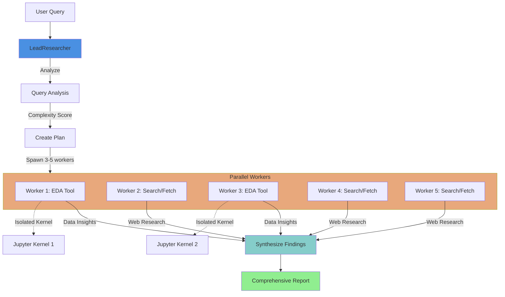
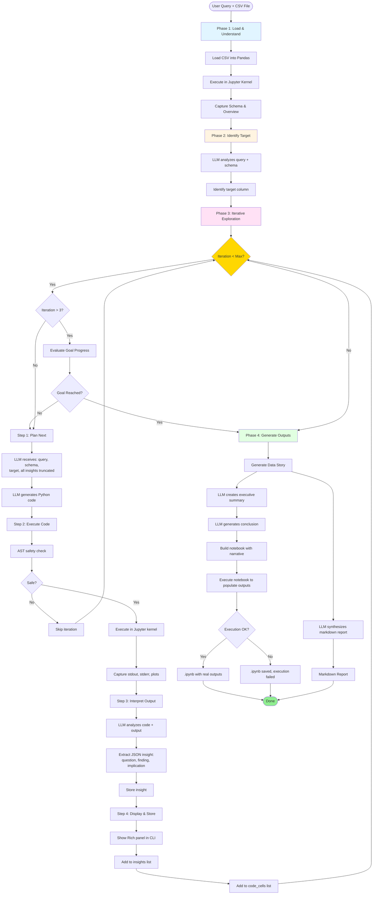
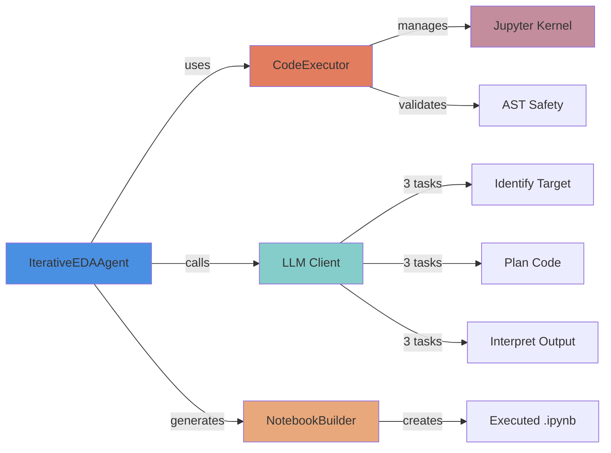

# Deep Research Agent

Multi-agent deep research system with automated EDA.

## Setup

```bash
# Install dependencies
uv sync

# Configure API keys
cp .env.example .env
# Edit .env with your OPENROUTER_API_KEY and BRAVE_API_KEY
```

### Supported Model

The system uses **Tongyi DeepResearch 30B** via OpenRouter:

| Model | ID | Context | Cost (per 1M tokens) |
|-------|-----|---------|---------------------|
| **Tongyi DeepResearch 30B** | `alibaba/tongyi-deepresearch-30b-a3b` | 131K tokens | $0.09 input / $0.40 output |

**Features:**
- Large context window (131K tokens)
- Optimized for deep research and analysis
- Cost-effective for complex queries

**Cost Examples:**
- Simple query (3 workers, 90K tokens): ~$0.01-0.02
- Complex query (5 workers, 140K tokens): ~$0.02-0.04

## Commands

### Verbose Mode

All research commands support a verbose flag (`-v` or `--verbose`) that provides detailed real-time output of the agent's thinking and actions:

```bash
# Enable verbose output for single-agent research
uv run research research "How does LangGraph work?" -v

# Enable verbose output for multi-agent research
uv run research multi "Compare React vs Vue.js" -v

# Enable verbose output for EDA
uv run research eda data/sales.csv "analyze trends" -v
```

**What you'll see in verbose mode:**

- 🔍 **Search operations**: Each search query and result found
- 🌐 **Site visits**: URLs being fetched and content length
- 🤔 **Reasoning steps**: Iteration count and decision-making process
- ⚙️ **Tool usage**: Every tool call with detailed arguments
- 📊 **Analysis progress**: Query complexity, plan creation, synthesis
- ⏱️ **Real-time activity**: Scrolling log of recent actions with timestamps
- 📝 **Worker activity**: Individual worker progress in multi-agent mode

**Example verbose output:**
```
• Analyzing Query query=What are the top 3 programming languages in 2024?
• Query Analysis Complete complexity=0.45 specificity=0.8 domains=['technology', 'programming']
• Creating Research Plan workers=3 complexity=0.45
• Search Started query=top programming languages 2024 max_results=10 provider=brave
• Search Results Received query=top programming languages 2024 count=10
• Fetch Started url=https://example.com/languages-2024 method=jina
• Fetch Completed url=https://example.com/languages-2024 length=8432 truncated=False
• Reasoning Step iteration=2 max_iterations=15
• Agent Taking Action num_tools=2
• Synthesizing Results num_workers=3
• Synthesis Complete report_length=2841 total_sources=15
```

Verbose mode uses stderr for logging, keeping stdout clean for the final report.

### Single-Agent Research

```bash
uv run research research "How does LangGraph work?"
uv run research research "Explain MVCC in PostgreSQL" -o report.md
uv run research research "What is Python?"
```

### Multi-Agent Research

The multi-agent system orchestrates parallel workers to tackle complex research tasks efficiently. It automatically detects when data analysis is needed and spawns specialized workers.

#### Pure Web Research

```bash
# Simple factual queries (spawns ~3 workers)
uv run research multi "What are the top 3 programming languages in 2024?"

# Complex multi-faceted research (spawns ~5 workers)
uv run research multi "Compare React vs Vue.js"
uv run research multi "State of AI in 2024" -o ai_report.md

# Geographic and market research
uv run research multi "Explore house and apartment pricing in Sweden, focus on Malmö for 2024 and 2025"
```

#### Multi-Agent with Data Analysis

The system automatically detects data analysis needs and uses the EDA tool alongside web research:

```bash
# Pure data analysis (spawns workers with EDA tool)
uv run research multi "Analyze data/car_price_prediction_.csv and identify the top 3 factors that influence car prices"

# Combined data + web research (some workers analyze data, others research web)
uv run research multi "Analyze the car pricing trends from data/car_price_prediction_.csv and compare with 2024 market trends found online"

# Multiple datasets + context research
uv run research multi "Compare sales patterns in data/Q1_sales.csv and data/Q2_sales.csv, then research seasonal retail trends"

# Data insights + industry benchmarks
uv run research multi "Analyze data/customer_churn.csv to find churn patterns, then research industry-standard churn reduction strategies"
```

#### How Multi-Agent Data Analysis Works

1. **Automatic Task Detection**: The orchestrator analyzes your query and detects data analysis requirements
2. **Parallel Worker Spawning**: Spawns 3-5 workers based on query complexity
3. **Tool Distribution**: Some workers use the EDA tool for data analysis, others use search/fetch for web research
4. **Isolated Execution**: Each EDA worker gets its own Jupyter kernel for thread-safe parallel execution
5. **Synthesis**: The lead researcher synthesizes insights from all workers into a comprehensive report

**Benefits:**
- ⚡ **Parallel execution**: Multiple datasets analyzed simultaneously
- 🔄 **Combined insights**: Data patterns + industry context in one report
- 📊 **Automatic format detection**: Supports CSV, Excel, Parquet, and more
- 🎯 **Goal-oriented**: Each EDA worker stops when sufficient insights are gathered
- 💰 **Cost efficient**: Typical queries cost $0.01-0.03

#### When to Use Multi vs Standalone EDA

| Use Case | Command | Why |
|----------|---------|-----|
| Single dataset, deep analysis | `uv run research eda data/sales.csv "analyze trends"` | Focused exploration with full notebook output |
| Dataset + web context needed | `uv run research multi "Analyze data/sales.csv and compare with industry trends"` | Combines data insights with research |
| Multiple datasets comparison | `uv run research multi "Compare Q1.csv and Q2.csv"` | Parallel analysis, synthesized findings |
| Quick data exploration | `uv run research eda data/customers.csv "segment customers"` | Direct, fast, detailed notebook |
| Complex research with data | `uv run research multi "Research customer retention strategies and validate with data/churn.csv"` | Integrated approach |

#### Example Output

When you run a multi-agent query with data analysis, you'll see:

```bash
$ uv run research multi "Analyze data/car_prices.csv and compare with 2024 market trends"

🔍 Multi-agent research: Analyze data/car_prices.csv and compare with 2024 market trends

Workers: 5 | Active: 0 | Complete: 5

 …  Objective                         Status
 …  Analyze car pricing trends from   ✓ Complete
    CSV
 …  Research 2024 automotive market   ✓ Complete
    trends
 …  Examine pricing correlations      ✓ Complete
 …  Compare historical vs current     ✓ Complete
    pricing
 …  Identify market factors           ✓ Complete

┏━━━━━━━━━━━━━━━━━━━━━━━━━━━━━━━━━━━━━━━━━━━━━━━━━━━━━━━━━━━━━━━━━━━━━━━━━━━━━━┓
┃              Comprehensive Report on Car Pricing Trends                      ┃
┗━━━━━━━━━━━━━━━━━━━━━━━━━━━━━━━━━━━━━━━━━━━━━━━━━━━━━━━━━━━━━━━━━━━━━━━━━━━━━━┛

[Detailed synthesis combining data analysis insights with web research findings]

Workers: 5
Sources: 295
Tokens: 137,483
Cost: $0.0244
```

**Generated artifacts:**
- 📊 Jupyter notebooks in `notebooks/` (one per EDA worker)
- 📝 Comprehensive synthesis report combining all findings
- 💾 All notebooks have real executed outputs, not placeholders

### Iterative EDA Agent

The EDA agent is **goal-oriented**: it executes code, learns from outputs, and **stops when sufficient insights are gathered** rather than running fixed iterations.

#### Supported Data Formats

- CSV (`.csv`)
- TSV (`.tsv`)
- Excel (`.xlsx`, `.xls`)
- Parquet (`.parquet`)
- Pickle (`.pkl`, `.pickle`)
- JSON (`.json`)
- Feather (`.feather`)

#### Standalone EDA

```bash
# CSV file
uv run research eda data/car_price_prediction_.csv "predict car prices"

# Excel file
uv run research eda data/customers.xlsx "segment customers by value"

# Parquet file
uv run research eda data/events.parquet "analyze user behavior patterns"

# With options
uv run research eda data/sales.csv "analyze sales trends" -o report.md
uv run research eda data/churn.csv "analyze customer churn" --max-iterations 10

# Output:
# - notebooks/{filename}_analysis.ipynb (executed notebook with data story)
# - report.md (markdown synthesis of insights)
# - Live CLI progress showing insights as they're discovered
```

#### Combined Data Analysis + Web Research

The EDA agent is now available as a tool in the multi-agent system, enabling powerful combined workflows:

```bash
# Analyze data + research context
uv run research research "Analyze data/customers.xlsx to find segments, then research customer segmentation best practices"

# Multiple datasets + web research
uv run research research "Compare sales patterns in Q1.csv and Q2.csv, then research seasonal retail trends"

# Pure data analysis through research command
uv run research research "Analyze car_price_prediction_.csv and identify key price drivers"
```

The system automatically:
- Detects data analysis needs in your query
- Spawns parallel workers for data analysis and web research
- Synthesizes insights from both sources
- Generates Jupyter notebooks with executable analysis

**What makes it different:**
- 🎯 **Goal-oriented exploration**: Evaluates if insights answer the goal, stops early when sufficient
- 📊 **Multi-format support**: CSV, Excel, Parquet, Pickle, JSON, TSV, Feather
- 🔄 **Multi-agent integration**: Use EDA as a tool alongside web research
- ⚡ **Parallel execution**: Multiple datasets analyzed concurrently
- ✅ Executes code in real Jupyter kernel
- ✅ Analyzes actual outputs with LLM
- ✅ Iterates based on findings (like a human analyst)
- ✅ Validates notebooks by executing them end-to-end
- ✅ Generates executed notebooks with real outputs (not "imagined" outputs)
- 📖 **Tells a data story**: Narrative notebook with executive summary and conclusion
- ✅ Shows live progress in CLI

## Architecture

### Multi-Agent System with EDA Integration

The system uses a **LeadResearcher → Workers** pattern where the orchestrator spawns parallel workers based on query complexity:



**Key Features:**
- **Automatic task detection**: Identifies data analysis needs from query text
- **Dynamic worker allocation**: 3 workers for simple queries, 5 for complex ones
- **Tool-based architecture**: Workers select appropriate tools (search, fetch, eda)
- **Isolated execution**: Each EDA worker gets its own Jupyter kernel
- **Parallel synthesis**: All worker findings combined into unified report

### Iterative EDA Agent Flow

The EDA agent follows a **four-phase execution strategy** with a feedback loop that mimics human analytical thinking:



### Key Design Decisions

| Decision | Rationale |
|----------|-----------|
| **Goal-oriented exploration** | Evaluates if insights answer goal, stops early when sufficient (after min 3 iterations) |
| **Single agent, no sub-agents** | Simplicity, speed, fewer failure points |
| **Full context (all insights)** | Complete context enables better iteration planning (truncated to 2000 chars for API) |
| **Jupyter kernel vs exec()** | State persistence, proper plotting, real notebooks |
| **AST safety checks** | Security without blocking legitimate exploration |
| **Robust JSON parsing** | Multiple validation strategies and character limits |
| **Data story narrative** | Executive summary + conclusion synthesize insights into compelling story |
| **Notebook execution validation** | Actually runs generated notebooks to ensure they work |

### Component Responsibilities



### Iteration Loop Details

Each iteration performs a **Goal Check → Plan → Execute → Interpret → Learn** cycle:

0. **Goal Check** (LLM, after 3+ iterations): Evaluates if insights sufficiently answer the goal → stops early if yes
1. **Plan** (LLM): Receives query + schema + all insights → generates Python code
2. **Execute** (Jupyter): Runs code → captures outputs (stdout, plots, errors)
3. **Interpret** (LLM): Analyzes code + output → extracts structured insight (JSON)
4. **Learn**: Stores insight → feeds into next iteration's context

**Example iteration:**
```
→ Iteration 2
Plan: "Check correlations between Price and numeric features"
Execute: correlation_code.py → stdout with correlation matrix
Interpret: "Finding: Year shows -0.037 correlation. Implication: Check categorical features"
Display: Rich panel in CLI
Store: Add to insights list for context
```

## Development

```bash
uv run pytest
uv run ruff check .
uv run mypy src/
```
