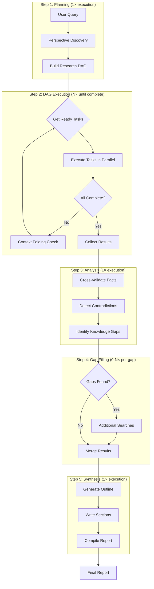
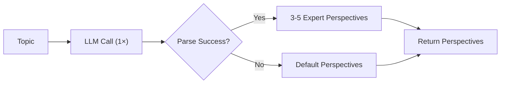
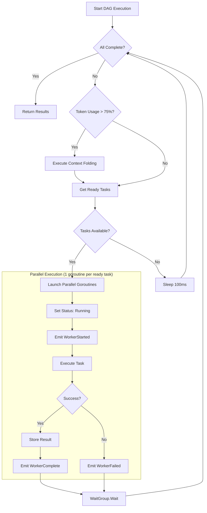
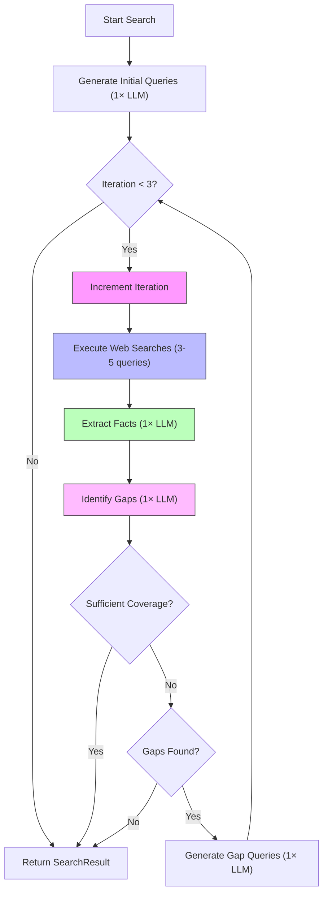
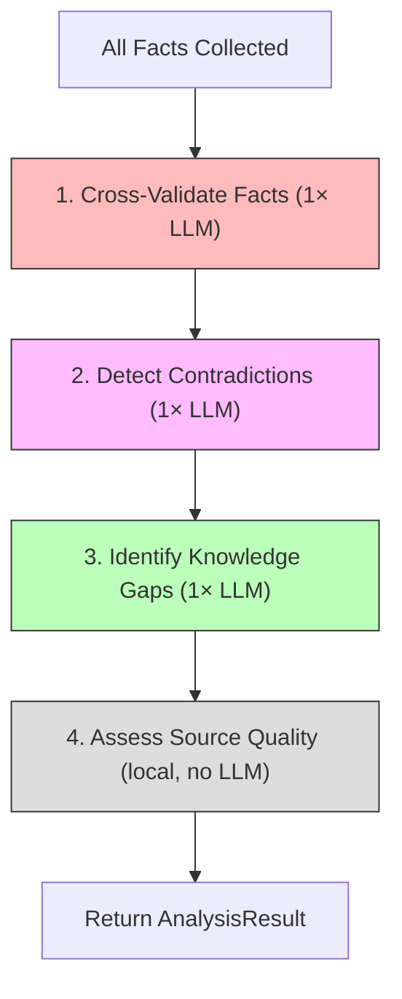
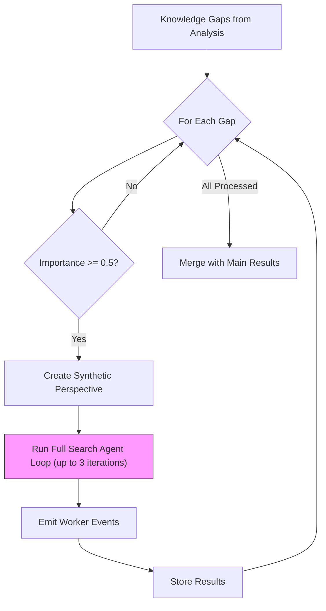
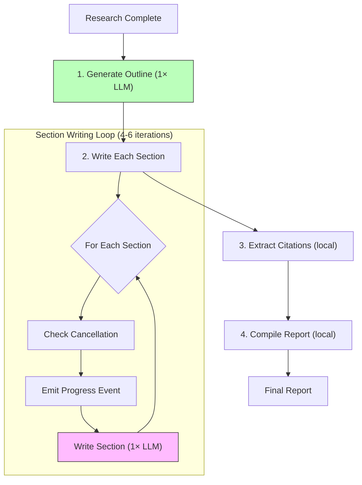
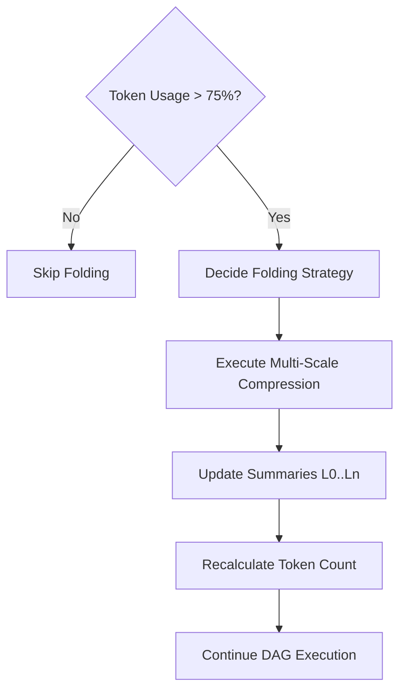

# Go Deep Research Agent

A state-of-the-art deep research agent built in Go, implementing multi-perspective research with DAG-based parallel execution, context folding, and specialized sub-agents.

## Architecture Overview

```
┌──────────────────────────────────────────────────────────────────┐
│                    DeepResearchOrchestrator                      │
│  ┌────────────────────────────────────────────────────────────┐  │
│  │                    Context Manager                         │  │
│  │  ┌─────────────┐ ┌─────────────┐ ┌─────────────────────┐   │  │
│  │  │ Summaries[] │ │ WorkingMem  │ │ ToolMemory          │   │  │
│  │  │ (L0..Ln)    │ │ (last K)    │ │ (consolidated)      │   │  │
│  │  └─────────────┘ └─────────────┘ └─────────────────────┘   │  │
│  └────────────────────────────────────────────────────────────┘  │
│                              │                                   │
│  ┌───────────────────────────▼────────────────────────────────┐  │
│  │                    Planning Agent                          │  │
│  │  • Perspective Discovery  • DAG Creation  • Replanning     │  │
│  └───────────────────────────┬────────────────────────────────┘  │
│                              │                                   │
│    ┌─────────────────────────┼─────────────────────────┐         │
│    │                         │                         │         │
│    ▼                         ▼                         ▼         │
│ ┌──────────┐          ┌──────────────┐          ┌────────────┐   │
│ │ Search   │          │ Analysis     │          │ Synthesis  │   │
│ │ Agent    │          │ Agent        │          │ Agent      │   │
│ └──────────┘          └──────────────┘          └────────────┘   │
│                              │                                   │
│  ┌───────────────────────────▼────────────────────────────────┐  │
│  │                    Tool Layer                              │  │
│  │           search (Brave API)    │    fetch (HTTP)          │  │
│  └────────────────────────────────────────────────────────────┘  │
└──────────────────────────────────────────────────────────────────┘
```

---

## Complete Research Workflow (5 Steps)

The deep research process executes in **5 main steps** with well-defined loops:



---

## Step 1: Planning (1× Execution)

**Files:**
- [`internal/planning/planner.go`](internal/planning/planner.go) - Plan creation
- [`internal/planning/perspectives.go`](internal/planning/perspectives.go) - Perspective discovery
- [`internal/planning/dag.go`](internal/planning/dag.go) - DAG structure

### 1.1 Perspective Discovery Loop



**Loop count:** `1× LLM call`

### 1.2 DAG Construction

```
                    ┌─────────┐
                    │  root   │ (Initial Analysis)
                    └────┬────┘
           ┌─────────────┼─────────────┐
           ▼             ▼             ▼
      ┌─────────┐  ┌─────────┐  ┌─────────┐
      │search_0 │  │search_1 │  │search_2 │  (Parallel per perspective)
      └────┬────┘  └────┬────┘  └────┬────┘
           └─────────────┼─────────────┘
                         ▼
               ┌─────────────────┐
               │ cross_validate  │ (Analysis)
               └────────┬────────┘
                        ▼
               ┌─────────────────┐
               │   fill_gaps     │ (Gap filling)
               └────────┬────────┘
                        ▼
               ┌─────────────────┐
               │   synthesize    │ (Report generation)
               └─────────────────┘
```

**DAG Node Types:**
| Type | Count | Description |
|------|-------|-------------|
| `root` | 1 | Initial topic analysis |
| `search_N` | 3-5 | One per perspective (parallel) |
| `cross_validate` | 1 | Analysis after all searches |
| `fill_gaps` | 1 | Knowledge gap filling |
| `synthesize` | 1 | Report generation |

---

## Step 2: DAG Execution Loop

**File:** [`internal/orchestrator/deep.go:282-369`](internal/orchestrator/deep.go#L282)

### Main DAG Loop (runs until all nodes complete)



**Loop execution counts:**
| Operation | Count |
|-----------|-------|
| Outer loop iterations | Variable until `DAG.AllComplete()` |
| Parallel goroutines per iteration | 1-5 (number of ready tasks) |
| Context folding checks | 1× per outer iteration |

---

## Step 2.1: Search Agent Loop (per perspective)

**File:** [`internal/agents/search.go`](internal/agents/search.go)

Each search task runs an **iterative refinement loop** (max 3 iterations):



**Loop execution counts (per search task):**
| Operation | Per Iteration | Max Total |
|-----------|---------------|-----------|
| Iterations | - | **3** (configurable) |
| Web searches | 3-5 | 15 |
| LLM calls | 3 (queries + facts + gaps) | 9 |

**Termination conditions:**
1. `MaxIterations` reached (default: 3)
2. No knowledge gaps identified
3. Sufficient coverage: `≥5 facts AND <2 gaps`

---

## Step 3: Analysis (1× Execution, 4 Sub-steps)

**File:** [`internal/agents/analysis.go`](internal/agents/analysis.go)



**LLM calls:** `3×` total (no loops, sequential execution)

| Sub-step | LLM Calls | Output |
|----------|-----------|--------|
| Cross-validation | 1 | `ValidatedFacts[]` |
| Contradiction detection | 1 | `Contradictions[]` |
| Gap identification | 1 | `KnowledgeGaps[]` |
| Source quality | 0 (local) | `SourceQuality{}` |

---

## Step 4: Gap Filling Loop (0-N× Iterations)

**File:** [`internal/orchestrator/deep.go:394-446`](internal/orchestrator/deep.go#L394)

Only executes if knowledge gaps with `Importance >= 0.5` were identified.



**Loop execution:**
| Condition | Iterations |
|-----------|------------|
| No gaps or all low importance | 0 |
| Per high-importance gap | 1 search agent execution (up to 3 iterations each) |
| Typical | 0-3 gap filling operations |

---

## Step 5: Synthesis (1× Execution, N Sections)

**File:** [`internal/agents/synthesis.go`](internal/agents/synthesis.go)



**LLM calls:** `1 + N` where N = number of sections (typically 4-6)

| Operation | LLM Calls |
|-----------|-----------|
| Generate outline | 1 |
| Write sections | 4-6 (one per section) |
| **Total** | **5-7** |

---

## Context Folding (Conditional, During DAG Execution)

**Files:**
- [`internal/context/manager.go`](internal/context/manager.go) - Manager
- [`internal/context/folding.go`](internal/context/folding.go) - Folding strategies



**Trigger:** Checked once per DAG loop iteration

---

## Total Execution Summary

```
┌─────────────────────────────────────────────────────────────────────────────┐
│                     TOTAL LOOP EXECUTION COUNTS                             │
├─────────────────────────────────────────────────────────────────────────────┤
│                                                                             │
│  STEP 1: PLANNING                                                           │
│    ├─ Perspective Discovery ────────────────── 1× LLM call                  │
│    └─ DAG Construction ─────────────────────── 0 LLM calls (local)          │
│                                                                             │
│  STEP 2: DAG EXECUTION                                                      │
│    ├─ Outer DAG loop ───────────────────────── Variable until complete      │
│    ├─ Parallel search tasks ────────────────── 3-5 (one per perspective)    │
│    │                                                                        │
│    └─ Per Search Task (SearchAgent loop):                                   │
│         ├─ Max iterations ──────────────────── 3                            │
│         ├─ LLM calls per iteration ─────────── 3 (queries + facts + gaps)   │
│         ├─ Web searches per iteration ──────── 3-5                          │
│         └─ Total LLM per search task ───────── up to 9                      │
│                                                                             │
│  STEP 3: ANALYSIS                                                           │
│    ├─ Cross-validation ─────────────────────── 1× LLM call                  │
│    ├─ Contradiction detection ──────────────── 1× LLM call                  │
│    └─ Gap identification ───────────────────── 1× LLM call                  │
│                                                                             │
│  STEP 4: GAP FILLING (conditional)                                          │
│    └─ Per high-importance gap ──────────────── Full search agent (up to 9 LLM) │
│                                                                             │
│  STEP 5: SYNTHESIS                                                          │
│    ├─ Outline generation ───────────────────── 1× LLM call                  │
│    └─ Section writing ──────────────────────── 4-6× LLM calls               │
│                                                                             │
├─────────────────────────────────────────────────────────────────────────────┤
│  TYPICAL TOTAL (3 perspectives, no gap filling):                            │
│    Planning:     1 LLM                                                      │
│    Search:       3 × 9 = 27 LLM max (often less due to early termination)   │
│    Analysis:     3 LLM                                                      │
│    Synthesis:    6 LLM                                                      │
│    ─────────────────────────────────────                                    │
│    TOTAL:        ~30-40 LLM calls                                           │
│    WEB SEARCHES: ~15-25 queries                                             │
└─────────────────────────────────────────────────────────────────────────────┘
```

---

## Source Files Reference

| Component | File | Description |
|-----------|------|-------------|
| **Orchestrator** | [`internal/orchestrator/deep.go`](internal/orchestrator/deep.go) | Main research coordinator |
| **Planner** | [`internal/planning/planner.go`](internal/planning/planner.go) | Research plan creation |
| **DAG** | [`internal/planning/dag.go`](internal/planning/dag.go) | Task dependency graph |
| **Perspectives** | [`internal/planning/perspectives.go`](internal/planning/perspectives.go) | Multi-perspective discovery |
| **Search Agent** | [`internal/agents/search.go`](internal/agents/search.go) | Iterative web search |
| **Analysis Agent** | [`internal/agents/analysis.go`](internal/agents/analysis.go) | Cross-validation & gaps |
| **Synthesis Agent** | [`internal/agents/synthesis.go`](internal/agents/synthesis.go) | Report generation |
| **Context Manager** | [`internal/context/manager.go`](internal/context/manager.go) | Token budget management |
| **Context Folding** | [`internal/context/folding.go`](internal/context/folding.go) | Multi-scale compression |
| **LLM Client** | [`internal/llm/client.go`](internal/llm/client.go) | OpenRouter API integration |
| **Tools Registry** | [`internal/tools/registry.go`](internal/tools/registry.go) | Tool execution |
| **Web Search** | [`internal/tools/search.go`](internal/tools/search.go) | Brave Search integration |
| **Events** | [`internal/events/bus.go`](internal/events/bus.go) | Event system for progress |
| **Event Types** | [`internal/events/types.go`](internal/events/types.go) | Event type definitions |

---

## Key Features

### 1. Multi-Perspective Research (STORM-style)

The agent discovers 3-5 expert perspectives before starting research:

```
Topic: "State of autonomous vehicles in 2025"

Discovered Perspectives:
├── Technical Expert: Implementation details, sensor fusion, AI models
├── Industry Analyst: Market trends, company strategies, investments
├── Safety Regulator: Compliance, testing standards, certification
├── End User Advocate: Accessibility, UX, consumer concerns
└── Critic: Limitations, failure modes, ethical concerns
```

Each perspective generates targeted search queries and ensures comprehensive coverage.

### 2. DAG-Based Parallel Execution

Research tasks are organized as a Directed Acyclic Graph:

```
                    ┌─────────┐
                    │  root   │  Initial topic analysis
                    └────┬────┘
           ┌─────────────┼─────────────┐
           ▼             ▼             ▼
      ┌─────────┐  ┌─────────┐  ┌─────────┐
      │search_0 │  │search_1 │  │search_2 │  Parallel perspective searches
      └────┬────┘  └────┬────┘  └────┬────┘
           └─────────────┼─────────────┘
                         ▼
                ┌────────────────┐
                │ cross_validate │  Analyze findings, find contradictions
                └───────┬────────┘
                        ▼
                  ┌───────────┐
                  │ fill_gaps │  Address knowledge gaps
                  └─────┬─────┘
                        ▼
                 ┌────────────┐
                 │ synthesize │  Generate final report
                 └────────────┘
```

Tasks run in parallel when their dependencies are satisfied.

### 3. Context Folding (AgentFold-style)

Proactive context management prevents token budget exhaustion:

- **Multi-scale Summaries**: L0 (fine) → Ln (coarse) compression levels
- **Working Memory**: Last K uncompressed interactions
- **Tool Memory**: Consolidated tool call history
- **Automatic Folding**: Triggers at configurable threshold (default 75%)

### 4. Specialized Sub-Agents

| Agent | Purpose | Key Features |
|-------|---------|--------------|
| **Search Agent** | Iterative web search | Query generation, fact extraction, gap identification |
| **Analysis Agent** | Cross-validation | Contradiction detection, source quality assessment |
| **Synthesis Agent** | Report generation | Outline creation, section writing, citation management |

### 5. Knowledge Gap Analysis

The agent iteratively identifies and fills knowledge gaps:

1. Initial search from each perspective
2. Cross-validate gathered facts
3. Identify missing coverage areas
4. Generate follow-up queries for gaps
5. Repeat until sufficient coverage

### 6. Cost Tracking

- Every LLM call records prompt/output tokens and per-stage USD cost
- Search, analysis, synthesis, planning, and context folding agents expose their individual cost breakdowns
- The deep orchestrator aggregates and streams these updates so the REPL can display live spend + final totals

## Usage

### CLI Commands

```bash
# Start the REPL
go run cmd/research/main.go

# Quick single-worker research
/fast What is quantum computing?

# Deep multi-perspective research (recommended)
/deep What is the state of autonomous vehicles in 2025?

# Session management
/sessions          # List all sessions
/load <id>         # Load a previous session
/new               # Start fresh

# Expand on research
/expand Tell me more about sensor fusion

# Other commands
/workers           # Show current workers
/rerun <num>       # Re-run a specific worker
/recompile         # Regenerate report from existing data
/verbose           # Toggle debug output
/help              # Show all commands
```

### Environment Variables

```bash
export OPENROUTER_API_KEY="your-key"  # Required: LLM API access
export BRAVE_API_KEY="your-key"       # Required: Web search
export OBSIDIAN_VAULT="~/obsidian"    # Optional: Save reports to Obsidian
```

### Programmatic Usage

```go
import (
    "go-research/internal/config"
    "go-research/internal/events"
    "go-research/internal/orchestrator"
)

cfg := config.Load()
bus := events.NewBus(100)
defer bus.Close()

// Create deep orchestrator
orch := orchestrator.NewDeepOrchestrator(bus, cfg)

// Run research
result, err := orch.Research(ctx, "Your research question")
if err != nil {
    log.Fatal(err)
}

// Access results
fmt.Println(result.Report.FullContent)
fmt.Printf("Sources: %d\n", len(result.SearchResults))
fmt.Printf("Duration: %s\n", result.Duration)
```

## Package Structure

```
go-research/
├── cmd/research/main.go          # CLI entry point
├── internal/
│   ├── agents/                   # Specialized sub-agents
│   │   ├── search.go            # Iterative search with gap analysis
│   │   ├── analysis.go          # Cross-validation, contradiction detection
│   │   └── synthesis.go         # Report generation with citations
│   ├── context/                  # Context management
│   │   ├── manager.go           # Multi-scale summary management
│   │   ├── folding.go           # Compression strategies
│   │   └── builder.go           # Message construction
│   ├── planning/                 # Research planning
│   │   ├── dag.go               # DAG data structure
│   │   ├── perspectives.go      # Expert perspective discovery
│   │   └── planner.go           # Plan creation
│   ├── orchestrator/            # Coordination
│   │   ├── orchestrator.go      # Basic orchestrator (fast mode)
│   │   └── deep.go              # Deep research orchestrator
│   ├── repl/                    # Interactive CLI
│   │   ├── repl.go              # Main REPL loop
│   │   ├── handlers/            # Command handlers
│   │   ├── visualizer.go        # Live worker display
│   │   ├── panels.go            # Worker panel rendering
│   │   └── renderer.go          # Output formatting
│   ├── tools/                   # External tool integrations
│   │   ├── search.go            # Brave Search API
│   │   └── fetch.go             # HTTP content fetching
│   ├── events/                  # Event-driven architecture
│   │   ├── bus.go               # Pub/sub event bus
│   │   └── types.go             # Event type definitions
│   ├── session/                 # Session persistence
│   ├── obsidian/                # Obsidian vault integration
│   ├── llm/                     # LLM client (OpenRouter)
│   └── config/                  # Configuration
```

## Research Workflow

### Deep Research Flow

```
1. User Query
      │
      ▼
2. Perspective Discovery
   └── LLM identifies 3-5 expert viewpoints
      │
      ▼
3. DAG Construction
   └── Build task graph with dependencies
      │
      ▼
4. Parallel Search Execution
   ├── Each perspective searches independently
   ├── Iterative query refinement
   └── Fact extraction with confidence scores
      │
      ▼
5. Cross-Validation
   ├── Identify contradictions
   ├── Assess source quality
   └── Detect knowledge gaps
      │
      ▼
6. Gap Filling
   └── Additional searches for missing coverage
      │
      ▼
7. Report Synthesis
   ├── Generate outline from perspectives
   ├── Write sections with citations
   └── Include contradiction notes
      │
      ▼
8. Output
   ├── Display in terminal
   ├── Save to session store
   └── Export to Obsidian vault
```

### Event-Driven UI Updates

The CLI provides real-time feedback via an event bus:

| Event | Description |
|-------|-------------|
| `EventResearchStarted` | Research begins |
| `EventPlanCreated` | Perspectives discovered, workers initialized |
| `EventWorkerStarted` | Individual worker begins |
| `EventLLMChunk` | Streaming LLM output |
| `EventToolCall` | Tool invocation (search, fetch) |
| `EventWorkerComplete` | Worker finished successfully |
| `EventWorkerFailed` | Worker encountered error |
| `EventSynthesisStarted` | Report generation begins |
| `EventResearchComplete` | All done |

## Configuration

### Context Manager

```go
context.Config{
    MaxTokens:      40000,  // Token budget
    FoldThreshold:  0.75,   // Fold at 75% capacity
    NumLevels:      3,      // Summary hierarchy depth
    WorkingMemSize: 5,      // Recent interactions to keep
}
```

### Search Agent

```go
agents.SearchConfig{
    MaxIterations: 3,  // Max search refinement rounds
}
```

### Orchestrator

```go
orchestrator.Config{
    MaxWorkers:    5,            // Max parallel workers
    WorkerTimeout: 30 * time.Minute,
    MaxIterations: 20,           // Per-worker iteration limit
}
```

## Output Formats

### Terminal Display

Live worker panels show real-time progress:

```
┌─ ⚡ Worker 1: Technical Expert - Implementation details ─────────┐
│ Analyzing sensor fusion approaches used in modern AV systems...   │
│ Found 12 papers on LiDAR-camera fusion architectures              │
└─ • thinking... ────────────────────────────────────────────────────┘

┌─ 🔧 Worker 2: Industry Analyst - Market trends ──────────────────┐
│ Retrieved market data from Bloomberg and Reuters...               │
│ Key finding: $127B projected market by 2030                       │
└─ → search ─────────────────────────────────────────────────────────┘

┌─ ✓ Worker 3: Safety Regulator - Compliance standards ────────────┐
│ Compiled regulatory frameworks from NHTSA, EU, and China          │
│ ISO 26262 and UL 4600 are primary safety standards                │
└─ ✓ complete ───────────────────────────────────────────────────────┘
```

### Obsidian Integration

Sessions are saved to your Obsidian vault with full metadata:

```
obsidian-vault/
└── session-abc123/
    ├── session.md           # Map of Content with links
    ├── reports/
    │   └── report_v1.md     # Final report with frontmatter
    ├── workers/
    │   ├── worker_1.md      # Technical Expert findings
    │   ├── worker_2.md      # Industry Analyst findings
    │   └── worker_3.md      # Safety Regulator findings
    ├── insights/
    └── sources/
```

Each file includes YAML frontmatter for Obsidian queries:

```yaml
---
session_id: abc123
version: 1
query: "State of autonomous vehicles in 2025"
complexity_score: 0.8
status: complete
created_at: 2025-01-15T10:30:00Z
cost: 0.0234
---
```

## Implementation Details

### Fact Extraction

Facts are extracted with confidence scores and source attribution:

```go
type Fact struct {
    Content    string  `json:"content"`
    Source     string  `json:"source"`
    Confidence float64 `json:"confidence"`  // 0.0-1.0
}
```

### Contradiction Detection

The analysis agent identifies conflicting claims:

```go
type Contradiction struct {
    Claim1  string  // First claim
    Source1 string  // Source of first claim
    Claim2  string  // Contradicting claim
    Source2 string  // Source of second claim
    Nature  string  // "direct", "nuanced", or "scope"
}
```

### Knowledge Gaps

Gaps are prioritized by importance with suggested queries:

```go
type KnowledgeGap struct {
    Description      string   // What's missing
    Importance       float64  // 0.0-1.0 priority
    SuggestedQueries []string // Follow-up searches
}
```

## Extending the Agent

### Adding New Tools

1. Implement the `ToolExecutor` interface in `internal/tools/`
2. Register in the tool registry
3. Tools are automatically available to all agents

### Adding New Perspectives

Modify `internal/planning/perspectives.go`:

```go
func defaultPerspectives(topic string) []Perspective {
    return []Perspective{
        {Name: "Technical Expert", Focus: "...", Questions: []string{...}},
        {Name: "Your New Perspective", Focus: "...", Questions: []string{...}},
    }
}
```

### Custom Analysis

The analysis agent can be extended with new validation strategies in `internal/agents/analysis.go`.

## Performance Considerations

- **Parallel Execution**: DAG enables concurrent perspective searches
- **Token Budget**: Context folding prevents runaway costs
- **Rate Limiting**: Respects API rate limits via tool layer
- **Caching**: Session store enables resuming research

## References

- **STORM**: [Stanford STORM Paper](https://arxiv.org/abs/2402.14207) - Multi-perspective article generation
- **AgentFold**: Context compression for long-horizon tasks
- **Search-R1**: Iterative search with reasoning traces
- **ReAct**: Reasoning + Acting paradigm for agents

## License

MIT License - See LICENSE file for details.
