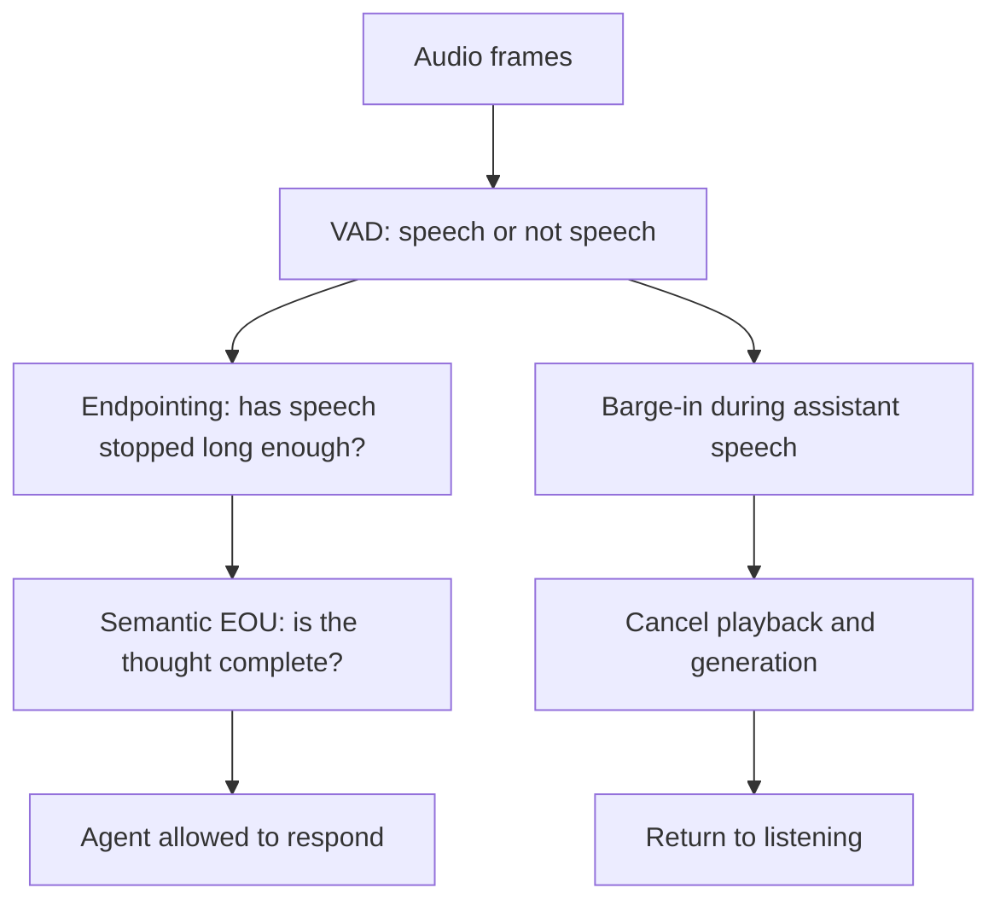
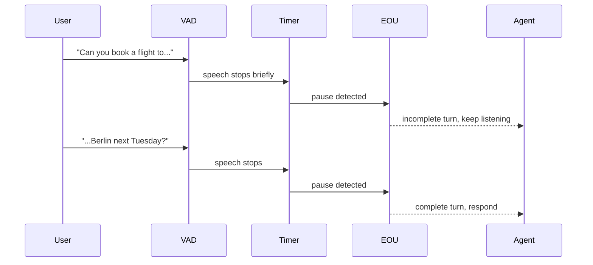

# Endpointing Is Turn-Taking

Voice activity detection is not turn-taking. VAD answers a narrow acoustic question:
"does this audio frame look like speech?" A voice agent has to answer a social and
product question: "is the user done enough that the assistant should talk now?"

Those are different decisions. If they are collapsed into one silence timer, the product
usually fails in one of two ways. A short timer makes the assistant interrupt unfinished
thoughts. A long timer makes the assistant feel slow. The better architecture separates
speech detection, acoustic endpointing, semantic end-of-utterance, and interruption.

## The Three-Layer Model

The clean model is not "VAD fires, then agent responds." It is a layered turn-taking
system.



This distinction matters because each layer has different failure modes.

| Layer        | Input                                   | Output                                  | Failure mode                                         |
| ------------ | --------------------------------------- | --------------------------------------- | ---------------------------------------------------- |
| VAD          | Raw audio frames                        | Speech probability or speech/non-speech | Noise looks like speech, soft speech is missed.      |
| Endpointing  | VAD state plus silence duration         | "User stopped speaking"                 | Pauses inside a thought become false ends.           |
| Semantic EOU | Recent audio/transcript/context         | "User's turn is complete"               | The model misreads hesitation, grammar, or intent.   |
| Barge-in     | User speech while assistant is speaking | Cancel assistant speech                 | Backchannels or echo stop the assistant incorrectly. |

The important product point: VAD quality is necessary, but it is not sufficient.

## VAD Measures Speech Presence

Silero's quality metrics are useful because they show why modern neural VAD is attractive.
The archived Silero wiki reports ROC-AUC on `31.25 ms` segments and separately reports
accuracy with validation-selected thresholds. On the multi-domain validation set, WebRTC
VAD is far behind Silero v5/v6.

| Model      | Multi-domain ROC-AUC | Multi-domain accuracy | Source   |
| ---------- | -------------------: | --------------------: | -------- |
| WebRTC VAD |               `0.73` |                `0.74` | R-VA-005 |
| Silero v4  |               `0.91` |                `0.85` | R-VA-005 |
| Silero v5  |               `0.96` |                `0.91` | R-VA-005 |
| Silero v6  |               `0.97` |                `0.92` | R-VA-005 |

This supports a strong but limited conclusion. Silero is a better speech detector than
WebRTC on this archived benchmark. It does not prove Silero knows when a user has finished
their thought. A model can classify speech frames well and still make bad turn-taking
decisions if it is wrapped in the wrong endpointing policy.

The local VAD deep dive also records the low-level knobs that often become accidental
conversation policy:

| Parameter                 | Typical/default value | Meaning                                   |
| ------------------------- | --------------------: | ----------------------------------------- |
| `threshold`               |                 `0.5` | Speech probability threshold.             |
| `window_size_samples`     |       `512` at 16 kHz | About `32 ms` input chunks.               |
| `min_speech_duration_ms`  |              `250 ms` | Minimum segment before accepting speech.  |
| `min_silence_duration_ms` |              `100 ms` | Minimum silence to split speech segments. |
| `speech_pad_ms`           |               `30 ms` | Padding around detected speech.           |

These are acoustic parameters. They should not be the only conversation parameters.

## Silence Duration Is A Product Decision

OpenAI's Realtime API reference makes the policy surface explicit. `server_vad` exposes
`threshold`, `prefix_padding_ms`, and `silence_duration_ms`. In the archived reference,
`threshold` defaults to `0.5`, `prefix_padding_ms` defaults to `300 ms`, and
`silence_duration_ms` defaults to `500 ms`. The reference text also states the tradeoff:
shorter values respond faster but may jump in on short pauses.

That one setting can dominate the budget. If the silence timer is `500 ms`, then the
system waits half a second before STT finalization, LLM, and TTS even get their turn.

| System/layer                        |                        Reported/default timing | What it means                                            |
| ----------------------------------- | ---------------------------------------------: | -------------------------------------------------------- |
| Silero frame size                   |                                  about `32 ms` | Fast speech/non-speech updates.                          |
| OpenAI `server_vad` silence default |                                       `500 ms` | Silence required before speech-stop decision.            |
| Local Jarvis VAD note               |                                       `700 ms` | Conservative local endpointing policy.                   |
| Pipecat Smart Turn v3               | under `100 ms` local CPU inference after pause | Semantic turn model can run inline after acoustic pause. |
| Deepgram Flux EOT claim             |                                 about `260 ms` | Vendor-claimed conversational end-of-turn detection.     |

This table is the reason endpointing needs its own insight. A "fast model" behind a slow
turn policy is still a slow product.

## Semantic EOU Is A Different Class Of Decision

Semantic end-of-utterance asks whether the user's thought is complete, not whether the
microphone is quiet. That is why modern voice infrastructure increasingly exposes turn
detection as a separate feature.



Pipecat Smart Turn is a clear example. The local data file records v3 as running after
VAD detects a pause, using the most recent `8 s` of the user turn, with under `100 ms`
local CPU inference and around `65 ms` on Pipecat Cloud 1x. LiveKit's docs similarly
separate VAD-only, STT endpointing, realtime model detection, and turn-detector models.
OpenAI exposes `semantic_vad` with `eagerness` settings and timeout behavior.

The stronger inference is that turn-taking is becoming a first-class subsystem. STT
providers and agent frameworks are no longer only exposing transcripts. They are exposing
permission-to-speak events.

## Deepgram Flux Shows EOT As Product Surface

Deepgram Flux is useful because it packages conversational STT around end-of-turn events.
The local turn-detection table captures these provider claims and defaults:

| Deepgram Flux field/claim |                Value | Caveat                                                    |
| ------------------------- | -------------------: | --------------------------------------------------------- |
| Recommended audio chunks  |              `80 ms` | Provider-specific streaming guidance.                     |
| `eot_threshold` default   |                `0.7` | Higher thresholds reduce false positives but add latency. |
| `eot_timeout_ms` default  |           `5,000 ms` | Forced completion safety net.                             |
| EOT detection             |       about `260 ms` | Vendor claim.                                             |
| Final `EndOfTurn` p95     |       within `1.5 s` | Vendor claim.                                             |
| `EagerEndOfTurn`          | `150-250 ms` earlier | Trades speed for more speculative downstream work.        |
| Agent latency reduction   |         `200-600 ms` | Vendor claim versus traditional STT+VAD.                  |

These claims should not be compared directly to Pipecat, OpenAI, or LiveKit without a
shared test set. But they show the market direction: end-of-turn is part of the speech
product, not an afterthought.

## The Human Baseline Explains Why Silence-Only Feels Wrong

Stivers et al. report cross-language turn transitions with a full-dataset mean response
offset around `208 ms`. The important part is not the exact number. Humans can answer
quickly because they anticipate turn completion from syntax, prosody, gaze, action type,
and shared context.

Silence-only endpointing does the opposite. It waits for absence. That is why a pure
silence timer tends to feel either sluggish or interruptive. Semantic EOU is an attempt
to add a small amount of prediction back into the agent loop.

## What To Measure

Endpointing needs its own metrics. WER does not catch these failures.

| Metric                              | Question it answers                                        |
| ----------------------------------- | ---------------------------------------------------------- |
| Start-of-speech latency             | How quickly does the system know the user began speaking?  |
| End-of-speech latency               | How quickly does acoustic speech stop get detected?        |
| End-of-turn latency                 | How quickly does the system decide the user is done?       |
| False EOT rate                      | How often does the agent interrupt unfinished turns?       |
| Missed EOT rate                     | How often does the agent wait after complete turns?        |
| Backchannel false interruption rate | How often do "yeah", "mm-hm", or noise stop the assistant? |
| Barge-in success rate               | Can the user interrupt assistant speech and be heard?      |

The implementation should also preserve evidence. A turn decision should be explainable:
which VAD state, silence duration, transcript fragment, semantic EOU score, and timeout
produced the decision?

```typescript
type TurnDecision = {
  requestId: string;
  decision: 'keep_listening' | 'respond' | 'cancel_assistant';
  vadSpeechProbability: number;
  silenceDurationMs: number;
  semanticEouScore?: number;
  transcriptFragment?: string;
  decidedAtMs: number;
};
```

This makes turn-taking debuggable instead of mystical.

## Product Profiles

Different agents should use different turn-taking policies.

| Mode            | Turn-taking preference                         | Likely configuration                                          |
| --------------- | ---------------------------------------------- | ------------------------------------------------------------- |
| Quick command   | Fast response, tolerates occasional false ends | Shorter silence, eager semantic EOU, strong cancellation.     |
| Support agent   | Avoid interrupting the user                    | More patient endpointing, semantic EOU, backchannel handling. |
| Noisy telephony | Avoid noise-triggered speech                   | Stricter VAD, noise suppression, provider EOT validation.     |
| Stage demo      | Reliability beats naturalness                  | Push-to-talk or explicit turn control may be better.          |

This is the core conclusion: endpointing is not an implementation detail. It is how the
agent expresses politeness, patience, and timing.

## Non-Claims

- Silero's VAD ROC-AUC does not prove good turn-taking.
- Semantic EOU does not remove the need for VAD.
- Lower silence duration is not automatically better.
- Vendor EOT latency claims are not apples-to-apples.
- Human turn-taking timing is not a universal product SLA.

## References

- R-VA-002: Local VAD deep dive, `presentations/voice-agents/VAD-DEEP-DIVE.md`
- R-VA-005: Silero VAD quality metrics, `presentations/voice-agents/research/articles/silero-vad-quality-metrics.html`, https://github.com/snakers4/silero-vad/wiki/Quality-Metrics
- R-VA-007: OpenAI Realtime API reference, `presentations/voice-agents/research/articles/openai-realtime-api-reference.html`, https://developers.openai.com/api/reference/resources/realtime
- R-VA-008: LiveKit turns overview, `presentations/voice-agents/research/articles/livekit-turns.html`, https://docs.livekit.io/agents/logic/turns/
- R-VA-009: Pipecat Smart Turn, `presentations/voice-agents/research/articles/pipecat-smart-turn.html`, https://docs.pipecat.ai/server/utilities/turn-detection/smart-turn-overview
- R-VA-020: Deepgram Flux docs, `presentations/voice-agents/research/articles/deepgram-flux-*.html`, https://developers.deepgram.com/docs/flux/quickstart
- R-VA-022: Stivers et al., "Universals and cultural variation in turn-taking in conversation", https://pmc.ncbi.nlm.nih.gov/articles/PMC2705608/
- Data: `presentations/voice-agents/research/data/turn_detection.csv`
