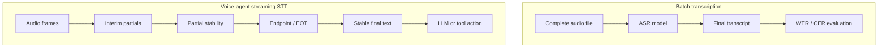
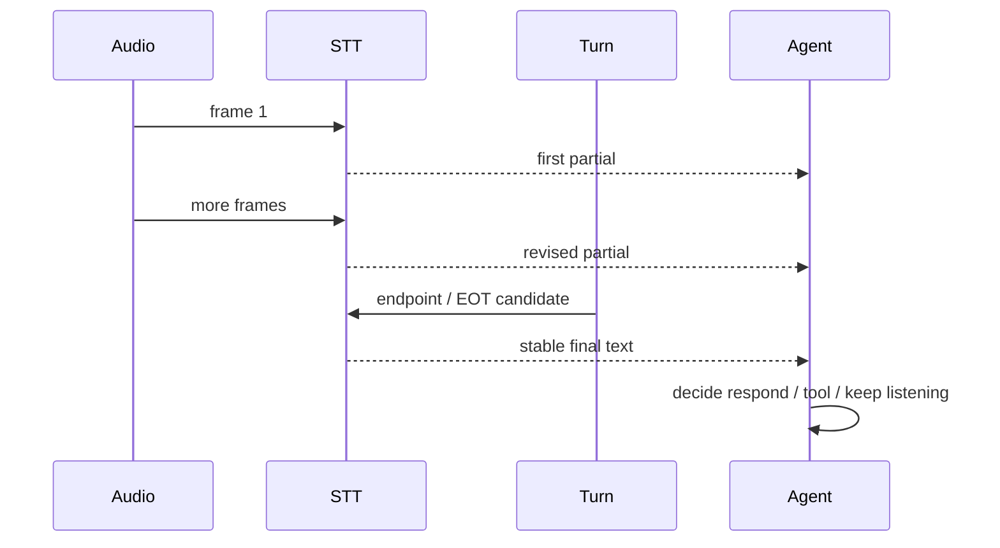

# Streaming STT Is Not Batch STT

Batch speech recognition asks a file-processing question: "what transcript can I produce
for this audio?" Streaming STT in a voice agent asks a systems question: "what stable
enough interpretation can I produce soon enough for the agent to decide whether to speak,
call a tool, or keep listening?"

WER is still necessary. A voice agent that misunderstands users is bad. But WER alone is
not a voice-agent metric. A low-WER model can still be the wrong choice if it produces
stable text too late, rewrites partials aggressively, or cannot signal end-of-turn
reliably.

## The Two Evaluation Questions

The difference between batch STT and agent STT is easiest to see as two loops.



Batch evaluation can wait for the whole file. A voice agent cannot. It needs text early
enough to drive turn-taking and response generation, while still avoiding premature or
incorrect actions.

## WER Is Necessary But Not Sufficient

WER measures edit distance between a transcript and a reference:

```text
WER = (substitutions + deletions + insertions) / reference_words
```

That is a useful quality metric. But the agent needs several additional measurements.

| Metric                     | What it catches                                | Why WER misses it                                        |
| -------------------------- | ---------------------------------------------- | -------------------------------------------------------- |
| Time to first partial      | When the system can start forming context.     | WER is measured after transcription completes.           |
| Partial churn              | Whether early text is stable enough to use.    | Final text can be correct even if partials were chaotic. |
| Finalization latency       | When the agent can safely act.                 | Batch benchmarks do not model turn boundaries.           |
| False EOT rate             | Whether the agent interrupts unfinished users. | The final transcript may still be accurate.              |
| Entity WER                 | Names, product terms, numbers, codes.          | Average WER can hide domain-critical mistakes.           |
| P95/P99 latency            | Tail behavior under load.                      | Mean accuracy does not reveal slow calls.                |
| Noise/telephony robustness | Real deployment conditions.                    | Clean audiobook datasets are not phone calls.            |

The practical rule: use WER as the floor, not the decision.

## Open ASR Leaderboard Is Useful But Not Sufficient

The Open ASR Leaderboard is valuable because it standardizes average WER and inverse
real-time factor, RTFx, across many systems. The paper defines RTFx as total audio
duration divided by transcription time, so higher is faster. The reported short-form
English results were measured on NVIDIA A100-SXM4-80GB hardware.

Copied subset from the paper's Table 3:

| Model                          | Open | Avg. WER |         RTFx | Encoder       | Decoder     | Languages |
| ------------------------------ | ---- | -------: | -----------: | ------------- | ----------- | --------: |
| Cohere Labs Transcribe         | Yes  |   `5.42` |        `525` | FastConformer | Transformer |      `14` |
| NVIDIA Canary Qwen 2.5B        | Yes  |   `5.63` |        `418` | FastConformer | LLM         |       `1` |
| Qwen3 ASR 1.7B                 | Yes  |   `5.76` |        `148` | Custom        | LLM         |      `52` |
| NVIDIA Parakeet TDT 0.6B v2    | Yes  |   `6.05` |       `3390` | FastConformer | TDT         |       `1` |
| NVIDIA Parakeet TDT 0.6B v3    | Yes  |   `6.32` |       `3330` | FastConformer | TDT         |      `25` |
| Google Chirp v2                | No   |   `6.42` | not reported | not listed    | not listed  |     `468` |
| Mistral Voxtral Small 24B      | Yes  |   `6.62` |       `54.1` | Whisper-FT    | LLM         |       `8` |
| OpenAI Whisper Large v3        | Yes  |   `7.44` |        `146` | Whisper       | Whisper     |      `99` |
| OpenAI Whisper Large v3 Turbo  | Yes  |   `7.83` |        `200` | Whisper       | Whisper     |      `99` |
| NVIDIA FastConformer CTC Large | Yes  |   `8.96` |       `6400` | FastConformer | CTC         |       `1` |

The table is excellent for understanding accuracy/throughput tradeoffs. It does not tell
you when a voice agent can speak. RTFx can be computed over an utterance or a batch of
audio; it is a throughput metric, not an end-of-turn latency metric.

The paper itself makes the architecture tradeoff visible: transformer/LLM decoders have
the best average WER in the short-form table, while TDT/CTC systems offer much higher
RTFx. For a voice agent, neither side automatically wins. The question is which system
produces sufficiently correct, sufficiently stable text at the right point in the turn.

## Moonshine v2 Measures The Live Question More Directly

Moonshine v2 is useful because it measures response latency in a live-transcription-like
setup. The paper defines response latency as the time between VAD detecting the end of a
speech segment and the returned transcript. The empirical latency table was measured on
an Apple MacBook M3.

| Model               |   Params | Moonshine Table 3 Libri clean WER | Moonshine Table 3 average WER | Response latency | Compute load |
| ------------------- | -------: | --------------------------------: | ----------------------------: | ---------------: | -----------: |
| Moonshine v2 Tiny   |    `34M` |                           `4.49%` |                      `12.01%` |          `50 ms` |      `8.03%` |
| Moonshine v2 Small  |   `123M` |                           `2.49%` |                       `7.84%` |         `148 ms` |     `17.97%` |
| Moonshine v2 Medium |   `245M` |                           `2.08%` |                       `6.65%` |         `258 ms` |     `28.95%` |
| Whisper Tiny        |    `39M` |        not reported in that table |    not reported in that table |         `289 ms` |      `8.46%` |
| Whisper Base        |    `74M` |        not reported in that table |    not reported in that table |         `553 ms` |     `16.19%` |
| Whisper Small       |   `244M` |        not reported in that table |    not reported in that table |       `1,940 ms` |     `56.84%` |
| Whisper Large v3    | `1,550M` |        not reported in that table |    not reported in that table |      `11,286 ms` |    `330.65%` |

This is not a cloud provider benchmark. It is not a universal ranking. But it does show
why "designed for live use" matters. The authors explicitly contrast online processing
applications such as live captioning with offline processing scenarios where overall
throughput is the main concern.

For a local voice-agent demo, this is a much better shape of evidence than WER alone.

For Whisper accuracy context, I keep a separate table from the local STT deep dive and
the Whisper paper appendix rather than merging it into the Moonshine table. The local
note records Whisper Tiny at `7.54%`, Base at `5.01%`, Small at `3.43%`, Medium at
`2.90%`, Large v3 around `2.7%`, and Turbo around `3.0%` on LibriSpeech clean. Those
numbers answer "how accurate is the recognizer on this clean benchmark?" The Moonshine
response-latency table answers "how long after detected speech end did this benchmark
return a transcript?" They are both useful, but they are not the same measurement.

## Whisper Is The Baseline, Not The Whole Category

Whisper remains the default mental baseline because it is robust, well-known, open, and
widely wrapped by tooling such as faster-whisper. The Whisper paper reports training on
`680,000` hours of multilingual and multitask supervision. That matters: Whisper changed
the baseline expectations for open speech recognition.

But using Whisper in a live agent normally means adding VAD, chunking, buffering,
endpointing, and finalization rules around a model that was not originally framed as a
low-latency turn-taking component. The failure is not "Whisper is bad." The failure is
treating a strong batch transcription baseline as if it automatically solves streaming
interaction.

## The Streaming STT Timeline

The agent cares about a timeline, not only the final transcript.



A partial transcript can be useful before it is final. The LLM can prefetch context,
prepare a likely answer, or start speculative work. But this is only safe if partial churn
is measured. If the STT system repeatedly rewrites the user's intent, speculation becomes
a source of wrong actions.

## What A Voice-Agent STT Benchmark Should Include

For a real voice agent, the evaluation table should look more like this:

| Metric                     | Why it matters                                      | How to measure                                       |
| -------------------------- | --------------------------------------------------- | ---------------------------------------------------- |
| WER/CER                    | Base transcription quality.                         | Reference transcript comparison after normalization. |
| Entity WER                 | Names, product terms, numbers, codes.               | Domain entity extraction plus transcript alignment.  |
| Time to first partial      | Enables early context and perceived responsiveness. | Audio start -> first interim transcript.             |
| Partial churn              | Determines whether early text is safe to use.       | Edit distance between successive partials and final. |
| End-of-turn latency        | Determines when the LLM can safely act.             | Human stop time -> EOT/stable final.                 |
| False EOT rate             | Detects interruption risk.                          | Incomplete turns marked complete.                    |
| Missed EOT rate            | Detects dead air.                                   | Complete turns not closed within target.             |
| P95/P99 latency            | Captures tail frustration.                          | Percentiles over calls, not only mean.               |
| Concurrency RTF/RTFx       | Predicts serving cost and capacity.                 | Benchmark at expected stream count.                  |
| Telephony/noise robustness | Matches deployment reality.                         | Test 8 kHz, packet loss, echo, background speech.    |

This benchmark should be domain-specific. A general model can score well on audiobook
speech and fail on customer names, medication names, city names, stock tickers, or product
SKUs.

## Engineering Implications

Pick STT by conversation behavior, not by clean benchmark rank.

For local demos, Moonshine v2 is worth highlighting because it directly targets
latency-critical local ASR and reports response latency in a live scenario. For broad
ecosystem compatibility, Whisper/faster-whisper remains useful. For production systems,
leaderboard leaders such as Canary, Parakeet, Qwen3 ASR, or provider systems should be
evaluated on the product's own domain audio and turn boundaries.

The STT component should expose more than text:

```typescript
type StreamingTranscriptEvent = {
  requestId: string;
  text: string;
  isFinal: boolean;
  startedAtMs: number;
  emittedAtMs: number;
  confidence?: number;
  partialRevision?: number;
  endpointReason?: 'silence' | 'semantic_eou' | 'timeout';
};
```

That event shape lets the rest of the agent distinguish "useful context" from "safe to
act."

## Non-Claims

- Open ASR Leaderboard does not rank best voice-agent STT.
- Moonshine v2 latency numbers do not prove best accuracy on every domain.
- RTFx is not the same as end-of-turn latency.
- WER on LibriSpeech clean does not predict noisy phone-call behavior.
- Cloud vendor latency should be remeasured from the client environment.

## References

- R-VA-001: Local STT deep dive, `presentations/voice-agents/STT-DEEP-DIVE.md`
- R-VA-003: Moonshine v2, `presentations/voice-agents/research/paper-text/moonshine-v2-2602.12241.txt`, https://arxiv.org/abs/2602.12241
- R-VA-004: Open ASR Leaderboard, `presentations/voice-agents/research/paper-text/open-asr-leaderboard-2510.06961.txt`, https://arxiv.org/abs/2510.06961
- R-VA-020: Deepgram Flux docs, `presentations/voice-agents/research/articles/deepgram-flux-*.html`, https://developers.deepgram.com/docs/flux/quickstart
- R-VA-026: NVIDIA Parakeet model card, `presentations/voice-agents/research/articles/nvidia-parakeet-tdt-06b-v3.html`
- R-VA-030: Whisper paper, `presentations/voice-agents/research/paper-text/whisper-2212.04356.txt`, https://arxiv.org/abs/2212.04356
- Data: `presentations/voice-agents/research/data/stt_models.csv`
