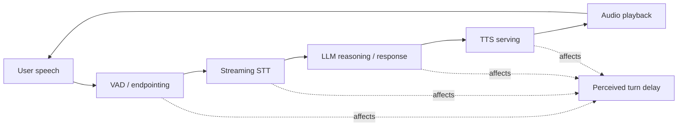
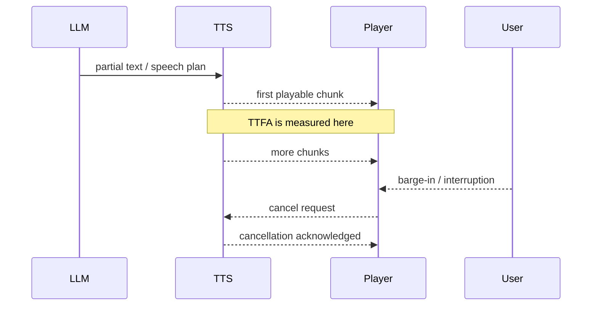
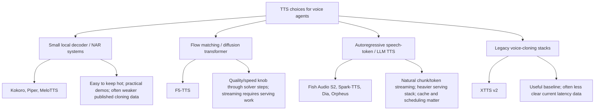
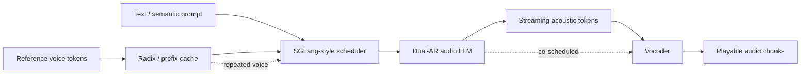

# TTS Latency Is Architecture

Text-to-speech latency is often discussed as if it is one model benchmark: choose the
voice that sounds best, check that it is "fast", then wire it into the agent. That is the
wrong mental model for voice agents. In a real-time agent, TTS is a media-serving
component. The important question is not only "can the model generate audio faster than
real time?" It is also "when does the first playable audio arrive?", "can the audio be
streamed smoothly?", "can the system stop mid-sentence when the user interrupts?", and
"does the serving stack stay fast when the same voice is reused across many requests?"

The short version: TTS latency is an architectural property. Model choice matters, but the
latency a user feels comes from model family, generation shape, streaming support,
caching, scheduling, vocoder placement, and playback control.

## Where TTS Sits In A Voice Agent

A voice agent is a pipeline with multiple latency sources. TTS is the last generative
stage before the user hears the assistant, so it turns upstream delay into a felt pause.



The TTS stage starts after the agent has enough response content to speak. In a simple
batch system, the LLM creates a full sentence or paragraph, TTS synthesizes the whole
utterance, and the player starts only when the file is ready. That is acceptable for
offline narration. It is bad for interactive agents. A real-time agent needs the TTS
stage to behave like a stream of cancellable media chunks.



This is why a paper reporting a low real-time factor is not enough. Real-time factor says
the model can keep up over the whole utterance. It does not say when the first chunk
arrives or whether the utterance can be interrupted cleanly.

## The Metrics That Matter

The following metrics should be kept separate. Collapsing them into a single "fast TTS"
claim hides the engineering problem.

| Metric                | Meaning                                               | Why it matters for agents                                                                                                          |
| --------------------- | ----------------------------------------------------- | ---------------------------------------------------------------------------------------------------------------------------------- |
| RTF                   | `synthesis_time / audio_duration`                     | Shows whether generation can keep ahead of playback. RTF `0.2` means five seconds of audio can be synthesized in about one second. |
| TTFA                  | Time-to-first-audio                                   | The delay before the user hears the assistant. This drives perceived responsiveness.                                               |
| Chunk cadence         | Time between playable chunks                          | Determines whether playback is smooth without large buffers.                                                                       |
| Cancellation latency  | Time from interruption to stopped generation/playback | Determines whether barge-in feels natural.                                                                                         |
| Prefix/cache hit rate | How often repeated prompt or voice state is reused    | Important for serving repeated assistant voices cheaply.                                                                           |
| Quality metrics       | MOS, CMOS, UTMOS, WER, CER, SIM                       | Necessary, but not sufficient. A beautiful voice can still feel broken if first audio is late.                                     |

The most common mistake is treating RTF as TTFA. They are not the same. A model can have
RTF below `1.0` and still feel slow if it must process a large chunk before emitting
audio. Conversely, a streaming model can begin quickly and still fail if later chunks
arrive unevenly.

## TTS Architecture Families

The useful split is not just "which model sounds best?" It is "what generation shape does
this architecture force on the serving system?"



Small local systems are attractive because they are cheap to keep warm and easy to ship
in demos. Flow-matching systems such as F5-TTS provide a clear quality/speed control
through the number of function evaluations. Autoregressive speech-token systems such as
Fish Audio S2 and Spark-TTS look more like LLM serving: generate semantic or acoustic
tokens, use cache, decode with a vocoder, and stream. That can be a better fit for voice
agents, but only if the serving stack is designed for it.

## What The Research Says

The available papers do not form one universal leaderboard. They use different datasets,
hardware, languages, metrics, and evaluation protocols. The safe way to use the data is
to compare within a paper and then make careful architectural inferences.

### StyleTTS 2: quality can be high and RTF can be low

StyleTTS 2 matters here because Kokoro-82M is built in the StyleTTS family. This is not a
direct Kokoro benchmark, but it is useful evidence that this architectural lineage can be
both high quality and fast in research settings.

| Result                                |                Value | Source               |
| ------------------------------------- | -------------------: | -------------------- |
| LJSpeech CMOS vs ground truth         | `+0.28`, `p = 0.021` | R-VA-011, StyleTTS 2 |
| LJSpeech CMOS vs NaturalSpeech        |  `+1.07`, `p < 1e-6` | R-VA-011, StyleTTS 2 |
| VCTK naturalness CMOS vs ground truth | `-0.02`, `p = 0.628` | R-VA-011, StyleTTS 2 |
| VCTK similarity CMOS vs ground truth  | `+0.30`, `p = 0.081` | R-VA-011, StyleTTS 2 |
| StyleTTS 2 RTF                        |             `0.0185` | R-VA-011, Table 4    |
| VITS RTF                              |             `0.0599` | R-VA-011, Table 4    |
| FastDiff RTF                          |             `0.0769` | R-VA-011, Table 4    |
| ProDiff RTF                           |             `0.1454` | R-VA-011, Table 4    |

The inference is limited but useful: small, efficient TTS stacks can be genuinely fast,
not merely "toy" fast. For a live demo or local-first agent, this is why a small model can
be the right engineering choice even when larger models have better cloning or control.
The non-claim is equally important: StyleTTS 2 RTF is not a measured Kokoro-82M TTFA
number.

### F5-TTS: quality/speed is a knob, not a constant

F5-TTS is useful because the paper reports a compact table connecting quality and speed.
It is a flow-matching model, so inference quality and cost depend on solver choices and
the number of function evaluations. The table below copies the most relevant rows from
the F5-TTS paper. The RTF was reported for inference on an RTX 3090.

| F5-TTS setting            | LibriSpeech-PC WER |  SIM-o |  UTMOS | Seed test-en WER | Seed test-zh CER |    RTF |
| ------------------------- | -----------------: | -----: | -----: | ---------------: | ---------------: | -----: |
| 16 NFE Euler, `s = -1`    |            `2.53%` | `0.66` | `3.88` |          `1.89%` |          `1.74%` | `0.15` |
| 32 NFE Euler, `s = -1`    |            `2.42%` | `0.66` | `3.90` |          `1.83%` |          `1.56%` | `0.31` |
| 16 NFE midpoint, `s = -1` |            `2.43%` | `0.66` | `3.87` |          `1.88%` |          `1.61%` | `0.26` |
| 32 NFE midpoint, `s = -1` |            `2.41%` | `0.66` | `3.89` |          `1.87%` |          `1.58%` | `0.53` |

This is the cleanest example of an architectural latency tradeoff. Doubling from 16 to 32
NFE improves WER modestly, but RTF roughly doubles for the Euler rows. The model is still
faster than real time in all these rows, but the serving decision changes depending on
the product: a narration system may prefer the best quality row, while a live agent may
prefer the lower-RTF setting if the quality drop is acceptable.

The key caveat remains: RTF is not TTFA. A low F5-TTS RTF proves throughput potential. It
does not prove that a user hears the first audio within a conversational budget.

### Spark-TTS: speech tokens and control, but not enough latency data

Spark-TTS is important because it represents the LLM-based TTS direction. It combines a
BiCodec audio tokenizer with a Qwen2.5 language model and reports strong quality and
control results. The paper reports BiCodec operating at `50 TPS` with a bitrate of
`0.65 kbps`, and Spark-TTS performs well on Seed-TTS and UTMOS.

| Metric               |       Value | Source   |
| -------------------- | ----------: | -------- |
| Spark-TTS parameters |      `0.5B` | R-VA-013 |
| BiCodec token rate   |    `50 TPS` | R-VA-013 |
| BiCodec bitrate      | `0.65 kbps` | R-VA-013 |
| Seed-TTS test-zh CER |      `1.20` | R-VA-013 |
| Seed-TTS test-zh SIM |     `0.672` | R-VA-013 |
| Seed-TTS test-en WER |      `1.98` | R-VA-013 |
| Seed-TTS test-en SIM |     `0.584` | R-VA-013 |
| LibriSpeech UTMOS    |      `4.35` | R-VA-013 |

This supports a quality/control story more than a latency story. I did not find a primary
RTF or TTFA number in the Spark-TTS paper. For the article or talk, Spark-TTS should be
used as evidence that TTS is moving toward speech-token LLM architectures, not as hard
evidence that a particular serving setup is low-latency.

### Fish Audio S2: the clearest production-serving latency data

Fish Audio S2 is the strongest source for the "TTS latency is architecture" claim because
it reports not just quality, but serving architecture and latency. The paper describes
adapting SGLang for audio generation, including mixed semantic/acoustic token prompts,
RadixCache changes for reference audio contexts, and co-scheduling vocoder decoding with
LLM decoding on the same GPU. The reported setup is a single NVIDIA H200.

| Metric                        |                     Value | Context                                        | Source   |
| ----------------------------- | ------------------------: | ---------------------------------------------- | -------- |
| RTF                           |                   `0.195` | Single NVIDIA H200 with SGLang optimizations   | R-VA-014 |
| TTFA                          |        as low as `100 ms` | Production serving environment                 | R-VA-014 |
| Throughput                    | `3000+` acoustic tokens/s | High concurrency while keeping RTF below `0.5` | R-VA-014 |
| Average prefix-cache hit rate |                   `86.4%` | Repeated voice reuse                           | R-VA-014 |
| Seed-TTS test-zh CER          |                    `0.54` | Voice-cloning intelligibility                  | R-VA-014 |
| Seed-TTS test-en WER          |                    `0.99` | Voice-cloning intelligibility                  | R-VA-014 |
| Seed-TTS zh-hard CER          |                    `5.99` | Harder Chinese set                             | R-VA-014 |

This table is the center of the argument. The latency result is not only a model result.
It comes from a serving design: cache reusable voice context, stream acoustic tokens,
co-schedule the vocoder, and optimize the runtime around the generation shape.



The caveat is also central: Fish Audio S2's `100 ms` TTFA is an H200-class production
serving claim. It should not be translated into "this runs with 100 ms TTFA on a laptop."
It should be translated into a design lesson: first-audio latency improves when the model
and serving runtime are designed together.

## Practical Architecture For Agents

An agent TTS interface should not look like a function that returns a finished audio
file. It should look like a media stream with observability and cancellation.

```typescript
type TtsChunk = {
  requestId: string;
  voiceId: string;
  audio: Uint8Array;
  startedAtMs: number;
  chunkIndex: number;
  isFinal: boolean;
};

type TtsMetrics = {
  requestId: string;
  timeToFirstAudioMs: number;
  realTimeFactor: number;
  generatedAudioMs: number;
  cancellationLatencyMs?: number;
};
```

The implementation details will vary, but the contract should expose:

- request identity, so stale chunks can be ignored;
- first-audio timestamp, so TTFA is measured rather than guessed;
- chunk indexes or media timestamps, so playback order is explicit;
- cancellation acknowledgement, so barge-in can be tested;
- final chunk marker, so downstream playback knows when the response is complete.

This turns TTS from a hidden model call into an observable part of the agent runtime.

## Engineering Takeaways

Do not choose TTS from voice samples alone. Voice samples test quality under a curated
prompt. Voice agents need media behavior under interruption, partial generation, and
concurrency.

Use RTF as a throughput screen, not as the only latency metric. F5-TTS shows that RTF
changes with solver settings. Fish Audio S2 shows that TTFA depends on serving design.

Prefer architecture-specific claims. Kokoro-style local systems are attractive for demos
and local agents because they are small and easy to keep hot. F5-TTS is a strong
quality/speed research baseline but still needs a streaming strategy. Spark-TTS supports
the speech-token LLM direction, but its paper should not be used for hard TTFA claims.
Fish Audio S2 is the strongest evidence that production TTS latency comes from the
combination of model, cache, scheduler, and vocoder.

For a blog or talk, the strongest concise framing is:

> TTS latency is not a voice setting. It is the architecture of how text becomes
> cancellable, streamed media.

## Non-Claims

- StyleTTS 2 metrics are not direct Kokoro-82M latency metrics.
- F5-TTS RTF is not TTFA.
- Spark-TTS quality/control numbers are not production latency numbers.
- Fish Audio S2's H200 TTFA should not be generalized to local hardware.
- UTMOS, WER, CER, CMOS, and SIM measure different things and should not be merged into
  one universal score.

## References

- R-VA-010: Kokoro-82M model card, `presentations/voice-agents/research/articles/kokoro-82m-model-card.html`, https://huggingface.co/hexgrad/Kokoro-82M
- R-VA-011: StyleTTS 2, `presentations/voice-agents/research/paper-text/styletts2-2306.07691.txt`, https://arxiv.org/abs/2306.07691
- R-VA-012: F5-TTS, `presentations/voice-agents/research/paper-text/f5-tts-2410.06885.txt`, https://arxiv.org/abs/2410.06885
- R-VA-013: Spark-TTS, `presentations/voice-agents/research/paper-text/spark-tts-2503.01710.txt`, https://arxiv.org/abs/2503.01710
- R-VA-014: Fish Audio S2, `presentations/voice-agents/research/paper-text/fish-audio-s2-2603.08823.txt`, https://arxiv.org/abs/2603.08823
- R-VA-027: Local TTS deep dive, `presentations/voice-agents/TTS-DEEP-DIVE.md`
- Data table: `presentations/voice-agents/research/data/tts_models.csv`
