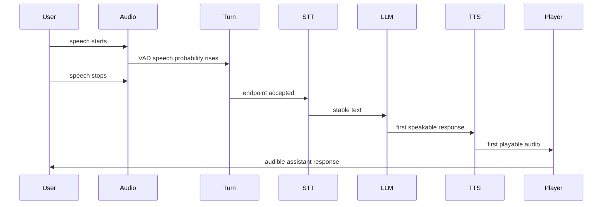

# Voice-Agent Latency Budget Is The Product

A voice agent is not judged by one model benchmark. It is judged by the whole path from
the user's intent to audible assistant behavior. Capture, transport, VAD, endpointing,
STT finalization, LLM first useful output, TTS first audio, playback buffering, and
cancellation all become one felt product property: did the agent respond at the right
time?

This is why "low latency" is too vague to be useful. A model can be fast in a benchmark
and the product can still feel slow. A system can respond quickly and still feel rude if
it starts talking before the user has finished. The real artifact to design is the latency
budget.

## The Budget Is A Waterfall, Not A Number

The user does not experience "STT latency" or "TTS latency" separately. They experience
the pause after they stop speaking, whether the assistant starts cleanly, and whether it
can be interrupted. That pause is a stack of decisions.

```mermaid
flowchart LR
  mic[Mic capture] --> aec[AEC / noise suppression]
  aec --> uplink[Uplink transport]
  uplink --> vad[VAD speech detection]
  vad --> endpoint[Endpointing / end of turn]
  endpoint --> stt[STT final or stable partial]
  stt --> llm[LLM first useful output]
  llm --> tts[TTS first playable audio]
  tts --> downlink[Downlink media]
  downlink --> playout[Playback buffer]
  playout --> user[User hears response]
```



Two things fall out of this diagram.

First, silence policy can dominate model latency. A `500 ms` or `700 ms` endpointing
timer is not model compute, but the user feels it as part of the answer delay. Second,
each stage has a different kind of "first" event. STT has first partial and final/stable
transcript. LLMs have first token and first useful response. TTS has first playable audio,
not only total synthesis speed.

The useful engineering model is therefore a timestamped waterfall:



If these timestamps are not collected separately, latency tuning becomes guesswork.

## Human Conversation Sets The Feel, Not The SLA

The best human baseline I found is Stivers et al. on cross-language turn-taking. The
paper reports a full-dataset mean response offset of about `208 ms`, with Japanese
fastest at about `7 ms` and Danish slowest at about `469 ms`. The right lesson is not
that a voice agent must answer every turn in `208 ms`. The lesson is that humans do not
wait for a long silence timer. They predict turn completion.

ITU-T G.114 gives a different kind of baseline. It recommends that one-way network delay
of `400 ms` should not be exceeded for general network planning, while noting that highly
interactive tasks can be affected by lower delays. That is network guidance, not a full
AI-agent budget. Still, it tells us how little room is available if the media path itself
consumes hundreds of milliseconds.

| Baseline                                  |         Number | Use it for                                   | Do not use it for                  |
| ----------------------------------------- | -------------: | -------------------------------------------- | ---------------------------------- |
| Stivers full-dataset mean response offset | about `208 ms` | A reminder that turn-taking is predictive.   | A universal product SLA.           |
| Stivers Japanese mean                     |   about `7 ms` | Showing how tight some turn transitions are. | A target for every agent response. |
| Stivers Danish mean                       | about `469 ms` | Showing normal conversational variation.     | Permission for arbitrary dead air. |
| ITU-T G.114 one-way planning bound        |       `400 ms` | Network/media planning context.              | Total AI-agent round-trip budget.  |

The product goal is not "always answer as fast as possible." The product goal is "answer
when the user expects the agent to answer."

## What The ASR Data Contributes

Moonshine v2 is valuable because it measures something closer to the live question than
ordinary batch throughput. The paper defines response latency as the time between VAD
detecting the end of a speech segment and the returned transcript. The reported setup is
an Apple MacBook M3.

| Model               |   Params | Response latency | Compute load | Context                               |
| ------------------- | -------: | ---------------: | -----------: | ------------------------------------- |
| Moonshine Tiny      |    `27M` |          `27 ms` |      `5.91%` | Apple M3, live-transcription scenario |
| Moonshine Base      |    `62M` |          `44 ms` |      `7.34%` | Apple M3, live-transcription scenario |
| Moonshine v2 Tiny   |    `34M` |          `50 ms` |      `8.03%` | Apple M3, live-transcription scenario |
| Moonshine v2 Small  |   `123M` |         `148 ms` |     `17.97%` | Apple M3, live-transcription scenario |
| Moonshine v2 Medium |   `245M` |         `258 ms` |     `28.95%` | Apple M3, live-transcription scenario |
| Whisper Tiny        |    `39M` |         `289 ms` |      `8.46%` | faster-whisper baseline               |
| Whisper Base        |    `74M` |         `553 ms` |     `16.19%` | faster-whisper baseline               |
| Whisper Small       |   `244M` |       `1,940 ms` |     `56.84%` | faster-whisper baseline               |
| Whisper Large v3    | `1,550M` |      `11,286 ms` |    `330.65%` | faster-whisper baseline               |

This table does not prove that Moonshine is the best ASR for every use case. It does
prove that architecture and measurement target matter. If the product needs a transcript
soon after the user stops speaking, a live-oriented response-latency table is more useful
than a file-transcription leaderboard alone.

## What The TTS Data Contributes

Fish Audio S2 is useful for the same reason: it reports the serving-shaped metric,
time-to-first-audio, not only total synthesis speed. The paper reports a single NVIDIA
H200 production serving setup with SGLang optimizations.

| System                         |             RTF |                  TTFA | Serving context                         | Why it matters                                         |
| ------------------------------ | --------------: | --------------------: | --------------------------------------- | ------------------------------------------------------ |
| Fish Audio S2                  |         `0.195` |    as low as `100 ms` | NVIDIA H200, SGLang, production serving | Separates total generation speed from first audio.     |
| Fish Audio S2 high concurrency | below `0.5` RTF | not separately stated | `3000+` acoustic tokens/s               | Shows the serving stack is part of the latency result. |

The caveat is as important as the number: this is not a laptop claim. It is evidence that
low TTS latency comes from model plus runtime plus cache plus scheduler plus vocoder
placement. For the product budget, TTS should contribute "first playable audio time" and
"can remain ahead of playback," not just "voice sounds good."

## Endpointing Can Eat The Budget

OpenAI's Realtime API exposes why endpointing belongs in the budget. `server_vad` includes
knobs such as `threshold`, `prefix_padding_ms`, and `silence_duration_ms`; the archived
reference says `prefix_padding_ms` defaults to `300 ms`, `silence_duration_ms` defaults
to `500 ms`, and the VAD activation `threshold` defaults to `0.5`. The docs explicitly
note the tradeoff: shorter silence makes the model respond faster but can make it jump in
on short user pauses.

That makes endpointing a product control, not a hidden implementation detail.

| Layer                |                                                             Example source number | What it decides                                |
| -------------------- | --------------------------------------------------------------------------------: | ---------------------------------------------- |
| Acoustic VAD frame   |                                Silero uses `512` samples at 16 kHz, about `32 ms` | Is there speech-like audio now?                |
| Silence endpointing  |     OpenAI `server_vad` silence default `500 ms`; local Jarvis note uses `700 ms` | Has there been enough quiet to close the turn? |
| Semantic end-of-turn | Pipecat Smart Turn data table says under `100 ms` local CPU inference after pause | Is the user's thought complete?                |
| TTS first audio      |                                     Fish Audio S2 reports as low as `100 ms` TTFA | When can the assistant start being heard?      |

The dangerous simplification is to call all of this "model latency." The endpointing row
alone can be larger than the STT compute row.

## A Practical Measurement Contract

The right product interface is a trace, not a single stopwatch.

```typescript
type VoiceAgentLatencyTrace = {
  requestId: string;
  audioCapturedAtMs: number;
  firstVadSpeechMs: number;
  userSpeechStoppedMs: number;
  endpointAcceptedMs: number;
  firstPartialTranscriptMs?: number;
  stableTranscriptMs: number;
  llmRequestSentMs: number;
  llmFirstUsefulOutputMs: number;
  ttsRequestSentMs: number;
  ttsFirstPlayableAudioMs: number;
  playbackStartedMs: number;
  cancellationAcknowledgedMs?: number;
};
```

This contract makes the product debuggable. If the agent feels slow, the trace tells
whether to tune endpointing, replace STT, optimize LLM first output, change TTS serving,
or fix playback buffering.

## The Product Tradeoff

The goal is not to minimize every component independently. Different products should use
different budgets.

| Product mode           | Endpointing preference        | Risk tolerance                   | Example strategy                                              |
| ---------------------- | ----------------------------- | -------------------------------- | ------------------------------------------------------------- |
| Command agent          | Fast close                    | More false ends accepted         | Shorter silence, eager semantic EOU, aggressive cancellation. |
| Coaching/support agent | Patient close                 | Low false interruption tolerance | Longer silence, semantic EOU, careful backchannel handling.   |
| Noisy telephony        | Conservative speech detection | Noise false positives are costly | Stronger VAD/noise filtering, provider EOT, measured P95.     |
| Stage demo             | Reliability over naturalness  | Avoid awkward failure            | Push-to-talk or explicit turn control may beat always-on.     |

That is the core article point: the latency budget is the product because it encodes the
conversation style.

## Non-Claims

- The Moonshine v2 table is not a universal ASR ranking.
- The Fish Audio S2 H200 TTFA number is not a local laptop claim.
- Stivers et al. does not create a universal `208 ms` voice-agent SLA.
- ITU-T G.114 is network planning guidance, not an AI-agent benchmark.
- RTF, RTFx, TTFA, TTFT, EOT latency, and total user-perceived delay are different
  metrics.

## References

- R-VA-003: Moonshine v2, `presentations/voice-agents/research/paper-text/moonshine-v2-2602.12241.txt`, https://arxiv.org/abs/2602.12241
- R-VA-007: OpenAI Realtime API reference, `presentations/voice-agents/research/articles/openai-realtime-api-reference.html`, https://developers.openai.com/api/reference/resources/realtime
- R-VA-014: Fish Audio S2, `presentations/voice-agents/research/paper-text/fish-audio-s2-2603.08823.txt`, https://arxiv.org/abs/2603.08823
- R-VA-022: Stivers et al., "Universals and cultural variation in turn-taking in conversation", https://pmc.ncbi.nlm.nih.gov/articles/PMC2705608/
- R-VA-023: ITU-T G.114, `presentations/voice-agents/research/articles/itu-g114.html`, https://www.itu.int/ITU-T/recommendations/rec.aspx?rec=G.114
- Data: `presentations/voice-agents/research/data/stt_models.csv`, `presentations/voice-agents/research/data/tts_models.csv`, `presentations/voice-agents/research/data/turn_detection.csv`
