# Latency Budget Is The Product

The practical product quality of a real-time voice agent is not determined by one model's
benchmark. It is determined by the full path from user intent to audible agent behavior:
capture, transport, VAD, endpointing, STT finalization, LLM first token, TTS first audio,
playout, cancellation, and tail behavior. The user does not experience these as separate
components. The user experiences one thing: did the agent respond at the right time?

This note is deliberately not a polished article. It is the evidence trace for later writing.

## Source Map

| Ref | Source | Local path | Role |
|---|---|---|---|
| R-VA-003 | Moonshine v2 | `../paper-text/moonshine-v2-2602.12241.txt` | Local/live ASR latency and WER numbers. |
| R-VA-004 | Open ASR Leaderboard | `../paper-text/open-asr-leaderboard-2510.06961.txt` | Accuracy/throughput context and benchmark caveats. |
| R-VA-007 | OpenAI Realtime API reference | `../articles/openai-realtime-api-reference.html` | Turn detection knobs, default silence duration, interruption semantics. |
| R-VA-009 | Pipecat Smart Turn | `../articles/pipecat-smart-turn.html` | Turn detection as a separate stage after VAD. |
| R-VA-014 | Fish Audio S2 | `../paper-text/fish-audio-s2-2603.08823.txt` | Primary TTFA and RTF data for production TTS serving. |
| R-VA-018 | Moshi | `../paper-text/moshi-2410.00037.txt` | Native speech argument against cascaded multi-stage latency. |
| R-VA-022 | Stivers et al. human turn-taking | URL in `../references.md` | Human response offset baseline. |
| R-VA-023 | ITU-T G.114 | URL in `../references.md` | Network delay planning baseline. |

## Why This Is The First Insight

Voice-agent latency discussions get confused because people use the same word for several
different things:

- network delay;
- model throughput;
- model first-token latency;
- VAD frame delay;
- end-of-turn delay;
- TTS real-time factor;
- time to first audio;
- user-perceived response delay;
- tail latency under concurrency.

Those are not interchangeable. A model can have excellent RTFx and still be a bad
conversational component if it waits too long to finalize a turn. A TTS system can generate
audio faster than real time and still have bad first-audio latency. A WebSocket demo can
feel fine on localhost while mobile packet loss makes playout and interruption state
unstable. A Realtime API can be "low latency" while default endpointing still waits for a
silence threshold before creating a response.

The voice agent budget is a waterfall. If every stage looks individually reasonable, the
sum can still feel slow. If the agent responds early at the wrong turn boundary, the sum
can look fast but feel rude.

## Baseline Human And Network Timing

The human literature is useful because it gives the target feel. The subagent found the
Stivers et al. cross-language result: the mean response offset is around 208 ms, with
Japanese fastest at about 7 ms and Danish slowest at about 469 ms. The important
interpretation is not that AI agents must always respond in 208 ms. The important
interpretation is that humans do not wait passively for silence. Humans predict when the
prior turn is ending.

ITU-T G.114 gives a different baseline: network planning. Its summary says one-way delay
of 400 ms should not be exceeded for general planning and that highly interactive speech
can be affected by lower delays. That is a network recommendation, not an AI-agent
budget. But it is a useful warning: if the media path itself consumes a few hundred
milliseconds, the model stack has little room left.

| Baseline | Number | What it means | What it does not mean |
|---|---:|---|---|
| Human turn response offset | ~208 ms mean | Humans predict turn endings. | AI agents can safely answer after every 208 ms pause. |
| Japanese mean in Stivers et al. | ~7 ms | Some cultures/languages have extremely tight turn timing. | A universal target for products. |
| Danish mean in Stivers et al. | ~469 ms | Normal conversation tolerates variation. | Slow endpointing is always fine. |
| ITU G.114 planning upper bound | 400 ms one-way | Network delay above this is broadly problematic. | Full voice-agent round trip should be 400 ms total. |

## The Voice Agent Waterfall

For a cascaded agent, the path is roughly:

```mermaid
flowchart LR
  A[Mic capture] --> B[AEC / noise suppression]
  B --> C[Uplink transport]
  C --> D[VAD speech start]
  D --> E[Endpointing / end of turn]
  E --> F[STT final or stable partial]
  F --> G[LLM first token]
  G --> H[TTS first audio]
  H --> I[Downlink transport]
  I --> J[Playback buffer]
  J --> K[User hears response]
```

The critical hidden point is that "STT latency" is often a compound of endpointing and
recognition. Moonshine v2 explicitly defines response latency as time between detecting the
end of a speech segment with VAD and returning the transcript. OpenAI server VAD has
default silence duration of 500 ms, which is not "model compute"; it is a policy decision
to avoid cutting users off. Fish Audio S2 reports TTFA as low as 100 ms, but only after
input text is available and under a specific production serving setup.

## Copied Data: ASR Latency

Moonshine v2 Table 2 is unusually useful because it measures response latency on Apple M3
in a live-transcription-like scenario. The paper compares Moonshine, Moonshine v2, and
Whisper via faster-whisper.

| Model | Params | Response latency on Apple M3 | Compute load | Source |
|---|---:|---:|---:|---|
| Moonshine Tiny | 27M | 27 ms | 5.91% | R-VA-003 Table 2 |
| Moonshine Base | 62M | 44 ms | 7.34% | R-VA-003 Table 2 |
| Moonshine v2 Tiny | 34M | 50 ms | 8.03% | R-VA-003 Table 2 |
| Moonshine v2 Small | 123M | 148 ms | 17.97% | R-VA-003 Table 2 |
| Moonshine v2 Medium | 245M | 258 ms | 28.95% | R-VA-003 Table 2 |
| Whisper Tiny | 39M | 289 ms | 8.46% | R-VA-003 Table 2 |
| Whisper Base | 74M | 553 ms | 16.19% | R-VA-003 Table 2 |
| Whisper Small | 244M | 1,940 ms | 56.84% | R-VA-003 Table 2 |
| Whisper Large v3 | 1,550M | 11,286 ms | 330.65% | R-VA-003 Table 2 |

This table can support a very strong slide, but the claim must be precise:

- It is not a general "Moonshine always beats Whisper" claim.
- It is not a cloud streaming benchmark.
- It is not total user round-trip latency.
- It is a local, live-transcription-oriented response-latency comparison on Apple M3.

The right inference is: offline ASR architectures can be inappropriate for latency-critical
agent loops even when their WER is good. A local streaming-oriented model can dramatically
reduce the STT portion of the waterfall.

## Copied Data: TTS First Audio

Fish Audio S2 is useful because it reports both RTF and TTFA. RTF is total speed; TTFA is
when the user can start hearing something.

| System | RTF | TTFA | Hardware/context | Source |
|---|---:|---:|---|---|
| Fish Audio S2 | 0.195 | as low as 100 ms | single NVIDIA H200, SGLang, production serving | R-VA-014 |
| Fish Audio S2 under high concurrency | <0.5 RTF | not separately stated | 3000+ acoustic tokens/s | R-VA-014 |

The caveat is important: H200 serving, SGLang, co-scheduling, and prefix-cache hits are not
the same thing as local laptop TTS. This is still the cleanest primary-source "voice-agent
TTS latency" data I found because it speaks directly in TTFA terms.

## Turn Detection Is Latency

OpenAI Realtime `server_vad` has `silence_duration_ms`, defaulting to 500 ms. That value
can dominate the interaction. Pipecat Smart Turn analyzes the recent user turn after VAD
detects a pause. LiveKit supports VAD-only, STT endpointing, realtime model detection, and
turn-detector models. Deepgram Flux claims end-of-turn detection around 260 ms and
response-latency reduction versus traditional STT+VAD.

This means a voice-agent latency budget should have at least two endpointing columns:

| Layer | Example number | Why it matters |
|---|---:|---|
| Acoustic frame classification | 10-32 ms frames | Detects whether speech is present. |
| Silence endpointing | 200-700 ms typical settings in local docs/frameworks | Decides when a pause is enough silence. |
| Semantic EOU | model-specific, e.g. Pipecat under 100 ms after pause | Decides whether the utterance is actually complete. |
| Forced timeout | seconds | Prevents an incomplete turn from hanging forever. |

## Chart Sketch

The useful visual is not a single "latency" number. It is a stacked budget with toggles:

```mermaid
xychart-beta
  title "Illustrative Voice-Agent Latency Budget"
  x-axis ["Conservative VAD", "Semantic EOU", "Speculative"]
  y-axis "Milliseconds" 0 --> 1800
  bar [700, 350, 180]
  bar [258, 258, 258]
  bar [400, 400, 250]
  bar [100, 100, 100]
```

Chart intent:

- first bar segment: endpointing;
- second: STT finalization;
- third: LLM first useful output;
- fourth: TTS first audio.

The numbers above are illustrative placeholders except where the note explicitly copies
paper values. Before publishing, use measured Jarvis timings or clearly label as budget
scenarios.

## Engineering Inference

Instrument every stage separately. A voice agent should emit timestamps for:

- audio captured;
- first VAD speech probability above threshold;
- user speech stop;
- endpoint decision;
- first partial transcript;
- stable/final transcript;
- LLM request sent;
- LLM first token;
- TTS request sent;
- first playable audio byte/chunk;
- playback start;
- interruption detected;
- response cancellation acknowledged.

Without this instrumentation, latency arguments collapse into vibes. You cannot tune what
you cannot locate.

The user-facing design target should not be "minimize every number." It should be "respond
when the user expects a response." That means you sometimes accept more silence to avoid
interrupting thoughtful speech, and sometimes use semantic end-of-turn to respond faster
than a fixed silence timer would allow.

## Non-Claims

- This note does not prove one STT/TTS provider is universally best.
- It does not compare total cloud API latency across providers.
- It does not claim native speech models are always lower latency in production.
- It does not claim a 200 ms human response offset is a universal product requirement.
- It does not treat RTF, RTFx, TTFT, TTFA, and end-to-end latency as interchangeable.

## Blog/Deck Visual Candidates

- Waterfall of the voice-agent path.
- Side-by-side ASR latency table from Moonshine v2.
- TTS RTF vs TTFA diagram explaining why "faster than real time" is insufficient.
- Endpointing slider: "too early = interruption; too late = dead air."
- "Metrics glossary" card: WER, RTF, RTFx, TTFT, TTFA, EOT latency, P95.

## References

- R-VA-003: `../paper-text/moonshine-v2-2602.12241.txt`
- R-VA-004: `../paper-text/open-asr-leaderboard-2510.06961.txt`
- R-VA-007: `../articles/openai-realtime-api-reference.html`
- R-VA-009: `../articles/pipecat-smart-turn.html`
- R-VA-014: `../paper-text/fish-audio-s2-2603.08823.txt`
- R-VA-018: `../paper-text/moshi-2410.00037.txt`
- R-VA-022: see `../references.md`
- R-VA-023: see `../references.md`
- Plot data: `../data/stt_models.csv`, `../data/tts_models.csv`, `../data/turn_detection.csv`
