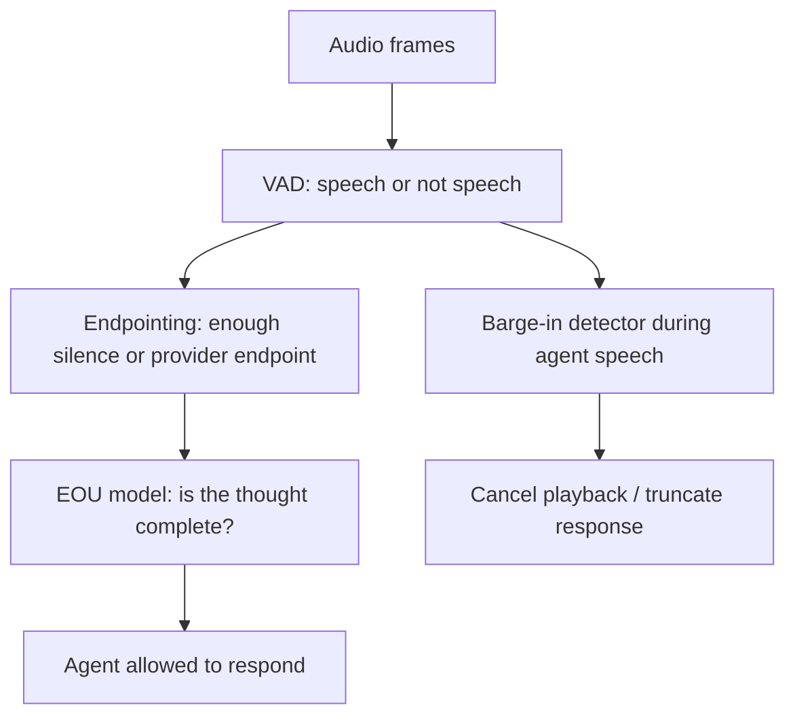

# Endpointing Is Turn-Taking

VAD is not turn-taking. VAD tells the system whether speech-like audio is present. A voice
agent also needs to decide whether the user has finished the thought, whether the pause is
only hesitation, whether a short "yeah" is a backchannel, and whether agent speech should
be interrupted. The strongest pattern in current voice-agent infrastructure is a separation
between speech detection, endpointing, and semantic end-of-utterance detection.

## Source Map

| Ref | Source | Local path | Role |
|---|---|---|---|
| R-VA-002 | Local VAD deep dive | `../VAD-DEEP-DIVE.md` | Existing local analysis of Silero/WebRTC/Jarvis parameters. |
| R-VA-005 | Silero VAD quality metrics | `../articles/silero-vad-quality-metrics.html` | ROC-AUC and accuracy table across VAD models. |
| R-VA-006 | Silero VAD GitHub/defaults | `../VAD-DEEP-DIVE.md` | Frame size, threshold, minimum speech/silence defaults. |
| R-VA-007 | OpenAI Realtime API reference | `../articles/openai-realtime-api-reference.html` | `server_vad`, `semantic_vad`, silence and interruption knobs. |
| R-VA-008 | LiveKit turns overview | `../articles/livekit-turns.html` | Turn detection modes and adaptive interruption framing. |
| R-VA-009 | Pipecat Smart Turn | `../articles/pipecat-smart-turn.html` | Learned turn-completion model layered after VAD. |
| R-VA-020 | Deepgram Flux | `../articles/deepgram-flux-quickstart.html`, `../articles/deepgram-flux-configuration.html`, `../articles/deepgram-flux-launch.html` | Conversational STT and end-of-turn event data. |
| R-VA-022 | Stivers et al. human turn-taking | URL in `../references.md` | Human target behavior. |

## The Three-Layer Model

The useful architecture is:

This framing prevents a common design bug: using the VAD threshold as if it were the
conversation policy. Raising the threshold might reduce false positives in noise, but it does
not solve incomplete thoughts. Lowering `min_silence_duration` might reduce dead air, but
it increases interruptions. A semantic turn model can help, but it introduces its own
latency, model errors, and domain assumptions.

## VAD Data: Silero Versus WebRTC

The Silero VAD wiki gives a direct comparison across several validation sets. The local
deep dive originally summarized Silero v6 as ROC-AUC 0.97 on a multi-domain validation
set, but the archived current table should be read carefully: the wiki includes separate
ROC-AUC and accuracy tables. The current HTML shows WebRTC far below Silero on
multi-domain ROC-AUC.

| Model | Multi-domain ROC-AUC | Multi-domain accuracy | Source |
|---|---:|---:|---|
| WebRTC VAD | 0.73 | 0.74 | R-VA-005 |
| Silero v4 | 0.91 | 0.85 | R-VA-005 |
| Silero v5 | 0.96 | 0.91 | R-VA-005 |
| Silero v6 | 0.97 in local deep dive / current table shows 0.92 in accuracy section | 0.92 | R-VA-002/R-VA-005 |

Important caveat: these are VAD metrics, not turn-taking metrics. They say "speech
probability is better classified." They do not say "the agent knows when the user is done."

## VAD Defaults And Hidden Policy

Silero defaults matter because they become policy when wrapped in an agent runtime:

| Parameter | Typical/default value | Meaning |
|---|---:|---|
| `threshold` | 0.5 | Speech probability threshold. |
| `window_size_samples` | 512 at 16 kHz | About 32 ms input chunks. |
| `min_speech_duration_ms` | 250 ms | Minimum segment before accepting speech. |
| `min_silence_duration_ms` | 100 ms | Minimum silence to split segments. |
| `speech_pad_ms` | 30 ms | Padding around speech segments. |

Those defaults are low-level. A voice agent usually adds a larger post-speech timer at a
higher layer. The local Jarvis config uses 700 ms. The local VAD note compares OpenAI
and Pipecat at around 200 ms, LiveKit around 550 ms, and Jarvis at 700 ms. These are
not just tuning constants; they define how patient or interruptive the agent feels.

## OpenAI: Server VAD And Semantic VAD

The OpenAI Realtime API reference exposes the shape of the problem:

| Mode | Relevant knobs | Defaults / values | Interpretation |
|---|---|---|---|
| `server_vad` | `threshold`, `prefix_padding_ms`, `silence_duration_ms`, `interrupt_response`, `create_response` | `prefix_padding_ms` defaults to 300 ms; `silence_duration_ms` defaults to 500 ms | Acoustic/silence-driven turn handling. |
| `semantic_vad` | `eagerness`, `interrupt_response`, `create_response` | low/medium/high/auto; max timeouts 8 s, 4 s, 2 s | Model estimates whether the user is done. |
| idle timeout | `idle_timeout_ms` | 5,000 to 30,000 ms; only for `server_vad` | Safety net for silence/no response. |

The engineering inference: even a "native realtime" API exposes endpointing as a separate
policy surface. That is evidence that turn-taking cannot be treated as an incidental detail
inside STT.

## LiveKit And Pipecat: VAD Plus Turn Model

LiveKit explicitly lists several detection modes: VAD-only, STT endpointing, realtime model
turn detection, and a turn detector model. The source also frames interruptions as a
separate concept, with adaptive interruption handling to distinguish true interruptions from
backchannels.

Pipecat Smart Turn is similarly explicit. It uses VAD to detect a pause, then analyzes the
recent user turn to decide whether the turn is complete. The subagent found current
documentation data:

| System | Reported data | Meaning |
|---|---|---|
| Pipecat Smart Turn v3 | under 100 ms local CPU inference; around 65 ms on Pipecat Cloud 1x | Semantic EOU can be cheap enough to run inline after pause. |
| Pipecat input window | most recent 8 seconds | The model sees enough audio context to classify completion. |
| Pipecat languages | 23 languages in docs | Turn detection is increasingly multilingual, but language coverage should be checked. |

This is the production pattern: keep VAD fast for start-of-speech and interruption
responsiveness, but add a second model/policy for "done speaking."

## Deepgram Flux: End-Of-Turn As STT Product Surface

Deepgram Flux is useful because it packages EOT as part of conversational STT, not as an
afterthought. The subagent found:

| Deepgram Flux field/claim | Value | Caveat |
|---|---:|---|
| Recommended audio chunks | 80 ms | Provider-specific streaming guidance. |
| `eot_threshold` range/default | 0.5-0.9, default 0.7 | Higher threshold reduces false positives but adds latency. |
| `eot_timeout_ms` range/default | 500-10,000 ms, default 5,000 ms | Forced completion safety net. |
| EOT detection | about 260 ms | Vendor claim. |
| Final `EndOfTurn` p95 | within 1.5 s | Vendor claim. |
| `EagerEndOfTurn` | 150-250 ms earlier | Costs 50-70% more LLM calls in the source summary. |
| Agent latency reduction | 200-600 ms vs traditional STT+VAD | Vendor claim; should be validated. |

This gives a good article point: modern STT providers are not only selling transcript WER.
They are selling turn-taking events because the downstream LLM needs permission to speak.

## Human Turn-Taking: Prediction, Not Reaction

The human baseline matters because it explains why silence-only endpointing feels wrong.
Humans routinely answer with gaps around a few hundred milliseconds, even though language
production planning can take much longer. That implies prediction. Humans start preparing
before the other person has fully finished.

The agent analogy:

- VAD-only systems react to silence.
- Semantic EOU systems approximate prediction.
- Speculative LLM/TTS systems can start work before final endpointing but need clean
  cancellation semantics.

## Engineering Inference

Agent endpointing should be designed as an explicit subsystem with its own metrics:

| Metric | Question |
|---|---|
| Start-of-speech latency | How quickly does the system know the user began speaking? |
| End-of-speech latency | How quickly does acoustic speech stop get detected? |
| End-of-turn latency | How quickly does the system decide the user is done? |
| False end-of-turn rate | How often does the agent interrupt an unfinished user? |
| Missed end-of-turn rate | How often does the agent wait after the user is done? |
| Backchannel false interruption rate | How often does "yeah", "mm-hm", or noise stop the assistant? |
| Barge-in success rate | Can the user interrupt agent speech and be heard? |

The product should expose different endpointing profiles:

- quick-command mode: shorter silence and eager EOU;
- coaching/support mode: longer patience, lower false interruption tolerance;
- noisy telephony mode: stricter VAD, stronger noise cancellation, more semantic EOU;
- live demo mode: explicit push-to-talk may be more reliable than always-on endpointing.

## Non-Claims

- Silero's better VAD ROC-AUC does not prove better turn-taking.
- Semantic turn detection does not remove the need for VAD.
- Lower silence duration is not automatically better.
- Vendor EOT latency claims are not apples-to-apples.
- Human response timing is not a universal SLA.

## Visual Candidates

1. Three-layer diagram: VAD -> endpointing -> semantic EOU.
2. Slider visual: fast response vs false interruption.
3. Table of OpenAI/LiveKit/Pipecat/Deepgram endpointing knobs.
4. State machine with separate interruption path during agent speech.

## References

- R-VA-002: `../VAD-DEEP-DIVE.md`
- R-VA-005: `../articles/silero-vad-quality-metrics.html`
- R-VA-007: `../articles/openai-realtime-api-reference.html`
- R-VA-008: `../articles/livekit-turns.html`
- R-VA-009: `../articles/pipecat-smart-turn.html`
- R-VA-020: `../articles/deepgram-flux-*.html`
- R-VA-022: see `../references.md`
- Data: `../data/turn_detection.csv`
