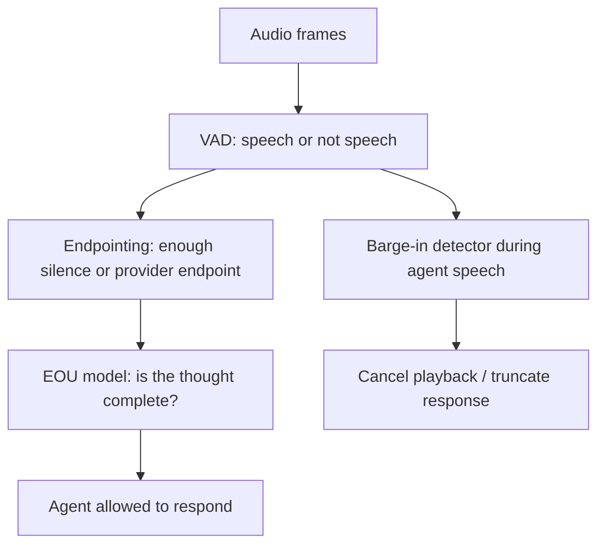

# Endpointing Is Turn-Taking

VAD is not turn-taking. VAD tells the system whether speech-like audio is present. A voice
agent also needs to decide whether the user has finished the thought, whether the pause is
only hesitation, whether a short "yeah" is a backchannel, and whether agent speech should
be interrupted. The strongest pattern in current voice-agent infrastructure is a separation
between speech detection, endpointing, and semantic end-of-utterance detection.

This note traces the evidence for that separation and documents the specific data available
from each source.

## Source Map

| Ref      | Source                                                                                         | Local path                                                                                                                           | Role                                                          | Source quality                                                                       |
| -------- | ---------------------------------------------------------------------------------------------- | ------------------------------------------------------------------------------------------------------------------------------------ | ------------------------------------------------------------- | ------------------------------------------------------------------------------------ |
| R-VA-002 | Local VAD deep dive                                                                            | `../VAD-DEEP-DIVE.md`                                                                                                                | Existing local analysis of Silero/WebRTC/Jarvis parameters.   | `local measurement`                                                                  |
| R-VA-005 | Silero VAD quality metrics (GitHub wiki)                                                       | `../articles/silero-vad-quality-metrics.html`                                                                                        | ROC-AUC and accuracy table across VAD models and datasets.    | `benchmark evidence` (vendor's own wiki, not independent).                           |
| R-VA-006 | Silero VAD GitHub/defaults                                                                     | `../VAD-DEEP-DIVE.md`                                                                                                                | Frame size, threshold, minimum speech/silence defaults.       | `official-doc evidence`                                                              |
| R-VA-007 | OpenAI Realtime API reference                                                                  | `../articles/openai-realtime-api-reference.html`                                                                                     | `server_vad`, `semantic_vad`, silence and interruption knobs. | `official-doc evidence`                                                              |
| R-VA-008 | LiveKit turns overview and turn detector docs                                                  | `../articles/livekit-turns.html`                                                                                                     | Turn detection modes and adaptive interruption framing.       | `official-doc evidence`                                                              |
| R-VA-009 | Pipecat Smart Turn docs                                                                        | `../articles/pipecat-smart-turn.html`                                                                                                | Learned turn-completion model layered after VAD.              | `official-doc evidence`                                                              |
| R-VA-020 | Deepgram Flux docs and launch post                                                             | `../articles/deepgram-flux-quickstart.html`, `../articles/deepgram-flux-configuration.html`, `../articles/deepgram-flux-launch.html` | Conversational STT and end-of-turn event data.                | `vendor claim` for latency numbers; `official-doc evidence` for configuration knobs. |
| R-VA-022 | Stivers et al. "Universals and cultural variation in turn-taking in conversation" (PNAS, 2009) | URL in `../references.md`                                                                                                            | Human target behavior.                                        | `paper evidence`                                                                     |

## The Three-Layer Model

The useful architecture is:

This framing prevents a common design bug: using the VAD threshold as if it were the
conversation policy. Raising the threshold might reduce false positives in noise, but it does
not solve incomplete thoughts. Lowering `min_silence_duration` might reduce dead air, but
it increases interruptions. A semantic turn model can help, but it introduces its own
latency, model errors, and domain assumptions.

## VAD Data: Silero Versus WebRTC

The Silero VAD wiki (R-VA-005, `benchmark evidence`) gives a direct comparison across
several validation datasets. The wiki publishes two separate metric tables: ROC-AUC scores
(threshold-independent, calculated on 31.25 ms segments) and accuracy scores
(threshold-dependent, using thresholds optimized on the Multi-Domain Validation Dataset).
These are different metrics and should not be conflated.

The ROC-AUC score is the threshold-independent measure of how well the model separates
speech from non-speech across all operating points. The accuracy score uses a specific
threshold per model (optimized on the validation set) and measures classification
correctness at that threshold. The ROC-AUC will generally be higher than accuracy because
it represents the best possible separation, while accuracy is locked to a single threshold.

### Multi-Domain Validation results (subset, ROC-AUC and accuracy side by side)

| Model      | Multi-Domain ROC-AUC | Multi-Domain Accuracy | Source   | Caveat                                                                 |
| ---------- | -------------------: | --------------------: | -------- | ---------------------------------------------------------------------- |
| WebRTC VAD |                 0.73 |                  0.74 | R-VA-005 | `benchmark evidence`. Vendor's own wiki, not independently reproduced. |
| Silero v4  |                 0.91 |                  0.85 | R-VA-005 | `benchmark evidence`. Same caveat.                                     |
| Silero v5  |                 0.96 |                  0.91 | R-VA-005 | `benchmark evidence`. Same caveat.                                     |
| Silero v6  |                 0.97 |                  0.92 | R-VA-005 | `benchmark evidence`. Same caveat.                                     |

All values verified against `../articles/silero-vad-quality-metrics.html`. The ROC-AUC
column comes from the "ROC-AUC score" table and the accuracy column comes from the
"Accuracy score" / "Speech datasets - 31.25 ms chunk accuracy" table, both under the
"Multi-Domain Validation" dataset column.

The wiki also includes per-dataset breakdowns (AliMeeting, Earnings 21, MSDWild, AISHELL-4,
VoxConverse, Libriparty, Private speech). The Multi-Domain Validation column is the most
useful aggregate for a general comparison, but domain-specific performance varies
meaningfully. For example, on AliMeeting (meeting scenarios), Silero v6 ROC-AUC is 0.96
while WebRTC is 0.82. On MSDWild (wild conditions), Silero v6 ROC-AUC is 0.79 while
WebRTC is 0.62.

Important caveat: these are VAD metrics, not turn-taking metrics. They say "speech
probability is better classified." They do not say "the agent knows when the user is done."
A VAD with 0.97 ROC-AUC can still produce terrible turn-taking if the silence timer or
EOU policy is wrong.

## VAD Defaults And Hidden Policy

Silero defaults matter because they become policy when wrapped in an agent runtime
(`official-doc evidence`, R-VA-006):

| Parameter                 | Typical/default value | Meaning                                  |
| ------------------------- | --------------------: | ---------------------------------------- |
| `threshold`               |                   0.5 | Speech probability threshold.            |
| `window_size_samples`     |         512 at 16 kHz | About 32 ms input chunks.                |
| `min_speech_duration_ms`  |                250 ms | Minimum segment before accepting speech. |
| `min_silence_duration_ms` |                100 ms | Minimum silence to split segments.       |
| `speech_pad_ms`           |                 30 ms | Padding around speech segments.          |

Those defaults are low-level. A voice agent usually adds a larger post-speech timer at a
higher layer. The local Jarvis config uses 700 ms. The local VAD note compares OpenAI
and Pipecat at around 200 ms, LiveKit around 550 ms, and Jarvis at 700 ms (`local
measurement`, R-VA-002). These are not just tuning constants; they define how patient or
interruptive the agent feels.

## OpenAI: Server VAD And Semantic VAD

The OpenAI Realtime API reference (`official-doc evidence`, R-VA-007) exposes the shape
of the problem:

| Mode           | Relevant knobs                                                                                   | Defaults / values                                                                | Interpretation                            |
| -------------- | ------------------------------------------------------------------------------------------------ | -------------------------------------------------------------------------------- | ----------------------------------------- |
| `server_vad`   | `threshold`, `prefix_padding_ms`, `silence_duration_ms`, `interrupt_response`, `create_response` | `prefix_padding_ms` defaults to 300 ms; `silence_duration_ms` defaults to 500 ms | Acoustic/silence-driven turn handling.    |
| `semantic_vad` | `eagerness`, `interrupt_response`, `create_response`                                             | low/medium/high/auto; max timeouts 8 s, 4 s, 2 s                                 | Model estimates whether the user is done. |
| idle timeout   | `idle_timeout_ms`                                                                                | 5,000 to 30,000 ms; only for `server_vad`                                        | Safety net for silence/no response.       |

The engineering observation: even a "native realtime" API exposes endpointing as a separate
policy surface. That is evidence that turn-taking cannot be treated as an incidental detail
inside STT.

## LiveKit And Pipecat: VAD Plus Turn Model

LiveKit explicitly lists several detection modes: VAD-only, STT endpointing, realtime model
turn detection, and a turn detector model (`official-doc evidence`, R-VA-008). The source
also frames interruptions as a separate concept, with adaptive interruption handling to
distinguish true interruptions from backchannels.

Pipecat Smart Turn is similarly explicit (`official-doc evidence`, R-VA-009). It uses VAD
to detect a pause, then analyzes the recent user turn to decide whether the turn is
complete. The Smart Turn v3 model (`LocalSmartTurnAnalyzerV3`) is the default user turn
stop strategy in Pipecat. The model weights are bundled with the Pipecat package. The
documentation states that it runs inference locally using ONNX.

| System                | Reported data                                                           | Source quality                     | Meaning                                                                                              |
| --------------------- | ----------------------------------------------------------------------- | ---------------------------------- | ---------------------------------------------------------------------------------------------------- |
| Pipecat Smart Turn v3 | "inference can be performed on low-cost cloud instances in under 100ms" | `official-doc evidence` (R-VA-009) | Semantic EOU can be cheap enough to run inline after pause on CPU.                                   |
| Pipecat input window  | most recent 8 seconds                                                   | `official-doc evidence` (R-VA-009) | The model sees enough audio context to classify completion.                                          |
| Pipecat languages     | 23 languages                                                            | `official-doc evidence` (R-VA-009) | Turn detection is increasingly multilingual, but language coverage should be checked per deployment. |

The "under 100 ms" CPU inference and the "around 65 ms on Pipecat Cloud 1x" figure (from
`../data/turn_detection.csv`) are Pipecat's own documentation claims, not independently
benchmarked. They are `official-doc evidence` from the vendor's docs, not third-party
validation. The docs state: "LocalSmartTurnAnalyzerV3 is designed to run on CPU, and
inference can be performed on low-cost cloud instances in under 100ms." The ~65 ms Pipecat
Cloud figure appears in local research data but the exact source should be verified.

This is the production pattern: keep VAD fast for start-of-speech and interruption
responsiveness, but add a second model/policy for "done speaking."

Inference: the emergence of separate turn-completion models as first-class components
(Pipecat Smart Turn, LiveKit turn detector, OpenAI semantic_vad) is evidence that
silence-only endpointing is insufficient for production-quality conversation. Each system
has independently arrived at a layered architecture.

## Deepgram Flux: End-Of-Turn As STT Product Surface

Deepgram Flux is useful because it packages EOT as part of conversational STT, not as an
afterthought. The data comes from Deepgram's documentation and launch materials.

| Deepgram Flux field/claim      |                               Value | Source quality                            | Caveat                                                                                                                                                          |
| ------------------------------ | ----------------------------------: | ----------------------------------------- | --------------------------------------------------------------------------------------------------------------------------------------------------------------- |
| Recommended audio chunks       |                               80 ms | `official-doc evidence` (R-VA-020)        | Provider-specific streaming guidance.                                                                                                                           |
| `eot_threshold` range/default  |                0.5-0.9, default 0.7 | `official-doc evidence` (R-VA-020)        | Higher threshold reduces false positives but adds latency.                                                                                                      |
| `eot_timeout_ms` range/default |     500-10,000 ms, default 5,000 ms | `official-doc evidence` (R-VA-020)        | Forced completion safety net.                                                                                                                                   |
| EOT detection latency          |                             ~260 ms | `vendor claim` (R-VA-020 quickstart page) | Stated as "~260ms end-of-turn detection" in the quickstart. Not independently validated.                                                                        |
| Final `EndOfTurn` p95          |                        within 1.5 s | `vendor claim` (R-VA-020)                 | Not verified in local HTML capture; originally from launch post. Not independently validated. p95 of 1.5 s is a long tail relative to the ~260 ms median claim. |
| `EagerEndOfTurn` timing        | 150-250 ms earlier than `EndOfTurn` | `vendor claim` (R-VA-020)                 | Not verified in local HTML capture; originally from launch post. Trades speed for speculation.                                                                  |
| Agent latency reduction        |   200-600 ms vs traditional STT+VAD | `vendor claim` (R-VA-020)                 | Not verified in local HTML capture; originally from launch post. Needs controlled comparison.                                                                   |

### EagerEndOfTurn: operational tradeoffs

The `EagerEndOfTurn` event deserves expanded treatment because it has significant
operational implications. When enabled (by setting `eager_eot_threshold`, valid range
0.3-0.9), Flux fires an `EagerEndOfTurn` event when its confidence that the user is done
exceeds the eager threshold but has not yet reached the final `eot_threshold`. This
enables the downstream LLM to begin generating a response speculatively.

The operational tradeoff is substantial. The Deepgram launch materials and research notes
indicate that `EagerEndOfTurn` costs 50-70% more LLM calls (`vendor claim`; not verified
in local HTML capture — the saved launch page HTML may not contain the full article text).
This happens because:

1. The eager event fires before the system is confident the user is done.
2. If the user continues speaking, Flux fires a `TurnResumed` event.
3. The speculative LLM generation must be cancelled.
4. A new LLM call is needed when the actual `EndOfTurn` fires.

For systems with expensive LLM inference (large models, high per-token cost), this 50-70%
increase in LLM calls is a significant cost multiplier. For systems where response latency
is the primary concern and LLM cost is secondary, the tradeoff may be worthwhile.

Inference: the `EagerEndOfTurn` pattern is analogous to speculative execution in CPU
design. It trades compute waste for latency reduction. The engineering decision depends on
the cost ratio of LLM inference to user-perceived latency improvement. This is not a free
optimization.

This gives a good article point: modern STT providers are not only selling transcript WER.
They are selling turn-taking events because the downstream LLM needs permission to speak.
Turn-taking is becoming a first-class product surface in the STT API layer.

## Human Turn-Taking: Prediction, Not Reaction

The human baseline matters because it explains why silence-only endpointing feels wrong.
Stivers et al. (2009) (`paper evidence`, R-VA-022) found that humans routinely respond
with gaps around a few hundred milliseconds (cross-language median approximately 200 ms,
see INSIGHT_01 for the 200 ms vs 230 ms discrepancy discussion), even though language
production planning can take much longer. That implies prediction. Humans start preparing
before the other person has fully finished.

The agent analogy:

- VAD-only systems react to silence.
- Semantic EOU systems approximate prediction.
- Speculative LLM/TTS systems can start work before final endpointing but need clean
  cancellation semantics (as the Deepgram EagerEndOfTurn pattern demonstrates).

Inference: the reason silence-only endpointing feels unnatural is that humans do not use
silence-only endpointing. Humans use syntactic, prosodic, and pragmatic cues to predict
turn completion. Semantic turn models attempt to approximate this. Whether current models
are good enough to match human prediction accuracy is an open question not answered by the
available evidence.

## Engineering Inference

Inference: agent endpointing should be designed as an explicit subsystem with its own
metrics:

| Metric                              | Question                                                     |
| ----------------------------------- | ------------------------------------------------------------ |
| Start-of-speech latency             | How quickly does the system know the user began speaking?    |
| End-of-speech latency               | How quickly does acoustic speech stop get detected?          |
| End-of-turn latency                 | How quickly does the system decide the user is done?         |
| False end-of-turn rate              | How often does the agent interrupt an unfinished user?       |
| Missed end-of-turn rate             | How often does the agent wait after the user is done?        |
| Backchannel false interruption rate | How often does "yeah", "mm-hm", or noise stop the assistant? |
| Barge-in success rate               | Can the user interrupt agent speech and be heard?            |

Inference: the product should expose different endpointing profiles:

- quick-command mode: shorter silence and eager EOU;
- coaching/support mode: longer patience, lower false interruption tolerance;
- noisy telephony mode: stricter VAD, stronger noise cancellation, more semantic EOU;
- live demo mode: explicit push-to-talk may be more reliable than always-on endpointing.

## Non-Claims

- Silero's better VAD ROC-AUC does not prove better turn-taking. VAD classification
  quality and turn-taking quality are different things.
- Semantic turn detection does not remove the need for VAD. The three-layer model requires
  all three layers.
- Lower silence duration is not automatically better. It depends on the use case and the
  user population.
- Vendor EOT latency claims (Deepgram ~260 ms, p95 within 1.5 s) are not apples-to-apples
  comparable to Pipecat Smart Turn or OpenAI semantic_vad timings. Different systems
  measure different things at different points in the pipeline.
- Human response timing (~200 ms median) is not a universal SLA. It is a descriptive
  finding about human behavior, not a prescriptive target for AI systems.
- The Silero VAD quality metrics are from the vendor's own wiki (`benchmark evidence`, not
  independent). They have not been independently reproduced in the cited form.
- Pipecat Smart Turn inference times (under 100 ms, ~65 ms) are from Pipecat's own
  documentation, not independent benchmarks.

## Blog/Presentation Visual Candidates

1. Three-layer diagram: VAD -> endpointing -> semantic EOU. The Mermaid flowchart above is
   a starting point. Emphasize that each layer answers a different question.
2. Slider visual: fast response vs false interruption. Show how adjusting silence duration
   and EOU threshold shifts the tradeoff curve.
3. Table of OpenAI/LiveKit/Pipecat/Deepgram endpointing knobs. Side-by-side comparison of
   what each system exposes and what the defaults are.
4. State machine with separate interruption path during agent speech. Show the barge-in
   detection, playback cancellation, and return-to-listening cycle.
5. Silero VAD ROC-AUC vs accuracy table. Clean two-metric comparison showing that ROC-AUC
   0.97 and accuracy 0.92 are consistent (different metrics, not conflicting numbers).
6. EagerEndOfTurn cost diagram: show the speculative execution pattern with the 50-70%
   extra LLM call cost.

## References

- R-VA-002: `../VAD-DEEP-DIVE.md`
- R-VA-005: Silero VAD quality metrics. `../articles/silero-vad-quality-metrics.html`. https://github.com/snakers4/silero-vad/wiki/Quality-Metrics
- R-VA-006: Silero VAD GitHub. https://github.com/snakers4/silero-vad
- R-VA-007: OpenAI Realtime API reference. `../articles/openai-realtime-api-reference.html`. https://developers.openai.com/api/reference/resources/realtime
- R-VA-008: LiveKit turns overview. `../articles/livekit-turns.html`. https://docs.livekit.io/agents/logic/turns/
- R-VA-009: Pipecat Smart Turn docs. `../articles/pipecat-smart-turn.html`. https://docs.pipecat.ai/server/utilities/turn-detection/smart-turn-overview
- R-VA-020: Deepgram Flux docs. `../articles/deepgram-flux-quickstart.html`, `../articles/deepgram-flux-configuration.html`, `../articles/deepgram-flux-launch.html`. https://developers.deepgram.com/docs/flux/quickstart
- R-VA-022: Stivers et al. (2009). "Universals and cultural variation in turn-taking in conversation." PNAS 106(26), 10587-10592. https://www.mpi.nl/publications/item66202/universals-and-cultural-variation-turn-taking-conversation
- Data: `../data/turn_detection.csv`
