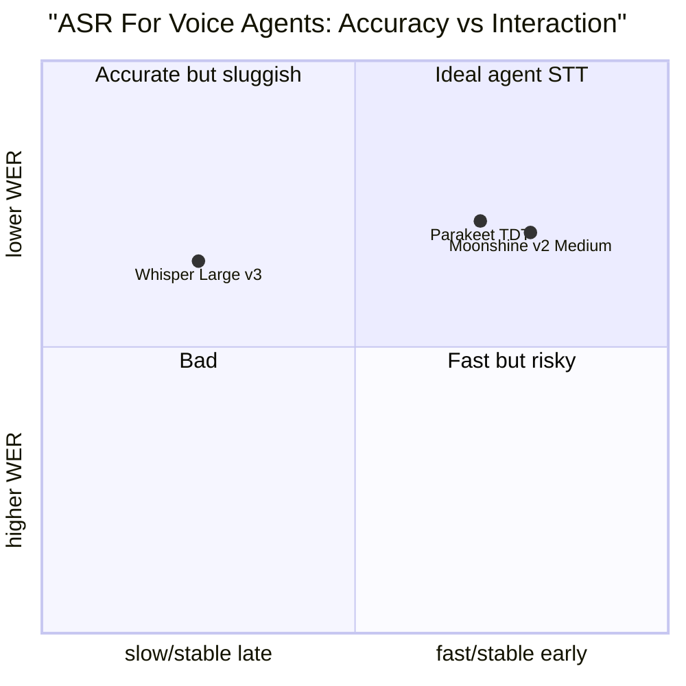

# Streaming STT Is Not Batch STT

Batch speech recognition asks: "What transcript can I produce for this audio file?" A real-time
voice agent asks a harder systems question: "What stable enough interpretation can I produce
soon enough for the agent to decide whether to speak, call tools, or keep listening?"

WER is still necessary. But WER alone is not a voice-agent metric.

## Source Map

| Ref | Source | Local path | Role |
|---|---|---|---|
| R-VA-001 | Local STT deep dive | `../STT-DEEP-DIVE.md` | Existing WER/RTF/latency metric definitions. |
| R-VA-003 | Moonshine v2 | `../paper-text/moonshine-v2-2602.12241.txt` | Local latency and WER comparison with Whisper. |
| R-VA-004 | Open ASR Leaderboard | `../paper-text/open-asr-leaderboard-2510.06961.txt` | Reproducible WER/RTFx benchmark. |
| R-VA-026 | NVIDIA Parakeet model card | URL in `../references.md` | Current Parakeet v3 WER/RTFx values. |
| R-VA-030 | Whisper paper | `../paper-text/whisper-2212.04356.txt` | Baseline model trained on 680,000 hours. |
| R-VA-020 | Deepgram latency/Flux docs | `../articles/deepgram-flux-*.html` | Provider view of streaming latency and EOT events. |

## What WER Measures And What It Hides

WER measures edit distance between transcript and reference at word level:

```text
WER = (substitutions + deletions + insertions) / reference_words
```

That is useful. It catches broad transcription quality. But voice agents need more:

- first partial latency;
- stability of partials;
- final transcript latency after speech stops;
- EOT precision/recall;
- domain-entity accuracy;
- language detection and code switching;
- timestamp accuracy;
- tail latency under concurrency;
- downstream task success.

A model can have lower average WER and still be worse for a voice agent if it emits stable
text too late. A model can have high RTFx in batch and still have poor interactive latency
if it processes long windows or waits for an endpoint.

## Open ASR Leaderboard: Useful, But Not The Whole Product

The Open ASR Leaderboard is valuable because it standardizes WER and RTFx across many
systems and datasets. It reports that 86 systems were listed as of March 27, 2026, and
74 were open source. The benchmark uses an NVIDIA A100-SXM4-80GB setup and reports
WER plus inverse real-time factor.

Copied subset from Table 3:

| Model | Open | Avg. WER | RTFx | Encoder | Decoder | Languages |
|---|---|---:|---:|---|---|---:|
| Cohere Labs Transcribe | Yes | 5.42 | 525 | FastConformer | Transformer | 14 |
| NVIDIA Canary Qwen 2.5B | Yes | 5.63 | 418 | FastConformer | LLM | 1 |
| Qwen3 ASR 1.7B | Yes | 5.76 | 148 | Custom | LLM | 52 |
| NVIDIA Parakeet TDT 0.6B v2 | Yes | 6.05 | 3390 | FastConformer | TDT | 1 |
| NVIDIA Parakeet TDT 0.6B v3 | Yes | 6.32 | 3330 | FastConformer | TDT | 25 |
| Google Chirp v2 | No | 6.42 | not reported | not listed | not listed | 468 |
| Mistral Voxtral Small 24B | Yes | 6.62 | 54.1 | Whisper-FT | LLM | 8 |
| OpenAI Whisper Large v3 | Yes | 7.44 | 146 | Whisper | Whisper | 99 |
| OpenAI Whisper Large v3 Turbo | Yes | 7.83 | 200 | Whisper | Whisper | 99 |
| NVIDIA FastConformer CTC Large | Yes | 8.96 | 6400 | FastConformer | CTC | 1 |

Inference: throughput and accuracy form a Pareto surface, not one winner. TDT/CTC systems
can be very fast in RTFx. LLM-decoder systems can be more accurate but often slower. But
this is still not the same as "time from user stops speaking to agent can act."

## Moonshine v2: A Better Fit For The Live Question

Moonshine v2 defines response latency as the time between VAD detecting the end of a speech
segment and the returned transcript. That is closer to what a voice agent needs than file
throughput.

| Model | Params | Libri clean WER | Average WER | Response latency | Compute load |
|---|---:|---:|---:|---:|---:|
| Moonshine v2 Tiny | 34M | 4.49% | 12.01% | 50 ms | 8.03% |
| Moonshine v2 Small | 123M | 2.49% | 7.84% | 148 ms | 17.97% |
| Moonshine v2 Medium | 245M | 2.08% | 6.65% | 258 ms | 28.95% |
| Whisper Tiny | 39M | 7.54% | not copied here | 289 ms | 8.46% |
| Whisper Base | 74M | 5.66% | not copied here | 553 ms | 16.19% |
| Whisper Small | 244M | 3.43% | not copied here | 1,940 ms | 56.84% |
| Whisper Large v3 | 1,550M | not copied in Table 3 | not copied here | 11,286 ms | 330.65% |

The paper's own discussion says Moonshine v2 fills the lower parameter-count region for
memory-constrained edge processors. The table supports the claim that architecture matters
for interactive latency. A streaming encoder and model shape designed for live use can
matter more than generic "best WER."

## Whisper: Still The Baseline, But Not Designed For This

The Whisper paper is still foundational. It trained on 680,000 hours of multilingual and
multitask supervision and gave a robust open baseline. But Whisper's original architecture
and 30-second chunking assumptions are not the same as turn-level streaming. The local
presentation can say:

- Whisper is the default mental baseline.
- faster-whisper/CTranslate2 made it much more practical.
- It is still not inherently a low-latency endpointing model.
- Using Whisper in a voice agent usually means wrapping it with VAD, chunking, buffering,
  and finalization heuristics.

This distinction matters because many demos "work" with Whisper but feel delayed or brittle.

## Streaming STT Metrics For Voice Agents

The evaluation table for a real voice agent should include:

| Metric | Why it matters | How to measure |
|---|---|---|
| WER/CER | Base transcription quality. | Reference transcript comparison after normalization. |
| Entity WER | Names, product terms, numbers, codes. | Domain entity extraction plus transcript alignment. |
| Time to first partial | Perceived responsiveness and speculative context. | Audio start -> first interim transcript. |
| Partial churn | Whether early text is stable enough to use. | Edit distance between successive partials and final. |
| End-of-turn latency | When LLM can start safely. | Human stop time -> EOT/stable final. |
| False EOT rate | Interruptions. | User-labeled incomplete turns marked complete. |
| Missed EOT rate | Dead air. | Complete turns not closed within target. |
| P95/P99 latency | Tail frustration. | Percentiles over calls, not just mean. |
| Concurrency RTF/RTFx | Cost and serving capacity. | Benchmark at expected stream count. |
| Telephony/noise robustness | Real users. | 8 kHz, mu-law, packet loss, echo, background speech. |

## Chart Sketch



This is a conceptual sketch, not a chart from copied data. The real chart should use:

- x-axis: measured EOT-to-final latency in Jarvis or a provider benchmark;
- y-axis: WER/entity WER on the target domain;
- bubble size: model footprint or cost.

## Engineering Inference

Pick STT by conversation behavior, not by clean benchmark rank.

For a local live presentation:

- Moonshine v2 is worth highlighting because it directly targets latency-critical local ASR.
- faster-whisper remains useful as the familiar baseline and broad ecosystem option.
- Parakeet/Canary/Qwen-style models should be discussed as accuracy/throughput leaders,
  but not oversold as turn-taking solutions without local streaming measurements.
- Deepgram Flux is relevant because it makes end-of-turn an explicit product surface.

For production:

- create an audio test set from actual domain calls;
- label turn boundaries and entities, not just transcript text;
- measure P50/P95/P99 end-of-turn and final transcript latency;
- evaluate what happens when users interrupt, backchannel, pause mid-sentence, or speak in noise.

## Non-Claims

- Open ASR Leaderboard does not rank "best voice-agent STT."
- Moonshine v2 latency numbers do not prove best accuracy on all domains.
- RTFx is not the same as end-of-turn latency.
- WER on LibriSpeech clean does not predict noisy phone-call behavior.
- Cloud vendor latency claims must be re-measured from the client environment.

## Blog/Deck Visual Candidates

- Scatter plot: WER vs response latency for Moonshine and Whisper from R-VA-003.
- Scatter plot: Open ASR WER vs RTFx for current top systems from R-VA-004.
- Metric glossary showing WER, RTFx, TTFT, final latency, EOT latency.
- Example transcript partial churn timeline.

## References

- R-VA-001: `../STT-DEEP-DIVE.md`
- R-VA-003: `../paper-text/moonshine-v2-2602.12241.txt`
- R-VA-004: `../paper-text/open-asr-leaderboard-2510.06961.txt`
- R-VA-020: `../articles/deepgram-flux-*.html`
- R-VA-026: see `../references.md`
- R-VA-030: `../paper-text/whisper-2212.04356.txt`
- Data: `../data/stt_models.csv`
