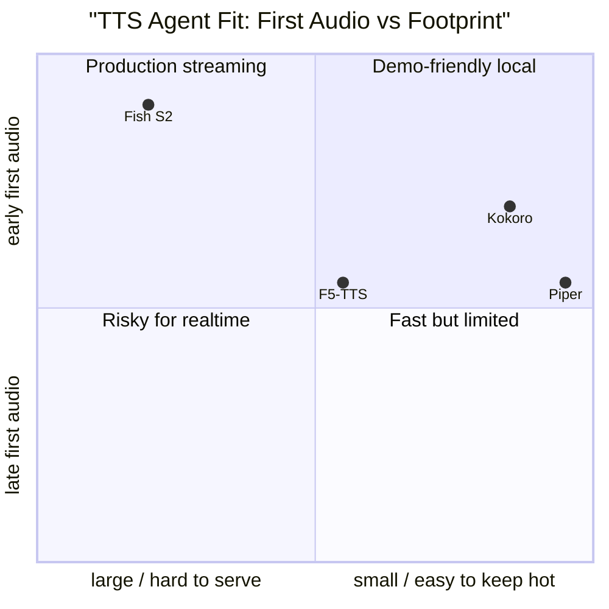

# TTS Latency Is Architecture

For voice agents, TTS is not only a voice-quality problem. It is a serving-shape problem:
how soon can the system emit playable audio, how much headroom does it have against real
time, can it stream, can it stop cleanly, and can it restart without confusing the conversation?

MOS, UTMOS, WER, and speaker similarity matter. But an agent can have a beautiful voice
and still feel broken if first audio arrives late or cannot be interrupted.

## Source Map

| Ref | Source | Local path | Role |
|---|---|---|---|
| R-VA-027 | Local TTS deep dive | `../TTS-DEEP-DIVE.md` | Existing open-source TTS survey. |
| R-VA-010 | Kokoro-82M model card | URL in `../references.md` | Small practical local model. |
| R-VA-011 | StyleTTS 2 | `../paper-text/styletts2-2306.07691.txt` | Kokoro lineage and human-level quality/RTF data. |
| R-VA-012 | F5-TTS | `../paper-text/f5-tts-2410.06885.txt` | Flow-matching TTS WER/SIM/UTMOS/RTF data. |
| R-VA-013 | Spark-TTS | `../paper-text/spark-tts-2503.01710.txt` | LLM-based TTS with BiCodec and controllability data. |
| R-VA-014 | Fish Audio S2 | `../paper-text/fish-audio-s2-2603.08823.txt` | Strong TTFA/RTF production-serving data. |
| R-VA-036 | TTS benchmark slide | `../../../components/presentations/voice-agents/slides/08b-tts-benchmarks.tsx` | Existing chart data and source links. |

## Families That Matter

The models fall into different latency shapes:

| Family | Examples | Agent-relevant shape |
|---|---|---|
| Small local decoder/NAR systems | Kokoro, Piper, MeloTTS | Easy to keep hot; cheap local demos; often limited cloning/expressiveness metrics. |
| Flow matching / diffusion transformer | F5-TTS | Strong quality and cloning; RTF controlled by NFE/solver; streaming requires careful serving. |
| AR speech-token / LLM TTS | Fish Audio S2, Spark-TTS, Dia, Orpheus | Can naturally stream token/audio chunks; heavier models; serving stack matters a lot. |
| Legacy voice-cloning systems | XTTS v2 | Useful baseline; less compelling hard current latency data. |

The deck should avoid presenting a universal leaderboard. TTS papers do not use the same
datasets, hardware, metrics, languages, or serving assumptions. Use grouped tables and
explicit caveats.

## RTF Is Necessary But Not Sufficient

RTF = synthesis_time / audio_duration.

- RTF 0.2 means the model can synthesize five seconds of audio in one second.
- That is necessary for interactive use.
- It does not tell when the first playable chunk arrives.
- It does not tell whether the model can be cancelled mid-sentence.
- It does not tell whether the serving stack can keep the model hot under concurrency.

The key agent metrics:

| Metric | Why it matters |
|---|---|
| TTFA | User hears something soon after LLM first text/audio decision. |
| RTF | The system keeps ahead of playback. |
| Streaming chunk cadence | Smooth playout without large buffers. |
| Cancellation latency | Barge-in feels immediate. |
| Voice cache/prefix reuse | Repeated assistant voice is cheap. |
| Stability under concurrency | No P99 spikes when multiple calls run. |
| License and deployment footprint | Determines whether the model can ship in the desired environment. |

## Copied Data: StyleTTS 2

StyleTTS 2 matters because Kokoro inherits from its architecture family. It is not a direct
Kokoro benchmark, so the inference must be labeled carefully.

| Result | Value | Source |
|---|---:|---|
| LJSpeech CMOS vs ground truth | +0.28, p = 0.021 | R-VA-011 |
| LJSpeech CMOS vs NaturalSpeech | +1.07, p < 1e-6 | R-VA-011 |
| VCTK naturalness CMOS vs ground truth | -0.02, p = 0.628 | R-VA-011 |
| VCTK similarity CMOS vs ground truth | +0.30, p = 0.081 | R-VA-011 |
| StyleTTS 2 RTF | 0.0185 | R-VA-011 Table 4 |
| VITS RTF | 0.0599 | R-VA-011 Table 4 |
| FastDiff RTF | 0.0769 | R-VA-011 Table 4 |
| ProDiff RTF | 0.1454 | R-VA-011 Table 4 |

This gives a strong "small/fast architecture lineage" story, but it does not replace direct
Kokoro measurement. The note should say Kokoro is practical because it is 82M parameters
and local, not because StyleTTS 2's exact RTF transfers to Kokoro.

## Copied Data: F5-TTS

F5-TTS is a good research-quality table because the paper reports WER, SIM-o, UTMOS, and
RTF under NFE/solver variants.

| F5-TTS setting | LibriSpeech-PC WER | SIM-o | UTMOS | Seed test-en WER | Seed test-zh CER | RTF |
|---|---:|---:|---:|---:|---:|---:|
| 16 NFE Euler, s=-1 | 2.53% | 0.66 | 3.88 | 1.89% | 1.74% | 0.15 |
| 32 NFE Euler, s=-1 | 2.42% | 0.66 | 3.90 | 1.83% | 1.56% | 0.31 |
| 16 NFE midpoint, s=-1 | 2.43% | 0.66 | 3.87 | 1.88% | 1.61% | 0.26 |
| 32 NFE midpoint, s=-1 | 2.41% | 0.66 | 3.89 | 1.87% | 1.58% | 0.53 |

Inference:

- F5-TTS has a clean quality/speed knob.
- Doubling NFE from 16 to 32 improves WER modestly but increases RTF.
- RTF still does not equal TTFA. A flow-matching system may be fast overall but requires a
  serving strategy to emit early audio.

## Copied Data: Spark-TTS

Spark-TTS is useful for the LLM-token TTS direction and control. The extracted text reports:

| Metric | Value | Source |
|---|---:|---|
| Spark-TTS params | 0.5B | R-VA-013/local deep dive |
| BiCodec token rate | 50 TPS | R-VA-013 |
| BiCodec bitrate | 0.65 kbps | R-VA-013 |
| Seed-TTS test-zh CER | 1.20 | R-VA-013 |
| Seed-TTS test-zh SIM | 0.672 | R-VA-013 |
| Seed-TTS test-en WER | 1.98 | R-VA-013 |
| Seed-TTS test-en SIM | 0.584 | R-VA-013 |
| LibriSpeech UTMOS | 4.35 | R-VA-013 |

The caveat: I did not find a primary RTF/TTFA number in the Spark-TTS paper. It may be
strong in quality/control, but the voice-agent latency claim should be weaker than Fish S2.

## Copied Data: Fish Audio S2

Fish Audio S2 is the strongest source for production TTS latency:

| Metric | Value | Context | Source |
|---|---:|---|---|
| RTF | 0.195 | single NVIDIA H200 with SGLang optimizations | R-VA-014 |
| TTFA | as low as 100 ms | production serving environment | R-VA-014 |
| Throughput | 3000+ acoustic tokens/s | high concurrency while keeping RTF below 0.5 | R-VA-014 |
| Average prefix-cache hit rate | 86.4% | repeated voice reuse | R-VA-014 |
| Seed-TTS test-zh CER | 0.54 | voice-cloning intelligibility | R-VA-014 |
| Seed-TTS test-en WER | 0.99 | voice-cloning intelligibility | R-VA-014 |
| Seed-TTS zh-hard CER | 5.99 | harder Chinese set | R-VA-014 |

This is likely the best "where production TTS is going" visual: AR/LLM serving with cache
reuse, co-scheduling, and explicit TTFA.

## Chart Sketch

This is conceptual. A publishable version needs measured TTFA and model memory.

## Engineering Inference

For a talk/demo stack:

- Kokoro is the right practical local default if the goal is a reliable live demo.
- F5-TTS is the research-quality cloning/quality baseline, but needs serving work for
  low TTFA.
- Fish Audio S2 is the primary-source example of a production-ready streaming TTS stack,
  but it is H200-class in the reported configuration.
- Piper remains a useful deterministic CPU baseline when expressive quality is not the goal.

The agent interface should treat TTS output as cancellable, chunked media, not a completed
file. That means the TTS component should expose:

- request id;
- voice id;
- chunk timestamp;
- first-audio timestamp;
- playback duration produced;
- cancellation acknowledgement;
- final chunk marker.

## Non-Claims

- StyleTTS 2 metrics are not direct Kokoro metrics.
- Fish Audio S2 H200 TTFA is not a laptop-local latency claim.
- F5-TTS RTF is not TTFA.
- UTMOS does not replace human quality tests.
- TTS WER measures intelligibility through an ASR model, not full conversational quality.

## Blog/Deck Visual Candidates

- RTF vs TTFA explainer.
- F5-TTS NFE trade-off table.
- Fish Audio S2 serving stack: prefix cache + co-scheduled vocoder.
- Model-family grid: small local, flow matching, AR speech-token, legacy.
- "Do not choose TTS by voice samples alone" checklist.

## References

- R-VA-010: see `../references.md`
- R-VA-011: `../paper-text/styletts2-2306.07691.txt`
- R-VA-012: `../paper-text/f5-tts-2410.06885.txt`
- R-VA-013: `../paper-text/spark-tts-2503.01710.txt`
- R-VA-014: `../paper-text/fish-audio-s2-2603.08823.txt`
- R-VA-027: `../TTS-DEEP-DIVE.md`
- R-VA-036: `../../../components/presentations/voice-agents/slides/08b-tts-benchmarks.tsx`
- Data: `../data/tts_models.csv`
