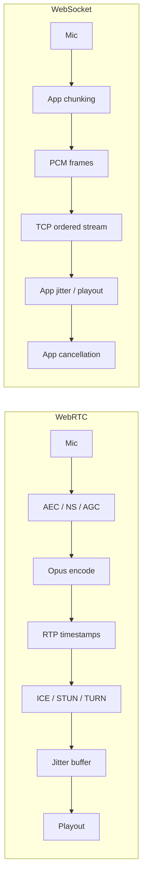
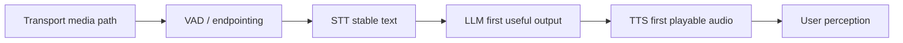

# Transport Is Media Correctness

The shallow question is "WebSocket or WebRTC?" The better question is: which layer owns
media correctness? Voice agents need capture timing, echo cancellation, packet timing,
jitter handling, interruption, playout, control events, NAT traversal, and observability. WebRTC
is not just a lower-latency pipe; it is a media stack. WebSocket is a general ordered byte
stream; it can work, but the application inherits the media behavior.

## Source Map

| Ref | Source | Local path | Role |
|---|---|---|---|
| R-VA-028 | Local transport deep dive | `../TRANSPORT-DEEP-DIVE.md` | Existing protocol comparison and WebSocket overhead details. |
| R-VA-029 | MDN WebRTC protocols | `../articles/mdn-webrtc-protocols.html` | ICE/STUN/TURN overview and protocol stack. |
| R-VA-031 | OpenAI Realtime WebRTC/WebSocket docs | `../articles/openai-realtime-webrtc.html`, `../articles/openai-realtime-websocket.html` | Official client/browser vs server-side transport split. |
| R-VA-032 | LiveKit transport docs | `../articles/livekit-transport.html` | Production WebRTC substrate framing. |
| R-VA-033 | Pipecat transport docs | `../articles/pipecat-transports.html`, `../articles/pipecat-choosing-transport.html` | Framework guidance on choosing transports. |

## The Important Distinction

WebSocket can stream audio. It is often enough for:

- localhost demos;
- server-to-server streams;
- telephony media stream integrations;
- controlled network environments;
- simple binary PCM prototypes.

But browser/mobile voice agents are not only "streaming bytes." They need media-native
behavior. WebRTC gives the browser and runtime more of this machinery:

- microphone capture with media constraints;
- echo cancellation/noise suppression/auto gain control;
- Opus encoding;
- RTP timestamps and sequence numbers;
- jitter buffer and packet-loss concealment;
- ICE/STUN/TURN traversal;
- media stats;
- separate media/control channels depending on architecture.

## Transport Comparison

| Dimension | WebRTC | WebSocket |
|---|---|---|
| Best fit | Browser/mobile voice, production client media | Server-to-server, telephony streams, controlled prototypes |
| Transport behavior | Media-native RTP/SRTP, usually UDP, adaptive | TCP stream, ordered delivery |
| Audio stack | Opus, timestamps, jitter buffer, packet-loss tools | App implements framing, timing, buffering |
| Browser AEC/NS/AGC | First-class capture/media path | Capture constraints possible, but transport is not media-native |
| NAT traversal | ICE/STUN/TURN built in | Usually simpler firewall path, but no media traversal stack |
| Barge-in | Easier to separate media timing and control | Ordered stream can couple audio/control delay |
| OpenAI guidance | Recommended for browser/mobile clients | Recommended for server-to-server |
| Pipecat guidance | Good for client-to-server voice | Good for server-to-server/text/controlled cases |

The local transport deep dive also makes an important point: WebSocket frame overhead is
not the main issue. The document estimates 2-14 bytes per frame, which is only 0.2-1.5%
for a 960-byte 30 ms 16 kHz int16 audio chunk. The real issues are TCP head-of-line
blocking, jitter/playout policy, media timing, echo, and cancellation.

## WebSocket Is Not "Bad"

The blog should avoid a simplistic "WebRTC good, WebSocket bad" take. WebSocket is
excellent when the media problems are already solved or do not matter:

- Twilio/telephony media streams commonly expose WebSocket-like server streams.
- Backend-to-backend model events often fit WebSocket.
- Realtime API server controls can use WebSocket to observe/manage sessions.
- A local demo can be simpler and completely adequate over WebSocket.

But the burden is different. With WebSocket audio, your app must define:

- exact chunk format;
- sample rate and resampling;
- sequence numbers/timestamps;
- buffering and drift correction;
- playback scheduling;
- cancellation semantics;
- whether control messages can overtake audio messages;
- how packet loss and jitter are handled under real networks.

## Why WebRTC Wins For Browser/Mobile

The decisive factor is not always raw latency. It is that browser/mobile conditions are messy:

- speakers echo into microphones;
- Bluetooth and mobile OS audio stacks add buffering;
- users change networks;
- packet loss happens;
- NAT/firewalls block direct connections;
- the agent needs to distinguish user speech from its own playback;
- interruptions must cancel playout and model generation quickly.

WebRTC was built for this kind of media session. WebSocket was not.

## Media Stack Diagram

The WebSocket path can absolutely be made good. But every app now owns the details the
WebRTC stack already encodes.

## WebRTC Does Not Remove The Agent Budget

A separate warning: WebRTC does not solve STT, LLM, TTS, or endpointing. A perfect
transport still leaves the core budget:

Transport should be treated as the media foundation. It prevents avoidable audio-session
failure. It does not make a slow endpointing policy feel fast.

## Engineering Inference

Recommendation shape for the presentation:

| Scenario | Default transport |
|---|---|
| Browser/mobile user talks to voice agent | WebRTC |
| Native app with production media stack | WebRTC or platform-native media stack |
| Telephony provider media stream | Provider-native stream, often WebSocket |
| Backend-to-backend model stream | WebSocket |
| Local proof-of-concept | WebSocket is fine |
| Live stage demo where reliability matters | Prefer the simpler path you can fully test, but know what it gives up |

The article can say: use WebRTC by default for client voice, not because demos cannot work
over WebSocket, but because production voice is a media problem.

## Non-Claims

- WebRTC is not always lower latency than WebSocket.
- WebSocket is not unusable for audio.
- Transport choice does not dominate a 1-2 second model/endpointing budget.
- WebRTC still requires correct TURN placement, audio constraints, and cancellation code.
- A local demo result does not predict mobile packet-loss behavior.

## Blog/Deck Visual Candidates

- WebRTC vs WebSocket responsibilities table.
- "Frame overhead is not the problem" small callout using the 2-14 byte overhead figure.
- Media correctness diagram showing AEC, Opus, RTP timestamps, jitter, TURN.
- Decision matrix by environment.

## References

- R-VA-028: `../TRANSPORT-DEEP-DIVE.md`
- R-VA-029: `../articles/mdn-webrtc-protocols.html`
- R-VA-031: `../articles/openai-realtime-webrtc.html`, `../articles/openai-realtime-websocket.html`
- R-VA-032: `../articles/livekit-transport.html`
- R-VA-033: `../articles/pipecat-transports.html`, `../articles/pipecat-choosing-transport.html`
- Data: `../data/transport_tradeoffs.csv`
