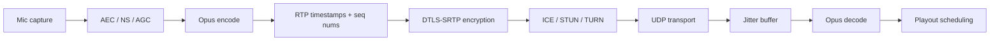
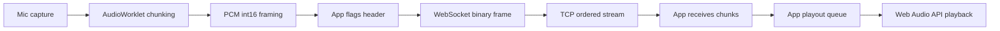
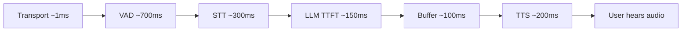

# Transport Is Media Correctness

The question "WebSocket or WebRTC?" masks a deeper engineering question: which layer owns
media correctness for a voice agent? Voice agents require capture timing, echo
cancellation, packet timing, jitter handling, interruption control, playout scheduling,
codec negotiation, NAT traversal, and observability. WebRTC is not merely a lower-latency
pipe; it is a media stack that encodes these behaviors at the protocol level. WebSocket is
a general-purpose ordered byte stream. It can carry audio, but the application inherits
every media behavior that WebRTC provides natively.

This insight traces the evidence from protocol standards, vendor documentation, framework
guidance, and local transport analysis to show when transport choice matters, when it does
not, and what specific protocol-level mechanisms make WebRTC the default for browser/mobile
voice agents.

## Source Map

| Ref      | Source                                | Local path                                                                              | Role                                                                                                                                                                |
| -------- | ------------------------------------- | --------------------------------------------------------------------------------------- | ------------------------------------------------------------------------------------------------------------------------------------------------------------------- |
| R-VA-028 | Local transport deep dive             | `../TRANSPORT-DEEP-DIVE.md`                                                             | Protocol internals, frame overhead calculation, echo cancellation analysis, latency budget breakdown, industry survey. `local measurement` / `practitioner signal`. |
| R-VA-029 | MDN WebRTC protocols                  | `../articles/mdn-webrtc-protocols.html`                                                 | ICE/STUN/TURN/SDP protocol definitions. `official-doc evidence`.                                                                                                    |
| R-VA-031 | OpenAI Realtime WebRTC/WebSocket docs | `../articles/openai-realtime-webrtc.html`, `../articles/openai-realtime-websocket.html` | Official transport guidance: WebRTC for browser/mobile, WebSocket for server-to-server. `official-doc evidence`.                                                    |
| R-VA-032 | LiveKit transport docs                | `../articles/livekit-transport.html`                                                    | Production WebRTC SFU substrate reference. `official-doc evidence`.                                                                                                 |
| R-VA-033 | Pipecat transport docs                | `../articles/pipecat-transports.html`, `../articles/pipecat-choosing-transport.html`    | Transport-selection guidance with explicit "WebRTC for client-to-server voice, WebSocket for server-to-server." `official-doc evidence`.                            |

## What WebRTC Provides That WebSocket Does Not

### Protocol-Level Media Semantics (official-doc evidence)

The MDN WebRTC protocols page (R-VA-029) describes the full protocol stack that WebRTC
assembles. The critical components for voice agents, with their standard references:

1. **ICE (RFC 8445)** -- Interactive Connectivity Establishment. Gathers host, server-reflexive (STUN), and relay (TURN) candidates, runs connectivity checks, and selects the best working path. The MDN docs describe three candidate types: host (local IP, best latency), srflx (public IP via STUN, good latency), and relay (TURN server, always works but adds a hop). Source: R-VA-029.

2. **STUN (RFC 8489)** -- Session Traversal Utilities for NAT. Lets a client discover its public IP and port. The MDN docs note that STUN fails with symmetric NAT, which is common in corporate networks and some mobile carriers. Source: R-VA-029.

3. **TURN (RFC 8656)** -- Traversal Using Relays around NAT. Relays all media through a server when direct connectivity fails. The local transport deep dive reports that approximately 10-15% of WebRTC connections in the wild require TURN relay (`practitioner signal`, R-VA-028).

4. **DTLS-SRTP (RFC 9147, RFC 3711)** -- Encryption and media transport. SRTP carries audio with sequence numbers for reordering detection, timestamps for jitter buffer management, and negotiated payload types (Opus = PT 111 typically). The local transport deep dive documents the SRTP header structure with its sequence number, timestamp, and SSRC fields (`practitioner signal`, R-VA-028).

5. **SDP (RFC 8866)** -- Session Description Protocol. Negotiates codecs, sample rates, and media direction. The deep dive shows an example SDP negotiating Opus at 48 kHz with FEC enabled (`a=fmtp:111 minptime=10;useinbandfec=1`). Source: R-VA-028.

6. **RTCP** -- RTP Control Protocol. Carries sender/receiver reports with fraction lost, cumulative lost, jitter statistics. The sender uses RTCP feedback to adapt bitrate, codec, or stream quality. Source: R-VA-028.

None of these mechanisms exist in the WebSocket protocol. WebSocket (RFC 6455) provides a
persistent full-duplex TCP channel with frame-based messaging. Audio over WebSocket means
the application implements all media behavior above the TCP layer.

### Opus Encoding and Bandwidth (practitioner signal)

The local transport deep dive (R-VA-028) documents the codec difference:

| Transport           | Audio format               | Bandwidth          | Compression        | Source   |
| ------------------- | -------------------------- | ------------------ | ------------------ | -------- |
| WebSocket (typical) | Raw PCM int16, 16 kHz mono | 256 kbps (32 KB/s) | None               | R-VA-028 |
| WebRTC (typical)    | Opus, negotiated via SDP   | 16-32 kbps         | 10-20x compression | R-VA-028 |

The deep dive notes that Opus includes built-in forward error correction (FEC) for packet
loss resilience. On localhost, the bandwidth difference is irrelevant. Over the internet,
Opus saves significant bandwidth and handles lossy connections better.

Inference: For mobile users on cellular connections with bandwidth constraints, the 10-20x
compression difference between raw PCM and Opus is material. For localhost demos or LAN
deployments, it does not matter.

### RTP Timestamps and Jitter Buffer (practitioner signal)

The local transport deep dive (R-VA-028) documents the SRTP packet structure. Each packet
carries:

- **Sequence numbers** -- for reordering detection and packet loss counting.
- **Timestamps** -- for jitter buffer management and playout scheduling.
- **No retransmission by default** -- lost packets stay lost; the jitter buffer conceals
  gaps with packet loss concealment (PLC).

The deep dive states: "The browser's WebRTC stack includes a built-in jitter buffer that
smooths out timing variations in incoming audio. With WebSocket, you'd implement this
yourself."

Inference: RTP timestamps are what allow the jitter buffer to schedule playout correctly
even when packets arrive out of order or with variable delay. Without timestamps, a
WebSocket implementation must infer timing from arrival order and wall-clock time, which
is less robust under jitter.

### Connection Setup Cost (practitioner signal)

The local transport deep dive (R-VA-028) provides connection setup timelines:

| Transport       | Setup time | Steps                                                            | Source   |
| --------------- | ---------- | ---------------------------------------------------------------- | -------- |
| WebSocket (WSS) | ~100 ms    | TCP SYN/SYN-ACK/ACK, TLS handshake, HTTP Upgrade                 | R-VA-028 |
| WebRTC          | ~500 ms    | SDP exchange, ICE gathering, connectivity checks, DTLS handshake | R-VA-028 |

WebRTC takes 3-5x longer to establish a connection. Once established, audio flows with
the media-native characteristics described above.

## WebSocket Frame Overhead Is Not the Problem (practitioner signal)

The local transport deep dive (R-VA-028) calculates WebSocket frame overhead precisely:

> **Overhead:** 2-14 bytes per frame. For a 960-byte audio chunk (30 ms at 16 kHz, int16),
> that's 0.2-1.5% overhead. Negligible.

The WebSocket frame format (RFC 6455) uses:

- 2 bytes minimum header (FIN, opcode, mask bit, 7-bit payload length)
- Up to 8 bytes extended payload length (for payloads > 125 bytes)
- 4 bytes masking key (client-to-server only; server-to-client is unmasked)

For the Jarvis implementation, the custom binary protocol adds a 4-byte flags header
(carrying `is_tts_playing` state), making the total per-frame overhead 6-18 bytes on a
960-byte payload, or 0.6-1.9%. Source: R-VA-028.

Inference: Frame overhead is a red herring. The real problems with WebSocket for real-time
audio are TCP head-of-line blocking, absence of jitter/playout policy, lack of media
timing primitives, and no integrated echo cancellation. The 0.2-1.5% overhead number is
useful in the article to defuse the wrong argument.

## TCP Head-of-Line Blocking (practitioner signal)

The local transport deep dive (R-VA-028) explains the fundamental TCP problem for
real-time audio: TCP guarantees in-order delivery, so if packet N is lost, packets N+1,
N+2, ... are buffered at the receiver's TCP stack until packet N is retransmitted.

The deep dive provides a packet-loss impact table:

| Scenario                 | Packet loss | HOL stall            | Impact            | Source   |
| ------------------------ | ----------- | -------------------- | ----------------- | -------- |
| Localhost                | ~0%         | N/A                  | No impact         | R-VA-028 |
| LAN (same network)       | <0.01%      | N/A                  | No impact         | R-VA-028 |
| Internet (good)          | <0.1%       | ~50 ms once per 30 s | Imperceptible     | R-VA-028 |
| Internet (poor / mobile) | 1-5%        | 50-200 ms frequently | Noticeable jitter | R-VA-028 |
| Corporate VPN            | 0.1-1%      | Variable             | Depends on VPN    | R-VA-028 |

The deep dive's key observation: "The pipeline latency (1-2 s for VAD+STT+LLM+TTS)
dominates by 100x. A 50 ms HOL stall is noise." This is true for the total latency
budget. But the perceptual effect matters: "Variable delay (jitter) is worse than
consistent delay."

Inference: HOL blocking matters for the playout smoothness of TTS audio returning to the
user, not for the total response time. A 50 ms stall followed by a burst of queued audio
is perceptually worse than a steady 50 ms delay, even though the total latency is similar.
WebRTC avoids this because SRTP over UDP simply drops lost packets and conceals them.

## Echo Cancellation: Where WebRTC Wins Decisively (practitioner signal)

The local transport deep dive (R-VA-028, Section 7) calls echo cancellation "the one area
where WebRTC has a decisive, hard-to-replicate advantage."

The browser's AEC (Acoustic Echo Cancellation) algorithm has a privileged position: it has
direct access to both the microphone signal (speech + echo + noise) and the reference
signal (what the speakers are playing). In WebRTC, the browser controls both playback (via
`<audio>` element or MediaStream) and capture (via getUserMedia). The AEC operates at the
audio driver level with access to both signals.

The deep dive documents three WebSocket AEC workarounds with their limitations:

| Workaround                               | How it works                                               | Limitation                                                                                                                                                        | Source   |
| ---------------------------------------- | ---------------------------------------------------------- | ----------------------------------------------------------------------------------------------------------------------------------------------------------------- | -------- |
| Mute mic during playback                 | Server skips mic frames while `is_tts_playing` flag is set | Prevents barge-in entirely                                                                                                                                        | R-VA-028 |
| getUserMedia echoCancellation constraint | Browser applies AEC to mic stream before app sees it       | "Works ~80% of the time on Chrome desktop. Not reliable enough for production." AEC may not have correct reference signal when audio plays through Web Audio API. | R-VA-028 |
| Server-side AEC (SpeexDSP)               | Run AEC algorithm on server with reference signal          | Requires sending reference signal back (doubles bandwidth), adds latency, quality depends on tail length tuning                                                   | R-VA-028 |

The deep dive also provides a scenario matrix:

| Scenario                              | Echo risk | Recommendation                        | Source   |
| ------------------------------------- | --------- | ------------------------------------- | -------- |
| Agent speaks, user waits, user speaks | None      | Mute-during-playback works            | R-VA-028 |
| User can interrupt agent (barge-in)   | High      | Need real AEC (WebRTC or server-side) | R-VA-028 |
| Headphones required                   | None      | No echo path exists                   | R-VA-028 |
| Speakerphone / laptop speakers        | High      | AEC essential                         | R-VA-028 |
| Smart speaker / far-field mic         | Very high | Hardware AEC + software AEC           | R-VA-028 |

Inference: Echo cancellation is the strongest argument for WebRTC in browser/mobile voice
agents. The workarounds for WebSocket are either destructive (muting prevents barge-in),
unreliable (getUserMedia AEC without reference signal), or complex (server-side AEC with
doubled bandwidth). This connects directly to INSIGHT_06 on barge-in.

## What Vendors and Frameworks Recommend

### OpenAI Realtime API (official-doc evidence)

The OpenAI Realtime WebRTC docs (R-VA-031, `../articles/openai-realtime-webrtc.html`)
state: "For browser-based speech-to-speech voice applications, we recommend starting with
Voice agents." The docs further state: "When connecting to a Realtime model from the client (like a web
browser or mobile device), we recommend using WebRTC rather than WebSockets for more
consistent performance."

The OpenAI Realtime WebSocket docs (R-VA-031, `../articles/openai-realtime-websocket.html`)
exist as a separate page, implying the server-to-server use case.

The local transport deep dive summarizes: "WebRTC recommended for browser-based
applications (built-in AEC, lower perceived latency). WebSocket mode for server-to-server
integrations (telephony, backend pipelines)." Source: R-VA-028.

### Pipecat (official-doc evidence)

The Pipecat choosing-transport docs (R-VA-033, `../articles/pipecat-choosing-transport.html`)
make the strongest statement among the frameworks examined:

> "For any client-to-server voice application, WebRTC is the right choice."

The docs list specific reasons:

- **Head-of-line blocking**: "TCP retransmits lost packets and holds up everything behind
  them. For audio, a dropped packet is better discarded than waited for -- a brief gap
  sounds far better than a stutter."
- **Opus codec coupling**: "Opus's forward error correction and packet loss concealment
  are designed to work with UDP's delivery model. On TCP, that machinery either doesn't
  help or actively hurts."
- **No automatic timestamping**: "WebRTC handles RTP timestamping and jitter buffering
  automatically. WebSocket leaves that to you."
- **No built-in echo cancellation or noise suppression**: "Browser echo cancellation (AEC)
  is wired into the WebRTC stack. It's not available to arbitrary WebSocket streams."
- **Reconnection complexity**: "WebRTC handles ICE restarts and network changes. WebSocket
  reconnection on mobile, sleep/wake cycles, or network switches requires you to rebuild
  that logic yourself."

The docs then state: "WebSocket is appropriate for server-to-server communication (where
both sides are on stable, controlled networks) or for text-only bots with no audio."

Pipecat offers three transport options:

1. **SmallWebRTC** -- Direct peer-to-peer WebRTC. Default in quickstart templates. For
   self-hosting and local dev.
2. **Daily** -- WebRTC via Daily's global network (~75 PoPs, P50 first-hop latency ~13 ms,
   `vendor claim`). For production with global users.
3. **WebSocket** -- For text-only or server-to-server. Explicitly: "Do not use it for
   browser-to-server voice interactions."

### LiveKit (official-doc evidence)

LiveKit (R-VA-032) is WebRTC-only. The platform is built as a Selective Forwarding Unit
(SFU) that handles all WebRTC infrastructure. The local transport deep dive notes:
"Their core product is real-time communication rooms. Voice agents are an extension."
Source: R-VA-028.

### Industry Summary (practitioner signal)

The local transport deep dive (R-VA-028) surveys the industry:

| Platform             | Transport                             | Reason                                  | Source             |
| -------------------- | ------------------------------------- | --------------------------------------- | ------------------ |
| OpenAI Realtime      | Both (WebRTC preferred for browser)   | Flexibility across use cases            | R-VA-028, R-VA-031 |
| LiveKit              | WebRTC only                           | Core product is real-time communication | R-VA-028, R-VA-032 |
| Daily / Pipecat      | WebRTC (with WS abstraction)          | Production infrastructure               | R-VA-028, R-VA-033 |
| Twilio Media Streams | WebSocket                             | Telephony bridge, not browser-native    | R-VA-028           |
| Gemini Live          | WebSocket                             | Simplicity, native multimodal           | R-VA-028           |
| Vapi / Retell        | WebRTC (abstracted via LiveKit/Daily) | Built on LiveKit/Daily                  | R-VA-028           |

Inference: The pattern is consistent. Every vendor that targets browser/mobile voice uses
WebRTC or recommends WebRTC for that use case. WebSocket appears in telephony bridging
(Twilio), simplified multimodal APIs (Gemini), and server-to-server integrations.

## WebSocket Is Not Bad

The evidence does not support a "WebRTC good, WebSocket bad" conclusion. WebSocket is
appropriate -- and sometimes preferable -- when the media problems are already solved or do
not matter.

### When WebSocket Works Well

1. **Telephony media streams.** Twilio Media Streams uses WebSocket to bridge PSTN audio
   to application servers. The audio arrives as base64-encoded mu-law in JSON messages.
   The PSTN leg is not WebRTC; WebSocket bridges the gap between telephony infrastructure
   and the application. Source: R-VA-028.

2. **Server-to-server model streams.** The OpenAI Realtime API offers WebSocket for
   server-side integrations where both endpoints are on stable networks. Pipecat explicitly
   recommends WebSocket for "connecting two servers." Sources: R-VA-031, R-VA-033.

3. **Backend session control.** WebSocket can observe and manage Realtime API sessions
   from a backend without carrying media. Source: R-VA-031.

4. **Local proof-of-concept.** On localhost with ~0% packet loss and ~0 ms RTT, the
   WebRTC advantages (UDP, jitter buffer, Opus) provide no measurable benefit. The
   simpler WebSocket setup (single TCP connection, no ICE/STUN/TURN) is preferable for
   iteration speed. Source: R-VA-028.

5. **Controlled network environments.** LAN deployments with <0.01% packet loss see no
   HOL blocking impact. Source: R-VA-028.

### The Burden Difference

With WebSocket audio, the application must define (R-VA-028):

- Exact chunk format (sample rate, bit depth, endianness)
- Resampling between device rate and model rate
- Sequence numbers and timestamps (if any)
- Buffering and drift correction
- Playback scheduling
- Cancellation semantics (how to stop mid-stream)
- Whether control messages can overtake audio messages (they cannot on a single ordered
  TCP stream)
- How packet loss and jitter are handled (TCP retransmits, causing stalls)

WebRTC encodes all of these at the protocol level.

## The Latency Budget Argument (practitioner signal)

The local transport deep dive (R-VA-028, Section 8) provides the Jarvis latency breakdown:

| Stage                       | Latency      | % of total | Source   |
| --------------------------- | ------------ | ---------- | -------- |
| VAD silence detection       | ~700 ms      | 46.7%      | R-VA-028 |
| Whisper STT (small, CPU)    | ~300 ms      | 20.0%      | R-VA-028 |
| Groq LLM TTFT (streaming)   | ~150 ms      | 10.0%      | R-VA-028 |
| First sentence buffer       | ~100 ms      | 6.7%       | R-VA-028 |
| Kokoro TTS (first sentence) | ~200 ms      | 13.3%      | R-VA-028 |
| WebSocket round-trip        | ~1 ms        | 0.07%      | R-VA-028 |
| **Total to first audio**    | **~1451 ms** |            | R-VA-028 |

Transport contributes 0.07% of total latency on localhost. Even over the internet with 50
ms RTT, both WebSocket and WebRTC add approximately the same network latency (~50 ms, or
3.3% of the total budget).

Inference: Transport protocol choice does not meaningfully affect response latency. The
argument for WebRTC is not about speed; it is about media correctness -- echo
cancellation, codec efficiency, jitter handling, NAT traversal, and playout smoothness.

## Media Stack Diagrams

### WebRTC Media Path (conceptual)

### WebSocket Media Path (conceptual)

The WebSocket path can be made to work. But every box labeled "App" in the WebSocket
diagram is a box labeled with a protocol name in the WebRTC diagram.

### Agent Latency Budget (data-supported)

Transport is the thinnest slice. The argument for WebRTC is correctness, not speed.

## Explicit Inferences

1. **Inference:** The 10-15% TURN relay rate (`practitioner signal`, R-VA-028) means that
   roughly 1 in 7-10 WebRTC connections adds an extra hop through a relay server. For
   production voice agents, TURN infrastructure is a required cost, not optional.

2. **Inference:** Pipecat's Daily network P50 first-hop latency of ~13 ms (`vendor claim`,
   R-VA-033) suggests that managed WebRTC infrastructure adds minimal latency overhead for
   the reliability and global routing it provides.

3. **Inference:** The convergence of OpenAI, Pipecat, and LiveKit on "WebRTC for
   browser/mobile, WebSocket for server-to-server" represents an industry consensus that
   emerged independently across three organizations with different architectures.

4. **Inference:** The getUserMedia echoCancellation constraint working "~80% of the time
   on Chrome desktop" (R-VA-028) is insufficient for production voice agents. The 20%
   failure rate would create unacceptable echo feedback in real usage. This makes WebRTC's
   integrated AEC a hard requirement for speakerphone use.

5. **Inference:** Opus FEC is designed for UDP's loss model, where a lost packet stays
   lost. On TCP (WebSocket), packet loss triggers retransmission and HOL blocking rather
   than a gap. Opus FEC on TCP either doesn't help (because the packet eventually arrives
   via retransmit) or actively hurts (by adding redundancy to an already-reliable stream).
   This point is stated directly by Pipecat docs (`official-doc evidence`, R-VA-033).

## Implementation Implications

### Decision Matrix

| Scenario                                 | Recommended transport             | Why                                                          | Source                       |
| ---------------------------------------- | --------------------------------- | ------------------------------------------------------------ | ---------------------------- |
| Browser/mobile user talks to voice agent | WebRTC                            | AEC, Opus, jitter buffer, NAT traversal                      | R-VA-028, R-VA-031, R-VA-033 |
| Native app with production media stack   | WebRTC or platform-native media   | Same media correctness needs                                 | R-VA-028                     |
| Telephony provider media stream          | Provider-native (often WebSocket) | PSTN bridge, not browser-native                              | R-VA-028                     |
| Backend-to-backend model stream          | WebSocket                         | Stable network, no browser media stack needed                | R-VA-031, R-VA-033           |
| Local proof-of-concept                   | WebSocket                         | Simpler setup, faster iteration, media advantages irrelevant | R-VA-028                     |
| Text-only bots                           | WebSocket                         | No audio at all                                              | R-VA-033                     |

### For the Presentation

The core message: use WebRTC by default for client voice, not because demos cannot work
over WebSocket, but because production voice is a media problem. The transport does not
affect latency in any measurable way (0.07% of budget). It affects whether the audio
session works correctly under real-world conditions.

## Non-Claims

- **WebRTC is not always lower latency than WebSocket.** On localhost and LAN, both are
  ~1 ms. The latency advantage of WebRTC only manifests under packet loss conditions on
  real networks.
- **WebSocket is not unusable for audio.** Twilio, Gemini Live, and countless demos run
  audio over WebSocket successfully.
- **Transport choice does not dominate the latency budget.** The 1-2 second
  VAD+STT+LLM+TTS pipeline is 100x larger than transport latency.
- **WebRTC does not automatically implement application-level cancellation.** Stopping
  TTS playout and cancelling model generation still requires application logic.
- **WebRTC still requires correct TURN placement, audio constraints, and cancellation
  code.** The protocol handles media transport, not application behavior.
- **A local demo result does not predict mobile packet-loss behavior.** Testing on
  localhost validates the pipeline, not the transport robustness.
- **getUserMedia constraints work independently of transport for capture-side processing.**
  Both WebSocket and WebRTC can request echoCancellation/noiseSuppression/autoGainControl
  on the mic stream. The difference is in playout-side AEC reference signal access.
- **This insight does not claim WebRTC is simpler.** The deep dive estimates ~4x more code
  and 2-3 additional failure modes for WebRTC compared to WebSocket (R-VA-028). The
  argument is correctness, not simplicity.

## Blog/Presentation Visual Candidates

- **Transport comparison table** with a "Source" column. The table in this insight provides
  the data.
- **"Frame overhead is not the problem" callout.** The 2-14 byte / 0.2-1.5% number from
  R-VA-028 is a clean, surprising fact for the audience.
- **Media correctness diagram.** The WebRTC vs WebSocket media path diagrams above, side
  by side, showing which boxes are protocol-level vs application-level.
- **Latency budget pie chart.** Transport at 0.07% makes the "transport is not about
  speed" argument visual.
- **Decision matrix by environment.** The table from Implementation Implications.
- **Echo cancellation scenario matrix.** The table from the AEC section.
- **Industry consensus table.** All major vendors converge on WebRTC for browser/mobile.

## References

- R-VA-028: Local transport deep dive. `../TRANSPORT-DEEP-DIVE.md`.
- R-VA-029: MDN WebRTC protocols. `../articles/mdn-webrtc-protocols.html`. https://developer.mozilla.org/en-US/docs/Web/API/WebRTC_API/Protocols.
- R-VA-031: OpenAI Realtime WebRTC docs. `../articles/openai-realtime-webrtc.html`. https://developers.openai.com/api/docs/guides/realtime-webrtc.
- R-VA-031: OpenAI Realtime WebSocket docs. `../articles/openai-realtime-websocket.html`. https://developers.openai.com/api/docs/guides/realtime-websocket.
- R-VA-032: LiveKit transport docs. `../articles/livekit-transport.html`. https://docs.livekit.io/transport/.
- R-VA-033: Pipecat transport docs. `../articles/pipecat-transports.html`. https://docs.pipecat.ai/pipecat/learn/transports.
- R-VA-033: Pipecat choosing-transport docs. `../articles/pipecat-choosing-transport.html`. https://docs.pipecat.ai/pipecat/learn/choosing-a-transport.
- Data: `../data/transport_tradeoffs.csv`.
