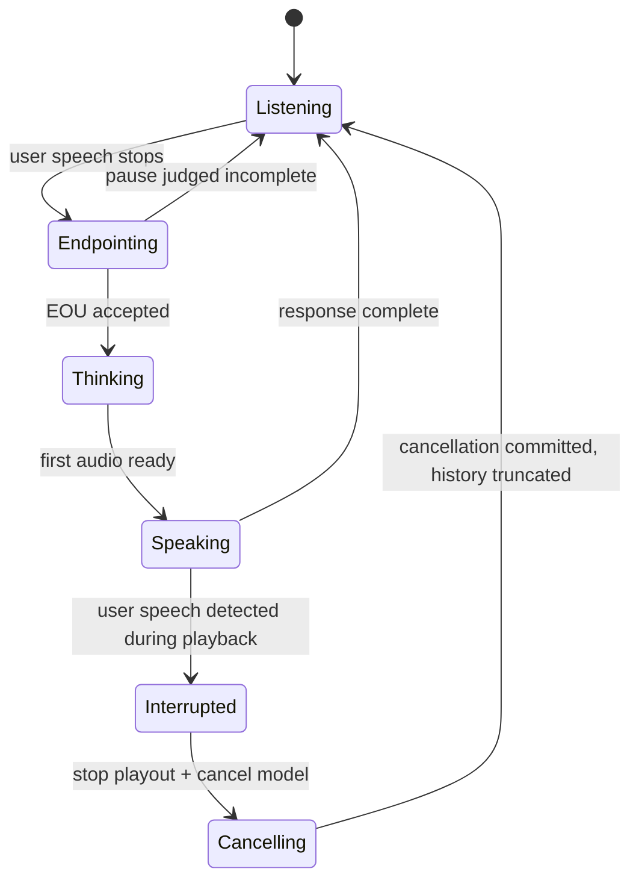

# Barge-In Is The Real System Test

A voice agent is not truly conversational until the user can interrupt it. Barge-in forces
every part of the system to be honest: echo cancellation must work during playback, VAD
must discriminate user speech from agent audio, transport timing must allow control
messages to overtake audio, playback must stop promptly, model generation must be
cancellable, response truncation must synchronize server and client state, and conversation
history must reflect what was actually heard -- not what was generated.

This is why barge-in is a better system test than "can it answer one clean prompt?" A
clean prompt tests STT, LLM, and TTS in isolation. Barge-in tests the full-duplex
feedback loop: simultaneous input and output, cancellation semantics, state
reconciliation, and the boundary between acoustic events and semantic intent.

This insight traces the evidence for how barge-in works across providers and frameworks,
what specific API fields control interruption behavior, what data gaps exist in measuring
interruption correctness, and why echo cancellation quality (including VAD accuracy)
cascades into barge-in correctness.

## Source Map

| Ref | Source | Local path | Role |
|---|---|---|---|
| R-VA-002 | Local VAD deep dive | `../VAD-DEEP-DIVE.md` | VAD state machine, Silero/WebRTC ROC-AUC comparison, threshold tuning. `local measurement` / `practitioner signal`. |
| R-VA-005 | Silero VAD quality metrics | `../articles/silero-vad-quality-metrics.html` | ROC-AUC benchmark: Silero v6 0.97 vs WebRTC 0.73. `benchmark evidence`. |
| R-VA-007 | OpenAI Realtime API reference | `../articles/openai-realtime-api-reference.html` | `server_vad` and `semantic_vad` turn detection, `interrupt_response` field, `conversation.item.truncate` event, `prefix_padding_ms`, `silence_duration_ms`, `threshold`, `eagerness`. `official-doc evidence`. |
| R-VA-008 | LiveKit turns overview | `../articles/livekit-turns.html` | Turn detection modes, adaptive interruption handling, false interruption recovery, `InterruptionOptions` fields. `official-doc evidence`. |
| R-VA-009 | Pipecat Smart Turn docs | `../articles/pipecat-smart-turn.html` | Context-aware turn completion model. `official-doc evidence`. |
| R-VA-028 | Local transport deep dive | `../TRANSPORT-DEEP-DIVE.md` | Echo cancellation analysis, WebRTC AEC vs WebSocket workarounds, `is_tts_playing` flag implementation. `local measurement` / `practitioner signal`. |
| R-VA-031 | OpenAI Realtime WebRTC/WebSocket docs | `../articles/openai-realtime-webrtc.html`, `../articles/openai-realtime-websocket.html` | Transport and event model for Realtime sessions. `official-doc evidence`. |
| R-VA-033 | Pipecat transport docs | `../articles/pipecat-choosing-transport.html` | Transport guidance: "Browser echo cancellation (AEC) is wired into the WebRTC stack. It's not available to arbitrary WebSocket streams." `official-doc evidence`. |

## Why Barge-In Is Hard

Barge-in requires the agent to do several things simultaneously, and each can fail
independently:

1. **Keep listening while speaking.** The microphone must remain active during agent
   playback. If the mic is muted during TTS (as in the Jarvis WebSocket implementation),
   barge-in is impossible by design (`practitioner signal`, R-VA-028).

2. **Avoid transcribing its own audio.** Without echo cancellation, the agent's speech
   leaks into the microphone and gets transcribed as user input. The local transport deep
   dive documents this failure mode: the agent can "transcribe its own response, trigger
   VAD on its own voice, reset the end-of-turn timer, enter feedback loops, ignore the
   real user because the input stream is polluted" (`practitioner signal`, R-VA-028).

3. **Detect that the user actually intends to interrupt.** Not all speech during agent
   playback is interruption. Backchannels ("yeah", "right", "mm-hm"), coughs, and
   background noise must be distinguished from intentional interruption. This requires
   either a policy layer or a semantic model.

4. **Stop local playback quickly.** The client must stop playing agent audio and clear
   any buffered TTS chunks.

5. **Cancel or truncate the model response.** The server must stop generating tokens
   and/or stop synthesizing speech.

6. **Preserve accurate conversation history.** The conversation history must reflect what
   the user actually heard, not what was generated. Unheard assistant text must not appear
   in the context sent to the LLM for the next turn.

7. **Start processing the user's new turn without waiting for stale audio.** The pipeline
   must not block on draining old TTS chunks before processing the interrupting utterance.

## Barge-In State Machine

The critical transition is `Speaking -> Interrupted`. During the Speaking state, the VAD
operates under echo and playback. The agent must decide whether the detected speech is
an interruption or a backchannel. This decision depends on the quality of echo
cancellation (does the VAD see the user's voice or the agent's voice?), the VAD's
discrimination ability (is the detected audio speech or noise?), and the interruption
policy (should backchannels trigger cancellation?).

## Provider-Specific Barge-In Mechanisms

### OpenAI Realtime API (official-doc evidence)

The OpenAI Realtime API reference (R-VA-007) exposes two turn detection modes with
distinct interruption handling:

**server_vad mode fields:**

| Field | Type | Default | Description | Source |
|---|---|---|---|---|
| `type` | string | -- | `"server_vad"` | R-VA-007 |
| `threshold` | number (0.0-1.0) | 0.5 | VAD activation threshold. Higher = requires louder audio. | R-VA-007 |
| `prefix_padding_ms` | number | 300 ms | Audio to include before VAD detected speech. | R-VA-007 |
| `silence_duration_ms` | number | 500 ms | Duration of silence to detect speech stop. | R-VA-007 |
| `interrupt_response` | boolean | (not specified) | Whether to cancel ongoing response when VAD start event occurs. If `true`, response is cancelled; if `false`, response continues until complete. | R-VA-007 |
| `create_response` | boolean | (not specified) | Whether to automatically generate a response when VAD stop occurs. | R-VA-007 |
| `idle_timeout_ms` | number | 5000-30000 ms range | Timeout for no speech detected. Currently only supported for `server_vad`. | R-VA-007 |

The docs state: "Server VAD means that the model will detect the start and end of speech
based on audio volume and respond at the end of user speech." Source: R-VA-007.

The `interrupt_response` field is the key barge-in control. The docs state: "Whether or
not to automatically interrupt (cancel) any ongoing response with output to the default
conversation (i.e. `conversation` of `auto`) when a VAD start event occurs. If `true` then
the response will be cancelled, otherwise it will continue until complete." Source:
R-VA-007.

Inference: Setting `interrupt_response=false` with `create_response=false` gives the
developer full manual control: "the model will never respond automatically but VAD events
will still be emitted." This is useful for applications that want custom interruption
policies (e.g., only interrupt on specific keywords).

**semantic_vad mode fields:**

| Field | Type | Default | Description | Source |
|---|---|---|---|---|
| `type` | string | -- | `"semantic_vad"` | R-VA-007 |
| `eagerness` | enum | `"auto"` (= `"medium"`) | How eagerly the model responds. `low`/`medium`/`high`/`auto`. | R-VA-007 |
| `interrupt_response` | boolean | (not specified) | Same as server_vad: cancel ongoing response on VAD start. | R-VA-007 |
| `create_response` | boolean | (not specified) | Auto-generate response on VAD stop. | R-VA-007 |

The docs state: "Semantic VAD is more advanced and uses a turn detection model (in
conjunction with VAD) to semantically estimate whether the user has finished speaking, then
dynamically sets a timeout based on this probability. For example, if user audio trails off
with 'uhhm', the model will score a low probability of turn end and wait longer for the
user to continue speaking." Source: R-VA-007.

The eagerness levels have specific max timeouts: `low` = 8 s, `medium` = 4 s, `high` =
2 s. Source: R-VA-007.

**Truncation event for barge-in:**

The OpenAI Realtime API provides a `conversation.item.truncate` client event. The docs
state: "Send this event to truncate a previous assistant message's audio. The server will
produce audio faster than realtime, so this event is useful when the user interrupts to
truncate audio that has already been sent to the client but not yet played. This will
synchronize the server's understanding of the audio with the client's playback." Source:
R-VA-007.

The docs further state: "Truncating audio will delete the server-side text transcript to
ensure there is no text in the context that hasn't been heard by the user." Source:
R-VA-007.

Inference: OpenAI's truncation event implements the "conversation history must reflect what
was actually heard" requirement. The server-side transcript deletion is a deliberate design
choice to prevent the LLM from treating unheard text as established context. This is a
concrete example of the cancellation contract that every barge-in system needs.

**Speech detection events:**

The API emits `input_audio_buffer.speech_started` when speech is detected in the audio
buffer. The docs state: "The client may want to use this event to interrupt audio playback
or provide visual feedback to the user." Source: R-VA-007.

The `item_id` in the speech_started event identifies the user message item that will be
created when speech stops, enabling correlation between the interruption event and the
resulting transcript.

### LiveKit (official-doc evidence)

The LiveKit turns overview (R-VA-008, `../articles/livekit-turns.html`) provides a
comprehensive interruption handling system with multiple layers.

**Turn detection modes:**

| Mode | Description | Source |
|---|---|---|
| Turn detector model | Custom open-weights model for context-aware turn detection on top of VAD or STT endpoint data. | R-VA-008 |
| Realtime models | Server-side detection from realtime LLM (OpenAI Realtime API, Gemini Live API). | R-VA-008 |
| VAD only | End-of-turn from speech and silence data alone. | R-VA-008 |
| STT endpointing | Phrase endpoints from STT provider (AssemblyAI recommended). | R-VA-008 |
| Manual turn control | Disable automatic detection; control turn boundaries explicitly. | R-VA-008 |

**Interruption options (InterruptionOptions):**

| Field | Type | Description | Source |
|---|---|---|---|
| `enabled` | boolean | Whether agent can be interrupted by user speech. | R-VA-008 |
| `mode` | `"adaptive"` or `"vad"` | How interruptions are detected. `"adaptive"` is default on LiveKit Cloud. | R-VA-008 |
| `min_duration` | seconds | Minimum speech duration to register as interruption. | R-VA-008 |
| `min_words` | integer | Minimum words to register as interruption (requires STT). | R-VA-008 |
| `discard_audio_if_uninterruptible` | boolean | Drop buffered audio if agent is speaking and cannot be interrupted. | R-VA-008 |
| `false_interruption_timeout` | seconds | Duration of silence after interruption to wait before emitting false interruption event. | R-VA-008 |
| `resume_false_interruption` | boolean | Whether to resume agent speech after false interruption is detected. | R-VA-008 |

**Adaptive interruption handling:**

The docs state: "Adaptive interruption handling enables your agent to intelligently detect
when users interrupt mid-response. Rather than using fixed thresholds, adaptive
interruption handling analyzes the audio signals to determine whether an interruption is
intentional." The docs further state it can "distinguish true interruptions from
conversational backchanneling." Source: R-VA-008.

**False interruption recovery:**

The docs describe a specific recovery mechanism: "In some cases, the framework detects
human speech audio and interrupts the agent, but the transcription comes up empty as no
actual words are spoken. In these cases, the VAD-based interruption is considered a false
positive. By default, the agent resumes speaking from where it left off after a false
interruption." Source: R-VA-008.

This is controlled by `resume_false_interruption` (default: resume) and
`false_interruption_timeout` (how long to wait for actual transcription before declaring
the interruption false). Source: R-VA-008.

**Interruption events:**

LiveKit exposes `user_interruption_detected` (with `timestamp` and `probability`) and
`agent_false_interruption` events. Source: R-VA-008.

**Realtime model constraints:**

The docs note a hard constraint for realtime models with server-side turn detection:
"The SDK rejects `turn_handling.interruption.enabled=False` at session start with a
`ValueError`." To disable interruptions, set the model's own `turn_detection=None` and use
VAD on the AgentSession instead. Source: R-VA-008.

### Pipecat (official-doc evidence)

Pipecat's choosing-transport docs (R-VA-033) state that "Browser echo cancellation (AEC)
is wired into the WebRTC stack. It's not available to arbitrary WebSocket streams." This
directly impacts barge-in: without AEC, the mic captures the agent's audio, and the VAD
triggers on the agent's own voice.

The Pipecat Smart Turn docs (R-VA-009) describe a context-aware turn completion model that
uses audio features (prosody) to predict end-of-turn. The VAD deep dive (R-VA-002) notes
that Pipecat uses a default VAD threshold of 0.7 (vs the universal 0.5 default), a
stricter setting that reduces false positives in noisy environments.

### Barge-In Requirements Comparison

| Provider/Framework | Interruption control field | Default behavior | Backchannel handling | Transcript truncation | Source |
|---|---|---|---|---|---|
| OpenAI (server_vad) | `interrupt_response: boolean` | Cancel on VAD start (when true) | No built-in distinction; acoustic VAD only | `conversation.item.truncate` event deletes unheard transcript | R-VA-007 |
| OpenAI (semantic_vad) | `interrupt_response: boolean`, `eagerness` | Cancel on VAD start (when true), eagerness controls sensitivity | Semantic model scores turn-end probability | `conversation.item.truncate` event deletes unheard transcript | R-VA-007 |
| LiveKit | `InterruptionOptions.enabled`, `mode` | `"adaptive"` mode on Cloud | Adaptive interruption handling distinguishes interruption from backchannel | False interruption recovery resumes agent speech | R-VA-008 |
| Pipecat | Transport-level AEC + VAD threshold | VAD threshold 0.7 (stricter) | Smart Turn uses prosody features | Framework-level pipeline interruption | R-VA-009, R-VA-033 |
| Jarvis (WebSocket) | `is_tts_playing` flag | Mic muted during playback; barge-in impossible | N/A (mic is muted) | N/A | R-VA-028 |
| Jarvis (WebRTC) | Browser AEC | AEC removes echo; VAD processes normally | Not implemented | Not implemented | R-VA-028 |

## VAD Quality Cascades Into Barge-In Correctness (benchmark evidence)

The Silero VAD quality metrics wiki (R-VA-005) and local VAD deep dive (R-VA-002) provide
the key benchmark:

| Model | ROC-AUC | Accuracy | Source |
|---|---|---|---|
| **Silero v6** | **0.97** | **0.92** | R-VA-005, R-VA-002 |
| Silero v5 | 0.96 | 0.91 | R-VA-005, R-VA-002 |
| FireRed VAD | 0.94 | 0.88 | R-VA-005, R-VA-002 |
| Silero v4 | 0.91 | 0.85 | R-VA-005, R-VA-002 |
| **WebRTC VAD** | **0.73** | **0.74** | R-VA-005, R-VA-002 |

Benchmark context: This is a multi-domain validation set of 17 hours across 9 datasets.
The metric is ROC-AUC (area under the receiver operating characteristic curve), where
higher is better. Source: R-VA-005, R-VA-002.

The VAD deep dive describes WebRTC VAD's limitation: "extremely fast and pretty good at
separating noise from silence, but pretty poor at separating speech from noise." Source:
R-VA-002.

**How this cascades into barge-in:**

During the Speaking state, the VAD operates under degraded conditions:
- Agent audio leaks into the microphone (unless AEC is perfect).
- Background noise is present.
- The user's voice overlaps with the agent's audio.

A VAD with 0.73 ROC-AUC (WebRTC) will produce significantly more false positives under
these conditions than a VAD with 0.97 ROC-AUC (Silero v6). Each false positive during
agent playback triggers an unnecessary interruption, which:
- Stops the agent mid-sentence.
- Loses the generated response (or requires resumption logic).
- Disrupts conversation flow.

Conversely, false negatives during agent playback mean the user cannot interrupt at all,
making the agent unresponsive to genuine interruptions.

Inference: The 0.24 ROC-AUC gap between Silero v6 (0.97) and WebRTC VAD (0.73) is not
just a speech detection quality issue -- it directly affects barge-in reliability. A
voice agent using WebRTC VAD for interruption detection during playback would be
significantly more prone to false interruptions (noise/echo triggering cancellation) and
missed interruptions (user speech not detected over agent audio). This is why every
framework examined (LiveKit, Pipecat, OpenAI) uses Silero or a neural VAD rather than
WebRTC VAD for interruption detection.

## Echo Cancellation Data (practitioner signal)

The local transport deep dive (R-VA-028) documents three echo cancellation approaches
with specific quality data:

| AEC approach | Where it runs | Reliability | Limitation | Source |
|---|---|---|---|---|
| WebRTC native AEC | Browser audio driver | High -- direct access to mic and speaker signals | Requires WebRTC transport or `<audio>` element playout | R-VA-028 |
| getUserMedia echoCancellation | Browser, capture-side | "~80% of the time on Chrome desktop" | "The AEC may not have access to the correct reference signal" when audio plays through Web Audio API | R-VA-028 |
| Server-side AEC (SpeexDSP) | Server | Depends on tuning | Requires sending reference signal back to server (doubles bandwidth), adds latency | R-VA-028 |
| Mic muting (`is_tts_playing`) | Server, by discarding frames | 100% echo prevention | Prevents barge-in entirely | R-VA-028 |

The deep dive elaborates on why WebRTC AEC has a structural advantage: "In WebRTC, the
browser controls both the playback (via `<audio>` element or MediaStream) and the capture
(via getUserMedia). The AEC has direct access to both signals at the audio driver level."
Source: R-VA-028.

For WebSocket implementations: "When you play audio through Web Audio API (as WebSocket
implementations do), the AEC may not have access to the correct reference signal." Source:
R-VA-028.

Inference: Echo cancellation is the gateway to barge-in. Without reliable AEC, the VAD
(even Silero at 0.97 ROC-AUC) will trigger on the agent's own voice, creating a feedback
loop. The choice between WebRTC and WebSocket transport directly determines whether
reliable AEC is available, which in turn determines whether barge-in is possible. This is
the connection between INSIGHT_05 (transport is media correctness) and this insight
(barge-in is the real system test).

## Backchannels Are Not Interruptions

Humans commonly produce speech during another person's turn: "yeah", "right", "mm-hm",
laughter, or brief acknowledgments. Treating every speech event during agent playback as
an interruption makes the agent fragile and over-eager. Ignoring every speech event makes
it impossible to interrupt.

| Input during agent speech | Desired behavior | Why | Source |
|---|---|---|---|
| "stop" | Cancel immediately | Explicit termination command | Conceptual |
| "wait, no..." | Cancel and listen | Semantic correction intent | Conceptual |
| "yeah" | Often continue speaking | Backchannel, not interruption | Conceptual |
| "mm-hm" | Continue speaking | Acknowledgment | Conceptual |
| Cough/noise | Continue speaking | Non-speech event | Conceptual |
| Overlapping correction ("actually it's...") | Cancel if semantic intent is clear | Requires semantic understanding | Conceptual |

The system cannot solve this with acoustic VAD alone. It needs a policy layer. The
providers examined address this differently:

- **OpenAI semantic_vad** uses a turn detection model that scores turn-end probability,
  dynamically adjusting timeouts. But the `interrupt_response` field is still a binary
  boolean -- when VAD fires during agent speech, the response is either cancelled or not.
  The semantic_vad model helps with end-of-turn detection, not with interruption
  classification per se. Source: R-VA-007.

- **LiveKit adaptive interruption handling** explicitly addresses this: it "can distinguish
  true interruptions from conversational backchanneling" using audio signal analysis.
  Source: R-VA-008.

- **LiveKit false interruption recovery** provides a fallback: if VAD fires but no words
  are transcribed, the agent resumes speaking from where it left off. This is a pragmatic
  approach that uses STT as a post-hoc filter on VAD false positives. Source: R-VA-008.

Inference: The backchannel problem is currently addressed through heuristics (LiveKit's
adaptive mode, false interruption recovery) rather than through a dedicated backchannel
classifier with published benchmarks. This is one of the missing data gaps identified
below.

## The Missing Barge-In Benchmark Gap

### What is well-measured

| Metric | What it measures | Open benchmarks | Source |
|---|---|---|---|
| WER (Word Error Rate) | STT transcript accuracy | LibriSpeech, Open ASR Leaderboard, Fleurs, etc. | R-VA-004 |
| MOS (Mean Opinion Score) | TTS audio quality | Seed-TTS-Eval, subjective listener tests | R-VA-012, R-VA-014 |
| UTMOS | Automated TTS quality prediction | Automated version of MOS | R-VA-012, R-VA-013 |
| ROC-AUC | VAD frame-level accuracy | Silero wiki benchmark (17 hours, 9 datasets) | R-VA-005 |
| RTF / TTFA | Model inference speed | Per-model benchmarks | Various |
| Response latency | Time from user-done to agent-audio | Moonshine v2 defines this precisely | R-VA-003 |

### What is poorly measured

| Metric | What it would measure | Status | Source |
|---|---|---|---|
| Interruption detection accuracy | How often the system correctly identifies a true interruption vs backchannel vs noise | No open benchmark exists | Observation from this research |
| Interruption latency | Time from user speech onset to agent playout stop | No standardized measurement | Observation from this research |
| Transcript truncation correctness | Whether unheard text is correctly excluded from context | No benchmark; implementation-specific | Observation from this research |
| False interruption rate | How often noise/echo/backchannel causes unnecessary cancellation | LiveKit tracks this (`agent_false_interruption` event) but no cross-platform benchmark | R-VA-008 |
| Resumption quality | Whether the agent resumes coherently after a false interruption | No benchmark | Observation from this research |

Inference: The voice agent community has mature benchmarks for individual components (STT
accuracy, TTS quality, VAD frame accuracy) but lacks benchmarks for system-level
interaction quality. Barge-in correctness is a system property that emerges from the
interaction of AEC, VAD, transport, cancellation, and history management. No single
component benchmark captures it.

This is an important claim for the article: **people over-measure transcript quality and
under-measure interruption correctness.** A voice agent with 3% WER and broken barge-in is
worse in practice than one with 8% WER and correct barge-in, because the user's ability to
steer the conversation is more important than perfect transcription of each individual
utterance.

## The Cancellation Contract

An agent response should be treated as a cancellable stream, not a text blob or audio
file. The cancellation contract needs the following elements:

| Element | Why it matters | OpenAI implementation | Source |
|---|---|---|---|
| Response ID | Know which model output is being cancelled | `response.done` event includes response with status `cancelled` | R-VA-007 |
| Audio chunk timestamp | Know what audio was actually played | `audio_end_ms` field in truncate event | R-VA-007 |
| Playback cursor | Truncate conversation history to heard content | Client-side tracking, sent via truncate event | R-VA-007 |
| Interruption timestamp | Align user speech with assistant audio timeline | `input_audio_buffer.speech_started` event includes `audio_start_ms` | R-VA-007 |
| Cancellation acknowledgement | Avoid continuing stale TTS/LLM streams | Response status changes to `cancelled` | R-VA-007 |
| Transcript state | Do not include unheard text as if it was said | "Truncating audio will delete the server-side text transcript" | R-VA-007 |

Inference: OpenAI's implementation of the truncation contract is the most documented among
the providers examined. The explicit deletion of server-side text transcript on truncation
is a strong design choice: it prioritizes conversation coherence over completeness.
LiveKit's approach (false interruption recovery, resumption from interruption point)
addresses a different aspect of the problem -- recovering from unnecessary cancellations
rather than ensuring correct cancellation.

## Engineering Implications

### For the Jarvis stack

The barge-in evaluation should test these scenarios:

1. Agent speaking through laptop speakers; user says "stop" at different audio positions.
2. User says a backchannel ("yeah") while agent speaks.
3. User speaks softly over agent audio.
4. User interrupts during TTS startup, mid-sentence, and near response end.
5. User interrupts while LLM has generated text but TTS has not played it.
6. Network jitter if using remote model/provider.

The test harness should record:

| Measurement | What it tests |
|---|---|
| Whether playout stopped | Cancellation responsiveness |
| Stop latency (ms from user speech to playout stop) | System-level interruption latency |
| Whether stale assistant audio kept playing | Playout cancellation completeness |
| Whether stale assistant text remained in conversation history | Transcript truncation correctness |
| Whether user interruption was transcribed correctly | STT under echo/overlap conditions |
| Whether the next response addressed the interruption | LLM context coherence after truncation |

### Transport dependency

Barge-in capability depends on the transport choice:

| Transport | AEC | Barge-in possible | Source |
|---|---|---|---|
| WebRTC | Browser-native AEC with reference signal access | Yes | R-VA-028 |
| WebSocket + getUserMedia echoCancellation | Browser AEC without reliable reference signal | Unreliable (~80% on Chrome desktop) | R-VA-028 |
| WebSocket + mic muting | No echo but no listening during playback | No | R-VA-028 |
| WebSocket + server-side AEC | SpeexDSP or similar | Yes, but doubles bandwidth and adds latency | R-VA-028 |

This is the connection between INSIGHT_05 and this insight. Transport choice determines
AEC quality, which determines whether the mic input during agent playback is clean enough
for VAD to make correct decisions, which determines whether barge-in works.

## Non-Claims

- **Barge-in is not solved by VAD alone.** VAD detects speech; it does not determine
  whether speech is an interruption, a backchannel, or echo. A separate policy or
  classifier is needed.
- **WebRTC does not automatically implement application-level cancellation.** WebRTC
  provides AEC and media timing. Stopping TTS generation, truncating conversation history,
  and resuming after false interruptions are application-level concerns.
- **AEC does not distinguish semantic interruption from backchannel.** AEC removes echo
  from the mic signal; it does not classify the user's intent.
- **Provider interruption events still need app-side state handling.** Receiving an
  `interrupt_response` or `user_interruption_detected` event is necessary but not
  sufficient. The application must stop playback, cancel generation, update history, and
  handle the user's new turn.
- **A demo without speaker playback does not test real barge-in.** Testing with headphones
  eliminates the echo path entirely. Real barge-in testing requires speakers.
- **ROC-AUC is a frame-level metric, not an interruption-quality metric.** Silero's 0.97
  ROC-AUC measures per-frame speech/non-speech discrimination. This is necessary but not
  sufficient for correct interruption detection, which also requires temporal context,
  echo cancellation, and a policy layer.
- **The backchannel/interruption distinction is not a solved problem.** LiveKit's adaptive
  mode and OpenAI's semantic VAD are heuristic approaches, not classifiers with published
  precision/recall numbers on a standard benchmark.
- **This insight does not claim that any specific provider handles barge-in correctly.**
  The evidence covers what API fields and mechanisms are available, not whether they work
  well in practice. No cross-platform barge-in benchmark exists to make that comparison.

## Blog/Presentation Visual Candidates

- **Barge-in state machine diagram.** The Mermaid diagram above. Highlight the
  `Speaking -> Interrupted` transition as the critical path.
- **Timeline showing assistant audio, user interruption, cancellation, and new turn.**
  A horizontal timeline diagram showing overlapping agent audio, user speech onset,
  cancellation point, and the gap before the new response.
- **Backchannel vs interruption examples.** A simple two-column comparison: "yeah" (not an
  interruption) vs "wait, no" (interruption). Show the desired system behavior for each.
- **Provider barge-in comparison table.** The requirements comparison table from this
  insight.
- **"What we measure vs what matters" diagram.** Left column: WER, MOS, UTMOS, ROC-AUC
  (all well-measured). Right column: interruption accuracy, interruption latency, false
  interruption rate, resumption quality (all poorly measured). The article's claim that
  interruption correctness is under-measured.
- **Test matrix for shipping a voice agent.** The evaluation scenarios and measurements
  from the engineering implications section.

## References

- R-VA-002: Local VAD deep dive. `../VAD-DEEP-DIVE.md`.
- R-VA-005: Silero VAD quality metrics. `../articles/silero-vad-quality-metrics.html`. https://github.com/snakers4/silero-vad/wiki/Quality-Metrics.
- R-VA-007: OpenAI Realtime API reference. `../articles/openai-realtime-api-reference.html`. https://developers.openai.com/api/reference/resources/realtime.
- R-VA-008: LiveKit turns overview. `../articles/livekit-turns.html`. https://docs.livekit.io/agents/logic/turns/.
- R-VA-009: Pipecat Smart Turn docs. `../articles/pipecat-smart-turn.html`. https://docs.pipecat.ai/server/utilities/turn-detection/smart-turn-overview.
- R-VA-028: Local transport deep dive. `../TRANSPORT-DEEP-DIVE.md`.
- R-VA-031: OpenAI Realtime WebRTC docs. `../articles/openai-realtime-webrtc.html`. https://developers.openai.com/api/docs/guides/realtime-webrtc.
- R-VA-031: OpenAI Realtime WebSocket docs. `../articles/openai-realtime-websocket.html`.
- R-VA-033: Pipecat choosing-transport docs. `../articles/pipecat-choosing-transport.html`. https://docs.pipecat.ai/pipecat/learn/choosing-a-transport.
- Data: `../data/turn_detection.csv`, `../data/transport_tradeoffs.csv`.
