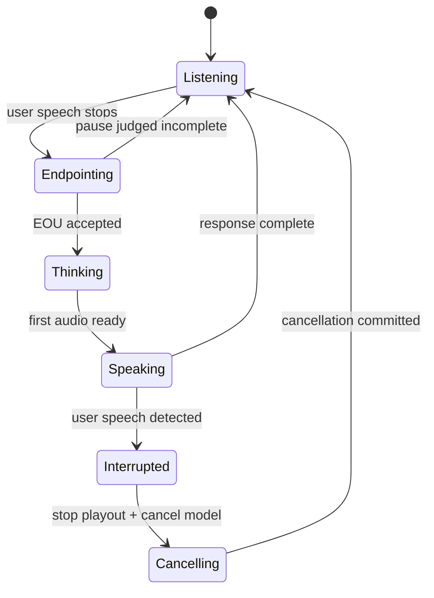

# Barge-In Is The Real System Test

A voice agent is not truly conversational until the user can interrupt it. Barge-in forces
every part of the system to be honest: echo cancellation, VAD during playback, transport
timing, playback control, model cancellation, response truncation, transcript state, and
conversation history.

This is why barge-in is a better system test than "can it answer one clean prompt?"

## Source Map

| Ref | Source | Local path | Role |
|---|---|---|---|
| R-VA-002 | Local VAD deep dive | `../VAD-DEEP-DIVE.md` | VAD state-machine and false positive/false negative framing. |
| R-VA-007 | OpenAI Realtime API reference | `../articles/openai-realtime-api-reference.html` | `interrupt_response` and turn detection fields. |
| R-VA-008 | LiveKit turns overview | `../articles/livekit-turns.html` | Interruption and turn-detection modes. |
| R-VA-028 | Local transport deep dive | `../TRANSPORT-DEEP-DIVE.md` | Echo cancellation and WebRTC analysis. |
| R-VA-031 | OpenAI Realtime WebRTC/WebSocket docs | `../articles/openai-realtime-webrtc.html`, `../articles/openai-realtime-websocket.html` | Realtime transport and event model. |
| R-VA-032 | LiveKit transport docs | `../articles/livekit-transport.html` | Media-stack support for production voice. |

## Why Barge-In Is Hard

Barge-in requires the agent to do several things at once:

1. keep listening while it speaks;
2. avoid transcribing its own audio as the user;
3. detect that the user actually intends to interrupt;
4. stop local playback quickly;
5. cancel or truncate the model response;
6. preserve accurate conversation history;
7. start processing the user's new turn without waiting for stale audio.

Each item can fail independently. A system with great STT and great TTS can still fail
barge-in if the assistant hears itself or if response cancellation leaves ghost state.

## State Machine

The important detail: `Speaking -> Interrupted` is not the same as normal endpointing.
During speaking, the VAD is operating under echo and playback. The agent must decide
whether the user is interrupting or merely backchanneling.

## Echo Cancellation Is Not Optional

If the assistant audio plays through speakers, it leaks into the microphone. Without echo
cancellation or tight playout/capture handling, the agent can:

- transcribe its own response;
- trigger VAD on its own voice;
- reset the end-of-turn timer;
- enter feedback loops;
- ignore the real user because the input stream is polluted.

WebRTC helps because browser media capture and playout are part of a media engine with
echo cancellation and timing. WebSocket can still use `getUserMedia` constraints for
capture-side echo cancellation, but the transport itself does not carry the same media
semantics.

## Barge-In Is A Cancellation Contract

An agent response should be treated as a cancellable stream, not a text blob or audio file.
The contract needs:

| Field/event | Why it matters |
|---|---|
| response id | Know which model output is being cancelled. |
| audio chunk timestamp | Know what the user actually heard. |
| playback cursor | Truncate conversation history to heard content. |
| interruption timestamp | Align user speech with assistant audio. |
| cancellation acknowledgement | Avoid continuing stale TTS/LLM streams. |
| transcript state | Do not include unheard assistant text as if it was said. |

OpenAI Realtime exposes turn detection fields such as `interrupt_response` and server-side
turn detection settings. The exact event protocol depends on provider/runtime, but the
conceptual contract is portable: the system must know what audio was emitted, what audio
was heard, and what response is now invalid.

## Backchannels Are Not Interruptions

Humans often say "yeah", "right", "mm-hm", or laugh while another person is speaking.
Treating every speech event during assistant playback as interruption makes the agent
fragile and over-eager. Ignoring every speech event makes it impossible to interrupt.

This is where endpointing and turn detection connect back to barge-in:

| Input during assistant speech | Desired behavior |
|---|---|
| "stop" | Cancel immediately. |
| "wait, no..." | Cancel and listen. |
| "yeah" | Often continue speaking. |
| cough/noise | Continue speaking. |
| overlapping correction | Cancel if semantic intent is clear. |

The system cannot solve this with acoustic VAD alone. It needs a policy, and often a
semantic/interruption classifier or provider model.

## Data Points Worth Using

| Source | Data | Why it matters |
|---|---|---|
| Silero/WebRTC VAD comparison | Silero much higher ROC-AUC than WebRTC in local notes/wiki | Better speech/noise detection reduces false barge-in triggers. |
| OpenAI Realtime settings | `interrupt_response` and `server_vad`/`semantic_vad` surfaces | Provider treats interruption as explicit turn-detection behavior. |
| LiveKit docs | Turn detection modes and adaptive interruption framing | Production agent frameworks distinguish interruptions from ordinary endpointing. |
| WebRTC transport stack | AEC/NS/AGC, RTP timestamps, jitter buffer | Makes media state available for interruption correctness. |

The missing data gap: there are fewer open, standardized barge-in benchmarks than WER
benchmarks. That should be a claim in the article. People over-measure transcript quality
and under-measure interruption correctness.

## Engineering Inference

For the local Jarvis stack, the barge-in evaluation should include:

- assistant speaking through laptop speakers;
- user says "stop" at different audio positions;
- user says a backchannel while assistant speaks;
- user speaks softly over assistant audio;
- user interrupts during TTS startup, mid-sentence, and near response end;
- user interruption while LLM has generated text but TTS has not played it;
- network jitter if using remote model/provider.

The harness should record:

- whether playout stopped;
- stop latency;
- whether stale assistant audio kept playing;
- whether stale assistant text remained in conversation history;
- whether user interruption was transcribed correctly;
- whether the next response addressed the interruption.

## Non-Claims

- Barge-in is not solved by VAD alone.
- WebRTC does not automatically implement application-level cancellation.
- AEC does not distinguish semantic interruption from backchannel.
- Provider interruption events still need app-side state handling.
- A demo without speaker playback does not test real barge-in.

## Blog/Deck Visual Candidates

- Barge-in state machine.
- Timeline showing assistant audio, user interruption, cancellation, and new turn.
- "Backchannel vs interruption" examples.
- Test matrix for shipping a voice agent.

## References

- R-VA-002: `../VAD-DEEP-DIVE.md`
- R-VA-007: `../articles/openai-realtime-api-reference.html`
- R-VA-008: `../articles/livekit-turns.html`
- R-VA-028: `../TRANSPORT-DEEP-DIVE.md`
- R-VA-031: `../articles/openai-realtime-webrtc.html`, `../articles/openai-realtime-websocket.html`
- R-VA-032: `../articles/livekit-transport.html`
- Data: `../data/turn_detection.csv`, `../data/transport_tradeoffs.csv`
