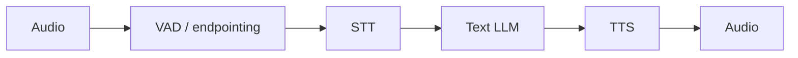

# Native Speech Models Change The Boundary

Cascaded voice agents split the problem into STT -> LLM -> TTS. Native speech-to-speech
models move the boundary: audio tokens become part of the model's input/output space, and
the system can preserve prosody, overlap, backchannels, and timing in ways a text-only
middle layer throws away.

But native speech does not automatically win. Cascades remain easier to debug, evaluate,
moderate, log, tool-call, and swap component-by-component. The interesting research
question is not "native or cascade?" It is which boundary you want to own.

## Source Map

| Ref | Source | Local path | Role |
|---|---|---|---|
| R-VA-018 | Moshi | `../paper-text/moshi-2410.00037.txt` | Strongest conceptual source for full-duplex native speech. |
| R-VA-019 | Qwen2.5-Omni | `../paper-text/qwen25-omni-2503.20215.txt` | Thinker-Talker architecture and streaming speech output. |
| R-VA-024 | Mini-Omni | `../paper-text/mini-omni-2408.16725.txt` | Small open real-time speech interaction architecture. |
| R-VA-025 | GLM-4-Voice | `../paper-text/glm-4-voice-2412.02612.txt` | Speech tokenizer and end-to-end spoken chatbot architecture. |
| R-VA-028 | Local transport deep dive | `../TRANSPORT-DEEP-DIVE.md` | Cascaded architecture and media-system context. |

## The Cascade

The conventional architecture is:

Strengths:

- every component is inspectable;
- transcript is available for logs, tools, moderation, and UI;
- STT/TTS can be swapped independently;
- debugging is simple compared with audio-token internals;
- API/tool calling fits text LLM workflows.

Weaknesses:

- latency compounds across modules;
- prosody and non-speech signal are discarded or approximated;
- turn-taking becomes an external policy;
- overlap and backchannels are awkward;
- the user's voice becomes text before the model reasons.

## Moshi's Argument

Moshi states the cascade problem clearly: latency compounds, text bottlenecks lose non-written
information, and turn-based segmentation fails for interruptions and overlap. The paper
reports that overlapping speech accounts for 10-20% of spoken time, then introduces a
multi-stream model that removes explicit speaker turns.

Copied Moshi data:

| Claim/data | Value | Source |
|---|---:|---|
| Theoretical latency | 160 ms | R-VA-018 |
| Practical latency | 200 ms | R-VA-018 |
| Natural conversation average used by paper | 230 ms | R-VA-018 citing Stivers et al. |
| Mimi codec frame rate | 12.5 Hz | R-VA-018 |
| Audio frame duration implied by 12.5 Hz | 80 ms | R-VA-018 |
| Mimi bitrate in extracted table | 1.1 kbps | R-VA-018 |
| Backbone | 7B Helium | R-VA-018/subagent |

The most important idea is not just the latency number. It is the modeling shift: Moshi
processes input and output streams jointly, allowing overlapping speech and eliminating
hard speaker-turn boundaries inside the model.

## Qwen2.5-Omni

Qwen2.5-Omni uses a Thinker-Talker architecture:

- Thinker handles text generation/reasoning.
- Talker is a dual-track autoregressive model that uses hidden representations from Thinker
  to produce audio tokens.
- TMRoPE aligns time across modalities.
- A sliding-window DiT is used for streaming audio token decoding and reducing initial
  package delay.

This is interesting because it preserves text-like reasoning structure while adding a
speech-generation path. It is less radical than "audio only" but more integrated than a
plain STT -> LLM -> TTS cascade.

## Mini-Omni

Mini-Omni frames itself as a small, open real-time speech interaction model. The extracted
text describes text-delay parallel decoding and batch parallel decoding with SNAC audio
tokens. It uses multiple audio token codebooks and generates text plus audio tokens in a
parallel/delayed fashion to reduce first-token delay.

The useful point for the blog: native speech systems often use codec token tricks, delay
patterns, and parallel decoding to make audio generation practical. They are not just
"LLMs that output WAV."

## GLM-4-Voice

The subagent found GLM-4-Voice data:

| Item | Value |
|---|---:|
| Backbone | GLM-4-9B based |
| Speech tokenizer | 175 bps single-codebook |
| Token/frame rate | 12.5 tokens/sec |
| Decoder startup | repo says can start with as few as 10 audio tokens |

This supports the same trend: low-rate speech tokenization plus streaming decoders reduce
the cost of making speech a model-native modality.

## Native Versus Cascaded Comparison

| Architecture | Strengths | Weaknesses |
|---|---|---|
| Cascaded STT -> LLM -> TTS | Debuggable, modular, easy transcripts, easy tools, mature components | Compounded latency, text bottleneck, external turn-taking |
| Native speech-to-speech | Preserves paralinguistic signal, can model overlap/backchannels, potentially lower latency | Harder debugging, harder moderation/logging, tool-calling boundary less obvious |
| Hybrid Thinker/Talker | Keeps reasoning/text structure while streaming speech | More complex serving and evaluation |
| Realtime API native model | Fast integration and vendor-managed media/model behavior | Less decomposable, provider lock-in, needs audio-level eval |

## Engineering Inference

The likely production path is hybrid:

1. Use WebRTC/media substrate for real client audio.
2. Start with a debuggable cascade because it gives transcripts, component isolation, and
   straightforward tool calls.
3. Add semantic EOU and better barge-in before chasing native speech.
4. Move native only when latency, emotion/prosody, duplex overlap, or product feel justify
   the loss of component transparency.

For the presentation, native speech models are a "where this is going" section. The
practical builder advice remains: understand the cascade deeply, because the native systems
are trying to remove the cascade's worst boundaries.

## Non-Claims

- Native speech does not automatically outperform cascaded systems in production.
- Native speech latency claims do not include every product concern.
- Cascades are not obsolete.
- Text transcripts remain valuable for tools, safety, UX, and debugging.
- Open-source native models often lag in serving maturity and evaluation harnesses.

## Blog/Deck Visual Candidates

- Cascade vs native boundary diagram.
- Moshi multi-stream turn-removal visual.
- Table of Moshi/Qwen2.5-Omni/Mini-Omni/GLM-4-Voice.
- "What text throws away" diagram: prosody, overlap, emotion, acoustic context.

## References

- R-VA-018: `../paper-text/moshi-2410.00037.txt`
- R-VA-019: `../paper-text/qwen25-omni-2503.20215.txt`
- R-VA-024: `../paper-text/mini-omni-2408.16725.txt`
- R-VA-025: `../paper-text/glm-4-voice-2412.02612.txt`
- R-VA-028: `../TRANSPORT-DEEP-DIVE.md`
- Data: `../data/native_speech_models.csv`
