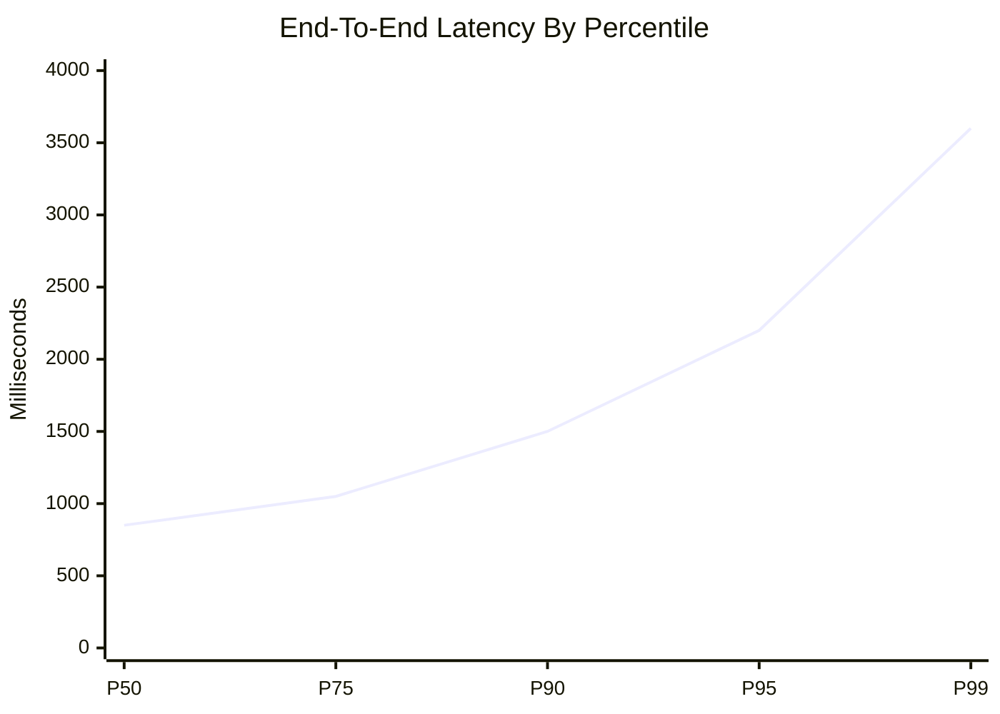
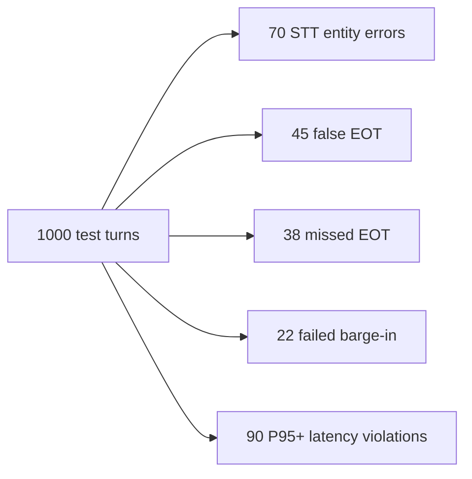

# Voice Agent Eval Needs Multiple Metrics

A voice agent is a real-time distributed system wrapped in a conversational interface. It
cannot be evaluated with WER alone, MOS alone, or a subjective demo alone. The eval must
cross speech accuracy, turn-taking, latency tails, media transport, barge-in, cost, and
downstream task success.

This is the note that should become the "what to measure before shipping" section.

## Source Map

| Ref | Source | Local path | Role |
|---|---|---|---|
| R-VA-001 | Local STT deep dive | `../STT-DEEP-DIVE.md` | WER/CER/RTF/latency metric definitions. |
| R-VA-002 | Local VAD deep dive | `../VAD-DEEP-DIVE.md` | VAD false positive/negative and endpointing framing. |
| R-VA-003 | Moonshine v2 | `../paper-text/moonshine-v2-2602.12241.txt` | Response latency and compute-load example. |
| R-VA-004 | Open ASR Leaderboard | `../paper-text/open-asr-leaderboard-2510.06961.txt` | WER + RTFx benchmark model. |
| R-VA-012 | F5-TTS | `../paper-text/f5-tts-2410.06885.txt` | TTS WER/SIM/UTMOS/RTF example. |
| R-VA-014 | Fish Audio S2 | `../paper-text/fish-audio-s2-2603.08823.txt` | TTFA/RTF/concurrency example. |
| R-VA-020 | Deepgram Flux | `../articles/deepgram-flux-*.html` | EOT metrics and latency framing. |
| R-VA-028 | Local transport deep dive | `../TRANSPORT-DEEP-DIVE.md` | WebSocket/WebRTC and media behavior. |

## The Failure Of Single-Number Evaluation

Single-number evaluation hides the actual product:

- WER says transcript closeness, not whether the agent spoke at the right time.
- MOS says voice naturalness, not whether first audio arrived fast.
- RTF says total generation speed, not TTFA.
- RTFx says throughput, not end-of-turn latency.
- p50 latency hides tail failures.
- a live demo hides repeatability.

The right eval is a matrix. Each metric answers one question, and the important product
failures usually occur at metric boundaries.

## Core Metric Table

| Layer | Metric | Unit | Why it matters |
|---|---|---:|---|
| Capture | audio start latency | ms | Mic pipeline and permissions can dominate first turn. |
| VAD | start-of-speech latency | ms | Determines barge-in and listening responsiveness. |
| VAD | false positive/false negative rate | percent | Noise can trigger or suppress the agent. |
| Endpointing | end-of-turn latency | ms | Controls dead air vs interruption. |
| Endpointing | false EOT / missed EOT | percent | Measures turn-taking correctness. |
| STT | WER/CER | percent | Base transcript quality. |
| STT | entity WER | percent | Names, IDs, numbers, domain terms. |
| STT | partial churn | edit distance / second | Whether speculative reasoning is safe. |
| LLM | first token | ms | Earliest useful response generation. |
| TTS | TTFA | ms | When audio can start. |
| TTS | RTF | ratio | Whether synthesis stays ahead of playback. |
| Transport | jitter / loss / reconnect | ms / percent / count | Media stability. |
| Barge-in | interruption success | percent | Whether users can stop the agent. |
| System | P95/P99 round-trip | ms | Tail UX. |
| Product | task success | percent | Whether the user got the thing done. |
| Cost | live concurrent minute cost | dollars | Whether it can scale. |

## Dataset Design

The evaluation set should not be only clean read speech. It should include:

- short commands;
- long hesitant turns;
- mid-sentence pauses;
- self-corrections;
- names and product terms;
- numbers, dates, addresses, email-like strings;
- multilingual/code-switched snippets if product requires it;
- backchannels while the assistant speaks;
- true interruptions while the assistant speaks;
- background TV/music/cafe noise;
- laptop speakers causing echo;
- Bluetooth microphone/speaker path;
- mobile packet loss simulation;
- 8 kHz telephony audio if relevant.

The local STT deep dive's dataset section is useful for explaining why LibriSpeech clean is
too easy. The Open ASR Leaderboard improves on this by including AMI, Earnings22,
GigaSpeech, LibriSpeech, SPGISpeech, TED-LIUM, and VoxPopuli, but it is still mostly an
ASR benchmark, not a full agent benchmark.

## Instrumentation Schema

Each conversation turn should produce a trace. A rough JSON shape:

```json
{
  "turnId": "turn_001",
  "audio": {
    "capturedAtMs": 0,
    "firstVadSpeechMs": 74,
    "speechEndedMs": 2140
  },
  "endpointing": {
    "endOfTurnMs": 2580,
    "method": "semantic_eou",
    "falseEndpoint": false
  },
  "stt": {
    "firstPartialMs": 310,
    "finalMs": 2700,
    "wer": 0.053,
    "entityWer": 0.0
  },
  "llm": {
    "requestSentMs": 2710,
    "firstTokenMs": 3040
  },
  "tts": {
    "requestSentMs": 3060,
    "firstAudioMs": 3160,
    "rtf": 0.2
  },
  "playout": {
    "startedMs": 3220,
    "interruptedMs": null
  }
}
```

The exact schema should be code, not prose, in a real implementation. The point here is
that every claim about latency should be reproducible from trace events.

## Chart Sketches

### Latency Distribution



### Error Budget



These numbers are placeholders for chart design. A real version should use Jarvis or
provider benchmark traces.

## What To Evaluate For The Presentation Stack

For Jarvis/local presentation:

| Test | Expected measurement |
|---|---|
| Clean short command | baseline STT final latency and TTS TTFA |
| Long pause before object | false EOT risk |
| Speaker playback echo | VAD false positive and self-transcription |
| "stop" during assistant speech | barge-in stop latency |
| Backchannel during assistant speech | false interruption rate |
| Domain terms from slides | entity WER |
| Slow network/provider call | P95/P99 behavior |
| Restart/reconnect | state consistency |

This is also a good public article angle: the evaluation harness is where the "real-time"
claim becomes defensible.

## Engineering Inference

A good voice-agent dashboard should show:

- p50/p95/p99 end-to-end latency;
- p50/p95/p99 EOT latency;
- WER and entity WER;
- false interruption rate;
- missed EOT rate;
- TTS TTFA and RTF;
- transport reconnects/loss/jitter if available;
- LLM/TTS cancellation counts;
- task success;
- cost per live minute.

This is the voice version of observability for agents. Without it, the team optimizes the
component with the most visible benchmark instead of the component hurting conversation.

## Non-Claims

- This does not define one universal benchmark.
- It does not say WER is unimportant.
- It does not say subjective listening tests are useless.
- It does not claim every product needs native speech-to-speech evals on day one.
- It does not provide finished Jarvis trace data yet.

## Blog/Deck Visual Candidates

- Metrics matrix by layer.
- Trace timeline for one turn.
- P50/P95/P99 latency chart.
- Failure taxonomy: wrong words, wrong timing, wrong interruption, wrong media.
- "Benchmark your product conversation, not the model demo" closing slide.

## References

- R-VA-001: `../STT-DEEP-DIVE.md`
- R-VA-002: `../VAD-DEEP-DIVE.md`
- R-VA-003: `../paper-text/moonshine-v2-2602.12241.txt`
- R-VA-004: `../paper-text/open-asr-leaderboard-2510.06961.txt`
- R-VA-012: `../paper-text/f5-tts-2410.06885.txt`
- R-VA-014: `../paper-text/fish-audio-s2-2603.08823.txt`
- R-VA-020: `../articles/deepgram-flux-*.html`
- R-VA-028: `../TRANSPORT-DEEP-DIVE.md`
- Data: all CSVs under `../data/`
