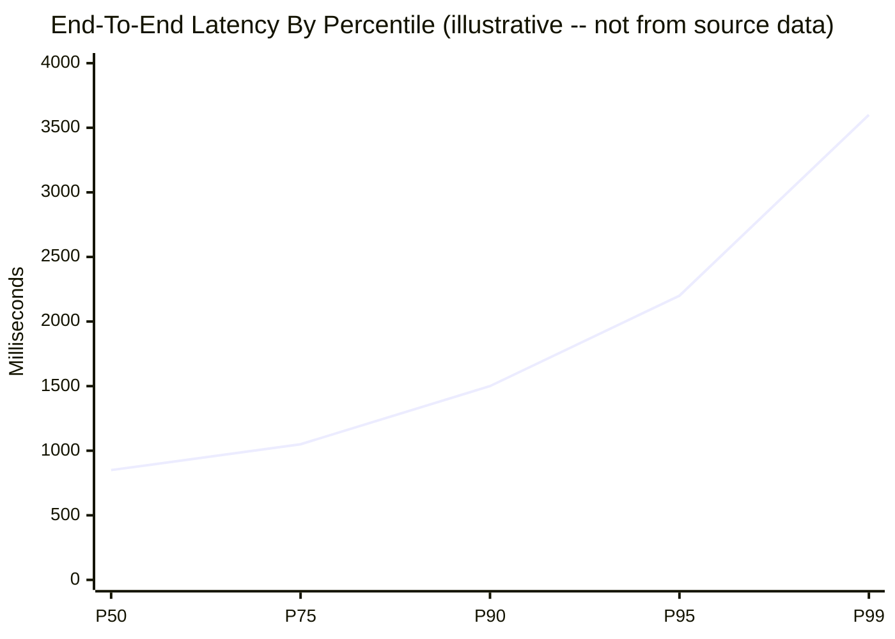
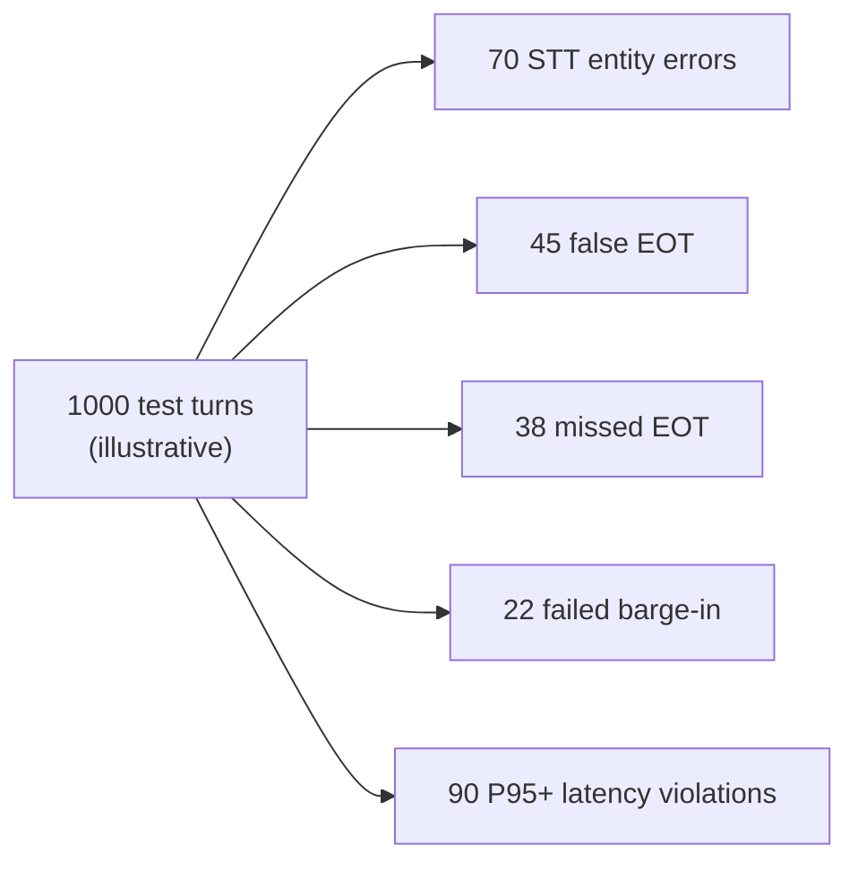

# Voice Agent Eval Needs Multiple Metrics

A voice agent is a real-time distributed system wrapped in a conversational interface. It
cannot be evaluated with WER alone, MOS alone, or a subjective demo alone. The eval must
cross speech accuracy, turn-taking, latency tails, media transport, barge-in, cost, and
downstream task success.

This insight argues that single-number benchmarks fail for voice agents because the product
failure modes span multiple layers and metric types. A model with excellent WER can still
produce a terrible voice agent if end-of-turn latency is high. A model with excellent RTF
can still feel slow if TTFA is not measured separately. The evidence comes from how existing
papers and benchmarks measure different, often incompatible, quantities.

This is the note that should become the "what to measure before shipping" section.

## Source Map

| Ref      | Source                                      | Local path                                          | Role                                                                         |
| -------- | ------------------------------------------- | --------------------------------------------------- | ---------------------------------------------------------------------------- |
| R-VA-001 | Local STT deep dive                         | `../STT-DEEP-DIVE.md`                               | WER/CER/RTF/latency metric definitions.                                      |
| R-VA-002 | Local VAD deep dive                         | `../VAD-DEEP-DIVE.md`                               | VAD false positive/negative and endpointing framing.                         |
| R-VA-003 | Moonshine v2: Ergodic Streaming Encoder ASR | `../paper-text/moonshine-v2-2602.12241.txt`         | Response latency and compute-load data; illustrates latency vs WER tradeoff. |
| R-VA-004 | Open ASR Leaderboard                        | `../paper-text/open-asr-leaderboard-2510.06961.txt` | WER + RTFx benchmark methodology; dataset selection.                         |
| R-VA-012 | F5-TTS                                      | `../paper-text/f5-tts-2410.06885.txt`               | TTS WER/SIM/UTMOS/RTF example.                                               |
| R-VA-014 | Fish Audio S2                               | `../paper-text/fish-audio-s2-2603.08823.txt`        | TTFA/RTF/concurrency example; illustrates TTFA vs RTF distinction.           |
| R-VA-020 | Deepgram Flux                               | `../articles/deepgram-flux-*.html`                  | EOT metrics and latency framing.                                             |
| R-VA-028 | Local transport deep dive                   | `../TRANSPORT-DEEP-DIVE.md`                         | WebSocket/WebRTC and media behavior.                                         |

## The Failure Of Single-Number Evaluation

Single-number evaluation hides the actual product:

- WER says transcript closeness, not whether the agent spoke at the right time.
- MOS says voice naturalness, not whether first audio arrived fast.
- RTF says total generation speed, not TTFA.
- RTFx says throughput, not end-of-turn latency.
- p50 latency hides tail failures.
- a live demo hides repeatability.

The right eval is a matrix. Each metric answers one question, and the important product
failures usually occur at metric boundaries.

### Specific Examples From Source Papers

**Example 1: Moonshine v2 vs Whisper --- latency and WER tell different stories.**

The Moonshine v2 paper (R-VA-003) reports response latency (time from VAD end-of-speech to
transcript return) in Table 2, and WER on Open ASR benchmarks in Table 3. Both measured on
an Apple MacBook M3.

| Model                      | Response Latency (ms) |    Avg WER (%) | Source                   |
| -------------------------- | --------------------: | -------------: | ------------------------ |
| Moonshine v2 Tiny (34M)    |                    50 |          12.01 | R-VA-003, Tables 2 and 3 |
| Moonshine v2 Small (123M)  |                   148 |           7.84 | R-VA-003, Tables 2 and 3 |
| Moonshine v2 Medium (245M) |                   258 |           6.65 | R-VA-003, Tables 2 and 3 |
| Whisper Tiny               |                   289 | (see Open ASR) | R-VA-003, Table 2        |
| Whisper Small              |                  1940 | (see Open ASR) | R-VA-003, Table 2        |
| Whisper Large v3           |                 11286 | (see Open ASR) | R-VA-003, Table 2        |

(`paper evidence`, R-VA-003, Tables 2 and 3.)

Inference: Moonshine v2 Small has 13.1x faster response latency than Whisper Small (148 ms
vs 1940 ms, per the paper), but Whisper Large v3 has lower WER on most datasets. If you
optimize for WER alone, you pick Whisper Large v3. If you optimize for response latency, you
pick Moonshine v2. A voice agent needs both metrics evaluated together. This is the
single-number problem: WER alone would choose Whisper Large v3, but its 11.3-second response
latency makes it unusable for real-time voice interaction.

**Example 2: Fish Audio S2 --- RTF vs TTFA are separate concerns.**

The Fish Audio S2 paper (R-VA-014) reports on an NVIDIA H200 GPU:

| Metric         | Value | Unit       | Source                                  |
| -------------- | ----: | ---------- | --------------------------------------- |
| RTF            | 0.195 | ratio      | R-VA-014, Section on production serving |
| TTFA           |   100 | ms         | R-VA-014, Section on production serving |
| Max throughput | 3000+ | tokens/sec | R-VA-014, Section on production serving |

(`paper evidence`, R-VA-014.)

Inference: RTF of 0.195 means audio is generated 5x faster than real-time. But RTF alone does
not tell you when the first audio chunk arrives. TTFA of 100 ms is a separate measurement
that matters for perceived responsiveness. A system could have RTF < 0.2 but TTFA > 500 ms
if the model requires a large context prefill. The Fish Audio paper separates these explicitly,
which is good practice.

**Example 3: Open ASR Leaderboard --- WER and RTFx but no end-of-turn latency.**

The Open ASR Leaderboard (R-VA-004) reports WER averaged across datasets and RTFx (inverse
real-time factor, higher is faster). The paper defines RTFx as audio_length / processing_time,
so higher values mean faster processing. Models can be sorted by WER or RTFx. (`paper evidence`,
R-VA-004.)

The leaderboard's short-form English track covers eight test sets: AMI, Earnings-22,
GigaSpeech, LibriSpeech clean, LibriSpeech other, SPGISpeech, TED-LIUM, and VoxPopuli. (`paper evidence`, R-VA-004.)

Inference: The Open ASR Leaderboard is the best-structured ASR benchmark available. But it
does not measure end-of-turn latency, barge-in behavior, or any voice-agent-specific metric.
RTFx measures throughput (how fast can you process a batch of audio), not response latency
(how quickly does the transcript arrive after the user stops speaking). For a voice agent, the
user-perceived metric is closer to Moonshine's "response latency" definition than to RTFx.

### Summary Of The Single-Number Problem

| Metric           | What it measures          | What it misses for voice agents           | Source example                  |
| ---------------- | ------------------------- | ----------------------------------------- | ------------------------------- |
| WER              | Transcript accuracy       | Latency, turn-taking, acoustic robustness | R-VA-003 (Moonshine v2)         |
| RTFx             | Processing throughput     | First-token latency, end-of-turn latency  | R-VA-004 (Open ASR Leaderboard) |
| RTF (TTS)        | Generation speed          | TTFA, voice quality, barge-in behavior    | R-VA-014 (Fish Audio S2)        |
| TTFA             | First audio chunk arrival | Total generation quality, RTF             | R-VA-014 (Fish Audio S2)        |
| MOS/UTMOS        | Voice naturalness         | Latency, content accuracy, turn-taking    | R-VA-012 (F5-TTS)               |
| Response latency | End-to-end user wait time | Transcript accuracy, robustness           | R-VA-003 (Moonshine v2)         |

## Core Metric Table

| Layer       | Metric                             |                   Unit | Why it matters                                        |
| ----------- | ---------------------------------- | ---------------------: | ----------------------------------------------------- |
| Capture     | audio start latency                |                     ms | Mic pipeline and permissions can dominate first turn. |
| VAD         | start-of-speech latency            |                     ms | Determines barge-in and listening responsiveness.     |
| VAD         | false positive/false negative rate |                percent | Noise can trigger or suppress the agent.              |
| Endpointing | end-of-turn latency                |                     ms | Controls dead air vs interruption.                    |
| Endpointing | false EOT / missed EOT             |                percent | Measures turn-taking correctness.                     |
| STT         | WER/CER                            |                percent | Base transcript quality.                              |
| STT         | entity WER                         |                percent | Names, IDs, numbers, domain terms.                    |
| STT         | partial churn                      | edit distance / second | Whether speculative reasoning is safe.                |
| LLM         | first token                        |                     ms | Earliest useful response generation.                  |
| TTS         | TTFA                               |                     ms | When audio can start.                                 |
| TTS         | RTF                                |                  ratio | Whether synthesis stays ahead of playback.            |
| Transport   | jitter / loss / reconnect          |   ms / percent / count | Media stability.                                      |
| Barge-in    | interruption success               |                percent | Whether users can stop the agent.                     |
| System      | P95/P99 round-trip                 |                     ms | Tail UX.                                              |
| Product     | task success                       |                percent | Whether the user got the thing done.                  |
| Cost        | live concurrent minute cost        |                dollars | Whether it can scale.                                 |

## Metrics Not Commonly Measured But Critical For Voice Agents

The metrics above cover what papers and benchmarks currently report. The following metrics
are rarely or never reported in the source papers but matter for production voice agents:

| Metric                          | Unit                                   | Why it matters                                                                                                                                | Why it is rarely measured                                                                                                             |
| ------------------------------- | -------------------------------------- | --------------------------------------------------------------------------------------------------------------------------------------------- | ------------------------------------------------------------------------------------------------------------------------------------- |
| Barge-in success rate           | percent                                | Whether the user can successfully interrupt the agent mid-speech. If barge-in fails, the agent feels unresponsive.                            | Requires a test harness that plays audio during agent output and measures whether the agent stops. No standard benchmark exists.      |
| Backchannel false positive rate | percent                                | Whether the agent interprets "uh-huh," "yeah," or "okay" as an interruption. High false positives make the agent stop mid-sentence.           | Requires labeled backchannel vs interruption data. Moshi's multi-stream architecture models this but does not report a metric for it. |
| Echo-triggered VAD rate         | percent                                | Whether the agent's own audio output (played through the user's speakers) triggers the VAD, causing self-transcription or false interruption. | Requires a real media path (speakers + microphone) or echo simulation. Most academic evals use clean audio input.                     |
| Turn-gap consistency            | ms (std dev)                           | Whether the agent's response timing is consistent or erratic. High variance in turn gaps feels unnatural even if the mean is acceptable.      | Requires per-turn timing logs and statistical analysis. Most papers report p50 or mean only.                                          |
| Graceful degradation under load | latency delta at N concurrent sessions | Whether latency increases linearly or exponentially as concurrency grows.                                                                     | Requires load testing infrastructure. Fish Audio S2 (R-VA-014) reports throughput under concurrency but most papers do not.           |

Inference: The absence of these metrics from published benchmarks does not mean they are
unimportant. It means the evaluation infrastructure for voice agents is immature. A team
shipping a voice agent should instrument these from day one, even if no public benchmark
exists.

## Dataset Design

The evaluation set should not be only clean read speech. It should include:

- short commands;
- long hesitant turns;
- mid-sentence pauses;
- self-corrections;
- names and product terms;
- numbers, dates, addresses, email-like strings;
- multilingual/code-switched snippets if product requires it;
- backchannels while the assistant speaks;
- true interruptions while the assistant speaks;
- background TV/music/cafe noise;
- laptop speakers causing echo;
- Bluetooth microphone/speaker path;
- mobile packet loss simulation;
- 8 kHz telephony audio if relevant.

### What Existing Benchmarks Cover

The Open ASR Leaderboard (R-VA-004) improves on single-dataset evaluation by including seven
English datasets: AMI (meeting speech), Earnings-22 (financial earnings calls), GigaSpeech
(diverse web audio), LibriSpeech (clean and other, read audiobooks), SPGISpeech (financial
transcription), TED-LIUM (TED talks), and VoxPopuli (European Parliament). (`paper evidence`,
R-VA-004.)

Inference: These datasets cover a good range of acoustic conditions for ASR benchmarking:
meeting rooms (AMI), telephony-adjacent audio (Earnings-22), noisy web audio (GigaSpeech),
clean studio conditions (LibriSpeech clean), and multi-speaker parliamentary proceedings
(VoxPopuli). However, they are ASR benchmarks, not voice agent benchmarks. None of them
include:

- agent-side audio output that could cause echo
- barge-in or interruption scenarios
- backchannel events during model speech
- turn-taking timing measurements
- end-of-turn detection evaluation
- TTS quality evaluation alongside ASR

Inference: A full voice agent benchmark would need to compose ASR evaluation data (like the
Open ASR Leaderboard datasets) with turn-taking scenarios, barge-in tests, and end-to-end
latency measurement. No such benchmark exists publicly as of this writing. The local STT deep
dive's dataset section (R-VA-001) makes a similar point about why LibriSpeech clean is too
easy for production ASR evaluation.

## Instrumentation Schema

Each conversation turn should produce a trace. A rough JSON shape (design proposal, not a
deployed schema):

```json
{
  "turnId": "turn_001",
  "audio": {
    "capturedAtMs": 0,
    "firstVadSpeechMs": 74,
    "speechEndedMs": 2140
  },
  "endpointing": {
    "endOfTurnMs": 2580,
    "method": "semantic_eou",
    "falseEndpoint": false
  },
  "stt": {
    "firstPartialMs": 310,
    "finalMs": 2700,
    "wer": 0.053,
    "entityWer": 0.0
  },
  "llm": {
    "requestSentMs": 2710,
    "firstTokenMs": 3040
  },
  "tts": {
    "requestSentMs": 3060,
    "firstAudioMs": 3160,
    "rtf": 0.2
  },
  "playout": {
    "startedMs": 3220,
    "interruptedMs": null
  }
}
```

This is a **design proposal** for what voice agent instrumentation should capture, not a
deployed schema from any of the source papers. The exact schema should be code, not prose,
in a real implementation. The point is that every claim about latency should be reproducible
from trace events.

## Chart Sketches

### Latency Distribution



**The values above (P50=850, P75=1050, P90=1500, P95=2200, P99=3600) are illustrative
placeholders for chart layout design, not measured data from any source.** They represent a
plausible distribution shape for a cascaded voice agent, but have not been benchmarked. A
real version should use traced data from an actual voice agent deployment or from controlled
testing with specific STT/LLM/TTS components.

### Error Budget



**The values above (70 STT errors, 45 false EOT, 38 missed EOT, 22 failed barge-in,
90 latency violations out of 1000 turns) are illustrative placeholders for chart design,
not measured data from any source.** They illustrate how an error budget might distribute
across voice agent failure modes. A real version should use Jarvis or provider benchmark
traces.

## What To Evaluate For The Presentation Stack

For Jarvis/local presentation:

| Test                                | Expected measurement                      |
| ----------------------------------- | ----------------------------------------- |
| Clean short command                 | baseline STT final latency and TTS TTFA   |
| Long pause before object            | false EOT risk                            |
| Speaker playback echo               | VAD false positive and self-transcription |
| "stop" during assistant speech      | barge-in stop latency                     |
| Backchannel during assistant speech | false interruption rate                   |
| Domain terms from slides            | entity WER                                |
| Slow network/provider call          | P95/P99 behavior                          |
| Restart/reconnect                   | state consistency                         |

This is also a good public article angle: the evaluation harness is where the "real-time"
claim becomes defensible.

## Engineering Inference

Inference: A good voice-agent dashboard should show:

- p50/p95/p99 end-to-end latency;
- p50/p95/p99 EOT latency;
- WER and entity WER;
- false interruption rate;
- missed EOT rate;
- TTS TTFA and RTF;
- transport reconnects/loss/jitter if available;
- LLM/TTS cancellation counts;
- task success;
- cost per live minute.

Inference: This is the voice version of observability for agents. Without it, the team optimizes
the component with the most visible benchmark instead of the component hurting conversation.

Inference: The Moonshine v2 vs Whisper comparison (R-VA-003) is the clearest illustration of
why a multi-metric approach is necessary. If a team only looks at the Open ASR Leaderboard
(R-VA-004), they see WER and RTFx. They might pick Whisper Large v3 for its low WER. But
Whisper Large v3 has 11.3 seconds of response latency on a MacBook M3 --- making it
completely unusable for a real-time voice agent. Moonshine v2 Small at 148 ms response
latency and 7.84% WER is a much better choice for a voice agent, even though its WER is
higher. The dashboard needs to surface both dimensions.

Inference: Fish Audio S2's separation of RTF (0.195) and TTFA (100 ms) (R-VA-014) is a model
for how TTS metrics should be reported for voice agents. RTF tells you the system can sustain
streaming output. TTFA tells you the user perceives fast response. Both matter. A system
with excellent RTF but high TTFA feels sluggish on the first chunk. A system with low TTFA
but poor RTF will stutter or underrun during long responses.

## Non-Claims

- This does not define one universal benchmark.
- It does not say WER is unimportant.
- It does not say subjective listening tests are useless.
- It does not claim every product needs native speech-to-speech evals on day one.
- It does not provide finished Jarvis trace data yet.
- The chart sketch values (latency distribution, error budget) are illustrative placeholders,
  not measured data. Do not cite them as benchmarks.
- The instrumentation JSON schema is a design proposal, not a deployed or validated schema.
- The "metrics not commonly measured" section identifies gaps in published benchmarks; it
  does not claim these metrics are impossible to measure.
- The Moonshine v2 response latency numbers are measured on Apple MacBook M3; they do not
  transfer to server hardware or other devices.
- The Fish Audio S2 TTFA of 100 ms is measured on NVIDIA H200 with RadixCache hits; cold
  start TTFA would be higher.
- The Open ASR Leaderboard datasets are ASR benchmarks. Using them as a proxy for
  voice-agent evaluation quality would be a category error.

## Blog/Presentation Visual Candidates

- Metrics matrix by layer (the Core Metric Table above, simplified for slides).
- Trace timeline for one turn (derived from the instrumentation schema).
- P50/P95/P99 latency chart (needs real data to replace placeholders).
- Failure taxonomy: wrong words, wrong timing, wrong interruption, wrong media.
- "Benchmark your product conversation, not the model demo" closing slide.
- Moonshine v2 vs Whisper scatter plot: response latency (x) vs WER (y) --- the tradeoff
  surface that single-number eval misses.
- Fish Audio S2 RTF vs TTFA as a "two metrics, one system" example.
- Open ASR Leaderboard datasets as "what exists" vs "what voice agents need" comparison.

## References

- R-VA-001: `../STT-DEEP-DIVE.md`
- R-VA-002: `../VAD-DEEP-DIVE.md`
- R-VA-003: Moonshine v2. `../paper-text/moonshine-v2-2602.12241.txt`. https://arxiv.org/abs/2602.12241
- R-VA-004: Open ASR Leaderboard. `../paper-text/open-asr-leaderboard-2510.06961.txt`. https://arxiv.org/abs/2510.06961
- R-VA-012: F5-TTS. `../paper-text/f5-tts-2410.06885.txt`. https://arxiv.org/abs/2410.06885
- R-VA-014: Fish Audio S2. `../paper-text/fish-audio-s2-2603.08823.txt`. https://arxiv.org/abs/2603.08823
- R-VA-020: Deepgram Flux. `../articles/deepgram-flux-*.html`
- R-VA-028: `../TRANSPORT-DEEP-DIVE.md`
- Data: all CSVs under `../data/`
