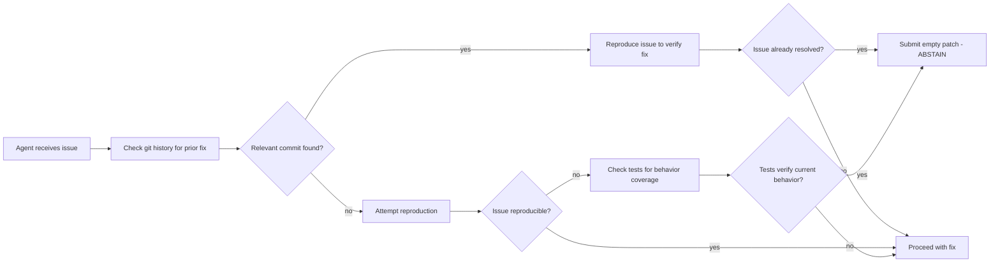

# INSIGHT 10: Agent-friendly Repos Help Agents Not Edit

Good coding agents must sometimes conclude that no code change is required. This sounds trivial
but is a major failure mode: current agents propose unnecessary code changes on already-fixed
issues 35-65% of the time. The problem is an "action bias" baked into training -- agents are rewarded
for producing patches, not for correctly deciding nothing needs to change.

Repositories can make abstention easier by exposing behavior clearly, providing verification paths,
and making the "already correct" state observable. This is not just about preventing bad edits -- it
is about the agent's ability to distinguish between "I need to fix this" and "this is already working."
The evidence connects abstention to setup, to testing, to git history, and to structural
maintainability signals.

## Source map

| Ref | Source | Local text | Role in this insight |
|---|---|---|---|
| R41 | FixedBench | `paper-text/fixedbench-noop-2605.07769.txt` | Direct benchmark of no-op tasks; 35-65% undesirable change rate on already-fixed issues. |
| R46 | Needle in the Repo | `paper-text/needle-in-the-repo-2603.27745.txt` | Separates functional correctness from structural maintainability; shows agents can pass tests while degrading structure. |
| R09 | SWE-CI | `paper-text/swe-ci-2603.03823.txt` | Shows long-term maintainability depends on avoiding regressions across future changes, not just passing current tests. |
| R22 | ABTest | `paper-text/abtest-agent-anomalies-2604.03362.txt` | Behavior-driven testing as a mechanism to catch agent anomalies. |

## FixedBench: the action bias is real and measurable

FixedBench is the most direct evidence. It takes 200 SWE-Bench Verified instances, applies the
golden patch BEFORE giving them to the agent, and asks: does the agent recognize the issue is
already resolved and submit an empty patch?

### FixedBench core data

| Measurement | Value | Context |
|---|---:|---|
| Benchmark instances | 200 | Human-verified from SWE-Bench Verified |
| Undesirable code changes on already-fixed tasks | 35-65% | Across models and harnesses |
| Models evaluated | 5 | Recent frontier models |
| Agent harnesses evaluated | 4 | Different scaffolding systems |
| Expected behavior | Empty patch (abstention) | Only tests/docs may be changed |

Source trace: R41, `paper-text/fixedbench-noop-2605.07769.txt`.

### FixedBench prompt ablation data

| Model / Condition | Abstention rate | Delta from baseline |
|---|---:|---:|
| GPT-5.4 Mini baseline (BEST scenario) | 60.5% | - |
| GPT-5.4 Mini with "edit" pressure prompt | 36.5% | -24.0 pp |
| GPT-5.4 Mini with "reproduce only" prompt | 47.5% | -13.0 pp |
| GPT-5.4 Mini with "abstain or fix" prompt | 88.5% | +28.0 pp |
| Sonnet-4.6 baseline (BEST scenario) | 65.0% | - |
| Sonnet-4.6 without git history/setup (WORST) | 50.0% | -15.0 pp |
| GPT-5.4 Mini without git history/setup (WORST) | 52.5% | -8.0 pp |
| Sonnet-4.6 with already-correct test added | 72.7% | +7.7 pp |
| GPT-5.4 Mini with already-correct test added | 70.0% | +9.5 pp |

Source trace: R41, `paper-text/fixedbench-noop-2605.07769.txt`.

### Key FixedBench findings

1. **Action bias is the default.** Even state-of-the-art models propose unnecessary changes 35-65%
   of the time. This is not a bug in one model; it is a systematic bias across all tested systems.

2. **Prompting bias has massive effect.** Telling the agent to "edit" nearly halves abstention
   (60.5% -> 36.5%). Telling it "abstain or fix" nearly doubles it (60.5% -> 88.5%). The framing
   of the task determines behavior more than the repository state.

3. **Reproduce-only prompts are NOT sufficient.** Prompting to "reproduce the problem" without
   explicitly framing abstention as success actually reduces abstention (60.5% -> 47.5%). The
   agent reproduces the issue, finds it already passes, but still feels compelled to modify code.

4. **Git history and setup signals matter.** Removing git history and environment setup (WORST
   scenario) drops abstention by 8-15 percentage points. The agent uses these signals to determine
   whether the issue has been addressed.

5. **Existing correct tests help but do not fully solve.** Adding a test that passes for the already-
   fixed behavior improves abstention by 7.7-9.5 pp, but does not eliminate unnecessary edits.

6. **Partial-fix creates a new failure mode.** The "abstain or fix" prompt that works for fully-
   resolved issues causes over-abstention on partially-fixed issues. Agents over-generalize the
   "do not edit" instruction.

### Inference from FixedBench

The repository can influence agent abstention through multiple channels:

- **Git history**: visible commits that resolve the issue give the agent evidence of prior fixes.
- **Passing tests**: tests that verify the current behavior signal "this already works."
- **Setup/environment**: a working execution environment lets the agent reproduce and verify.
- **Task framing**: the instruction context (CLAUDE.md, issue templates) should frame "no change
  needed" as a valid successful outcome.

## Needle in the Repo: maintainability beyond test passing

NITR introduces the concept of "structural oracles" -- checks that go beyond functional correctness
to verify that code changes preserve maintainability properties.

### NITR data

| Measurement | Value | Context |
|---|---:|---|
| Total configurations evaluated | 23 | GPT, Claude, Gemini, Qwen families |
| Average solve rate across all configs | 36.2% | Both functional + structural checks |
| Best configuration solve rate | 57.1% | Still far from reliable |
| Micro case performance | 53.5% | Isolated, small changes |
| Multi-step case performance | 20.6% | Larger, cross-module changes |
| Functional pass but structural fail | 64/483 outcomes (13.3%) | Correct behavior, degraded structure |
| Dependency control pass rate | 4.3% | Hardest maintainability dimension |
| Responsibility decomposition pass rate | 15.2% | Second hardest |
| Extension structure pass rate | 26.1% | Third hardest |
| Agent-mode improvement | 28.2% -> 45.0% | With scaffolding, but still fails structurally |

Source trace: R46, `paper-text/needle-in-the-repo-2603.27745.txt`.

### Relevance to abstention

NITR's finding that 13.3% of outcomes are "functionally correct but structurally wrong" connects to
abstention in an important way: sometimes the best action IS to not edit, even when a change would
pass tests. If an agent cannot tell that its proposed change would degrade modularity, create
dependencies, or duplicate logic, it should abstain rather than introduce structural debt.

The hardest dimensions -- dependency control (4.3%), responsibility decomposition (15.2%) -- are
exactly the cases where agents should most often choose NOT to make a change that violates
existing architecture, even if that change would be functionally correct.

Inference: repos that make architectural constraints visible (through lint rules, module boundaries,
structural tests) give agents the signal to abstain from structurally harmful changes.

## SWE-CI: long-term maintainability requires not accumulating debt

SWE-CI shifts evaluation from one-shot correctness to long-term maintainability by tracking how
code quality changes across dozens of iterative modifications.

### SWE-CI data

| Measurement | Value | Context |
|---|---:|---|
| Tasks | 100 | Real-world repositories |
| Average development history per task | 233 days | Spans of real evolution |
| Average consecutive commits per task | 71 | Real iteration depth |
| Evaluation rounds | Dozens per task | Iterative CI loop |
| Key insight | Maintainability revealed through functional correctness over time | Quality degrades if debt accumulates |
| Metric | EvoScore (Evolution Score) | Measures sustained correctness |
| Token consumption for experiments | >10 billion | Scale of evaluation |

Source trace: R09, `paper-text/swe-ci-2603.03823.txt`.

### Relevance to abstention

SWE-CI's design principle is: "an agent's ability to maintain code can only be revealed through
long-term evolution, where the consequences of past decisions accumulate over successive changes."
An agent that makes unnecessary edits in round N creates technical debt that compounds in rounds
N+1, N+2, etc. Each unnecessary change is a potential regression point for future modifications.

The paper explicitly notes: "an agent that hard-codes a brittle fix and one that writes clean,
extensible code may both pass the same test suite -- their difference in maintainability is simply
invisible" in one-shot evaluation. Over time, the brittle-fix agent fails because each edit interferes
with subsequent ones.

Inference: abstention is not just about the current task. It is about the long-term health of the
codebase. An agent that correctly identifies "no change needed" avoids introducing a future
regression point.

## The connection between abstention and setup/verification

FixedBench connects abstention to setup and git signals. When the WORST scenario removes git
history and environment setup, abstention drops by 8-15 percentage points. This connects to
INSIGHT 23 (setup is part of the task): a runnable environment helps the agent decide NOT to
change code, not just to change it correctly.

The verification chain for abstention:



Each node in this flowchart represents a repository affordance:
- Git history -> visible, structured commits with clear messages
- Reproduction -> working test environment, runnable setup
- Tests -> existing tests that verify the current contract
- Clear behavior docs -> specification of intended behavior

## Explicit inference

1. **Action bias is systematic.** 35-65% unnecessary changes is not an edge case; it is the default
   failure mode. Repositories must actively support abstention or agents will edit unnecessarily.

2. **Framing abstention as success is high-leverage.** The "abstain or fix" prompt achieves 88.5%
   correct abstention (vs. 60.5% baseline). CLAUDE.md files should explicitly state that not
   editing is a valid successful outcome.

3. **Git history is an abstention signal.** Removing it drops abstention 8-15 pp. Clean commit
   messages that describe what was fixed help agents recognize already-resolved issues.

4. **Passing tests are an abstention signal.** Adding correct tests improves abstention 7.7-9.5 pp.
   Tests that verify current behavior tell the agent "this already works."

5. **Structural checks prevent harmful edits.** NITR shows 13.3% of functionally correct
   outcomes degrade structure. Lint rules and architectural constraints catch edits that pass tests
   but violate design.

6. **Long-term debt compounds.** SWE-CI shows unnecessary edits create regression points that
   accumulate over time. Abstention today prevents failures tomorrow.

## What this does not prove

- This does not prove that agents should never edit code. The claim is about already-resolved or
  already-correct cases. When genuine fixes are needed, agents should act.

- FixedBench uses a specific setup: golden patch pre-applied, standard SWE-bench issues. The
  35-65% rate may be lower for more obviously novel issues and higher for ambiguous ones.

- The "abstain or fix" prompt improves abstention but causes over-abstention on partial fixes.
  There is no single prompt that perfectly separates "act" from "abstain" cases.

- NITR evaluates on curated C++ probes, not on production repositories. The 4.3% dependency
  control rate is for specific hard cases, not a general failure rate.

- SWE-CI's EvoScore measures sustained correctness, but the paper does not directly measure
  abstention as a contributing factor. The connection is inferential.

- The evidence does not prove that all unnecessary edits are harmful. Some unnecessary changes
  may be benign (adding a comment, minor reformatting). The concern is about substantive
  code changes that introduce behavioral risk.

## Codebase design for defensible abstention

| Agent failure mode | Repository affordance | Concrete artifact |
|---|---|---|
| Edits already-fixed issue | Visible fix in git history | Clear commit messages referencing issues |
| Cannot verify current behavior | Existing tests for the contract | Targeted unit/integration tests per feature |
| No reproduction environment | Working setup | `make verify-setup` in fresh shell |
| Framing pushes toward editing | Instruction context | CLAUDE.md: "no change is a valid outcome" |
| Passes tests but degrades structure | Structural checks | Lint rules, dependency boundaries, module checks |
| Introduces regression for future work | Long-term verification | CI that runs broad regression suite |
| Over-abstains on partial fixes | Issue classification | Issue templates distinguish "bug" from "question" from "already fixed" |

## Minimal agent-ready abstention contract

```yaml
abstention_signals:
  git:
    - commit messages reference issue numbers
    - merged PRs link to issues they resolve
    - branch names indicate fix scope

  tests:
    - existing tests verify reported behavior
    - test names describe the contract being tested
    - regression tests for previously fixed issues

  environment:
    - setup command works in fresh shell
    - reproduction script for reported issues
    - verification command confirms current behavior

  instructions:
    - CLAUDE.md explicitly allows "no change needed" as outcome
    - issue templates distinguish bugs from questions
    - review guidance flags unnecessary churn

  structural:
    - lint rules enforce module boundaries
    - dependency rules prevent new couplings
    - code ownership files indicate scope
```

## Blog visual candidates

1. FixedBench abstention rates by prompt condition: bar chart showing dramatic effect of framing.
2. The action bias spectrum: 35% (worst) to 88.5% (best prompt) abstention on same tasks.
3. NITR pass-tests-but-fail-structure: 13.3% of outcomes are functionally correct but structurally
   harmful.
4. Verification flowchart for abstention: git -> reproduce -> test -> decide.
5. SWE-CI debt accumulation: conceptual diagram showing how one unnecessary edit compounds
   over subsequent rounds.
6. Two-panel: agent with action bias (edits everything) vs. agent with abstention support (checks
   before editing).

## References

- R09: SWE-CI, `paper-text/swe-ci-2603.03823.txt`
- R22: ABTest, `paper-text/abtest-agent-anomalies-2604.03362.txt`
- R41: FixedBench, `paper-text/fixedbench-noop-2605.07769.txt`
- R46: Needle in the Repo, `paper-text/needle-in-the-repo-2603.27745.txt`
