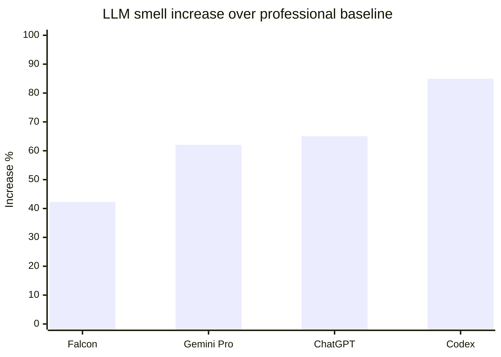

# INSIGHT 17: Quality Gates Must Cover Smells

Passing behavior tests is not enough. Agent-generated code can be functionally correct while
introducing structural quality problems that compound over time. The evidence shows that LLM-
generated code carries substantially more implementation and design smells than professional
code, that static-analysis-based measures can detect and help mitigate these smells, and that
asking agents to write more tests does not reliably improve patch quality. Quality gates must
include smell detection, not only behavioral correctness checks.

Cross-reference: INSIGHT_30 (CodeHealth predicts AI refactoring success) provides complementary
evidence from Borg et al. 2026 showing that file-level code quality, as measured by CodeScene's
CodeHealth metric, is a statistically significant predictor of whether an LLM will successfully
refactor code without breaking tests. The code smells that matter are the same standard structural
issues: complex methods, deep nesting, excessive arguments, complex conditionals.

## Source map

| Ref | Source | Local text | Source quality | Role in this insight |
|---|---|---|---|---|
| R59 | Investigating the Smells of LLM Generated Code (Ghosh Paul et al., 2025) | `paper-text/smells-llm-generated-code-2510.03029.txt` | paper evidence | Primary quantitative evidence: LLM code has 42-85% more smells than professional references. |
| R60 | A Causal Perspective on Smells (Velasco et al., ICSE 2026) | `paper-text/causal-smells-llm-code-2511.15817.txt` | paper evidence | Shows smell propensity is measurable (PSC metric) and can be mitigated via prompt formulation and architecture choices. |
| R67 | Rethinking Agent-Generated Tests (Chen et al., 2026) | `paper-text/rethinking-agent-generated-tests-2602.07900.txt` | paper evidence | Shows agent-written tests do not reliably improve patch success; tests mainly serve as observational feedback. |
| R09 | SWE-CI (2026) | `paper-text/swe-ci-2603.03823.txt` | paper evidence | Shifts evaluation from one-shot correctness to long-term maintainability through CI loops. |
| R46 | Needle in the Repo (2026) | `paper-text/needle-in-the-repo-2603.27745.txt` | paper evidence | Separates functional correctness from structural maintainability in evaluation. |
| R77 | Code for Machines, Not Just Humans (Borg et al., 2026) | `papers/code-for-machines-2601.02200.pdf` | paper evidence | CodeHealth predicts AI refactoring break rates. See INSIGHT_30 for full treatment. |

---

## Paper-by-paper discussion

### R59: Investigating the Smells of LLM Generated Code

Ghosh Paul, Zhu, and Bayley (Oxford Brookes, 2025) conducted a systematic study of code smells
in Java code generated by four LLMs (Gemini Pro, ChatGPT, Codex, Falcon) compared to
professional reference solutions from ScenEval, a benchmark of textbook tasks and StackOverflow
solutions scored by peers.

The study uses a scenario-based evaluation method: tasks are divided by topic (Basic Exercise,
OOP, Encapsulation, etc.) and complexity, with smell detection applied to each scenario. The
detection tool is DesigniteJava, which identifies both implementation smells and design smells.

Key finding: all four LLMs produce code with substantially more smells than the professional
baseline. The average increase is 63.34% across all LLMs, comprising 73.35% for implementation
smells and 21.42% for design smells.

Methods: Automated smell detection via DesigniteJava on generated Java code vs. human-written
reference solutions. 383 tasks from ScenEval benchmark.

Limitations: Java-only. The baseline is from textbooks and StackOverflow "best answers," which
may represent above-average human code. The LLMs tested (Gemini Pro, ChatGPT, Codex, Falcon)
are not the latest frontier models. Newer models may produce fewer smells, but the structural
tendency persists.

### R60: A Causal Perspective on Smells in LLM-Generated Code

Velasco et al. (William & Mary / Microsoft, ICSE 2026) extend the smell measurement work by
introducing a causal analysis framework. They use the Propensity Smelly Score (PSC), a
probabilistic metric that estimates the likelihood of generating tokens associated with code smells.
They then identify which factors in the generation pipeline most influence smell propensity.

Key findings:
1. Prompt formulation and model architecture most strongly influence smell propensity.
2. Targeted adjustments to prompt and architecture can significantly reduce smell introduction.
3. PSC captures structural quality signals overlooked by traditional metrics (BLEU, CodeBLEU).
4. A user study demonstrates PSC helps developers interpret and assess generated code.

The practical implication: smell propensity is not fixed for a given model. It can be reduced
through prompt design (analogous to adding quality constraints to agent instructions) and through
architectural choices in the generation pipeline. This validates the CI/lint approach: if you
tell the system "no new smells" via static analysis gates, you are effectively constraining the
output quality in a way the model alone cannot guarantee.

Methods: Causal inference on generation pipeline factors (decoding strategy, model size,
architecture, prompt formulation). Six semantic-preserving code transformations for robustness
testing. User study with developers.

Limitations: The PSC metric requires model logit access, which is not available for all
commercial APIs. The mitigation strategies demonstrated are prompt-level, not tool-level. The
user study had limited scale.

### R67: Rethinking Agent-Generated Tests

Chen et al. (SMU / ByteDance, 2026) analyzed trajectories from six strong LLMs on SWE-bench
Verified and found that agent-written tests do not reliably improve issue resolution. The key
findings:

1. Test writing is common in agent trajectories, but resolved and unresolved tasks show similar
   test-writing frequencies within the same model.
2. When tests are written, they mainly serve as observational feedback (print statements) rather
   than assertion-based validation.
3. A prompt-intervention study (increasing or reducing test writing via prompt changes) showed no
   significant change in final outcomes.
4. GPT-5.2 writes almost no new tests yet achieves performance comparable to top-ranking agents.

The implication for quality gates: relying on agents to write their own quality checks is
unreliable. The repository's existing human-curated test suite and static analysis gates remain
the more reliable oracle. Agent-written tests reshape process and cost more than they improve
final task outcomes.

Methods: Trajectory analysis of 6 LLMs on SWE-bench Verified. Prompt intervention study with
4 models. AST parsing of test artifacts.

Limitations: SWE-bench Verified is a specific task distribution (bug fixing in popular Python
repos). Results may differ for feature implementation or refactoring tasks where tests could
provide more value.

### R09 and R46: SWE-CI and Needle in the Repo

These two benchmarks shift evaluation beyond one-shot correctness:

- SWE-CI evaluates agents through iterative CI loops, measuring whether patches survive multiple
  rounds of integration testing and whether the changes remain maintainable over time.
- Needle in the Repo separates functional correctness from structural maintainability, evaluating
  whether agent-generated code matches expected structure, naming, and design patterns beyond
  just passing tests.

Both support the same conclusion: behavior tests are a necessary but insufficient quality signal.
Code can pass tests while being poorly structured, inconsistently named, or introducing
maintainability debt.

### R77: Code for Machines (cross-reference to INSIGHT_30)

Borg et al. (2026) provide the strongest direct link between code quality metrics and AI agent
performance. Their study of 5,000 Python files refactored by 7 models shows:

- CodeHealth is the root node in all five decision tree classifiers predicting refactoring success.
- Healthy code (CH >= 9) reduces refactoring break rates by 8-15 pp for medium-sized models.
- The nine code smells detected in their dataset are standard: Bumpy Road Ahead, Complex Method,
  Deep Nested Complexity, Complex Conditionals, Excessive Function Arguments.

These are exactly the smells that standard linters and complexity checkers detect. The CI
quality gate that catches these smells for human developers also protects AI agent workflows.

---

## Data tables

### LLM smell increase over professional baseline (R59)

| LLM | Smell increase over baseline | Implementation smell increase | Design smell increase |
|---|---:|---:|---:|
| Falcon | 42.28% | -- | -- |
| Gemini Pro | 62.07% | -- | -- |
| ChatGPT | 65.05% | -- | -- |
| Codex | 84.97% | -- | -- |
| **Average (all LLMs)** | **63.34%** | **73.35%** | **21.42%** |

Source: R59, Abstract and Figure 3. Units: percentage increase in smell violations per solution
compared to human-written reference code.

### Smell increase by topic complexity (R59, worst topics)

| Topic | Average increase over baseline (all LLMs) |
|---|---:|
| Encapsulation | 138.53% |
| Array | 101.88% |
| OOP | 101.88% |
| Regular Expression | -35.93% (improved by Gemini Pro) |

Source: R59, Table 7 and surrounding discussion. The pattern: LLMs produce worse quality on
more advanced/structural topics (OOP, encapsulation, inheritance) and comparable or better quality
on simpler/procedural topics.

### Agent test-writing does not predict resolution (R67)

| Finding | Evidence |
|---|---|
| Resolved vs unresolved tasks have similar test-writing frequency | Within-model analysis on SWE-bench Verified |
| Agent-written tests are mostly observational (prints > assertions) | AST parsing of test artifacts |
| Prompt intervention to increase/reduce testing does not change outcomes | 4-model prompt intervention study |
| GPT-5.2 writes almost no tests, matches top-ranking agents | Cross-model comparison |

Source: R67, Abstract and RQ1-RQ3.

### Code smells that predict AI refactoring failure (R77, cross-ref INSIGHT_30)

| Code smell | Count in 5,000-file dataset |
|---|---:|
| Bumpy Road Ahead | 4,901 |
| Complex Method | 3,572 |
| Deep, Nested Complexity | 2,433 |
| Complex Conditionals | 1,328 |
| Excessive Function Arguments | 724 |

Source: R77, Section 3.1. These are not exotic metrics. They are the same things most linters
already detect.

---

## Chart sketch: smell increase by LLM

The visual argument: all tested LLMs produce measurably smellier code than professionals. The
range (42-85%) is large enough that "passing tests" alone misses a significant quality dimension.

---

## Inference for "code AI agents love"

The convergent finding is that behavioral tests alone are an insufficient quality oracle for
agent-generated code. The practical prescription:

1. **Run static analysis in CI**: lint, typecheck, format, dead-code checks, complexity rules.
   These catch the smells that LLMs disproportionately introduce.

2. **Enforce "no new warnings" policy**: a ratchet that prevents quality degradation without
   requiring immediate cleanup of existing debt. This is the pattern validated by the causal
   smells paper (R60): constraining the output space reduces smell introduction.

3. **Do not rely on agent-written tests as a quality oracle**: R67 shows agent tests are mainly
   observational feedback, not reliable quality checks. Keep human-curated test suites strong.

4. **Add review checklist items for structural issues**: redundancy, incomplete implementation,
   naming inconsistency, unused variables/imports, broad exception handling, deep nesting.
   These are the categories where LLMs most often degrade quality.

5. **Target the smells that predict AI failure**: Complex Method, Deep Nested Complexity,
   Complex Conditionals, Excessive Function Arguments, Bumpy Road Ahead (R77). These are
   detectable by standard tools (ESLint complexity rules, pylint, SonarQube, CodeClimate,
   DesigniteJava) and directly predict whether future AI operations on the file will succeed.

6. **Use the same gates for human and AI code**: the Borg et al. conclusion -- "human-friendly
   code is more amenable to AI interventions" -- means the quality infrastructure serves both
   audiences simultaneously.

---

## What this does not prove

- This does not prove all LLM code is low quality. The smell increase is relative to professional
  references. Some LLM code may still be acceptable for initial prototyping or exploration.

- This does not prove agent-written tests are useless. R67 shows they serve as observational
  feedback channels (print-based debugging). They are not reliable quality oracles, but they
  have value in the development process.

- This does not prove static analysis catches all quality problems. Design smells, architectural
  drift, and semantic correctness require different evaluation methods beyond lint rules.

- This does not prove newer models (Claude 4, GPT-5+) have the same smell rates as the 2024-2025
  models tested in R59. Frontier models may produce cleaner code. But the structural tendency
  (LLMs replicate patterns from training data including smelly code) remains a fundamental
  property of the approach.

- This does not prove CodeHealth is the only useful metric. Other quality metrics (cyclomatic
  complexity, cognitive complexity, Halstead measures) were not compared head-to-head in R77.
  But the convergence between R59 (smells are measurably higher in LLM code), R60 (smells can
  be mitigated), and R77 (code quality predicts AI success) is strong enough to justify
  investing in static quality gates.

---

## Blog visual candidates

1. Smell increase bar chart: all four LLMs vs baseline, showing 42-85% increase range.
2. "Tests pass but quality degrades" split visual: left side shows green CI checks, right side
   shows smell count climbing.
3. Topic-complexity heatmap: LLMs do worse on advanced structural topics (OOP, encapsulation)
   and comparable on simple procedural topics.
4. The quality gate stack: tests + lint + typecheck + complexity + dead-code + format = the
   minimal CI configuration for agent-generated code.
5. Cross-reference diagram: R59 (smells are higher) + R60 (smells are mitigable) + R77
   (code quality predicts AI success) = invest in static quality gates.

---

## References

- R09: SWE-CI, `paper-text/swe-ci-2603.03823.txt`
- R46: Needle in the Repo, `paper-text/needle-in-the-repo-2603.27745.txt`
- R59: Investigating the Smells of LLM Generated Code, `paper-text/smells-llm-generated-code-2510.03029.txt`
- R60: A Causal Perspective on Smells, `paper-text/causal-smells-llm-code-2511.15817.txt`
- R67: Rethinking Agent-Generated Tests, `paper-text/rethinking-agent-generated-tests-2602.07900.txt`
- R77: Code for Machines, Not Just Humans, `papers/code-for-machines-2601.02200.pdf`
- INSIGHT_30: CodeHealth predicts AI refactoring success (cross-reference)
