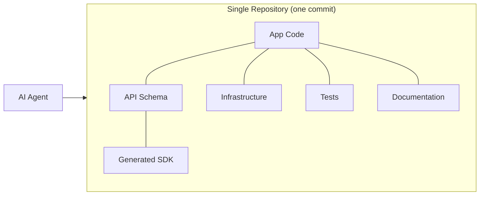
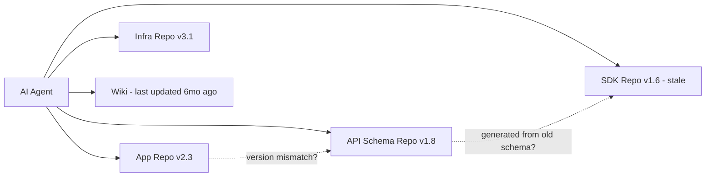

# INSIGHT 19: Monorepos Are Agent Context Infrastructure

A serious monorepo is not "everything dumped into one Git folder." It is a single, versioned,
searchable, enforceable context graph for code, docs, infra, tests, SDKs, policies, and examples.
For AI agents, the monorepo's special power is atomic context: the docs match the code at the
current commit, the API schema matches the generated client at the current commit, the infrastructure
change can be reviewed with the application change, and the tests describe the exact version of
the system being edited.

Agents pay heavily for missing cross-repo context. If the application code lives in one repo,
infrastructure in another, API schemas in another, docs in a wiki, and SDKs in generated package
repos, an agent must reconstruct the system through external knowledge and stale assumptions.
A monorepo can make the relevant world available at one commit.

## Source map

| Ref | Source                                                                     | Local text                                                | Source quality        | Role in this insight                                                                                        |
| --- | -------------------------------------------------------------------------- | --------------------------------------------------------- | --------------------- | ----------------------------------------------------------------------------------------------------------- |
| D19 | Google: Why Google Stores Billions of Lines of Code in a Single Repository | `articles/google-monorepo.html`                           | official-doc evidence | Frames the monorepo as common source of truth with explicit tradeoffs and custom tooling.                   |
| D20 | Code Simplicity: What is a Monorepo, Really?                               | `articles/code-simplicity-monorepo.html`                  | practitioner signal   | Breaks monorepo value into concrete mechanisms: atomic commits, universal hierarchy, one-version rule.      |
| D21 | Write the Docs: Docs as Code                                               | `articles/write-the-docs-docs-as-code.html`               | practitioner signal   | Docs should use same version control, review, and CI workflow as code.                                      |
| D22 | GitLab: Infrastructure as Code and GitOps                                  | `articles/gitlab-iac-gitops.html`                         | official-doc evidence | Git as source of truth for infrastructure and application deployment code.                                  |
| D23 | Spacelift: Terraform Monorepo                                              | `articles/spacelift-terraform-monorepo.html`              | practitioner signal   | Terraform monorepos centralize infrastructure code but change module-versioning tradeoffs.                  |
| D24 | Dropbox: Reducing Our Monorepo Size                                        | `articles/dropbox-monorepo-size.html`                     | practitioner signal   | Warning: without active investment, large repos can slow clone, CI, and daily development.                  |
| D18 | Nx: Enforce Module Boundaries                                              | `articles/nx-enforce-module-boundaries.html`              | official-doc evidence | Monorepo boundaries can be encoded as tags and enforced automatically.                                      |
| R13 | Repository Intelligence Graph                                              | `paper-text/repository-intelligence-graph-2601.10112.txt` | paper evidence        | Deterministic repo maps help agents orient in complex repositories; monorepos make such maps more complete. |
| R15 | Codified Context                                                           | `paper-text/codified-context-2602.20478.txt`              | paper evidence        | Case study showing persistent context infrastructure scaled to 108,000 lines in a single repository.        |

---

## What the Google monorepo paper establishes

Google's monorepo paper (Potvin and Levenberg, 2016; updated perspective) is not about AI agents,
but it establishes the engineering properties that make monorepos valuable for any automated
consumer of code:

1. **Single source of truth**: all code is at one version at any commit.
2. **Atomic changes across projects**: a single commit can modify an API, its client, its tests,
   its documentation, and its infrastructure simultaneously.
3. **Unified versioning**: the "one-version rule" means there is no diamond-dependency problem
   across packages.
4. **Universal directory hierarchy**: any tool (including an agent) can navigate from root to any
   artifact using a consistent path structure.
5. **Tooling investment**: Google built custom search, indexing, CI, dependency analysis, and code
   review tools specifically for monorepo scale.

The tradeoffs Google acknowledges: scalability requires specialized tooling (not standard Git),
access control becomes complex, build times require caching infrastructure, and not all
organizations can justify the tooling investment.

Source: D19, `articles/google-monorepo.html`.

## What Code Simplicity adds: concrete mechanisms

Code Simplicity (Max Kanat-Alexander, former Google) breaks monorepo value into discrete
mechanisms relevant to any automated consumer:

| Mechanism                      | What it means for agents                                                     |
| ------------------------------ | ---------------------------------------------------------------------------- |
| Atomic commits across projects | Agent can make a coherent cross-package change in one operation.             |
| Universal directory hierarchy  | Agent can rely on consistent path conventions for discovery.                 |
| One place to check out/commit  | Agent needs one git clone, one working directory, one search index.          |
| Single view of history         | Agent can trace when and why any artifact changed.                           |
| One-version rule               | Agent does not need to resolve which version of a shared dependency applies. |

Source: D20, `articles/code-simplicity-monorepo.html`.

## What Codified Context (R15) demonstrates at scale

Vasilopoulos (2026) built a 108,000-line C# distributed system using Claude Code as the sole
code-generation tool, directed by human prompting. The key insight for this INSIGHT_19: the
project's knowledge needs outgrew a single AGENTS.md file and evolved into a tiered architecture
totaling approximately 26,000 lines of context infrastructure, all in the same repository.

Key metrics from the paper:

- 283 development sessions
- 2,801 human prompts
- 1,197 agent invocations
- 16,522 agent turns
- 19 specialized domain-expert agents
- 34 on-demand specification documents (cold memory)
- Hot-memory constitution encoding conventions, retrieval hooks, and orchestration protocols

The paper explicitly addresses what happens when a project's knowledge needs outgrow a single
manifest file. The answer is a tiered architecture within a single repository: hot memory (always
loaded), cold memory (on-demand retrieval), and domain-expert agents (specialized knowledge
packages). All of this lives in the same repo as the code it describes.

The paper also notes that the approach was associated with a 29% reduction in median runtime
and 17% reduction in output token consumption when AGENTS.md files were present (citing R17).

Source: R15, `paper-text/codified-context-2602.20478.txt`.

## What RIG (R13) connects: deterministic repo maps

The Repository Intelligence Graph paper (INSIGHT_21) shows agents benefit from deterministic
repository maps. A monorepo makes such maps more complete: the map can include not just code
dependencies but also infrastructure dependencies, schema relationships, documentation links,
and test coverage relationships. In a multi-repo setup, these cross-repo relationships are
invisible to any single repository's map.

RIG's key numbers (from INSIGHT_21): +12.2% mean accuracy improvement, -53.9% completion time
reduction, and the largest gains (+17.4% accuracy, +70.3% efficiency) in high-complexity and
multilingual repositories. A monorepo with explicit structure is the natural home for a
comprehensive RIG-style map.

Source: R13, cross-reference to INSIGHT_21.

---

## Data table: monorepo properties and agent value

| Monorepo property             | Source          | Agent-relevant mechanism                          | Without it, the agent must...                    |
| ----------------------------- | --------------- | ------------------------------------------------- | ------------------------------------------------ |
| Atomic commits                | D19, D20        | Multi-artifact changes are coherent at one commit | Coordinate across repos, risk version skew       |
| Universal directory hierarchy | D19, D20        | Predictable paths for search and navigation       | Discover project layout per-repo                 |
| One-version rule              | D19, D20        | No diamond dependencies                           | Resolve version conflicts across packages        |
| Docs at code commit           | D21             | Documentation matches code state                  | Hope docs are current (they often are not)       |
| Infra at code commit          | D22             | Infrastructure and app changes reviewed together  | Cross-repo PRs or stale deployment configs       |
| Boundary enforcement          | D18             | Architectural rules are machine-checkable         | Infer boundaries from convention or guesswork    |
| Test colocation               | D19, D20        | Relevant tests are discoverable by path           | Search multiple repos or rely on CI coordination |
| Generated SDKs at code commit | D20, INSIGHT_20 | API client matches API schema at every commit     | Regenerate or guess at stale types               |

---

## Agent-friendly monorepo techniques

### What to colocate (things that change together)

- App code
- API schemas (OpenAPI, protobuf, TypeSpec)
- Generated SDKs or generation configs
- Database migrations
- Terraform/CDK/Kubernetes manifests for app-owned infra
- Docs, ADRs, runbooks, examples, test fixtures
- CI scripts and release automation
- Agent context files (CLAUDE.md, AGENTS.md, skills)

### Top-level layout pattern

```
apps/
packages/
infra/
docs/
schemas/
tools/
examples/
```

Each directory has a clear purpose. An agent can infer what lives where from the directory name.
Package/project ownership boundaries replace random folders.

### Boundary enforcement

Use Nx module boundaries, dependency-cruiser, Bazel/Buck/Pants rules, or custom lint to enforce
cross-package dependency rules. This gives agents a machine-readable architectural map: "package
A may depend on package B but not package C."

### Build and test efficiency

Monorepo value collapses if every change requires running everything. Affected-test/affected-build
tooling (Nx affected, Bazel, Turborepo) makes the verify loop cheap and deterministic. For agents,
this means: "run only the tests that could possibly be affected by my change" is a discoverable
command, not a manual judgment call.

### Generated artifact policy

Two workable patterns:

1. Commit generated clients when they are consumed by many packages, need code review, or serve
   as readable local context for agents.
2. Do not commit generated clients when the generator is fast, deterministic, and CI verifies
   freshness.

The key: the contract, generator config, and validation command are all in the repo.

---

## The Dropbox warning (D24)

Without active investment, monorepos can become liabilities:

| Problem            | Dropbox's experience                   | Mitigation                                    |
| ------------------ | -------------------------------------- | --------------------------------------------- |
| Clone time         | Grew to impractical sizes              | Sparse checkout, partial clone, shallow clone |
| CI time            | Every change triggered too many builds | Affected-build tooling, caching               |
| Developer velocity | Large repo slowed daily operations     | Custom tooling, repo segmentation             |
| Disk usage         | Checkouts consumed excessive storage   | Sparse checkout, virtual filesystems          |

For agents: the same problems apply. An agent that must clone 10GB and run 45 minutes of CI
for a single-file change will be impractical. The monorepo needs the same tooling investments
for agents as for humans: sparse checkout, affected-test scoping, fast CI, and good caching.

Source: D24, `articles/dropbox-monorepo-size.html`.

---

## Chart sketch: atomic context at one commit



Versus the multi-repo alternative:



The visual argument: in the monorepo, everything is consistent by construction. In multi-repo,
consistency requires active coordination that agents cannot provide.

---

## Inference for "code AI agents love"

The monorepo is not the only way to achieve good agent context. But it is the simplest path to
atomic context consistency. The engineering rule for the talk:

> For agents, a good monorepo is not one repo. It is one commit that contains the whole truth.

The practical implications:

1. If artifacts change together, they should live together. Version skew between repos is
   invisible to agents and causes silent failures.
2. Boundaries must be enforced by tools, not convention. Agents cannot infer unstated
   architectural rules.
3. The monorepo needs tooling: affected builds, boundary enforcement, sparse checkout, fast CI.
   Without it, the monorepo becomes a liability (Dropbox warning).
4. Context files, skills, and agent instructions should also live in the repo, versioned with
   the code they describe.

---

## What this does not prove

- This does not prove monorepos are always better than multi-repo setups. Organizations with
  mature multi-repo tooling (separate CI per repo, cross-repo dependency management, version
  pinning) can achieve similar consistency.

- This does not prove a monorepo solves the agent context problem alone. A monorepo without
  boundaries, documentation, or discoverable structure is just a larger mess.

- This does not prove smaller organizations need monorepo tooling. For small teams with 2-3
  repos, the coordination cost may be low enough that multi-repo works fine.

- This does not prove agents need the entire monorepo in context. They need selective slices
  (INSIGHT_21). The monorepo makes those slices available; it does not mean they should all be
  loaded simultaneously (INSIGHT_16).

- The evidence is primarily practitioner signal and official documentation, not controlled
  experiments. No paper has run an A/B test of "same project, monorepo vs multi-repo, with
  agents" on task success.

---

## Blog visual candidates

1. "One commit, whole truth" diagram: monorepo with all artifacts connected at one point in time.
2. Multi-repo version skew diagram: showing how API schema v1.8 and SDK v1.6 can silently diverge.
3. Monorepo top-level layout with agent discovery annotations: "agent reads apps/ for code,
   schemas/ for contracts, docs/ for ADRs."
4. The Dropbox warning table: problems and mitigations, reframed for agent workflows.
5. Codified Context scale chart: 108K LOC application + 26K LOC context infrastructure in one repo.

---

## References

- D18: Nx: Enforce Module Boundaries, `articles/nx-enforce-module-boundaries.html`
- D19: Google: Why Google Stores Billions of Lines of Code in a Single Repository, `articles/google-monorepo.html`
- D20: Code Simplicity: What is a Monorepo, Really?, `articles/code-simplicity-monorepo.html`
- D21: Write the Docs: Docs as Code, `articles/write-the-docs-docs-as-code.html`
- D22: GitLab: Infrastructure as Code and GitOps, `articles/gitlab-iac-gitops.html`
- D23: Spacelift: Terraform Monorepo, `articles/spacelift-terraform-monorepo.html`
- D24: Dropbox: Reducing Our Monorepo Size, `articles/dropbox-monorepo-size.html`
- R13: Repository Intelligence Graph, `paper-text/repository-intelligence-graph-2601.10112.txt`
- R15: Codified Context, `paper-text/codified-context-2602.20478.txt`
