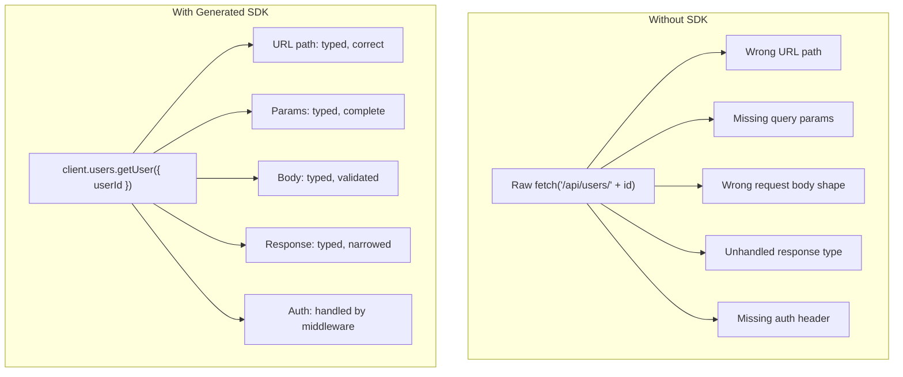

# INSIGHT 20: Generated SDKs Turn API Contracts Into Code

Agents should not hand-roll raw API calls when a typed, generated client can be produced from the
API contract. Generated SDKs convert remote API behavior into searchable, typed, versioned code
that agents can inspect, navigate, and use correctly. The evidence converges from three directions:
(1) API documentation retrieval improves code generation (DocPrompting), (2) visible typed symbols
reduce dependency errors dramatically (ToolGen), and (3) type constraints reduce compilation
errors by more than half and improve functional correctness (type-constrained generation). A
generated SDK is the practical embodiment of all three mechanisms: it makes the API contract
available as typed, documented, locally searchable code.

## Source map

| Ref | Source                                                  | Local text                                                    | Source quality        | Role in this insight                                                                                                             |
| --- | ------------------------------------------------------- | ------------------------------------------------------------- | --------------------- | -------------------------------------------------------------------------------------------------------------------------------- |
| R42 | DocPrompting (Zhou et al., ICLR 2023)                   | `paper-text/docprompting-2207.05987.txt`                      | paper evidence        | Shows retrieving relevant API documentation improves code generation by 2.85% pass@1 (52% relative) on CoNaLa.                   |
| R43 | Type-Constrained Code Generation (Mundler et al., 2025) | `paper-text/type-constrained-codegen-2504.09246.txt`          | paper evidence        | Type constraints reduce compilation errors by more than half and improve functional correctness 3.5-5.5% relatively.             |
| R51 | ToolGen (Wang et al., 2024)                             | `paper-text/toolgen-autocomplete-repo-codegen-2401.06391.txt` | paper evidence        | Visible accessible symbols reduce undefined-variable and no-member errors; +31-39% dependency coverage, +45-58% static validity. |
| R52 | RAR: Retrieval Augmented Retrieval                      | `papers/rar-retrieval-augmented-retrieval-2024.pdf`           | paper evidence        | Examples and API/grammar documentation are complementary context sources for code generation.                                    |
| D25 | OpenAPI Generator                                       | `articles/openapi-generator.html`                             | official-doc evidence | 50+ client generators from OpenAPI specs across languages.                                                                       |
| D26 | Microsoft Kiota                                         | `articles/microsoft-kiota.html`                               | official-doc evidence | Generates API clients for OpenAPI APIs with authentication, serialization, and middleware.                                       |
| D27 | Orval                                                   | `articles/orval-docs.html`                                    | official-doc evidence | Type-safe TypeScript clients, models, mocks, and query integrations from OpenAPI.                                                |
| D28 | Speakeasy                                               | `articles/speakeasy-generate-sdks.html`                       | official-doc evidence | Generates SDKs with typed models and validation from OpenAPI/JSON Schema.                                                        |
| D29 | Stainless                                               | `articles/stainless-typescript-sdk.html`                      | official-doc evidence | Production TypeScript SDKs from OpenAPI specifications.                                                                          |
| D30 | FastAPI: Generate Clients                               | `articles/fastapi-generate-clients.html`                      | official-doc evidence | OpenAPI output enables generated, up-to-date SDKs and automation workflows.                                                      |

---

## Paper-by-paper discussion

### R42: DocPrompting

DocPrompting (Zhou et al., ICLR 2023) introduces a natural-language-to-code generation approach
that explicitly retrieves relevant API documentation before generating code. The insight for
generated SDKs: if retrieving documentation helps, making the documentation into code (typed
methods, function signatures, parameter types) helps even more, because the agent can use the
same code-navigation tools (grep, LSP, type checking) it uses for any other code.

Key results:

- CodeT5 + DocPrompting: +2.85% pass@1 (52% relative gain) on CoNaLa (Python)
- CodeT5 + DocPrompting: +4.39% pass@10 (30% relative gain) on CoNaLa
- GPT-Neo-1.3B + DocPrompting: +6.9% absolute exact match on tldr (Bash)

The mechanism: when the model has access to the actual API documentation (function signatures,
parameter descriptions, usage examples), it generates code that correctly uses the API. Without
documentation, it hallucinates plausible but incorrect API calls based on training data.

A generated SDK is a pre-retrieved, pre-organized documentation artifact. Instead of the agent
needing to find and retrieve docs at generation time, the SDK makes the API surface discoverable
through normal code navigation (imports, type completions, function signatures).

Methods: Retrieval-augmented generation with BM25 and dense retrieval on documentation pools.
Evaluation on CoNaLa (Python) and tldr (Bash).

Limitations: The evaluation is on standalone function generation, not repository-level tasks.
The improvement is model-size-dependent. The documentation quality matters (stale or vague docs
provide less value). The paper uses retrieved documentation strings, not typed code; the
generated-SDK approach is an inference from the mechanism, not a direct experimental result.

### R51: ToolGen

ToolGen (Wang et al., 2024) directly addresses the generated-SDK thesis by showing that making
repository-level dependencies visible to the model via autocompletion tools dramatically reduces
dependency errors.

Key results:

- Dependency Coverage improvement: +31.4% to +39.1% across three LLMs (CodeGPT, CodeT5, CodeLlama)
- Static Validity Rate improvement: +44.9% to +57.7% across three LLMs
- CoderEval Pass@1 improvement: +40.0% (CodeT5), +25.0% (CodeLlama), same (CodeGPT)
- Latency: 0.63-2.34 seconds per function (practical for interactive use)

The mechanism: in real-world repositories, 70%+ of functions are not standalone. They depend on
user-defined attributes, imported functions, and project-specific types. Without visibility into
these dependencies, LLMs generate undefined-variable and no-member errors. ToolGen integrates
autocompletion tools that expose accessible symbols, letting the model select from valid
completions rather than hallucinating names.

A generated SDK achieves the same effect for API dependencies: instead of the model guessing
endpoint paths, parameter names, and response shapes, it has typed methods with explicit
signatures. The dependency becomes a local, searchable symbol.

Methods: Trigger insertion and model fine-tuning (offline); tool-integrated generation (online).
671 real-world repository benchmark.

Limitations: Requires fine-tuning for the trigger mechanism. The latency (0.63-2.34s) may not
be acceptable for all workflows. The evaluation is on function-level generation within existing
repos, not on fresh API integration.

### R43: Type-Constrained Code Generation

Mundler et al. (2025) show that enforcing type constraints during decoding significantly
improves code generation quality. This validates the typed-SDK approach: if type constraints
improve generation, then a typed SDK (which provides type information for all API interactions)
is a form of implicit type constraining.

Key results:

- Compilation errors reduced by more than half (synthesis and translation tasks)
- Functional correctness improvement: +3.5% to +5.5% relatively (synthesis and translation)
- Functionally correct repair: +37% relatively on average
- 94% of compilation errors in TypeScript generation are type errors (not syntax errors)

The 94% figure is critical. It means that syntax checking alone catches only 6% of compilation
failures. The vast majority of failures come from type mismatches, undefined variables, and
incorrect member access -- exactly the errors that a typed generated SDK prevents for API calls.

Methods: Novel prefix automata and type inhabitation search for TypeScript. Evaluated on
TypeScript versions of HumanEval and MBPP. Tested across 2B-34B parameter models.

Limitations: TypeScript-specific implementation (though the theory applies broadly). The
evaluation is on standalone functions, not repository-level tasks. The constrained decoding adds
computational overhead. The approach requires source access to the LLM (not applicable to
closed-weight API-only models without proxy methods).

### R52: RAR (Retrieval Augmented Retrieval)

RAR (Microsoft Research, 2024) demonstrates that examples and API/grammar documentation are
complementary context sources for code generation. Neither alone is optimal; both together
improve results more than either independently.

A generated SDK provides both: the typed signatures serve as documentation, and the SDK's
own test files or example files serve as usage examples. When both are in the repository,
the agent has the complete context for correct API usage.

Methods: Multi-stage retrieval combining example-based and documentation-based retrieval.

Limitations: Paper not fully extracted to local text. Using the reference entry claim only.

---

## Data tables

### Evidence that API-relevant context improves generation

| Paper                | Mechanism                                    |               Key metric improvement | Units                     |
| -------------------- | -------------------------------------------- | -----------------------------------: | ------------------------- |
| R42 DocPrompting     | Retrieve API docs before generation          |          +2.85 pass@1 (52% relative) | CoNaLa Python benchmark   |
| R51 ToolGen          | Expose accessible symbols via autocompletion |   +31.4 to +39.1 dependency coverage | Repository code benchmark |
| R51 ToolGen          | Expose accessible symbols via autocompletion |  +44.9 to +57.7 static validity rate | Repository code benchmark |
| R51 ToolGen          | Expose accessible symbols via autocompletion |                +25.0 to +40.0 pass@1 | CoderEval benchmark       |
| R43 Type-constrained | Enforce type correctness during generation   |     >50% compilation error reduction | HumanEval/MBPP TypeScript |
| R43 Type-constrained | Enforce type correctness during generation   | +3.5 to +5.5% functional correctness | HumanEval/MBPP TypeScript |

### Where compilation errors come from (R43)

| Error category | Share of compilation errors |
| -------------- | --------------------------: |
| Type errors    |                         94% |
| Syntax errors  |                          6% |

Source: R43, Section 5 evaluation discussion. This means typed SDKs address the dominant error
category, not just a marginal one.

### SDK generator ecosystem (practitioner landscape)

| Tool              | Source | Languages                                                     | Key differentiator                              |
| ----------------- | ------ | ------------------------------------------------------------- | ----------------------------------------------- |
| OpenAPI Generator | D25    | 50+ client targets                                            | Broadest language coverage                      |
| Microsoft Kiota   | D26    | TypeScript, Python, Java, Go, C#, PHP, Ruby                   | Auth, serialization, middleware abstractions    |
| Orval             | D27    | TypeScript                                                    | React Query/SWR hooks, mocks, MSW integration   |
| Speakeasy         | D28    | TypeScript, Python, Go, Java, Ruby, C#, Swift, PHP, Terraform | Typed models, validation, commercial SLA        |
| Stainless         | D29    | TypeScript, Python                                            | Production-grade, used by Anthropic/OpenAI SDKs |
| FastAPI built-in  | D30    | N/A (generates spec)                                          | OpenAPI spec generation from Python type hints  |

---

## Chart sketch: why typed SDKs prevent the dominant error class

The visual argument: every error the raw fetch approach can introduce (wrong path, missing params,
wrong body, untyped response, missing auth) is prevented by construction in the generated SDK.
The agent cannot generate an invalid API call because the type system prevents it.

---

## Agent-friendly techniques

### Treat OpenAPI/JSON Schema/TypeSpec/protobuf as first-class source artifacts

The API contract is the single source of truth. Everything else (SDK, docs, mocks, tests) is
derived. Keep the contract in the repo, version-controlled, and machine-readable.

### Generate clients in CI; fail if committed clients are stale

Verify SDK freshness in CI: run the generator, diff against committed output, fail if stale.

### Prefer SDK methods over raw URL strings

| Pattern                            | Risk for agents | Why                                                      |
| ---------------------------------- | --------------- | -------------------------------------------------------- |
| `fetch('/api/users/' + id)`        | High            | URL path, params, body, response all untyped strings     |
| `client.users.getUser({ userId })` | Low             | All parameters typed, response narrowed, IDE/LSP support |

### Keep generated code in predictable locations

Use `packages/api-client/src/generated/` or `schemas/openapi.yaml` + `apps/web/src/lib/api/generated/`.
Predictable paths mean agents can find the SDK without searching.

### Add lint rules banning raw calls when SDK exists

An ESLint rule that disallows `fetch('/api/...')` or `axios.get('/api/...')` and requires
`client.resource.method(...)` gives agents a machine-enforceable signal.

### Keep examples near the generated client

Authentication, retries, pagination, and error handling patterns should exist as code examples
adjacent to the generated SDK.

---

## Generated vs committed: two workable patterns

| Pattern                            | When to use                                                            | Agent implication                                             |
| ---------------------------------- | ---------------------------------------------------------------------- | ------------------------------------------------------------- |
| Commit generated SDKs              | Consumed by many packages; need code review; serve as readable context | Agent can inspect SDK directly without running generator      |
| Generate on demand (not committed) | Generator is fast and deterministic; CI verifies freshness             | Agent must run generator or trust CI; SDK not in search index |

The key distinction: the contract, generator config, and validation command must all be in the
repo and easy for agents to discover and run. Whether the output is committed is a workflow
choice, not a correctness choice.

---

## Inference for "code AI agents love"

The convergent finding is:

> Do not make the agent reverse-engineer your API from stringly typed fetch calls. Generate the
> API into code it can read.

The generated SDK transforms a remote, untyped, documentation-dependent API interaction into a
local, typed, searchable, testable code artifact. For agents, this means:

1. API endpoints become function calls with typed parameters (no URL string construction).
2. Request/response shapes become TypeScript types (no guessing at JSON structure).
3. Authentication becomes a configured middleware (no manual header construction).
4. Pagination becomes a method parameter (no custom loop logic).
5. Error handling becomes typed error responses (no generic catch-all).

Every one of these transformations reduces the surface area for agent hallucination. The agent
can use LSP, type checking, and code navigation to use the API correctly, instead of relying on
training-data memory of what the API might look like.

---

## What this does not prove

- This does not prove generated SDKs eliminate all API-related bugs. The SDK is only as good as
  the spec. A stale or vague OpenAPI file creates typed lies.

- This does not prove DocPrompting's improvement generalizes to repository-level tasks. The
  CoNaLa benchmark is standalone function generation. The effect direction is consistent with
  the thesis, but the magnitude may differ at repo scale.

- This does not prove ToolGen's autocompletion approach is the same mechanism as a generated SDK.
  ToolGen uses real-time program analysis; a generated SDK provides the same information statically.
  The mechanism is analogous but not identical.

- This does not prove type-constrained decoding requires a generated SDK. The type system
  operates on all code, not just API calls. But generated SDKs provide the type information that
  makes type-constrained generation effective for API interactions.

- This does not prove all APIs should use OpenAPI. Some APIs are better described by GraphQL
  schemas, protobuf, or TypeSpec. The principle (generate typed clients from contracts) applies
  regardless of the contract format.

- This does not prove generated SDKs are always worth the maintenance cost. Some APIs are
  simple enough that a few typed fetch wrappers suffice. The value of full SDK generation
  increases with API complexity, number of endpoints, and frequency of API changes.

---

## Blog visual candidates

1. "Raw fetch vs SDK method" side-by-side: showing all the implicit knowledge in the raw call
   that becomes explicit in the typed method.
2. Error-category pie chart: 94% type errors, 6% syntax errors. Caption: "The type system
   prevents the errors that matter."
3. SDK generator landscape table: showing the ecosystem maturity (5+ serious tools).
4. The generation flow: OpenAPI spec -> generator -> typed SDK -> agent uses typed methods.
5. A "before/after" slide: agent with raw fetch (hallucination risk) vs agent with SDK
   (constrained to valid calls).

---

## References

- R42: DocPrompting, `paper-text/docprompting-2207.05987.txt`
- R43: Type-Constrained Code Generation, `paper-text/type-constrained-codegen-2504.09246.txt`
- R51: ToolGen, `paper-text/toolgen-autocomplete-repo-codegen-2401.06391.txt`
- R52: RAR: Retrieval Augmented Retrieval, `papers/rar-retrieval-augmented-retrieval-2024.pdf`
- D25: OpenAPI Generator, `articles/openapi-generator.html`
- D26: Microsoft Kiota, `articles/microsoft-kiota.html`
- D27: Orval, `articles/orval-docs.html`
- D28: Speakeasy, `articles/speakeasy-generate-sdks.html`
- D29: Stainless, `articles/stainless-typescript-sdk.html`
- D30: FastAPI: Generate Clients, `articles/fastapi-generate-clients.html`
