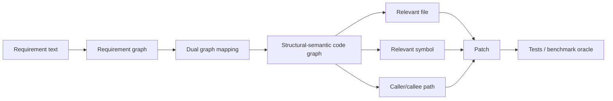
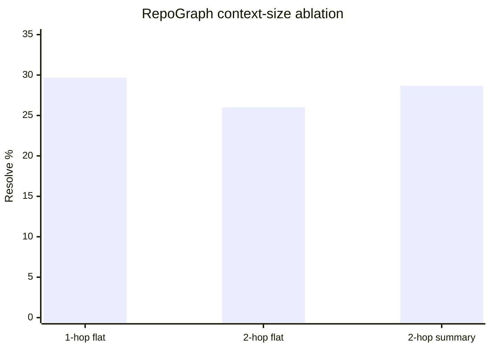

# INSIGHT 21: Repository Graphs Need Selective Slices

This is the insight I currently trust most from the whole research pass: agents do not need a
larger pile of context as much as they need a better way to recover repository structure. The
evidence is unusually aligned across papers. RIG measures deterministic repository maps for
commercial agents. GraphCodeAgent measures graph-guided code generation. RepoGraph measures
repository graphs plugged into issue-resolution systems. ContextBench and SWE Context Bench
measure whether agents found and reused the right code context.

The shared mechanism is not "graphs are cool." The mechanism is that repository work requires
relationships: which component builds what, which tests cover what, which API calls which
implementation, which file defines the symbol, which caller shows intended usage, and which
dependency edge should not be crossed. A language model can sometimes infer those relationships
from raw files, but it pays in tokens, tool calls, time, and mistakes. A graph externalizes those
relationships into something recoverable.

The critical caveat: the graph must be queried as a selective slice. The data does not support
dumping the whole graph into context. In fact, RepoGraph gives a useful counterexample where a
larger 2-hop flat graph slice uses far more tokens and performs worse than a smaller 1-hop slice.

Plot-ready data lives in `presentations/write-code-ai-agents-love/research/data/repository_graph_context.csv`.

## Source map

| Ref | Source | Local text | Role in this insight |
|---|---|---|---|
| R13 | Repository Intelligence Graph | `paper-text/repository-intelligence-graph-2601.10112.txt` | Best evidence that deterministic repo maps improve orientation speed and accuracy. |
| R53 | GraphCodeAgent | `paper-text/graphcodeagent-2504.10046.txt` | Best evidence that graph-guided traversal improves repository code generation, especially cross-file tasks. |
| R12 | RepoGraph | `paper-text/repograph-2410.14684.txt` | Best evidence that graph context can help existing agents, and that too much graph context can hurt. |
| R10 | ContextBench | `paper-text/contextbench-2602.05892.txt` | Shows final task success hides context retrieval quality. |
| R11 | SWE Context Bench | `paper-text/swe-contextbench-2602.08316.txt` | Shows prior context helps only when selected compactly and correctly. |
| R35 | What to Retrieve for Effective RACG | `paper-text/what-to-retrieve-racg-2503.20589.txt` | Shows API/context retrieval can help more than superficially similar snippets. |

## What RIG actually measured

Repository Intelligence Graph builds a deterministic graph of repository structure. The nodes are
not vague "documentation chunks." They include buildable components, aggregators, runners, tests,
external packages, and package managers. Edges encode dependency and coverage relationships. The
paper then measures whether three commercial agents answer repository-structure questions faster
and more accurately with the graph.

This matters because the task is not code generation. It is orientation. That makes RIG a strong
supporting paper for the opening third of the talk: before the agent writes code, it has to locate
the relevant structure.

### RIG data copied from the paper

| RIG result | Baseline vs RIG finding | Interpretation for the talk |
|---|---:|---|
| Mean accuracy improvement | +12.2% | An explicit repo map changes answers, not only speed. |
| Completion time reduction | -53.9% | Agents spend much less time reconstructing topology. |
| Seconds per correct answer reduction | -57.8% | Efficiency improves even when correctness is accounted for. |
| High-complexity repo accuracy gain | +17.4% | The graph is more valuable when the repo is harder to infer. |
| Low-complexity repo accuracy gain | +1.1% | Small/simple repos need less externalized structure. |
| Multilingual repo accuracy gain | +17.7% | Cross-language topology is a major agent pain point. |
| Single-language repo accuracy gain | +6.6% | The effect still exists, but it is smaller. |
| Multilingual efficiency gain | +70.3% | Explicit cross-language wiring saves a lot of time. |
| Single-language efficiency gain | +46.4% | Explicit structure still saves time in simpler language settings. |

Source trace: R13, especially the abstract/results sections in
`paper-text/repository-intelligence-graph-2601.10112.txt`.

### Chart sketch: RIG payoff grows with complexity

```mermaid
xychart-beta
  title "RIG gains by repository complexity"
  x-axis ["Low", "Medium", "High"]
  y-axis "Percent" 0 --> 75
  bar "Accuracy gain" [1.1, 11.0, 17.4]
  bar "Time reduction" [20.8, 54.6, 64.0]
  bar "Efficiency gain" [21.7, 58.4, 69.0]
```

If this becomes a blog visual, use three grouped bars per complexity bucket. The point is not the
exact agent leaderboard. The point is the shape: structural metadata pays off most when the repo
is not trivially inferable.

## What GraphCodeAgent adds

GraphCodeAgent moves from orientation QA into repository-level generation. It builds a requirement
graph and a structural-semantic code graph, then lets the agent retrieve and traverse relationships.
This is closer to the thing the blog cares about: can the agent use repository structure to make
better code changes?

The most useful result is the dependency-slice result. Cross-file tasks get the largest relative
gain. That makes intuitive sense. If the task is local, raw file context may be enough. If the task
requires understanding callers, callees, interfaces, and definitions elsewhere, plain text retrieval
starts to look weak.

### GraphCodeAgent data copied from the paper

| GraphCodeAgent result | Value | Interpretation |
|---|---:|---|
| DevEval GPT-4o relative Pass@1 improvement | +43.81% | Graph-guided retrieval beats the best reported baseline in that setting. |
| DevEval Gemini-1.5-Pro relative Pass@1 improvement | +39.15% | The effect is not unique to one model. |
| CoderEval GPT-4o relative Pass@1 improvement | +31.91% | The effect appears on another benchmark. |
| CoderEval Gemini-1.5-Pro relative Pass@1 improvement | +8.25% | Smaller but still positive in the reported table. |
| Cross-file dependency slice relative improvement | +94.30% | The graph helps most when context crosses file boundaries. |
| Full GraphCodeAgent DevEval GPT-4o Pass@1 | 58.14 | Reference point for the ablation below. |
| Without dynamic SSCGTraverse | 51.83 | Removing traversal causes a meaningful drop. |
| Reported relative ablation decline | 12.17% | The agent needs to walk the graph, not just receive a static blob. |

Source trace: R53, especially the main result tables and ablation section in
`paper-text/graphcodeagent-2504.10046.txt`.

### Graph sketch: why traversal matters

My inference: a normal product repo does not need to implement GraphCodeAgent. It needs to expose
the same kinds of edges through ordinary engineering artifacts: imports, package exports, route
registries, generated clients, test names, ownership metadata, architecture lint rules, and build
targets.

## What RepoGraph adds, including the warning

RepoGraph is useful because it tests repository graphs as a plug-in to existing systems. The gains
are not gigantic, but they are consistent enough to support the broader claim that graph context is
a useful agent input.

The more important result is the context-size ablation. More graph context was not always better.
The 2-hop flat context was much larger and got worse resolution than 1-hop flat context.

### RepoGraph data copied from the paper

| Setup | Nodes | Edges | Tokens | Resolve |
|---|---:|---:|---:|---:|
| 1-hop flat context | 11.6 | 37.1 | 2,310.7 | 29.67% |
| 2-hop flat context | 54.5 | 89.9 | 10,505.3 | 26.00% |
| 2-hop summary context | not copied here | not copied here | 1,229.2 | 28.67% |

| System | Baseline resolve | With RepoGraph | Delta |
|---|---:|---:|---:|
| RAG | 2.67% | 5.33% | +2.66 pp |
| Agentless | 27.33% | 29.67% | +2.34 pp |
| AutoCodeRover | 19.00% | 21.33% | +2.33 pp |
| SWE-agent | 18.33% | 20.33% | +2.00 pp |

Source trace: R12, `paper-text/repograph-2410.14684.txt`.

### Chart sketch: bigger slice, worse result

The blog version should not overstate this. RepoGraph's absolute gains are modest on SWE-bench
Lite. The value is the pattern: graph context helps, but the graph neighborhood must be selected
and compressed. Bigger neighborhoods add both useful signal and irrelevant paths.

## What ContextBench and SWE Context Bench add

ContextBench separates "did the patch pass?" from "did the agent retrieve the right context?" That
is important because final pass rate is a blunt instrument. An agent may pass by luck, fail despite
finding the right files, or inspect many relevant files while never using the precise lines that
matter.

SWE Context Bench adds the prior-work/memory angle. It tests whether related past task context can
help solve new tasks. The key result is not "memory always helps." Oracle Summary Learning helps,
but Free Summary Learning hurts. That is the same selective-slice lesson again.

### SWE Context Bench data copied from the paper

| Condition | Resolved rate |
|---|---:|
| No context | 26.26% |
| Oracle Summary Learning | 34.34% |
| Free Summary Learning | 22.22% |

| Context representation | Average tokens |
|---|---:|
| Full trajectories | 25,633.7 |
| Summaries | 217.1 |

Source trace: R11, `paper-text/swe-contextbench-2602.08316.txt`.

My inference: the useful long-term memory artifact is not a raw transcript. It is a compact,
structured summary of what mattered: relevant files, boundary, failing command, final fix, and
what not to repeat. This is exactly how the Brain insight system should behave internally: long
research notes exist, but the blog post should retrieve and package the relevant slice.

## Inference for "code AI agents love"

I would not present this as "add a graph database to every repo." That sounds too tool-driven. The
research supports a more general engineering rule:

> Make repository relationships recoverable, auditable, and selectively retrievable.

For a normal TypeScript/Next.js/product repo, that means:

- imports point in stable directions;
- package exports define the public surface;
- generated clients live in predictable locations;
- tests are connected to features by names, paths, or metadata;
- architectural boundaries have lint/static checks;
- setup/build/test commands are discoverable;
- route/schema/service/client relationships are easy to follow;
- docs link to source files and commands, not only concepts;
- large/generated/vendor folders are excluded from default agent context;
- there is a generated or maintained map for non-obvious subsystems.

The hard distinction:

| Bad pattern | Better pattern | Why agents care |
|---|---|---|
| "Read the whole repo and figure it out." | Generated repo map or explicit package graph. | Less orientation cost. |
| One giant architecture prompt. | Small root index pointing to scoped, executable artifacts. | Less context pollution. |
| Hidden dynamic registration. | Manifest, typed registry, or generated route map. | Search and static analysis can recover edges. |
| Tests only discoverable by running everything. | Feature-to-test naming, colocated tests, or test map. | Faster verify loop. |
| Raw API calls scattered through app code. | Generated SDK/client with typed methods. | API edges become local symbols. |

## What this does not prove

This does not prove that every repo needs an explicit graph file. It does not prove monorepos are
always better. It does not prove smaller functions improve agents. It does not prove graph
retrieval eliminates the need for tests.

The evidence is narrower and stronger: when repository tasks depend on relationships across files,
components, languages, tests, or prior tasks, agents benefit from explicit structure, and they are
hurt by unfiltered context volume.

## Blog visual candidates

1. RIG grouped bar chart: accuracy gain, time reduction, efficiency gain by complexity.
2. RepoGraph context-size chart: 1-hop vs 2-hop flat vs 2-hop summary.
3. A conceptual graph: requirement -> symbol -> caller/callee -> tests -> patch.
4. A "map vs dump" split visual showing the same information as a blob versus a traversable graph.

## References

- R10: ContextBench, `paper-text/contextbench-2602.05892.txt`
- R11: SWE Context Bench, `paper-text/swe-contextbench-2602.08316.txt`
- R12: RepoGraph, `paper-text/repograph-2410.14684.txt`
- R13: Repository Intelligence Graph, `paper-text/repository-intelligence-graph-2601.10112.txt`
- R35: What to Retrieve for Effective RACG, `paper-text/what-to-retrieve-racg-2503.20589.txt`
- R53: GraphCodeAgent, `paper-text/graphcodeagent-2504.10046.txt`
