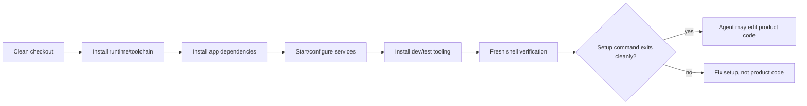

# INSIGHT 23: Setup Is Part of the Task

This insight sounds boring until the numbers make it impossible to ignore. Agents do not treat
setup as a prerequisite. They treat setup as the first task. If the environment cannot be
bootstrapped deterministically, the agent burns reasoning, tokens, and wall-clock time before it
touches the actual feature or bug.

The research evidence is spread across setup-specific benchmarks, installation studies, CI repair,
and end-to-end repository reuse. The shared result is that "can run the repo" is a major capability
bottleneck. Therefore, setup commands are part of the codebase's agent interface in the same way
public APIs and tests are.

Plot-ready data lives in `presentations/write-code-ai-agents-love/research/data/setup_verification.csv`.

## Source map

| Ref | Source                           | Local text                                                   | Role in this insight                                                         |
| --- | -------------------------------- | ------------------------------------------------------------ | ---------------------------------------------------------------------------- |
| R28 | SetupBench                       | `paper-text/setupbench-2507.09063.txt`                       | Direct benchmark of agent repository/environment setup.                      |
| R27 | Installamatic                    | `paper-text/installamatic-2412.06294.txt`                    | Measures AI agents installing Python repositories from docs.                 |
| R04 | Long Code Arena                  | `paper-text/long-code-arena-2406.11612.txt`                  | Includes real CI-build repair where environment and repo context matter.     |
| R09 | SWE-CI                           | `paper-text/swe-ci-2603.03823.txt`                           | Shows regression/maintainability over CI iteration, not just one-shot tests. |
| R41 | FixedBench                       | `paper-text/fixedbench-noop-2605.07769.txt`                  | Shows setup and git signals affect whether agents know not to edit.          |
| R67 | Rethinking Agent-Generated Tests | `paper-text/rethinking-agent-generated-tests-2602.07900.txt` | Shows "write more tests" is not equivalent to better validation.             |
| R75 | GitTaskBench                     | `paper-text/gittaskbench-aaai-2026.txt`                      | End-to-end real repo reuse benchmark with autonomous environment setup.      |

## SetupBench: setup deserves its own benchmark

SetupBench is the cleanest evidence because it isolates setup from patch generation. The agent's
job is not "fix a bug." The job is to configure a repository or service environment until a validation
command says the setup worked.

That design matters. In a lot of real agent workflows, setup failures are hidden inside later
failures. A test fails, but was the product broken, the dependency missing, the DB absent, the
runtime wrong, or the shell state non-persistent? SetupBench makes this visible by treating setup as
the outcome.

### SetupBench data copied from the paper

| Measurement                                                       |        Value | Interpretation                                          |
| ----------------------------------------------------------------- | -----------: | ------------------------------------------------------- |
| Setup tasks                                                       |           93 | Setup is large enough to benchmark directly.            |
| Best OpenHands overall success                                    |        62.4% | Even strong scaffolds do not reliably finish setup.     |
| Repository setup success range                                    |   38.9-57.4% | Plain repo bootstrap is still fragile.                  |
| Local DB setup success range                                      |   20.0-53.3% | Services/databases are particularly hard.               |
| Wasted steps range vs optimal human behavior                      | 38.17-68.77% | Ambiguous setup creates exploration waste.              |
| Hidden test tooling share of unsuccessful repo-setup failures     | about 17-26% | Missing dev/test tooling is a concrete failure cause.   |
| `--user` executable visibility risk from Installamatic comparison |          45% | Non-persistent shell/PATH changes break later sessions. |

Source trace: R28, `paper-text/setupbench-2507.09063.txt`.

SetupBench uses a validation command that prints a clear success/failure result after the agent is
done. The methodological lesson is useful for real repos: setup should be verified in a fresh shell,
not only in the shell where the agent happened to install and export things.

### Graph sketch: setup as a state machine



This is a stronger artifact than prose. A codebase agents love should let an agent distinguish "I
cannot run the repo yet" from "the requested behavior is failing."

## Installamatic: documentation recall is not enough

Installamatic studies AI agents installing Python repositories. It is useful because it separates
documentation visibility from actual install success. Even if the agent finds relevant docs, it can
miss extras, flags, test exclusions, system packages, or package-manager details.

### Installamatic data copied from the paper

| Measurement                          |             Value | Interpretation                                                    |
| ------------------------------------ | ----------------: | ----------------------------------------------------------------- |
| Repositories                         |                40 | Python repo sample.                                               |
| Unique install/test tag combinations |                31 | Setup practices vary heavily.                                     |
| Distinct install/test tags           |                17 | Agents cannot assume one convention.                              |
| Repos installed at least once        |             21/40 | About half never reached a successful install in tested attempts. |
| Average installation rate            |             28.8% | Most attempts fail.                                               |
| Perfect recall installation rate     |             34.7% | Finding docs is not enough.                                       |
| Average attempt time                 |       501 seconds | Setup failures are expensive.                                     |
| Longest run                          | almost 80 minutes | Bad setup can dominate the whole task budget.                     |

Source trace: R27, `paper-text/installamatic-2412.06294.txt`.

This supports a practical rule: the authoritative setup path should be executable, shallow, and
named predictably. A README paragraph is helpful, but not sufficient. A `make setup` or
`pnpm verify-setup` command is better because it collapses many hidden details into a single
observable contract.

## Long Code Arena and GitTaskBench: setup failures reappear in broader tasks

Long Code Arena includes CI-build repair. The agent sees real CI failures and must repair the
repository so CI passes. GitTaskBench goes even broader: agents reuse real GitHub repositories to
perform user-centric, multimodal tasks with autonomous environment provisioning.

These are not setup-only benchmarks, but they show setup as a recurring underlying failure mode.

### Long Code Arena CI data copied from the paper

| Measurement                  |                  Value |
| ---------------------------- | ---------------------: |
| Real CI failures             |                     77 |
| Open-source model fix range  |                   4-9% |
| GPT-3.5 fix rate             |                    17% |
| Average repo size in CI data | 610 files / 170K lines |

Source trace: R04, `paper-text/long-code-arena-2406.11612.txt`.

### GitTaskBench data copied from the paper

| Measurement                    |                  Value |
| ------------------------------ | ---------------------: |
| Tasks                          |                     54 |
| GitHub projects                |                     18 |
| Domains                        |                      7 |
| Modalities                     |                      7 |
| Best setting                   | OpenHands + Claude 3.7 |
| Best execution completion rate |                 72.22% |
| Best task pass rate            |                 48.15% |
| Best-setting input tokens      |              9,501.25K |
| Best-setting cost              |                 $29.80 |

Source trace: R75, `paper-text/gittaskbench-aaai-2026.txt`.

GitTaskBench explicitly includes autonomous environment provisioning. The paper calls out
dependency conflicts, missing binary wheels, absent system-level libraries, and setup-stage
stagnation as failure causes. This is exactly the "mundane infrastructure" theme: real-world agent
success depends on boring details being encoded.

## Verification is not "write tests"; it is controlled feedback

The setup insight connects to verification. A codebase can have tests and still be hostile to
agents if the tests are slow, broad, flaky, hidden behind unclear setup, or missing expected-output
oracles.

Rethinking Agent-Generated Tests is important because it prevents a naive conclusion. The answer
is not "ask the agent to write more tests." In that paper, Claude Opus 4.5 writes tests in 83.0% of
tasks and resolves 74.4%, while GPT-5.2 writes tests in only 0.6% and resolves 71.8%. Prompting
more or fewer tests changes test-writing behavior substantially, but most tasks keep the same final
result.

### Test-generation data copied from the paper

| Model           | Tasks with agent-written tests | Resolved |
| --------------- | -----------------------------: | -------: |
| Claude Opus 4.5 |                          83.0% |    74.4% |
| GPT-5.2         |                           0.6% |    71.8% |

Source trace: R67, `paper-text/rethinking-agent-generated-tests-2602.07900.txt`.

My inference: agents need high-signal validation more than they need test-writing activity. The
repo should provide:

- one fast smoke command;
- one targeted test command per subsystem;
- one full CI command for final confidence;
- expected values and fixtures in existing tests;
- fail-to-pass and pass-to-pass tests for feature work;
- structural/lint checks for constraints tests cannot see.

## No-op and setup are connected

FixedBench shows agents often make unnecessary code changes on already-fixed tasks. That seems
separate from setup, but the adverse-condition results tie them together. Removing git history and
setup signals lowers abstention. Existing correct tests help but do not fully solve the problem.

### FixedBench data copied from the paper

| Condition / prompt                              | Abstention or edit behavior |
| ----------------------------------------------- | --------------------------: |
| Undesirable code changes on already-fixed tasks |                      35-65% |
| GPT-5.4 Mini baseline abstention                |                       60.5% |
| GPT-5.4 Mini with "edit" pressure               |                       36.5% |
| GPT-5.4 Mini with "reproduce" only              |                       47.5% |
| GPT-5.4 Mini with "abstain or fix"              |                       88.5% |
| Sonnet-4.6 without git history/setup            |   65.0% -> 50.0% abstention |
| GPT-5.4 Mini without git history/setup          |   60.5% -> 52.5% abstention |
| Already-correct test added, Sonnet-4.6          |   65.0% -> 72.7% abstention |
| Already-correct test added, GPT-5.4 Mini        |   60.5% -> 70.0% abstention |

Source trace: R41, `paper-text/fixedbench-noop-2605.07769.txt`.

This strengthens the setup argument: a runnable environment is not just for making changes. It
also helps the agent decide that no change is needed.

## Codebase design implications

| Agent failure                          | Setup/verification affordance            | Concrete repo artifact                                             |
| -------------------------------------- | ---------------------------------------- | ------------------------------------------------------------------ |
| Cannot install dependencies            | One canonical setup command              | `make setup`, `pnpm install --frozen-lockfile`, `scripts/setup.sh` |
| PATH/env changes vanish                | Fresh-shell verification                 | `make verify-setup` run from a clean shell                         |
| Missing DB/service                     | Scripted local services                  | Docker Compose, dev containers, seed commands                      |
| Hidden dev/test extras                 | Dev/test dependencies in main setup path | lockfile, extras command, package scripts                          |
| Runs full suite too often              | Targeted test slices                     | `pnpm test path/to/file`, package-level test commands              |
| Cannot tell already fixed              | Reproduction and no-op path              | issue-specific verify command, explicit abstention allowed         |
| Passes behavior but violates structure | Structural checks                        | lint rules, dependency rules, generated-code drift checks          |
| CI failure cannot reproduce locally    | Local equivalent CI command              | `make ci-local`, documented env vars                               |

## Minimal agent-ready setup contract

If I were converting this into a checklist, the minimum would be:

```text
setup:
  command: pnpm install --frozen-lockfile
  verifies:
    - runtime version
    - package manager version
    - generated artifacts are fresh
    - test runner is installed

smoke:
  command: pnpm test -- --run smoke
  target_time: < 60 seconds

verify:
  command: pnpm lint && pnpm typecheck && pnpm test
  notes:
    - exact command must work in a fresh shell
    - command must not rely on prior terminal exports
```

The point is not the exact YAML. The point is that the repo should expose setup state as a
machine-checkable contract.

## What this does not prove

This does not prove that every project can have one trivial setup command. Some systems are
inherently multi-service and stateful. It does prove that setup ambiguity is expensive for agents,
and that clean-shell verification is a high-leverage target.

This also does not prove that agents should always run full test suites. The test-generation paper
suggests the opposite: validation has a budget, and broad self-authored test activity is not the same
as useful signal.

## Blog visual candidates

1. SetupBench success ranges by setup type.
2. Installamatic average install rate vs perfect-recall install rate.
3. GitTaskBench ECR vs TPR for the best setting.
4. Setup state-machine graph.
5. Validation ladder: setup -> smoke -> targeted test -> full CI -> structural checks.

## References

- R04: Long Code Arena, `paper-text/long-code-arena-2406.11612.txt`
- R09: SWE-CI, `paper-text/swe-ci-2603.03823.txt`
- R27: Installamatic, `paper-text/installamatic-2412.06294.txt`
- R28: SetupBench, `paper-text/setupbench-2507.09063.txt`
- R41: FixedBench, `paper-text/fixedbench-noop-2605.07769.txt`
- R67: Rethinking Agent-Generated Tests, `paper-text/rethinking-agent-generated-tests-2602.07900.txt`
- R75: GitTaskBench, `paper-text/gittaskbench-aaai-2026.txt`
