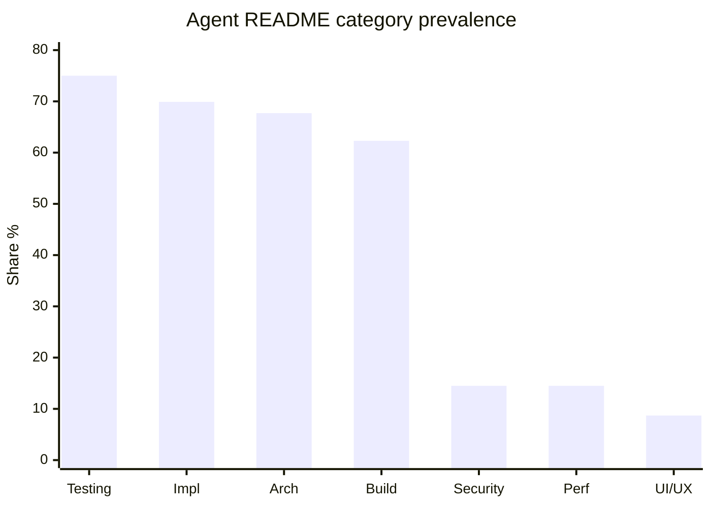
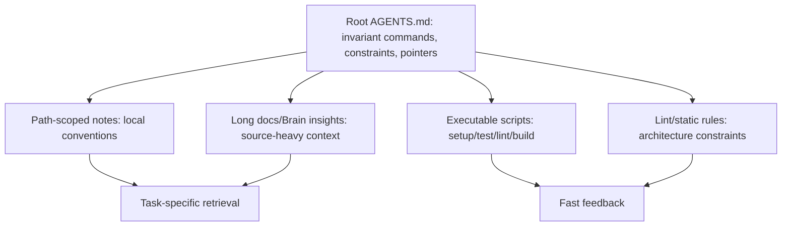

# INSIGHT 24: Context Files Are Config With Debt

`AGENTS.md`, `CLAUDE.md`, Copilot instructions, rules files, skills, hooks, and memory files are
not ordinary documentation. They are runtime configuration for an autonomous worker. That makes
them powerful and dangerous in the same way build config is powerful and dangerous: if the config
is short, accurate, scoped, and executable, it improves behavior; if it is stale, duplicated, verbose,
or contradictory, it becomes friction.

The evidence is mixed because context files are mixed. Some studies show efficiency gains. Some
show cost increases and worse resolution. Empirical studies show widespread adoption but also
length, readability issues, and missing non-functional requirements. Instruction-following
benchmarks show agents often satisfy individual checks while failing the full conjunction of
constraints.

So the conclusion is not "write AGENTS.md" or "avoid AGENTS.md." The conclusion is:

> Treat agent context files as maintained operational config with a token budget, owners, scope,
> tests, and debt.

Plot-ready data lives in `presentations/write-code-ai-agents-love/research/data/context_instruction_cost.csv`.

## Source map

| Ref | Source | Local text/article | Role in this insight |
|---|---|---|---|
| R17 | AGENTS.md impact | `paper-text/agents-md-impact-2601.20404.txt` | Shows root AGENTS.md can reduce runtime/output tokens. |
| R18 | Evaluating AGENTS.md | `paper-text/evaluating-agents-md-2602.11988.txt` | Shows context files can increase cost/steps and sometimes reduce success. |
| R19 | Claude Code config-file study | `paper-text/claude-code-configs-2511.09268.txt` | Shows what real `CLAUDE.md` files contain. |
| R21 | SWE-Skills-Bench | `paper-text/swe-skills-bench-2603.15401.txt` | Shows skills are high-variance and often add tokens without improving pass rate. |
| R73 | OctoBench | `paper-text/octobench-2601.10343.txt` | Measures scaffold-aware instruction following across heterogeneous sources. |
| R74 | Agent READMEs | `paper-text/agent-readmes-context-files-2025.txt` | Large empirical study of 2,303 context files from 1,925 repos. |
| D34-D53 | Practitioner/HN sources | `articles/*` | Shows the community has moved from prompt tricks to operational context management. |

## AGENTS.md can reduce motion

The positive case is real. The AGENTS.md impact study ran paired Codex executions with and
without root AGENTS.md files. It reports statistically significant reductions in wall-clock time and
output tokens. That supports the idea that a good root file can orient the agent and reduce
unnecessary exploration.

### AGENTS.md impact data copied from the paper

| Metric | Without AGENTS.md | With AGENTS.md | Change |
|---|---:|---:|---:|
| Mean runtime | 162.94s | 129.91s | -20.27% |
| Median runtime | 98.57s | 70.34s | -28.64% |
| Mean output tokens | 5,744.81 | 4,591.46 | -20.08% |
| Median output tokens | 2,925 | 2,440 | -16.58% |
| Mean input/cached tokens | 353,010.01 | 318,651.51 | -9.73% |
| Mean cached input tokens | 328,877.31 | 296,078.73 | -9.97% |

Source trace: R17, `paper-text/agents-md-impact-2601.20404.txt`.

Important caveat: this study did not deeply evaluate semantic correctness. It performed a manual
sanity check over sampled outputs. I should use it as evidence for efficiency, not as proof that
AGENTS.md improves correctness.

## Context files can also increase cost and reduce success

Evaluating AGENTS.md gives the counterweight. It distinguishes developer-provided context files
from LLM-generated ones and measures resolution, steps, cost, and reasoning behavior. The results
are exactly what I would expect from configuration: good human config can help; generated or
redundant config can make the system noisier.

### Evaluating AGENTS.md data copied from the paper

| Context condition | Success / resolution effect | Steps / cost effect | Interpretation |
|---|---:|---:|---|
| LLM-generated context on SWE-bench Lite | -0.5 pp resolution | +2.45 steps, +20% cost | Generated context can add motion without useful signal. |
| LLM-generated context on AGENT BENCH | -2.0 pp resolution | +3.92 steps, +23% cost | Same failure in a newer benchmark. |
| Developer-provided context | about +4% performance avg | +3.34 steps, cost up to +19% | Human context helps more but still has carrying cost. |
| Docs removed, LLM context | +2.7% average performance | not the main point | Context can substitute for missing docs. |
| `uv` mentioned | 1.6 uses per instance | <0.01 when not mentioned | Agents obey concrete tool guidance. |
| Repo-specific tools mentioned | 2.5 uses per instance | <0.05 when not mentioned | Naming tools explicitly changes behavior. |

Source trace: R18, `paper-text/evaluating-agents-md-2602.11988.txt`.

The useful inference is not that context files are bad. The useful inference is that context files
change the agent's policy. If the file contains extra requirements, vague overview, stale commands,
or old preferences, the agent may spend more steps trying to satisfy them.

## Agent READMEs: the ecosystem is already doing this, but unevenly

Agent READMEs is valuable because it is descriptive rather than prescriptive. It looks at 2,303
context files across 1,925 repositories and asks what developers actually write.

### Agent READMEs data copied from the paper

| File type | Count | Median words | Median FRE / readability |
|---|---:|---:|---:|
| `CLAUDE.md` | 922 | 485.0 | 16.6, very difficult |
| `AGENTS.md` | 694 | 335.5 | 39.6, difficult |
| `copilot-instructions.md` | 687 | 535.0 | 26.6, very difficult |
| Total | 2,303 | mixed | mixed |
| Repositories | 1,925 | n/a | n/a |

### Agent README category prevalence copied from the paper

| Category | Share of ACFs |
|---|---:|
| Testing | 75.0% |
| Implementation Details | 69.9% |
| Architecture | 67.7% |
| Development Process | 63.3% |
| Build and Run | 62.3% |
| System Overview | 59.0% |
| Maintenance | 43.7% |
| Configuration and Environment | 38.0% |
| Documentation | 26.8% |
| AI Integration | 24.4% |
| Debugging | 24.4% |
| DevOps | 18.1% |
| Security | 14.5% |
| Performance | 14.5% |
| UI/UX | 8.7% |
| Project Management | 5.4% |

Source trace: R74, `paper-text/agent-readmes-context-files-2025.txt`.

The content distribution is important. Developers mostly encode what agents need to execute:
testing, implementation details, architecture, process, build/run. Security, performance, and UI/UX
are much rarer. That suggests current context files are optimized for "get the code changed" more
than "preserve the qualities that are easy to regress."

### Chart sketch: context files over-index on execution guidance

This is a strong blog point: if agents rely on explicit context and the context under-represents
security/performance/UI, then repo owners should not be surprised when agents preserve the happy
path but miss non-functional constraints.

## Claude config studies: what practitioners put in memory

The Claude Code config-file paper analyzed 328 `CLAUDE.md` files. It gives a more Claude-specific
view of the same ecosystem.

### Claude Code config data copied from the paper

| Category | Files | Share |
|---|---:|---:|
| Architecture | 238 | 72.6% |
| Development guidelines | 147 | 44.8% |
| Project overview | 128 | 39.0% |
| Testing guidelines | 116 | 35.4% |
| Commands | 109 | 33.2% |
| Dependencies | about 101 | 30.8% |
| Project guidelines | about 84 | 25.6% |
| Integration guidelines | 59 | 18.0% |
| Usage guidelines | 59 | 18.0% |
| Configuration | 57 | 17.4% |

Source trace: R19, `paper-text/claude-code-configs-2511.09268.txt`.

The important detail is that code examples are not dominant. Mermaid diagrams are rare. Links are
rare. The files are mostly structured markdown instructions. That makes them easy to write but also
easy to let rot. A command listed in markdown can become stale the moment `package.json`,
`Makefile`, CI, or runtime versions change.

## Skills: high variance, narrow fit

SWE-Skills-Bench is the best warning against turning every preference into a skill. It evaluates 49
public SWE skills across roughly 565 task instances. Most skills do not improve pass rate. Some
help. Some hurt.

### SWE-Skills-Bench data copied from the paper

| Measurement | Value |
|---|---:|
| Public skills initially observed | 84,192 |
| Days of public skill creation | 136 |
| SWE skills evaluated | 49 |
| Approximate task instances | 565 |
| Aggregate pass-rate change | +1.2 pp |
| Aggregate token consumption change | +10.5% |
| Skills with zero pass-rate improvement | 39/49 |
| Best reported skill gain | +30.0 pp |
| Best reported skill token change | -34.8% |
| Degrading skills | 3 |
| Worst reported degradation | -10.0 pp |
| Token overhead range for perfect-pass skills | -77.6% to +450.8% |

Source trace: R21, `paper-text/swe-skills-bench-2603.15401.txt`.

My inference: skills are not "free expertise." They are context injections. A skill should be small,
scoped, current, and invoked only when the task matches. Stale concrete examples can anchor an
agent on the wrong API version or wrong protocol.

## OctoBench: per-check compliance is not full instruction following

OctoBench evaluates scaffold-aware instruction following in repository-grounded coding. It matters
because real agents receive instructions from many places: system prompt, user query, repository
policy files, skills, memory, tool schemas, and scaffold reminders.

The headline result is the gap between checklist success rate (CSR) and instance success rate
(ISR). Models can satisfy many individual checks and still fail to satisfy all constraints for an
instance.

### OctoBench dataset data copied from the paper

| Measurement | Value |
|---|---:|
| Environments | 34 |
| Tasks | 217 |
| Scaffold types | 3 |
| Objective checklist items | 7,098 |
| System prompt present | 217 instances / 100.0% |
| User query present | 217 instances / 100.0% |
| System reminder present | 158 instances / 72.8% |
| Agents.md/Claude.md present | 117 instances / 53.9% |
| Skill.md present | 48 instances / 22.1% |
| Memory present | 32 instances / 14.7% |
| Tool schema present | 197 instances / 90.8% |

### OctoBench result data copied from the paper

| Model | Avg CSR | Avg ISR |
|---|---:|---:|
| Claude Opus 4.5 | 85.64% | 28.11% |
| MiniMax-M2.1 | 83.86% | 18.15% |
| Gemini-3-Pro | 80.94% | 14.68% |
| Claude Sonnet 4.5 | 81.10% | 14.65% |
| ChatGLM-4.6 | 80.38% | 12.73% |
| Kimi-K2-thinking | 80.10% | 12.95% |
| Doubao-Seed-1.8 | 79.75% | 9.66% |
| MiniMax-M2 | 80.34% | 9.81% |

Source trace: R73, `paper-text/octobench-2601.10343.txt`.

### Chart sketch: CSR vs ISR gap

```mermaid
xychart-beta
  title "OctoBench: individual checks vs full instance success"
  x-axis ["Opus 4.5", "MiniMax M2.1", "Gemini 3", "Sonnet 4.5", "MiniMax M2"]
  y-axis "Percent" 0 --> 100
  bar "CSR" [85.64, 83.86, 80.94, 81.10, 80.34]
  bar "ISR" [28.11, 18.15, 14.68, 14.65, 9.81]
```

The blog implication: adding many rules is not the same as achieving rule-governed behavior. Every
additional instruction becomes part of a conjunction. Agents may satisfy most individual rules but
still miss the one that matters, especially under conflicting or long-lived constraints.

## Practitioner signal and how to interpret it

The practitioner material and HN history are useful but not controlled evidence. Anthropic,
GitHub, Builder.io, Aider, Sourcegraph, Windsurf, and community posts converge on patterns:
short root instructions, path-scoped rules, explicit commands, setup scripts, LSP/search, hooks,
skills, and MCP/tool integration.

I should treat these as implementation guidance, not as proof. They help translate the papers into
engineering practice:

- root context should be small;
- path-specific context should exist only when conventions differ;
- commands should be copy-pasteable and current;
- generated/build/vendor folders should be excluded;
- skills should be on-demand;
- hooks/lints should enforce what prose cannot;
- stale context should be detected, not trusted.

## Proposed architecture for context files

The important distinction is always-loaded vs on-demand:

| Knowledge type | Best home | Why |
|---|---|---|
| Must-follow repo invariants | Root `AGENTS.md` | Loaded early; keep short. |
| Local conventions | Directory-level instructions | Avoid global context pollution. |
| Long reasoning / research | Brain insight notes | Read only when relevant. |
| Setup/build/test truth | Scripts/package config | Executable and testable. |
| Architecture policy | Lint/static checks | Repairable diagnostics. |
| Domain workflows | Skills | On-demand, narrow fit. |
| External systems | MCP/tools/generated SDKs | Fresh, structured access. |

## What I should claim

Context files are agent configuration. Configuration needs:

- owners;
- review;
- small scope;
- clear precedence;
- tests or lint where possible;
- deletion of obsolete rules;
- links to executable truth;
- measured effect on time, tokens, and failures.

## What I should not claim

I should not claim that `AGENTS.md` always improves correctness. The positive AGENTS.md paper is
mostly efficiency evidence. The task-success evidence is mixed.

I should not claim that generated context files are useless. Evaluating AGENTS.md suggests they can
substitute for missing docs. The problem is using generated broad context as always-loaded truth.

I should not claim skills are bad. SWE-Skills-Bench shows high variance: most do nothing, a few
help a lot, and a few hurt. The better claim is that skills need strong selection and maintenance.

## Blog visual candidates

1. AGENTS.md with/without runtime and output tokens.
2. Evaluating AGENTS.md cost/success tradeoff.
3. Agent README category prevalence.
4. SWE-Skills-Bench distribution: zero-help skills, helpful skills, harmful skills.
5. OctoBench CSR vs ISR gap.
6. Context architecture graph: root index -> scoped docs -> executable checks.

## References

- R17: AGENTS.md impact, `paper-text/agents-md-impact-2601.20404.txt`
- R18: Evaluating AGENTS.md, `paper-text/evaluating-agents-md-2602.11988.txt`
- R19: Claude Code configs, `paper-text/claude-code-configs-2511.09268.txt`
- R21: SWE-Skills-Bench, `paper-text/swe-skills-bench-2603.15401.txt`
- R73: OctoBench, `paper-text/octobench-2601.10343.txt`
- R74: Agent READMEs, `paper-text/agent-readmes-context-files-2025.txt`
- D34-D53: practitioner/HN sources in `research/articles/`
