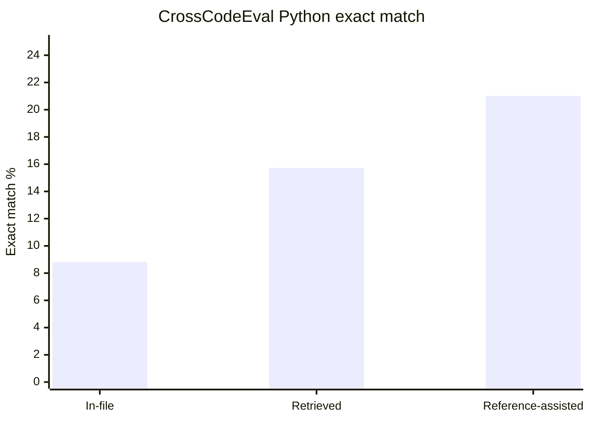
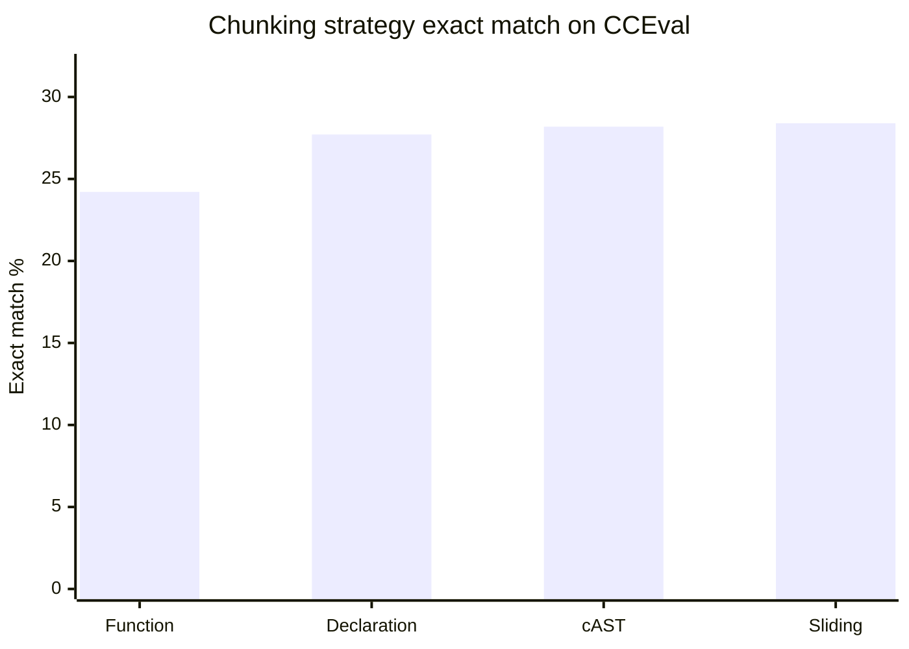
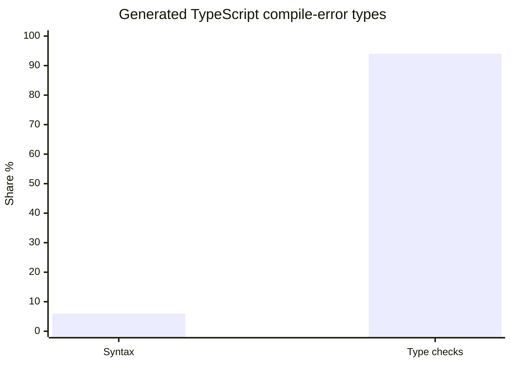
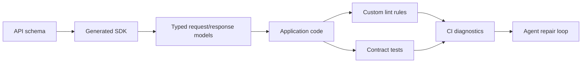

# INSIGHT 26: Static Surfaces Are Agent Affordances

The agent does not only read code as syntax. It reads the repository through surfaces: names,
imports, types, declarations, examples, generated clients, accessible members, package exports,
schemas, tests, docs, and static diagnostics. These surfaces tell the agent what exists and what is
valid.

This is the most concrete code-pattern insight in the research. If a behavior is hidden behind raw
strings, reflection, dynamic registration, implicit framework convention, or tribal docs, the agent
must infer it. If the behavior is represented as a typed symbol, generated method, exported
interface, visible declaration, or failing diagnostic, the agent can search it, import it, autocomplete
it, and repair against it.

That is why generated SDKs matter. The point is not "SDKs are nicer." The point is that SDKs turn
remote API contracts into local static affordances. The agent sees method names, request shapes,
response shapes, errors, mocks, and examples instead of guessing URLs and JSON fields.

Plot-ready data lives in `presentations/write-code-ai-agents-love/research/data/names_types_apis.csv`.

## Source map

| Ref | Source | Local text | Role in this insight |
|---|---|---|---|
| R62 | CrossCodeEval | `paper-text/crosscodeeval-2310.11248.txt` | Cross-file API context improves repository completion. |
| R49 | Chunking RAG Code Completion | `paper-text/chunking-rag-code-completion-2605.04763.txt` | Function chunks are not automatically the best retrieval unit. |
| R65 | Naming affects LLMs | `paper-text/naming-affects-llms-code-analysis-2307.12488.txt` | Identifier perturbation damages code search and analysis. |
| R66 | When Names Disappear | `paper-text/when-names-disappear-2510.03178.txt` | Obfuscating names hurts summarization and execution-oriented tasks. |
| R43 | Type-Constrained Code Generation | `paper-text/type-constrained-codegen-2504.09246.txt` | Type constraints reduce compile errors and improve pass@1. |
| R63 | CatCoder | `paper-text/catcoder-2406.03283.txt` | Code and type context improve repository-level Java/Rust generation. |
| R51 | ToolGen | `paper-text/toolgen-autocomplete-repo-codegen-2401.06391.txt` | Autocomplete/static tools reduce dependency and validity errors. |
| R64 | A3-CodGen | `paper-text/a3-codgen-2312.05772.txt` | Local/global/library-aware API retrieval helps, but too much context hurts. |
| D25-D30 | OpenAPI/SDK docs | `articles/openapi-generator.html`, `articles/orval-docs.html`, etc. | Practical tooling path for generated clients. |

## CrossCodeEval: repository APIs are not optional context

CrossCodeEval is one of the clearest sources for "the current file is not enough." It constructs
cross-file code completion examples from real repositories in Python, Java, TypeScript, and C#.
The completion target often depends on identifiers, imports, definitions, and usages outside the
current file.

The important annotation result is that almost all references contain names requiring cross-file
information, while only a tiny fraction are predictable from the current file alone. This directly
supports the claim that APIs, names, and imports are repository context, not decoration.

### CrossCodeEval data copied from the paper

| Measurement | Value |
|---|---:|
| Examples | about 10,000 |
| Repositories | about 1,000 |
| Languages | 4 |
| Python examples | 2,665 |
| Java examples | 2,139 |
| TypeScript examples | 3,356 |
| C# examples | 1,768 |
| References with names needing cross-file information | almost 100% |
| References predictable from current-file context alone | about 2% |

### CrossCodeEval retrieval data copied from the paper

| Setting | Exact match |
|---|---:|
| StarCoder-15.5B Python, in-file only | 8.82% |
| StarCoder-15.5B Python, retrieved context | 15.72% |
| StarCoder-15.5B Python, reference-assisted retrieval | 21.01% |
| GPT-3.5-turbo C#, in-file only | 3.56% |
| GPT-3.5-turbo C#, with cross-file context | 11.82% |

### Cross-file context location data copied from the paper

| Language | Same-directory references | Similar-filename references |
|---|---:|---:|
| Python | 49.0% | 33.4% |
| Java | 37.8% | 44.5% |
| TypeScript | 51.3% | 24.9% |
| C# | 51.7% | 39.0% |

Source trace: R62, `paper-text/crosscodeeval-2310.11248.txt`.

### Chart sketch: retrieved API context improves exact match



Inference: stable file names, coherent directories, explicit imports, and meaningful API names
help retrieval systems because relevant context is often nearby or name-related. This is not a
claim that all files should be colocated. It is a claim that recoverable locality and naming
consistency matter.

## Chunking: small functions are not the same as good context

The chunking paper is useful because it blocks a lazy conclusion. It is tempting to say "agents love
small functions." The evidence is more specific. Function-sized chunks were not Pareto-optimal in
the reported RAG code-completion experiments. Sliding windows, cAST, and declaration-aware chunks
performed better because they preserve surrounding declarations and context.

### Chunking data copied from the paper

| Chunking strategy on CCEval | Exact match |
|---|---:|
| Function | 24.21% |
| Declaration | 27.71% |
| cAST | 28.19% |
| Sliding Window | 28.40% |

| Strategy | Edit similarity |
|---|---:|
| Function | 0.379 |
| Declaration | 0.431 |
| cAST | 0.459 |
| Sliding Window | 0.464 |

Additional data from the paper:

| Finding | Value |
|---|---:|
| Function underperformance range | 3.57-5.64 pp EM |
| Context budget increase 2,048 -> 8,192 tokens | up to +4.2 pp EM |
| Chunk size effect | <= 1.9 pp |
| Overlap effect for chunks >= 2,000 | <= 0.5 pp |

Source trace: R49, `paper-text/chunking-rag-code-completion-2605.04763.txt`.

### Chart sketch: function chunks are not the winner



Inference: the codebase rule is not "make every function tiny." The rule is "make coherent
neighborhoods recoverable." An agent often needs imports, types, declarations, nearby examples,
callers, callees, and tests. A function body alone may hide the affordances that make the function
valid.

## Names are retrieval metadata

The naming papers make identifiers feel less like style and more like infrastructure. Code models
use names as semantic handles. If names are stable and truthful, they guide retrieval and intent
understanding. If names are misleading, inconsistent, or obfuscated, they become false signals.

### Naming-affects-LLMs data copied from the paper

| Code search setting | Original MRR | Perturbed/anonymized MRR |
|---|---:|---:|
| Java GraphCodeBERT | 70.36% | 17.03% |
| Python GraphCodeBERT | 68.17% | 23.73% |

Other paper findings to preserve:

| Finding | Interpretation |
|---|---|
| Definition names matter more than invocation names | Exported/function names carry goal-level semantics. |
| Misleading shuffled names are often worse than random strings | A wrong semantic hint can be more damaging than opacity. |
| Code search is especially name-sensitive | Names influence retrieval, not just summarization. |

Source trace: R65, `paper-text/naming-affects-llms-code-analysis-2307.12488.txt`.

### When Names Disappear data copied from the paper

| Task/model | Original | Obfuscated | Drop |
|---|---:|---:|---:|
| ClassEval class summarization, DeepSeek V3 | 87.7 | 76.7 | -11.0 |
| ClassEval class summarization, GPT-4o | 87.3 | 58.7 | -28.6 |
| Execution prediction, GPT-4o | 76.6 | 70.2 | -6.4 |
| Execution prediction, DeepSeek V3 under ambiguity | 90.0 | 69.3 | -20.7 |
| LiveCodeBench, Llama 4 Maverick | 80.2 | 56.4 | -23.8 |

Source trace: R66, `paper-text/when-names-disappear-2510.03178.txt`.

### Chart sketch: names disappearing hurts semantic tasks

```mermaid
xychart-beta
  title "Class-level summarization under name obfuscation"
  x-axis ["DeepSeek V3", "GPT-4o"]
  y-axis "Score" 0 --> 100
  bar "Original" [87.7, 87.3]
  bar "Obfuscated" [76.7, 58.7]
```



Inference for codebase design:

- Use one domain noun for one domain concept.
- Keep route names, schema names, DB names, UI names, and test names aligned where possible.
- Name exported functions after intent, not implementation accidents.
- Avoid "almost right" names. A misleading name is a false retrieval edge.
- Treat renames as API migrations, not cosmetics, when agents rely on them for retrieval.

## Types and generated clients turn hidden contracts into local facts

Type-Constrained Code Generation shows that type information does much more than prevent parser
errors. In generated TypeScript, syntax errors are a minority; type errors dominate compile
failures. Type constraints substantially reduce compiler errors and improve pass@1, especially for
repair tasks.

This is the strongest direct support for generated SDKs and typed API clients. A generated client is
not only a wrapper around fetch. It is a local type surface that says which endpoint exists, what the
request looks like, what the response contains, which fields are optional, and which errors may
exist.

### Type-Constrained Code Generation data copied from the paper

| Measurement | Value |
|---|---:|
| Type-check errors among generated TypeScript compile errors | 94% |
| Syntax errors among generated TypeScript compile errors | 6% |
| Compile-error reduction on HumanEval synthesis | 74.8% |
| Compile-error reduction on MBPP synthesis | 56.0% |
| Syntax-only ideal improvement on HumanEval synthesis | 9.0% |
| Syntax-only ideal improvement on MBPP synthesis | 4.8% |
| Average pass@1 relative gain, synthesis | +3.5% |
| Average pass@1 relative gain, translation | +5.0% |
| Average pass@1 relative gain, repair | +37.0% |

Source trace: R43, `paper-text/type-constrained-codegen-2504.09246.txt`.

### CatCoder data copied from the paper

| Measurement | Value |
|---|---:|
| Java tasks | 199 |
| Rust tasks | 90 |
| Java compile@k improvement over RepoCoder | up to +14.44% |
| Java pass@k improvement over RepoCoder | up to +17.35% |
| Rust compile@k improvement | up to +3.27% |
| Rust pass@k improvement | up to +6.68% |
| Removing type context, Java compile/pass drop | up to 6.63% / 11.57% |
| Removing type context, Rust compile/pass drop | up to 8.52% / 5.3% |
| Removing code retrieval, Java compile/pass drop | up to 19.43% / 38.35% |
| Removing code retrieval, Rust compile/pass drop | up to 46.24% / 56.03% |

Source trace: R63, `paper-text/catcoder-2406.03283.txt`.

### Chart sketch: type constraints attack the dominant compile failure



The generated SDK inference:

| Raw API call | Generated typed client |
|---|---|
| URL is a string | Endpoint is a method/symbol |
| Params are ad hoc | Params are typed |
| Response is guessed | Response model is typed |
| Errors are discovered at runtime | Errors can be modeled and tested |
| Examples are scattered | Usage can be colocated/generated |
| Agent can invent fields | Compiler rejects invalid fields |
| Drift is silent | CI can check generated output freshness |

This is why "rawdogging API calls" is a strong talk example. Raw calls hide the contract exactly
where agents need visible constraints.

## ToolGen and A3-CodGen: static tools and curated API candidates beat guessing

ToolGen teaches code models to trigger autocomplete-like tools at dependency points. Its reported
improvements are not primarily about solving all logic. They are about reducing invalid dependency
usage: undefined names, wrong members, missing APIs.

### ToolGen data copied from the paper

| Measurement | Improvement range |
|---|---:|
| Dependency Coverage | +31.4% to +39.1% |
| Static Validity Rate | +44.9% to +57.7% |
| Dependency-only validity | +56.8% to +67.7% |

| Model on CoderEval | Average tool triggers per task |
|---|---:|
| CodeGPT | 5.02 |
| CodeT5 | 6.24 |
| CodeLlama | 7.05 |

Source trace: R51, `paper-text/toolgen-autocomplete-repo-codegen-2401.06391.txt`.

A3-CodGen adds a retrieval-selection warning. It identifies local function signatures, variables,
fully qualified names, global functions, and installed libraries. But more global candidates can
hurt.

### A3-CodGen data copied from the paper

| Global retrieval setting | F1 | Accuracy | Avg retrieved functions |
|---|---:|---:|---:|
| k=5 | 0.601 | 0.851 | 8.154 |
| k=10 | 0.526 | not copied here | more context, worse F1 |
| k=15 | 0.479 | not copied here | more context, worse F1 |

| Retrieval method | Global functions found |
|---|---:|
| Function-description retrieval | 41.5% |
| Description + generated what-if code | 60.6% |

| Installed-library-aware knowledge | Improvement |
|---|---:|
| Precision | +30.59% |
| Recall | +36.36% |
| F1 | +34.33% |
| Accuracy | +15.38% |
| Library coverage | +7.43% |

Source trace: R64, `paper-text/a3-codgen-2312.05772.txt`.

Inference: agents should be given a curated list of available APIs, not an unbounded pile of
similar-looking snippets. This maps directly to generated SDKs, LSP symbol lookup, package export
maps, and typed public interfaces.

## How this becomes a codebase pattern

The phrase "static surfaces" should mean any repo artifact that makes valid behavior visible before
runtime:

| Static surface | Agent affordance | Bad alternative |
|---|---|---|
| Typed SDK/client | Valid API calls are importable symbols | Stringly typed `fetch` calls |
| OpenAPI/JSON Schema/TypeSpec/protobuf | Contract can generate code and docs | API contract lives in examples only |
| Package exports | Public surface is explicit | Deep imports into internal files |
| TypeScript interfaces | Shape is locally checkable | Runtime-only object conventions |
| LSP symbols | Agent can jump by definition/reference | Pure text search over ambiguous names |
| Generated route map | Dynamic routes become discoverable | Runtime registration magic |
| Custom lint rules | Architecture violations become diagnostics | Prose-only constraints |
| Colocated examples/tests | Usage is visible near the API | One stale README snippet |

## Generated SDK policy for agents

Generated SDKs help only if the repo makes the generation pipeline clear. Otherwise they can become
another stale or hand-edited artifact.

Minimum policy:

```text
API contract:
  source: openapi.yaml
  generator: pnpm generate-api
  output: src/generated/api
  edit_policy:
    - never hand-edit generated files
    - update schema or generator config instead
  ci:
    - run generator
    - fail if generated diff is not committed
  examples:
    - src/features/billing/example.ts
    - src/features/users/example.ts
```

This turns the SDK from "more code" into an agent affordance: the agent knows where the contract
lives, how to update it, and what not to edit.

## Where this connects to custom lint and monorepos

Static surfaces become more valuable when combined:



In a monorepo, this loop can be atomic. The schema, generated SDK, app code, tests, lint rules, docs,
and infra change together. That is the strongest version of the user's monorepo flavor: not
"everything in one repo" for its own sake, but all contract surfaces and verification surfaces
versioned together.

## What I should claim

I can make these claims confidently:

- Cross-file API context materially improves repository completion.
- Identifier names carry model-relevant semantic signal.
- Type constraints reduce a large class of invalid-code failures.
- Tool/autocomplete/static symbol assistance reduces dependency validity errors.
- Function-sized chunks are not automatically optimal retrieval units.
- Generated SDKs are a practical way to expose remote API contracts as local static surfaces.

## What I should not claim

I should not claim types prove business correctness. Types constrain shape and API validity; tests
and domain checks still matter.

I should not claim generated SDKs are always better if the schema is bad. A wrong schema produces
wrong affordances. The contract pipeline must be owned and verified.

I should not claim names are a substitute for structure. Names are a signal. They work best when
aligned with imports, types, tests, and examples.

I should not claim tiny functions are agent-friendly by default. The chunking paper points the
other way: isolated function bodies can be a poor retrieval unit.

## Blog visual candidates

1. CrossCodeEval exact-match chart: in-file vs retrieved vs reference-assisted.
2. Chunking chart: function vs declaration vs cAST vs sliding window.
3. Naming obfuscation chart: original vs obfuscated class summarization.
4. Type-error pie/bar: syntax 6% vs type checks 94%.
5. Raw fetch vs generated SDK comparison table.
6. Static-surface graph: schema -> SDK -> types -> app -> tests/lint -> CI -> agent repair loop.

## References

- R43: Type-Constrained Code Generation, `paper-text/type-constrained-codegen-2504.09246.txt`
- R49: Chunking RAG Code Completion, `paper-text/chunking-rag-code-completion-2605.04763.txt`
- R51: ToolGen, `paper-text/toolgen-autocomplete-repo-codegen-2401.06391.txt`
- R62: CrossCodeEval, `paper-text/crosscodeeval-2310.11248.txt`
- R63: CatCoder, `paper-text/catcoder-2406.03283.txt`
- R64: A3-CodGen, `paper-text/a3-codgen-2312.05772.txt`
- R65: How Does Naming Affect LLMs on Code Analysis Tasks?,
  `paper-text/naming-affects-llms-code-analysis-2307.12488.txt`
- R66: When Names Disappear, `paper-text/when-names-disappear-2510.03178.txt`
- D25-D30: OpenAPI Generator, Kiota, Orval, Speakeasy, Stainless, FastAPI client generation docs
