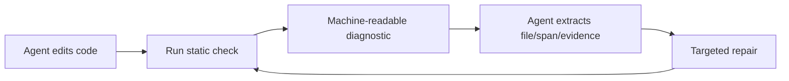
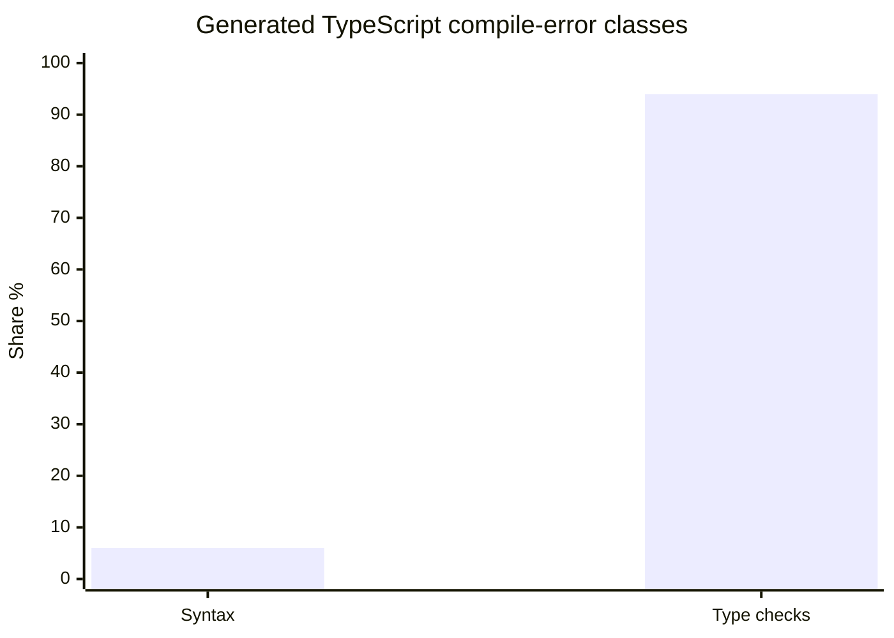

# INSIGHT 27: Static Diagnostics Are Agent Interfaces

Static analysis matters for agents less because "lint is good" and more because
a diagnostic is an interface. It turns a hidden rule into a structured object:
rule ID, severity, file, span, evidence, message, and sometimes a fix. That
shape is much easier for an agent to repair against than an instruction buried
in prose.

The key distinction for the article: agent-facing static analysis should not be
designed only as human terminal output. It should be designed as a repair
protocol.

## Source map

| Ref | Source                           | Local text                                                    | Role in this insight                                                                  |
| --- | -------------------------------- | ------------------------------------------------------------- | ------------------------------------------------------------------------------------- |
| R43 | Type-Constrained Code Generation | `paper-text/type-constrained-codegen-2504.09246.txt`          | Type diagnostics attack the dominant generated TypeScript compile-error class.        |
| R51 | ToolGen                          | `paper-text/toolgen-autocomplete-repo-codegen-2401.06391.txt` | Shows static/autocomplete-like symbol tools reduce dependency and validity errors.    |
| R64 | A3-CodGen                        | `paper-text/a3-codgen-2312.05772.txt`                         | Shows curated API candidates help; too much context can hurt.                         |
| D12 | Windsurf Cascade docs            | `articles/windsurf-cascade-docs.html`                         | Practitioner signal: coding agents integrate editor/linter feedback into checkpoints. |
| D31 | polint README                    | `articles/polint-readme.md`                                   | Local static-analysis framework with JSON/SARIF output and deterministic diagnostics. |
| D32 | polint Agent Playbook            | `articles/polint-agent-playbook.md`                           | Explicit agent loop around JSON diagnostics, focused rules, baselines, and ignores.   |
| D33 | polint ignore comments           | `articles/polint-ignore-comments.md`                          | Suppression state as inspectable debt rather than invisible local exception.          |

## The diagnostic is a more precise prompt

A prompt can say: "Use the generated billing SDK." A static diagnostic can say:

```text
rule_id: local/no-raw-internal-api
severity: error
file: apps/web/src/billing/create-invoice.ts
span: 44:13-44:39
message: Use the generated billing client instead of raw fetch.
evidence:
  found: fetch("/api/billing/invoices")
  expected_module: @repo/api-client/billing
  schema: packages/api/openapi.yaml
repair_hint:
  import billingClient and call billingClient.createInvoice(...)
```

That object does several things prose cannot reliably do:

- it points to the exact edit site;
- it names the rule in a stable way;
- it carries evidence the agent can compare against the source;
- it defines the expected replacement surface;
- it can be emitted as JSON/SARIF and consumed by tools;
- it can be rerun after repair.

This is why diagnostics are not only "quality gates." They are state in the
agent loop.



## ToolGen gives the cleanest mechanism: available symbols reduce invalid guesses

ToolGen teaches code models to trigger completion-like tools at dependency
points. The paper focuses on code generation with dependency usage, not linting
itself, but the mechanism maps directly: expose the valid symbol/API surface at
the point of need.

### ToolGen data copied from the paper

| Measurement              | Improvement range |
| ------------------------ | ----------------: |
| Dependency Coverage      |  +31.4% to +39.1% |
| Static Validity Rate     |  +44.9% to +57.7% |
| Dependency-only validity |  +56.8% to +67.7% |

| Model on CoderEval | Average tool triggers per task |
| ------------------ | -----------------------------: |
| CodeGPT            |                           5.02 |
| CodeT5             |                           6.24 |
| CodeLlama          |                           7.05 |

Source trace: R51, `paper-text/toolgen-autocomplete-repo-codegen-2401.06391.txt`.

The inference is not "autocomplete solves agents." The narrower inference is
that repository code generation fails partly because the model does not know
which dependencies, methods, and members are legal. A static diagnostic is the
same principle after the edit: it tells the agent which guess was illegal and
where the legal surface lives.

## Type errors are a dominant static feedback channel

Type-Constrained Code Generation is important because it quantifies where
generated TypeScript compile failures are. Syntax errors are the minority; type
errors dominate.

### Type-Constrained Code Generation data copied from the paper

| Measurement                                                 |  Value |
| ----------------------------------------------------------- | -----: |
| Type-check errors among generated TypeScript compile errors |    94% |
| Syntax errors among generated TypeScript compile errors     |     6% |
| Compile-error reduction on HumanEval synthesis              |  74.8% |
| Compile-error reduction on MBPP synthesis                   |  56.0% |
| Syntax-only ideal improvement on HumanEval synthesis        |   9.0% |
| Syntax-only ideal improvement on MBPP synthesis             |   4.8% |
| Average pass@1 relative gain, synthesis                     |  +3.5% |
| Average pass@1 relative gain, translation                   |  +5.0% |
| Average pass@1 relative gain, repair                        | +37.0% |

Source trace: R43, `paper-text/type-constrained-codegen-2504.09246.txt`.



This supports a strong practical claim: syntax-aware lint is useful, but
agent-facing static analysis should eventually climb toward type-aware facts
where the repo's highest-value policies depend on public API shape, generated
SDK models, or domain types.

## Diagnostic design should be optimized for repair

For humans, a lint message can often be short because the reader already knows
the local convention. Agents need more context. A good agent-facing diagnostic
should include:

| Field             | Why the agent needs it                                   |
| ----------------- | -------------------------------------------------------- |
| Stable rule ID    | Allows focused reruns, filtering, baselines, and memory. |
| File and span     | Prevents broad search and accidental unrelated edits.    |
| Found evidence    | Shows what the rule matched.                             |
| Expected surface  | Points at the approved import, API, type, or command.    |
| Related files     | Links schema, generated client, owner doc, or example.   |
| Precision tier    | Distinguishes exact facts from heuristics.               |
| Suppression state | Makes ignores visible debt, not hidden exceptions.       |
| Machine format    | Lets agents parse without scraping terminal prose.       |

This is where JSON and SARIF matter. They are not merely integrations for CI.
They are the machine-readable version of architectural feedback.

## A3-CodGen gives the caution: do not dump all possible context

A3-CodGen identifies local functions, class attributes, fully qualified names,
global functions, and installed libraries. It helps, but the paper also shows
that more global candidates can worsen F1.

### A3-CodGen data copied from the paper

| Global retrieval setting |    F1 |        Accuracy | Avg retrieved functions |
| ------------------------ | ----: | --------------: | ----------------------: |
| k=5                      | 0.601 |           0.851 |                   8.154 |
| k=10                     | 0.526 | not copied here |  more context, worse F1 |
| k=15                     | 0.479 | not copied here |  more context, worse F1 |

| Installed-library-aware knowledge | Improvement |
| --------------------------------- | ----------: |
| Precision                         |     +30.59% |
| Recall                            |     +36.36% |
| F1                                |     +34.33% |
| Accuracy                          |     +15.38% |
| Library coverage                  |      +7.43% |

Source trace: R64, `paper-text/a3-codgen-2312.05772.txt`.

The diagnostic-design inference: include enough evidence for repair, but do not
turn every diagnostic into a mini-repository dump. The right context is scoped:
the violated fact, the target surface, and the nearest examples.

## How this becomes a codebase pattern

Agent-friendly static diagnostics should look more like a protocol than a
sentence:

```text
diagnostic:
  rule_id: backend/mutating-route-requires-csrf
  precision: syntax-plus-route-convention
  file: backend/internal/billing/ports/http.go
  span: route registration call
  found:
    method: POST
    path: /v1/invoices
    middleware: [auth.RequireUser]
  expected:
    middleware: auth.RequireCSRF()
  related:
    example: backend/internal/users/ports/http.go
    policy: backend/AGENTS.md#http-routes
  next_step: add CSRF middleware or document a tested exemption
```

The exact schema is less important than the shape: evidence plus repair target.
This is the static-analysis version of "make the intended path the shortest
path."

## What this does not prove

It does not prove static diagnostics replace tests. A typecheck can prove an
API shape, not business behavior. A lint rule can prove a middleware call is
present, not that the security policy is complete.

It does not prove every warning should be fed to the agent. Low-signal
diagnostics can cause churn. Use severity, baselines, focused runs, and
`--max-diagnostics`-style output caps for agent loops.

It does not prove agent output improves just because a repo has SARIF. The
diagnostic has to be precise, current, and repairable.

## Blog visual candidates

1. Diagnostic object as protocol: rule ID, span, evidence, expected surface.
2. ToolGen bar chart: dependency coverage and static validity improvements.
3. Type-error chart: 94% type-check errors vs 6% syntax errors.
4. Good vs bad diagnostic examples.
5. Agent loop diagram: edit -> check -> parse diagnostic -> repair -> rerun.

## References

- R43: Type-Constrained Code Generation,
  `paper-text/type-constrained-codegen-2504.09246.txt`
- R51: ToolGen, `paper-text/toolgen-autocomplete-repo-codegen-2401.06391.txt`
- R64: A3-CodGen, `paper-text/a3-codgen-2312.05772.txt`
- D12: Windsurf Cascade docs, `articles/windsurf-cascade-docs.html`
- D31: polint README, `articles/polint-readme.md`
- D32: polint Agent Playbook, `articles/polint-agent-playbook.md`
- D33: polint Ignore Comments, `articles/polint-ignore-comments.md`
