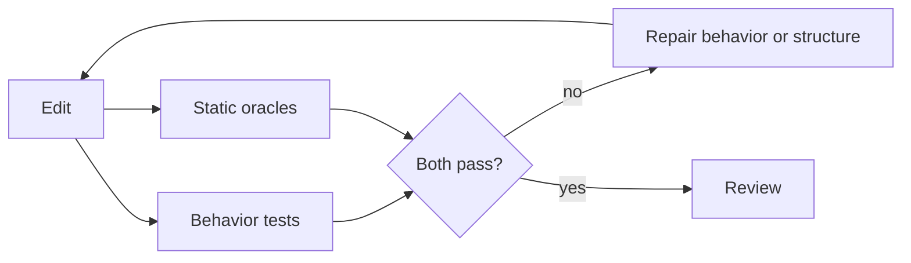

# INSIGHT 28: Static Oracles Catch What Tests Miss

Behavior tests are necessary, but they are incomplete for agent-written code.
Several papers now point at the same gap: an agent can make code pass narrow
tests while missing the intended structure, maintainability property, or
refactoring direction.

Static oracles are checks about shape: which dependency edge exists, which old
pattern disappeared, which new pattern appeared, which file owns an interface,
which layer may call which service, whether a route has evidence of a test, or
whether a migration touched the required call sites.

The important claim is not "static beats tests." The claim is:

> Tests check behavior. Static oracles can check the structural intent that
> tests do not express.

## Source map

| Ref | Source | Local text | Role in this insight |
|---|---|---|---|
| R46 | Needle in the Repo | `paper-text/needle-in-the-repo-2603.27745.txt` | Direct evidence that behaviorally correct agent outputs can still be structurally wrong. |
| R71 | Constraint Decay | `paper-text/constraint-decay-2605.06445.txt` | Quantifies how architectural/database/ORM constraints reduce backend generation success. |
| R72 | CODETASTE | `paper-text/codetaste-2603.04177.txt` | Uses tests plus OpenGrep static rules to evaluate refactoring intent. |
| R59 | Smells of LLM Generated Code | `paper-text/smells-llm-generated-code-2510.03029.txt` | LLM code can carry substantially more smell risk than professional reference code. |
| R60 | Causal Smells | `paper-text/causal-smells-llm-code-2511.15817.txt` | Smell propensity is measurable and partly mitigable, but needs careful interpretation. |
| R67 | Rethinking Agent-Generated Tests | `paper-text/rethinking-agent-generated-tests-2602.07900.txt` | Warns against treating more agent-written tests as a universal fix. |

## Needle in the Repo: passing behavior can still fail maintainability

Needle in the Repo is central because it separates functional correctness from
structural maintainability. It evaluates generated code against hidden
maintainability oracles as well as functional tests.

### Needle in the Repo data copied from the paper

| Measurement | Value | Interpretation |
|---|---:|---|
| Probe cases | 21 | Small but intentionally targeted. |
| Maintainability dimensions | 9 | Structure is multi-dimensional. |
| Average solve rate | 36.2% | Agents struggle with maintainability probes. |
| Best solve rate | 57.1% | Even best settings leave many failures. |
| Behaviorally correct but structurally wrong outcomes | 64/483 | Tests alone missed these. |
| Share behaviorally correct but structurally wrong | 13.3% | Non-trivial hidden structural failure rate. |
| Agent mode average | 45.0% | Tool scaffolding helps but does not solve structure. |
| API-only average | 28.2% | Tool access alone is insufficient. |

### Hardest maintainability dimensions

| Dimension | Pass rate |
|---|---:|
| Dependency Control | 4.3% |
| Responsibility Decomposition | 15.2% |
| Interface and Substitutability | 26.1% |
| Reuse and Repo Awareness | 31.9% |
| State Ownership and Lifecycle | 58.7% |

Source trace: R46, `paper-text/needle-in-the-repo-2603.27745.txt`.

The mapping to static analysis is almost literal:

| Maintainability dimension | Static facts likely needed |
|---|---|
| Dependency Control | resolved imports, module graph, package ownership |
| Responsibility Decomposition | symbols, call graph, file/function metrics |
| Interface/Substitutability | public exports, type facts, implementations |
| Reuse/Repo Awareness | symbol search, references, duplicate logic signals |
| State Ownership/Lifecycle | call graph, allocation/resource ownership, dataflow |

This is one of the strongest arguments for custom architecture rules. The
hardest dimensions are not "did the unit test assert the expected value." They
are about relationships between code units.

## CODETASTE: static rules can encode refactoring intent

CODETASTE evaluates real large refactorings. The important design point is that
the benchmark does not rely only on tests. It also uses OpenGrep static rules:
additive rules for new required patterns and reductive rules for old patterns
that should disappear.

That is exactly the static-oracle pattern for agentic codebases. A migration is
not complete because tests pass once. It is complete when the old structural
pattern is gone and the new one exists in the right places.

### CODETASTE benchmark scale copied from the paper

| Benchmark property | Value |
|---|---:|
| Instances | 100 |
| Repositories | 87 |
| Programming languages | 6 |
| Average files edited by human refactor | 91.52 |
| Average LOC changed | 2,605.39 |
| Maximum LOC changed | 18,821 |
| Maximum files changed | 290 |
| Average tests per instance | 1,638.53 |
| Average additive static rules | 29.66 |
| Average reductive static rules | 63.41 |

### CODETASTE result data copied from the paper

| Model / mode | PASS | Alignment A | Instruction-following rate |
|---|---:|---:|---:|
| GPT-5.2 instructed | 76.0% | 69.6% | 89.3% |
| GPT-5.2 open direct | 87.0% | 7.7% | about 9-10% components |
| GPT-5.2 open plan | 87.0% | 14.1% | higher than direct |
| GPT-5.2 open multiplan oracle | 81.0% | 19.4% | highest open-track alignment |
| GPT-5.1 Codex Mini instructed | 47.0% | 34.6% | 72.2% |
| Claude Sonnet 4.5 instructed | 43.0% | 32.4% | 69.2% |
| Qwen3 instructed | 30.0% | 11.8% | lower than frontier systems |

Source trace: R72, `paper-text/codetaste-2603.04177.txt`.

```mermaid
xychart-beta
  title "CODETASTE GPT-5.2: tests pass vs refactor alignment"
  x-axis ["Instructed", "Open direct", "Open plan", "Open multiplan"]
  y-axis "Percent" 0 --> 100
  bar "PASS" [76.0, 87.0, 87.0, 81.0]
  bar "Alignment A" [69.6, 7.7, 14.1, 19.4]
```

The striking part is that open direct mode has higher PASS than instructed mode
but dramatically lower alignment. That makes the article's claim concrete:
"tests passed" can be the wrong success metric when the human wanted a
structural transformation.

## Constraint Decay: production constraints are measurable load

Constraint Decay fixes a backend API contract and then layers constraints:
architecture, database backend, and ORM integration. The drop is large enough
that the article should treat structure as a primary task variable, not a
cosmetic preference.

### Constraint Decay data copied from the paper

| Measurement | Value | Interpretation |
|---|---:|---|
| Greenfield generation tasks | 80 | Controlled combinations across frameworks/constraints. |
| Feature implementation tasks | 20 | Existing-codebase sanity check. |
| API operations in contract | 19 | Non-trivial backend surface. |
| Assertions in test suite | 291 | Behavior was checked extensively. |
| Capable-config L0 -> L3 A% drop | 30 pp | Structural constraints materially reduce success. |
| Relative loss from baseline | 40% | Constraint cost is large relative to baseline. |
| Full-set vs subset Pearson correlation | 0.98 | Cost-reduced subset tracked the full benchmark. |
| Full-set vs subset Spearman correlation | 0.95 | Rank ordering also tracked well. |

### Marginal constraint effects copied from the paper

| Constraint | Average A% effect |
|---|---:|
| Clean architecture | -9.1 pp |
| PostgreSQL | -19.3 pp |
| SQLite | -14.3 pp |
| SQLAlchemy | -1.5 pp |
| Sequelize | -0.6 pp |

Source trace: R71, `paper-text/constraint-decay-2605.06445.txt`.

The database result is especially important for static-analysis thinking. It
suggests that agents are not merely bad at syntax. They struggle with the
intersection of architectural structure, persistence rules, runtime behavior,
and framework conventions. Some of that will always need tests. Some of it can
be made visible through static facts: repository boundaries, raw SQL bans,
approved data-access layers, generated query/client usage, and typed error
flows.

## Smell research says "plausible code" is not enough

The smell papers are not exact correctness oracles. They are risk signals.
Still, they support adding static quality gates around agent changes because
LLM-generated code can carry more maintainability smells than professional
reference code.

### Smells of LLM Generated Code data copied from the paper

| Model | Smell increase over professional reference |
|---|---:|
| Falcon | +42.28% |
| Gemini Pro | +62.07% |
| ChatGPT | +65.05% |
| Codex | +84.97% |
| Average across all LLMs | +63.34% |
| Implementation smell increase | +73.35% |
| Design smell increase | +21.42% |

### Causal smell research data

| Measurement | Value / finding |
|---|---|
| Smell types analyzed | 41 |
| Robust under syntactic variation | 76% of smell types |
| Prompt design effect | Structured prompts reduce propensity for specific smells. |
| Model size effect | Minimal benefit in the tested setting. |
| Model architecture effect | More pronounced for some warning/refactor smells. |
| Mitigation examples | broad exception, missing final newline, unused import |

Source traces: R59 and R60,
`paper-text/smells-llm-generated-code-2510.03029.txt` and
`paper-text/causal-smells-llm-code-2511.15817.txt`.

The caveat belongs in the blog: smell rules should not claim "bug." They should
say "risk signal" and define the local policy. This is why precision tiers and
good diagnostic language matter.

## How this becomes a codebase pattern

Use tests and static oracles together:

| Change type | Behavior tests check | Static oracles check |
|---|---|---|
| Feature addition | visible behavior and regression paths | new route follows auth/layering/test-evidence policy |
| API migration | old behavior preserved | old client removed; generated client used everywhere |
| Refactor | tests still pass | intended structural pattern exists; forbidden pattern gone |
| Security hardening | attack/edge cases covered | required middleware/validation present on all relevant paths |
| Monorepo boundary change | packages still build | imports obey ownership and dependency direction |

The ideal agent loop is not "write code, run tests." It is:

## What this does not prove

It does not prove static rules can evaluate nuanced design quality. Some
architecture decisions are contextual and need review.

It does not prove every smell should block an agent. Some smells are acceptable
locally; some static checks should be warnings; some should be baselined.

It does not prove tests are weak. CODETASTE and Needle in the Repo are useful
because they combine behavioral and structural signals. The final claim should
be "tests plus static oracles," not "lint instead of tests."

## Blog visual candidates

1. CODETASTE chart: high PASS but low alignment in open mode.
2. Needle in the Repo table: 64/483 behaviorally correct but structurally wrong.
3. Constraint Decay ladder: L0 -> L3 loses 30 pp.
4. Two-column visual: tests check behavior; static oracles check shape.
5. Migration oracle example: additive and reductive rules.

## References

- R46: Needle in the Repo,
  `paper-text/needle-in-the-repo-2603.27745.txt`
- R71: Constraint Decay, `paper-text/constraint-decay-2605.06445.txt`
- R72: CODETASTE, `paper-text/codetaste-2603.04177.txt`
- R59: Smells of LLM Generated Code,
  `paper-text/smells-llm-generated-code-2510.03029.txt`
- R60: Causal smell analysis,
  `paper-text/causal-smells-llm-code-2511.15817.txt`
- R67: Rethinking Agent-Generated Tests,
  `paper-text/rethinking-agent-generated-tests-2602.07900.txt`
